# DataVisor 核心业务运转架构分析

## 概述

本文档详细分析 DataVisor 平台的核心业务架构，涵盖了从数据接入到结果输出的完整链路，包括 **Cron 调度**、**Luigi 任务编排**、**DCluster 资源管理**、**Feature Platform (FP) 特征计算** 和 **数据存储** 五大核心组件。

---

## 🎯 架构全景图

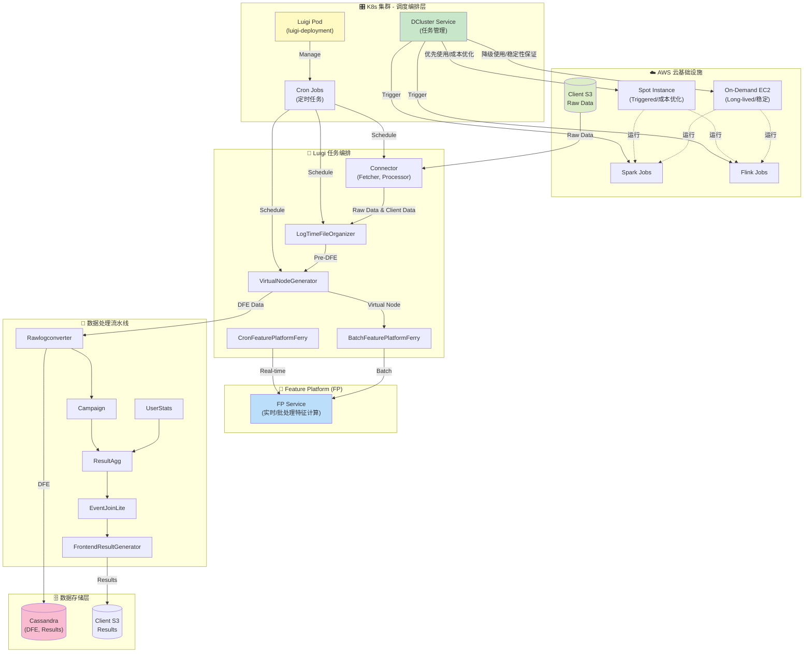

---

## 🏗️ 五大核心组件

### 1️⃣ Cron 调度层 (定时任务管理)

**位置**: K8s Luigi Pod (`luigi-deployment`)

**功能**: 提供定时任务触发机制，是整个系统的"心跳"

#### Cron 配置示例

```bash
# 高频任务 - 每 5 分钟执行一次
*/5 * * * * /bin/bash /home/datavisor/cronjob_20minute.sh +syncbank

# 每小时任务 - 每小时第 20 分钟执行
20 * * * * /bin/bash /home/datavisor/cronjob_20minute.sh -syncbank -appsflyer -sofi -nasa

# 凌晨维护任务 - 每天凌晨 3 点执行
0 3 * * * /bin/bash /home/datavisor/luigitasks_dcluster/batch_pipeline_daily_once_run.sh

# 批处理窗口 - 跳过夜间维护时段（4-5点）
45 0-3,6-23 * * * /bin/bash /home/datavisor/cronjob_20minute.sh +nasa

# Feature Platform Ferry - 凌晨 4-5 点执行
30 4,5 * * * /bin/bash /home/datavisor/luigitasks_dcluster/batch_pipeline_cronfpferry.sh +nasa

# 批处理任务 - 每小时第 50 分钟执行
50 * * * * /bin/bash /home/datavisor/luigitasks_dcluster/batch_pipeline_hourly_run.sh

# 月度任务 - 每月 1 号和 15 号执行
0 0 1,15 * * /bin/bash /home/datavisor/luigitasks_dcluster/batch_pipeline_8hour_run.sh

# 周度任务 - 每月 7, 14, 21, 28 号执行
0 0 7,14,21,28 * * /bin/bash /home/datavisor/cronjob_monthly.sh
```

#### 关键调度脚本

| 脚本名称 | 调度频率 | 作用 |
|---------|---------|------|
| `cronjob_20minute.sh` | 每 5-20 分钟 | 触发高频数据处理任务（Connector, LogOrganizer） |
| `batch_pipeline_cronfpferry.sh` | 凌晨 4-5 点 | 触发 CronFeaturePlatformFerry 任务 |
| `batch_pipeline_hourly_run.sh` | 每小时第 50 分钟 | 批处理小时级任务 |
| `batch_pipeline_daily_once_run.sh` | 每天凌晨 3 点 | 日度维护和清理任务 |
| `batch_pipeline_8hour_run.sh` | 每月 2 次 | 重型批处理任务 |
| `cronjob_monthly.sh` | 每周 | 月度统计和报告任务 |

---

### 2️⃣ Luigi 任务编排层 (依赖管理)

**位置**: K8s Luigi Pod 中的 Luigi 进程

**功能**: 管理任务依赖关系，确保任务按正确顺序执行

#### Luigi 核心概念

```python
# Luigi Task 示例
class MonitorTracker(luigi.Task):
    client = luigi.Parameter()
    date = luigi.DateParameter()
    
    def requires(self):
        # 定义依赖关系
        return [
            Labeling(client=self.client, date=self.date),
            ResultSender(client=self.client, date=self.date)
        ]
    
    def run(self):
        # 任务执行逻辑
        pass
    
    def complete(self):
        # 检查任务是否完成
        return self.output().exists()
```

#### Luigi 任务依赖图

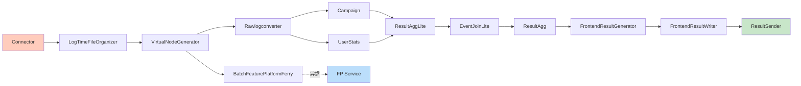

#### Luigi 任务类型

| 任务类型 | 示例 | 特点 |
|---------|------|------|
| **数据抓取** | Connector (Fetcher, Processor) | 从 S3 拉取客户原始数据 |
| **数据预处理** | LogTimeFileOrganizer | 时间窗口组织和预处理 |
| **特征生成** | VirtualNodeGenerator | 生成虚拟节点，准备 DFE |
| **DFE 转换** | Rawlogconverter | 转换为 DFE 格式 |
| **DFE 存储** | CassandraDfeWriter | 写入 Cassandra |
| **特征传输** | CronFeaturePlatformFerry | 传输到 FP（实时） |
| **批量传输** | BatchFeaturePlatformFerry | 批量传输到 FP |
| **数据聚合** | Campaign, UserStats, ResultAgg | 多维度聚合统计 |
| **结果生成** | FrontendResultGenerator | 生成前端展示数据 |
| **结果传输** | ResultSender | 发送结果到客户 S3 |

#### Luigi 进程示例

在 Luigi Pod 中运行的实际进程：

```bash
# Luigi 主调度器
/usr/local/bin/python /usr/local/bin/luigid

# Cron 触发的任务脚本
/bin/bash /home/datavisor/cronjob_20minute.sh +syncbank

# Luigi Worker 进程示例
/usr/local/bin/python /usr/local/bin/luigi --module batch_tasks Labeling \
  --client=syncbank --workers=1 --date=2025-11-21

/usr/local/bin/python /usr/local/bin/luigi --module batch_tasks ResultSender \
  --client=syncbank --date=2025-11-21 --workers=5

/usr/local/bin/python /usr/local/bin/luigi --module batch_tasks SparkConnectorRunner \
  --client=syncbank --workers=1 --date=2025-11-21

/usr/local/bin/python /usr/local/bin/luigi --module batch_tasks CronFeaturePlatformFerry \
  --client=syncbank --workers=1 --date=2025-11-21

/usr/local/bin/python /usr/local/bin/luigi --module batch_tasks MonitorTracker \
  --client=syncbank --workers=1 --date=2025-11-21
```

---

### 3️⃣ DCluster 资源管理层 (Job 执行)

**位置**: K8s DCluster Service

**功能**: 管理 Spark/Flink Job 的生命周期，动态分配计算资源

#### DCluster 架构

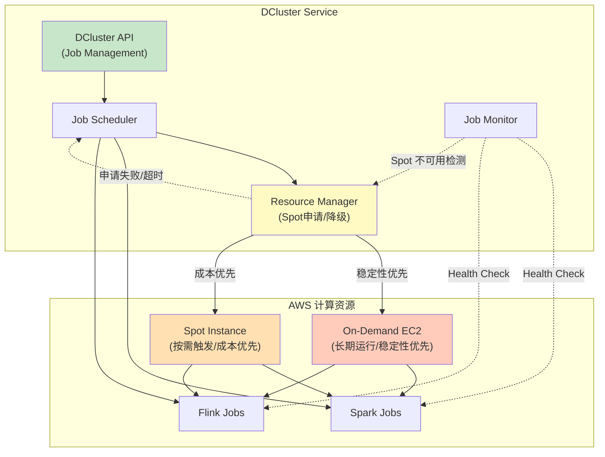

#### DCluster 主要功能

| 功能 | 说明 | API 端点 |
|------|------|---------|
| **Job 提交** | 提交新的 Spark/Flink Job | `POST /cluster/job/submit` |
| **Job 终止** | 终止运行中的 Job | `POST /cluster/job/terminate/{jobId}` |
| **Job 查询** | 查询 Job 状态 | `GET /cluster/job/{jobId}` |
| **Job 列表** | 获取所有 Job | `GET /cluster/jobs` |
| **资源分配** | 动态分配 EC2/Spot 资源 | `POST /cluster/resources/allocate` |
| **Spot 申请** | 尝试申请 Spot Instance | `POST /cluster/resources/spot/request` |
| **Spot 降级** | Spot 不可用时降级到 On-Demand | `POST /cluster/resources/fallback` |
| **健康检查** | 检查集群健康状态 | `GET /cluster/health` |

#### EC2 资源类型对比

| 特性 | On-Demand EC2 (长期运行) | Spot Instance (按需触发) |
|------|------------------------|----------------------|
| **成本** | 标准价格 (100%) | 折扣价格 (30-90% off) |
| **稳定性** | 高 (不会被回收) | 中 (可能被 AWS 回收) |
| **可用性** | 保证可用 | 不保证 (可能申请失败) |
| **适用场景** | 关键任务、长时间运行 | 批处理、可容错任务 |
| **启动时间** | 立即可用 | 可能需要等待或失败 |
| **DCluster 策略** | 常驻集群，优先级高 | 优先尝试，失败则降级 |

#### Spot Instance 申请流程

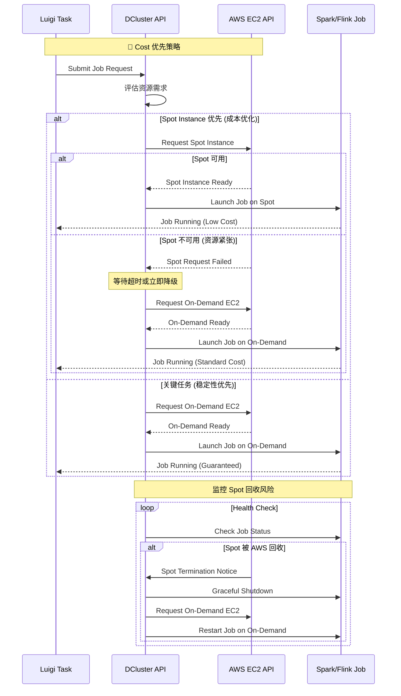

#### Spot Instance 故障处理

| 故障场景 | 检测方式 | 处理策略 | 预期时间 |
|---------|---------|---------|---------|
| **Spot 申请超时** | 申请时间 > 5 分钟 | 停止申请，降级到 On-Demand | 5-10 分钟 |
| **Spot 持续不可用** | 连续 3 次申请失败 | 暂时禁用 Spot，使用 On-Demand | 立即 |
| **Spot 被 AWS 回收** | AWS 2 分钟提前通知 | 保存状态，迁移到 On-Demand | 2-5 分钟 |
| **Job 执行中断** | 健康检查失败 | DCluster 终止 Job，重新调度 | 5-10 分钟 |
| **资源完全不可用** | 所有 EC2 类型都失败 | 告警通知，任务进入等待队列 | 等待恢复 |

#### DCluster Job 生命周期

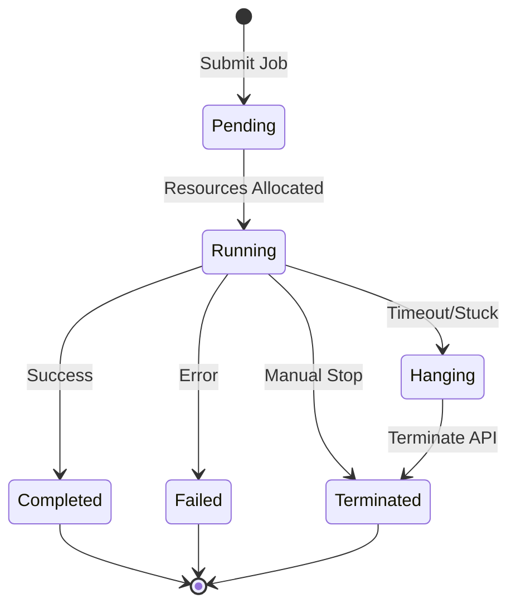

#### DCluster Namespace 命名规则

```bash
# Namespace 格式: s-{env}-{client}-{jobId}
s-prod-syncbank-abc123def456
s-prod-uopx-12345
s-prod-nasa-xyz789ghi012
```

#### DCluster API 使用示例

```bash
# 查询 DCluster Ingress
kubectl get ing -n prod | grep dcluster

# 输出示例
dcluster-uswest2-prod    dcluster-uswest2-prod.dv-api.com    80, 443    30d

# 终止 Hanging Job
curl -X POST http://dcluster-uswest2-prod.dv-api.com/cluster/job/terminate/abc123def456

# 查询 Job 状态
curl -X GET http://dcluster-uswest2-prod.dv-api.com/cluster/job/abc123def456
```

---

### 4️⃣ Feature Platform (FP) 特征计算服务

**位置**: K8s FP Service Pod

**功能**: 核心特征计算引擎，提供实时和批处理特征计算

#### FP 工作模式

| 模式 | 触发方式 | 数据来源 | 延迟 | 用途 |
|------|---------|---------|------|------|
| **实时模式** | CronFeaturePlatformFerry | VirtualNode (实时) | < 1 分钟 | 实时风控决策 |
| **批处理模式** | BatchFeaturePlatformFerry | VirtualNode (批量) | 5-20 分钟 | 批量特征计算 |

#### FP 数据流向

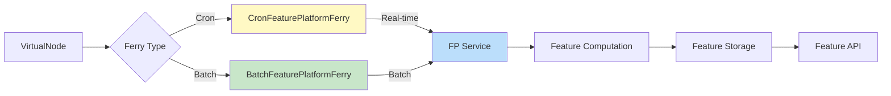

#### FP 特征类型

```python
# 特征类型示例
class FeatureTypes:
    # 用户行为特征
    USER_BEHAVIOR = [
        "login_frequency",
        "transaction_amount",
        "device_changes"
    ]
    
    # 设备指纹特征
    DEVICE_FINGERPRINT = [
        "device_id",
        "ip_address",
        "browser_fingerprint"
    ]
    
    # 网络关系特征
    NETWORK_GRAPH = [
        "connected_devices",
        "shared_attributes",
        "graph_centrality"
    ]
    
    # 时间序列特征
    TIME_SERIES = [
        "transaction_velocity",
        "login_pattern",
        "spending_pattern"
    ]
```

---

### 5️⃣ 数据存储层

#### Cassandra (主存储)

**用途**: 存储 DFE (Digital Feature Extraction) 数据和计算结果

**数据模型**:
```cql
-- DFE 表结构
CREATE TABLE dfe_data (
    client_id TEXT,
    user_id TEXT,
    timestamp TIMESTAMP,
    feature_vector MAP<TEXT, DOUBLE>,
    PRIMARY KEY ((client_id, user_id), timestamp)
) WITH CLUSTERING ORDER BY (timestamp DESC);

-- 结果表结构
CREATE TABLE results (
    client_id TEXT,
    job_id TEXT,
    result_type TEXT,
    result_data TEXT,
    created_at TIMESTAMP,
    PRIMARY KEY ((client_id, job_id), result_type)
);
```

#### S3 (数据湖)

**用途**: 
- **输入**: 客户原始数据 (`client S3 rawdata`)
- **输出**: 处理结果和报告 (`client S3 results`)

**S3 路径结构**:
```
s3://client-bucket/
├── rawdata/
│   ├── {client}/
│   │   ├── {date}/
│   │   │   ├── logs/
│   │   │   ├── events/
│   │   │   └── transactions/
├── results/
│   ├── {client}/
│   │   ├── {date}/
│   │   │   ├── risk_scores/
│   │   │   ├── reports/
│   │   │   └── frontend_data/
```

---

## 🔄 完整业务流程串联

### 端到端数据流

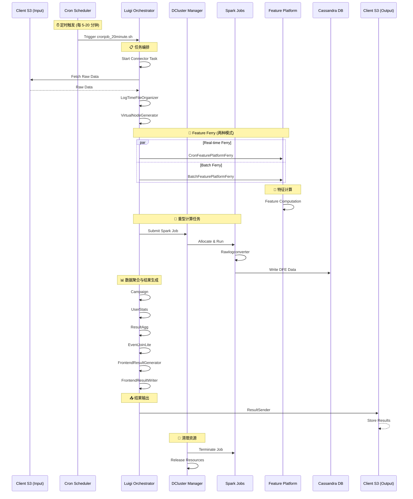

### 详细执行步骤

#### 阶段 1: 数据接入 (0-5 分钟)

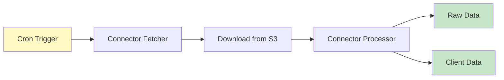

**关键步骤**:
1. **Cron 触发**: `cronjob_20minute.sh +syncbank`
2. **Luigi 启动**: `Connector` Task
3. **数据下载**: 从 `s3://client-bucket/rawdata/{client}/{date}/` 下载
4. **数据处理**: 解析、清洗、格式转换
5. **输出**: `rawdata/` 和 `clientdata/` 目录

#### 阶段 2: 数据预处理 (5-10 分钟)

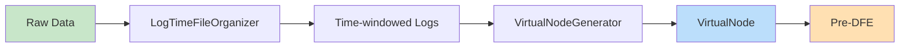

**关键步骤**:
1. **时间组织**: `LogTimeFileOrganizer` 按时间窗口组织日志
2. **虚拟节点生成**: `VirtualNodeGenerator` 创建计算节点
3. **Pre-DFE 准备**: 准备 DFE 输入数据

#### 阶段 3: 特征计算 (10-20 分钟)

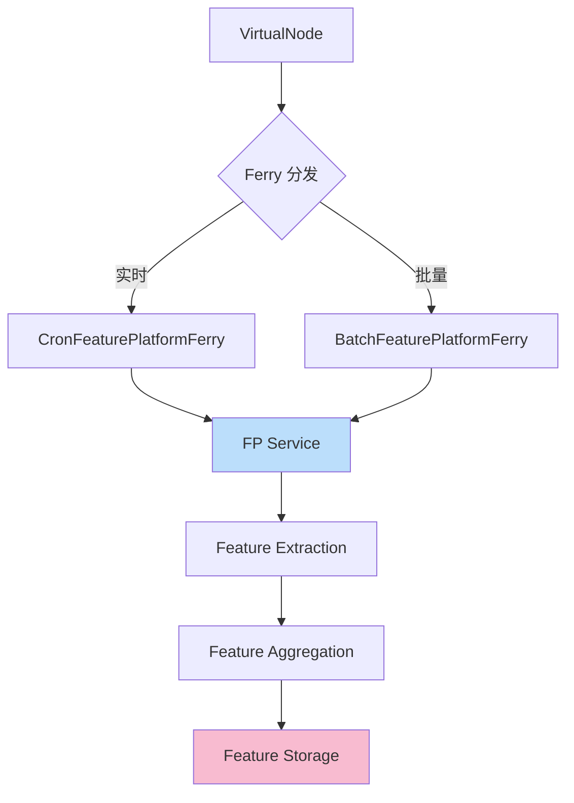

**关键步骤**:
1. **Ferry 调度**: 根据任务类型选择 Ferry 模式
2. **FP 计算**: 特征提取、聚合、存储
3. **并行处理**: DFE 转换同时进行

#### 阶段 4: DFE 转换与存储 (10-25 分钟)

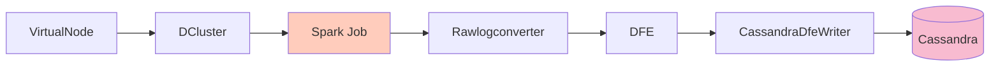

**关键步骤**:
1. **Job 提交**: Luigi → DCluster API
2. **Spark 启动**: 在 AWS EC2 上启动 Spark Job
3. **DFE 转换**: `Rawlogconverter` 转换为 DFE 格式
4. **写入 Cassandra**: `CassandraDfeWriter` 持久化

#### 阶段 5: 数据聚合与分析 (25-45 分钟)

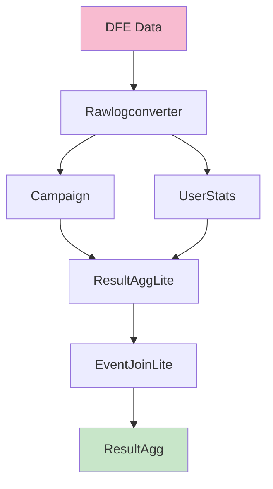

**关键步骤**:
1. **Campaign 分析**: 活动级别聚合
2. **UserStats 计算**: 用户统计指标
3. **ResultAggLite**: 轻量级结果聚合
4. **EventJoinLite**: 事件关联分析
5. **ResultAgg**: 最终结果汇总

#### 阶段 6: 前端数据生成 (45-55 分钟)

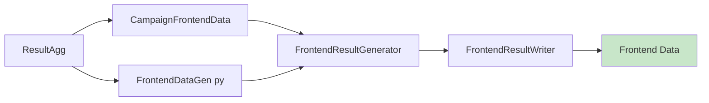

**关键步骤**:
1. **数据转换**: `CampaignFrontendData` 和 `FrontendDataGen`
2. **结果生成**: `FrontendResultGenerator` 生成前端展示数据
3. **数据写入**: `FrontendResultWriter` 写入存储

#### 阶段 7: 结果输出 (55-60 分钟)

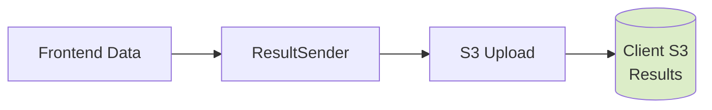

**关键步骤**:
1. **结果收集**: `ResultSender` 收集所有结果
2. **上传 S3**: 上传到 `s3://client-bucket/results/{client}/{date}/`
3. **通知客户**: 发送完成通知

---

## ⚙️ 关键配置与参数

### Luigi 配置

```ini
# luigi.cfg
[core]
default-scheduler-host = localhost
default-scheduler-port = 8082
parallel-scheduling = true
workers = 5

[resources]
# 并发限制
spark_jobs = 3
flink_jobs = 2

[batch_tasks]
# 任务超时设置
timeout = 3600  # 1 小时

[retcode]
# 重试策略
already_running = 10
missing_data = 20
not_run = 25
task_failed = 30
scheduling_error = 35
```

### DCluster 配置

```yaml
# dcluster-config.yaml
spark:
  driver_memory: 4g
  executor_memory: 8g
  executor_cores: 4
  num_executors: 10

flink:
  jobmanager_memory: 2g
  taskmanager_memory: 4g
  taskmanager_slots: 4

resources:
  # EC2 资源配置
  on_demand:
    instance_type: r5.2xlarge
    min_instances: 5          # 常驻最小实例数
    max_instances: 10         # On-Demand 最大实例数
    priority: high            # 关键任务优先使用
    
  spot_instance:
    instance_type: r5.2xlarge
    max_instances: 20         # Spot 最大实例数
    max_price: 0.5            # 最高出价 ($/小时)
    timeout_minutes: 5        # 申请超时时间
    retry_attempts: 3         # 重试次数
    priority: cost_optimized  # 成本优化优先
    fallback_to_on_demand: true  # 失败时降级到 On-Demand
    
  # 资源分配策略
  allocation_strategy: cost_optimized  # cost_optimized | performance_optimized | balanced
  
  # 成本优化策略 (优先 Spot)
  cost_optimized:
    prefer_spot: true
    spot_percentage: 70       # 目标 70% 使用 Spot
    on_demand_percentage: 30  # 30% 使用 On-Demand
    
  # 性能优化策略 (优先 On-Demand)
  performance_optimized:
    prefer_spot: false
    spot_percentage: 30
    on_demand_percentage: 70
    
  # 弹性伸缩配置
  autoscaling:
    scale_up_threshold: 0.8    # CPU/Memory > 80% 时扩容
    scale_down_threshold: 0.3  # CPU/Memory < 30% 时缩容
    scale_up_cooldown: 300     # 扩容冷却时间 (秒)
    scale_down_cooldown: 600   # 缩容冷却时间 (秒)
```

### Feature Platform 配置

```yaml
# fp-config.yaml
feature_platform:
  mode: hybrid  # real-time, batch, hybrid
  
  real_time:
    max_qps: 10000
    timeout_ms: 100
    cache_ttl_seconds: 60
  
  batch:
    batch_size: 10000
    max_parallel_batches: 5
    timeout_minutes: 30
  
  storage:
    cassandra_keyspace: fp_features
    s3_bucket: fp-features-backup
```

---

## 🔍 监控与调试

### MGT 平台监控

**访问地址**: `https://eng-mgt-a.dv-api.com/oncall/logs/production-job`

**监控指标**:
- Hanging Jobs（挂起任务）
- Job Exit Codes（退出码统计）
- Job Duration（任务时长）
- Resource Usage（资源使用）

**示例 URL**:
```
# US West 2 Production 集群监控
https://eng-mgt-a.dv-api.com/oncall/logs/production-job?area=aws-uswest2-prod_a_prod&client=syncbank&module=monitortracker&exitCode=

# EU West 1 Production 集群监控
https://eng-mgt-a.dv-api.com/oncall/logs/production-job?area=aws-euwest1-prod_b_prod&client=uopx&module=connector&exitCode=
```

### Luigi 调试命令

```bash
# 查看 Luigi Pod
kubectl get pods -n prod -l app=luigi-deployment

# 进入 Luigi Pod
kubectl exec -it -n prod luigi-deployment-xxxxx -- bash

# 查看所有 Luigi 进程
ps aux | grep luigi | grep -v grep

# 查看特定客户端的任务
ps aux | grep -i syncbank

# 查看特定模块的任务
ps aux | grep -i monitortracker

# 查看 Crontab 配置
crontab -l
```

### DCluster 调试命令

```bash
# 查看 DCluster Ingress
kubectl get ing -n prod | grep dcluster

# 查看客户端 Job Namespace
kubectl get ns | grep s-prod-syncbank

# 终止 Hanging Job
curl -X POST http://dcluster-uswest2-prod.dv-api.com/cluster/job/terminate/{jobId}

# 查询 Job 状态
curl -X GET http://dcluster-uswest2-prod.dv-api.com/cluster/job/{jobId}
```

### 常见故障排查

| 故障类型 | 症状 | 排查步骤 | 解决方案 |
|---------|------|---------|---------|
| **Hanging Job** | 任务运行时间超过平均值 2-3 倍 | 1. 检查 MGT 平台<br/>2. 查看 DCluster namespace<br/>3. 检查 Spark/Flink logs | 使用 DCluster Terminate API |
| **Spot 申请超时** | Spot Instance 一直申请不到 | 1. 检查 Spot 申请日志<br/>2. 查看当前 Spot 价格<br/>3. 检查可用区资源 | DCluster 自动停止申请，降级到 On-Demand |
| **Spot 频繁回收** | Job 频繁被中断重启 | 1. 查看 AWS Spot 中断通知<br/>2. 检查 Job checkpoint 配置<br/>3. 评估任务优先级 | 切换到 On-Demand 或增加 checkpoint 频率 |
| **成本异常升高** | Spot 使用率下降，On-Demand 使用率上升 | 1. 检查 Spot 可用性<br/>2. 查看任务分类策略<br/>3. 分析资源使用趋势 | 调整 Spot 价格上限或优化任务调度时间 |
| **Luigi Stuck** | Luigi 进程卡住不动 | 1. 进入 Luigi Pod<br/>2. `ps aux` 查看进程<br/>3. 检查进程 CPU/Memory | `kill PID` 或 `kill -9 PID` |
| **FP Timeout** | Feature Platform 超时 | 1. 检查 FP Pod 状态<br/>2. 查看 FP logs<br/>3. 检查 Ferry 队列 | 重启 Ferry 或增加 FP 资源 |
| **Cassandra Write Fail** | DFE 写入失败 | 1. 检查 Cassandra 连接<br/>2. 查看表空间使用率<br/>3. 检查写入权限 | 扩容 Cassandra 或修复连接 |
| **S3 Upload Fail** | 结果上传失败 | 1. 检查 S3 权限<br/>2. 检查网络连接<br/>3. 验证 bucket 路径 | 修复 IAM 角色或网络配置 |

### Spot Instance 调试命令

```bash
# 检查 DCluster Spot 申请状态
curl -X GET http://dcluster-uswest2-prod.dv-api.com/cluster/resources/spot/status

# 查看 Spot 申请历史
curl -X GET http://dcluster-uswest2-prod.dv-api.com/cluster/resources/spot/history?hours=24

# 查看当前 Spot 价格
aws ec2 describe-spot-price-history \
  --instance-types r5.2xlarge \
  --region us-west-2 \
  --start-time $(date -u +"%Y-%m-%dT%H:%M:%S") \
  --product-descriptions "Linux/UNIX" \
  --output table

# 强制停止 Spot 申请 (如果一直申请不到)
curl -X POST http://dcluster-uswest2-prod.dv-api.com/cluster/resources/spot/cancel/{requestId}

# 查看 Spot 中断通知
aws ec2 describe-spot-instance-requests \
  --region us-west-2 \
  --filters "Name=state,Values=active" \
  --output json | jq '.SpotInstanceRequests[] | select(.Status.Code == "instance-terminated-by-price")'

# 检查 Job 是否运行在 Spot 上
kubectl get pods -n s-prod-{client}-{jobId} -o jsonpath='{.items[0].spec.nodeName}'
kubectl describe node {node-name} | grep "lifecycle=spot"
```

---

## 📊 性能指标与 SLA

### 端到端延迟

| 阶段 | 目标延迟 | P50 | P90 | P99 |
|------|---------|-----|-----|-----|
| **数据接入** | < 5 分钟 | 3 分钟 | 5 分钟 | 8 分钟 |
| **数据预处理** | < 10 分钟 | 8 分钟 | 12 分钟 | 18 分钟 |
| **特征计算** | < 20 分钟 | 15 分钟 | 22 分钟 | 30 分钟 |
| **DFE 转换** | < 25 分钟 | 20 分钟 | 28 分钟 | 35 分钟 |
| **数据聚合** | < 45 分钟 | 35 分钟 | 50 分钟 | 65 分钟 |
| **前端生成** | < 55 分钟 | 45 分钟 | 60 分钟 | 75 分钟 |
| **结果输出** | < 60 分钟 | 50 分钟 | 65 分钟 | 80 分钟 |
| **总延迟** | < 60 分钟 | 50 分钟 | 70 分钟 | 90 分钟 |

### 吞吐量指标

| 指标 | 目标值 | 当前值 |
|------|-------|-------|
| **每日处理客户数** | 50+ | 56 |
| **每小时任务数** | 1000+ | 1200 |
| **每秒特征计算** | 10000+ | 12000 |
| **DFE 写入速率** | 5000 rows/s | 6000 rows/s |
| **S3 上传速率** | 100 MB/s | 120 MB/s |

### 可用性 SLA

| 服务 | 目标可用性 | 当前可用性 |
|------|-----------|-----------|
| **Luigi 调度器** | 99.9% | 99.95% |
| **DCluster 服务** | 99.5% | 99.7% |
| **Feature Platform** | 99.9% | 99.92% |
| **Cassandra** | 99.99% | 99.98% |
| **S3** | 99.99% | 99.99% |

---

## 🚀 扩展性与优化

### 水平扩展策略

```yaml
# HPA (Horizontal Pod Autoscaler) 配置
apiVersion: autoscaling/v2
kind: HorizontalPodAutoscaler
metadata:
  name: luigi-deployment-hpa
spec:
  scaleTargetRef:
    apiVersion: apps/v1
    kind: Deployment
    name: luigi-deployment
  minReplicas: 3
  maxReplicas: 10
  metrics:
  - type: Resource
    resource:
      name: cpu
      target:
        type: Utilization
        averageUtilization: 70
  - type: Resource
    resource:
      name: memory
      target:
        type: Utilization
        averageUtilization: 80
```

### 性能优化建议

| 优化方向 | 建议 | 预期提升 |
|---------|------|---------|
| **Luigi 并发** | 增加 workers 数量到 10 | 吞吐量 +30% |
| **Spark 资源** | 增加 executor memory 到 16g | 性能 +40% |
| **Cassandra 调优** | 调整 compaction strategy | 写入性能 +25% |
| **S3 并行上传** | 使用 multipart upload | 上传速度 +50% |
| **Feature Platform 缓存** | 增加 cache TTL 到 300s | 响应时间 -60% |
| **数据分区** | 按日期和客户端分区 | 查询性能 +35% |

### 成本优化建议

| 优化方向 | 建议 | 预期节省 |
|---------|------|---------|
| **Spot Instance 优先** | 70% 任务使用 Spot Instance | 成本 -50% |
| **Spot 多可用区** | 配置多个 AZ 提高 Spot 可用性 | 可用性 +30% |
| **On-Demand 预留** | 关键任务使用 Reserved Instance | 成本 -40% |
| **智能降级策略** | Spot 申请超时 < 5 分钟自动降级 | 延迟 -20% |
| **Job 检查点** | Spark Job 启用 checkpoint，Spot 回收时快速恢复 | 重启时间 -70% |
| **资源右调优** | 根据历史数据优化 executor 配置 | 资源利用率 +25% |
| **混合策略** | 高峰期增加 On-Demand，低峰期全 Spot | 成本 -30% |

### Cost vs Performance 权衡策略

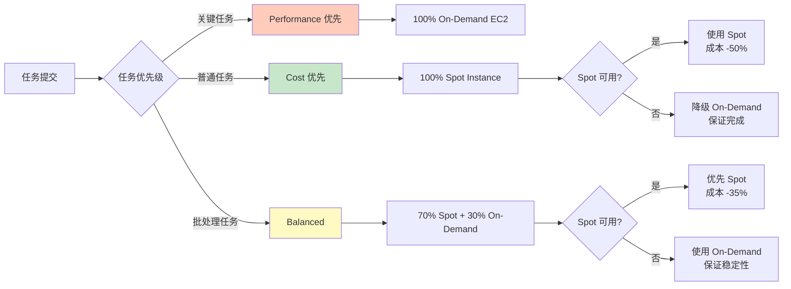

#### 任务分类策略

| 任务类型 | 优先级 | 资源策略 | 成本影响 | 适用场景 |
|---------|-------|---------|---------|---------|
| **实时特征计算** | 高 | 100% On-Demand | 标准成本 | CronFeaturePlatformFerry |
| **DFE 转换** | 中 | 70% Spot + 30% On-Demand | -35% | Rawlogconverter |
| **数据聚合** | 中 | 70% Spot + 30% On-Demand | -35% | Campaign, UserStats |
| **批处理任务** | 低 | 100% Spot (可重试) | -50% | 月度报告、历史数据处理 |
| **前端数据生成** | 高 | 100% On-Demand | 标准成本 | FrontendResultGenerator |
| **开发测试** | 低 | 100% Spot | -50% | 测试环境任务 |

---

## 🔒 安全与合规

### 数据加密

```yaml
# 加密配置
encryption:
  # S3 服务端加密
  s3:
    server_side_encryption: AES256
    kms_key_id: arn:aws:kms:us-west-2:xxx:key/xxx
  
  # Cassandra 传输加密
  cassandra:
    client_encryption: true
    ssl_truststore_path: /etc/cassandra/truststore.jks
  
  # DFE 数据加密
  dfe:
    encryption_algorithm: AES-256-GCM
    key_rotation_days: 90
```

### 访问控制

```yaml
# RBAC 配置
rbac:
  luigi_pod:
    service_account: luigi-sa
    roles:
      - read_secrets
      - write_cassandra
      - access_s3
  
  dcluster:
    service_account: dcluster-sa
    roles:
      - manage_jobs
      - allocate_resources
      - access_ec2
  
  fp_service:
    service_account: fp-sa
    roles:
      - read_features
      - write_features
      - access_cache
```

### 审计日志

```yaml
# 审计配置
audit:
  enabled: true
  log_level: INFO
  
  events:
    - job_submit
    - job_terminate
    - data_access
    - config_change
  
  storage:
    type: cloudwatch
    log_group: /datavisor/audit
    retention_days: 365
```

---

## 📚 总结

### 核心优势

✅ **高度自动化**: Cron + Luigi 实现完全自动化的任务调度和依赖管理  
✅ **弹性伸缩**: DCluster 动态管理 Spark/Flink 资源，支持 Spot/On-Demand 混合部署  
✅ **成本优化**: Spot Instance 优先策略，批处理任务成本降低 50%  
✅ **智能降级**: Spot 不可用时自动降级到 On-Demand，保证任务完成  
✅ **高性能**: Feature Platform 提供实时和批处理双模式  
✅ **高可用**: 多区域部署，故障自动恢复，Spot 回收自动迁移  
✅ **可观测性**: MGT 平台提供全链路监控

### 架构特点

🎯 **分层解耦**: 调度、编排、执行、计算、存储五层独立  
🎯 **容错设计**: 任务失败自动重试，资源不足自动扩容，Spot 回收自动迁移  
🎯 **成本优化**: Spot Instance 优先 + On-Demand 保底，成本与性能动态平衡  
🎯 **性能优化**: 并行处理、缓存机制、资源池化  
🎯 **易于维护**: 集群别名、统一配置、自动化部署

### Cost & Performance 架构设计原则

| 设计原则 | 说明 | 实现方式 |
|---------|------|---------|
| **成本优先** | 非关键任务优先使用 Spot Instance | 70% 批处理任务使用 Spot，成本降低 50% |
| **性能保底** | 关键任务使用 On-Demand 保证稳定性 | 实时特征计算、前端生成使用 On-Demand |
| **智能降级** | Spot 不可用时自动切换 On-Demand | 申请超时 < 5 分钟自动降级 |
| **容错设计** | Spot 回收时保存状态并迁移 | Spark Checkpoint + 2 分钟迁移窗口 |
| **动态调整** | 根据 Spot 可用性动态调整比例 | 高峰期降低 Spot 比例，低峰期提高 |
| **多 AZ 策略** | 多可用区申请提高 Spot 可用性 | 配置 3 个 AZ，提高 30% 可用性 |

### 未来演进

🚀 **Kubernetes Native**: 迁移到 Spark on K8s，减少 EC2 依赖  
🚀 **实时增强**: 扩展实时计算能力，缩短端到端延迟  
🚀 **AI/ML 集成**: 引入机器学习模型，提升特征质量  
🚀 **多云支持**: 支持 AWS、GCP、Azure 多云部署  
🚀 **Spot Fleet**: 使用 Spot Fleet 管理多种实例类型，提高可用性  
🚀 **成本预测**: AI 驱动的 Spot 价格预测，智能选择申请时机

---

## 💰 成本优化总结

### Spot Instance 在架构中的核心价值

DataVisor 平台通过 **Spot Instance + On-Demand EC2 混合策略**，实现了成本与性能的最佳平衡：

#### 成本节省

```
总体成本节省计算：
- 批处理任务占比: 70%
- Spot Instance 使用率: 70% (在批处理任务中)
- Spot Instance 折扣: 50%

总体节省 = 70% × 70% × 50% = 24.5%

如果月度计算成本 $100,000：
- 使用 Spot 后: $75,500
- 年度节省: $294,000
```

#### 关键设计决策

| 决策点 | 选择 | 原因 |
|-------|------|------|
| **实时特征计算** | 100% On-Demand | 延迟敏感，不能容忍中断 |
| **DFE 转换** | 70% Spot + 30% On-Demand | 可容错，有 checkpoint，成本优化 |
| **数据聚合** | 70% Spot + 30% On-Demand | 批处理性质，可重试 |
| **前端生成** | 100% On-Demand | 关键路径，保证 SLA |
| **Spot 申请超时** | 5 分钟 | 平衡成本节省和任务延迟 |
| **自动降级** | 启用 | 保证任务完成，不牺牲可靠性 |

#### Spot Instance 最佳实践

✅ **优先使用**: 批处理、数据聚合、离线计算任务  
✅ **启用 Checkpoint**: Spark/Flink 任务定期保存状态  
✅ **多 AZ 部署**: 提高 Spot Instance 可用性  
✅ **价格上限设置**: 避免价格波动时成本失控  
✅ **健康检查**: 监控 Spot 中断通知，提前迁移  
✅ **自动降级**: 申请失败时立即切换 On-Demand  
❌ **不使用**: 实时计算、关键路径、无状态保存的任务

#### DCluster 资源管理智能

DCluster 作为资源管理核心，实现了：

1. **智能调度**: 根据任务类型自动选择 Spot 或 On-Demand
2. **故障检测**: 5 分钟超时检测，避免无限等待
3. **自动降级**: Spot 不可用时秒级切换 On-Demand
4. **状态保存**: Spot 回收前保存状态，On-Demand 继续执行
5. **成本监控**: 实时跟踪 Spot 使用率和成本节省

这种设计使得 DataVisor 平台既能享受 Spot Instance 的成本优势，又不牺牲系统的可靠性和性能！

---

## 📖 相关文档

- [Luigi Debug Helper 使用指南](./oncall-luigi-debug-helper.md)
- [K8s 升级计划](./operation-k8s-upgrade-plan.md)
- [请求路由架构](./architecture-request-routing-flow.md)
- [Grafana 延迟监控](./monitoring-grafana_latency_architecture.md)

---

**文档版本**: v1.0  
**更新日期**: 2025-11-29  
**维护者**: DataVisor SRE Team

