# Scratchpad

### DV's App

- FP (fp/fp-async/kafka app export/fp-cron)
- June Decision:
  - API Server
  - Admin
  - Platform API Server 
- Metadata:
  - Infra

> 注意：yuga 重启可能需要重启 fp/fp-async
> 注意：不轻易重启clickhouse

ngsc(frontend) -> ui -> sdg (backend) 
                -> ui-mysql

platform-api-server -> clickhouse

fp/fp-async/fp-cron some config different

admin-ui

dcluster -> apply node resource -> s(spark)-prex-syncbank

metabase -> BI

# Kubernetes Helm Charts Repository Structure Analysis
## monitoring dashboard

sla: 
https://grafana-mgt.dv-api.com/d/p1KqfRAMk/sla-batch-and-realtime?orgId=1&var-PromDs=vms-victoria-metrics-single-server&var-client=syncbank&var-sandbox_client=&var-pipeline=prod.realtime.rtserver.awsus&var-Batch_Pipeline=prod.awsus&from=now-15m&to=now

PANEL: Upstream latency graph
PANEL: Waiting Latency between Ingress and Upstream

fp metrics:
https://grafana-mgt.dv-api.com/d/EP_yHg7Gk/feature-platform-metrics?orgId=1&var-PromDs=vms-victoria-metrics-single-server&var-cluster=aws-uswest2-prod-a&var-namespace=prod&var-pod=fp-deployment-845489447f-t66t8&var-tenant=syncbank
- Error log:
  [Error Log](https://grafana-mgt.dv-api.com/explore?orgId=1&left=%7B%22datasource%22:%22Loki%22,%22queries%22:%5B%7B%22refId%22:%22A%22,%22expr%22:%22%7Bcluster%3D%5C%22aws-apsoutheast1-prod-a%5C%22,namespace%3D%5C%22prod%5C%22,pod%3D~%5C%22fp-.*deployment.*%5C%22%7D%20%7C~%5C%22ERROR%5C%22%20%22,%22datasource%22:%7B%22type%22:%22loki%22,%22uid%22:%22M2q8i3Q7z%22%7D%7D%5D,%22range%22:%7B%22from%22:%22now-3h%22,%22to%22:%22now%22%7D%7D)

pod resource
https://grafana-mgt.dv-api.com/d/b_XlLjRMz/pod-resources?orgId=1&var-PromDs=prometheus-pods&var-cluster=aws-uswest2-prod-a&var-namespace=prod&var-pod=fp-deployment-845489447f-4xjff&var-containers=fp

双集群对比：
https://grafana-mgt.dv-api.com/d/X2qhqpjSk/multi-cluster-traffic-distribution?orgId=1&var-cluster=aws-uswest2-prod&var-client=All&var-interface=All

kafka:
https://grafana-mgt.dv-api.com/d/cluster_kafkfa_exporter/kafka-exporter-for-all?orgId=1
[Kafka Exporter Dashboard](https://grafana-mgt.dv-api.com/d/cluster_kafkfa_exporter/kafka-exporter-for-all?orgId=1&var-PromDs=prometheus-apps&var-job=kubernetes-pods&var-cluster=aws-uswest2-prod-b&var-namespace=prod&var-pod=kafka3-exporter-788587b949-dpvvw&var-topic=1214_navan_update_transformer_20241213&var-consumergroup=&from=now-15m&to=now)
    - Topic: cluster_a.
    - Velocity: prod_b
  - Enable Kafka MirrorMaker:
  ```sh
  kubectl scale --replicas 0 deployment -n prod mirrormaker2 # A/B together off
  ```
[Kafka Exporter for All](https://grafana-mgt.dv-api.com/d/cluster_kafkfa_exporter/kafka-exporter-for-all?orgId=1&var-PromDs=vms-victoria-metrics-single-server&var-job=kubernetes-pods&var-cluster=aws-apsoutheast1-prod-a&var-namespace=prod&var-pod=kafka3-exporter-66c5987d49-v9csp&var-topic=cluster_b.prod_fp_velocity.admin&var-topic=cluster_b.prod_fp_velocity.airasia&var-topic=cluster_b.prod_fp_velocity.autoswitchtraffic&var-topic=cluster_b.prod_fp_velocity.autotest013&var-topic=cluster_b.prod_fp_velocity.autotest014&var-topic=cluster_b.prod_fp_velocity.binance&var-topic=cluster_b.prod_fp_velocity.blibli&var-topic=cluster_b.prod_fp_velocity.dvgin&var-topic=cluster_b.prod_fp_velocity.dvloginprotectinternal&var-topic=cluster_b.prod_fp_velocity.ggpoker&var-topic=cluster_b.prod_fp_velocity.okcoin&var-topic=cluster_b.prod_fp_velocity.okg&var-topic=cluster_b.prod_fp_velocity.okx&var-topic=cluster_b.prod_fp_velocity.qaautomationtest&var-topic=cluster_b.prod_fp_velocity.qaautotest&var-topic=cluster_b.prod_fp_velocity.qatenant1685695013&var-topic=cluster_b.prod_fp_velocity.qatenant1685699607&var-topic=cluster_b.prod_fp_velocity.qatest&var-topic=cluster_b.prod_fp_velocity.qatestb&var-topic=cluster_b.prod_fp_velocity.qatestsgprodb&var-topic=prod_fp_velocity&var-topic=prod_fp_velocity-al-.admin&var-topic=prod_fp_velocity-al-.airasia&var-topic=prod_fp_velocity-al-.autoswitchtraffic&var-topic=prod_fp_velocity-al-.autotest001&var-topic=prod_fp_velocity-al-.autotest002&var-topic=prod_fp_velocity-al-.autotest005&var-topic=prod_fp_velocity-al-.autotest006&var-topic=prod_fp_velocity-al-.autotest007&var-topic=prod_fp_velocity-al-.autotest008&var-topic=prod_fp_velocity-al-.autotest009&var-topic=prod_fp_velocity-al-.autotest010&var-topic=prod_fp_velocity-al-.autotest011&var-topic=prod_fp_velocity-al-.autotest012&var-topic=prod_fp_velocity-al-.autotest013&var-topic=prod_fp_velocity-al-.autotest014&var-topic=prod_fp_velocity-al-.blibli&var-topic=prod_fp_velocity-al-.dvgin&var-topic=prod_fp_velocity-al-.dvloginprotectinternal&var-topic=prod_fp_velocity-al-.ggpoker&var-topic=prod_fp_velocity-al-.metabasetest01&var-topic=prod_fp_velocity-al-.okcoin&var-topic=prod_fp_velocity-al-.okg&var-topic=prod_fp_velocity-al-.okx&var-topic=prod_fp_velocity-al-.qaautomationtest&var-topic=prod_fp_velocity-al-.qaautotest&var-topic=prod_fp_velocity-al-.qatenant1685640319&var-topic=prod_fp_velocity-al-.qatenant1685642411&var-topic=prod_fp_velocity-al-.qatenant1685695013&var-topic=prod_fp_velocity-al-.qatenant1685699607&var-topic=prod_fp_velocity-al-.qatest&var-topic=prod_fp_velocity-al-.qatestb&var-topic=prod_fp_velocity-synth-.admin&var-topic=prod_fp_velocity-synth-.airasia&var-topic=prod_fp_velocity-synth-.blibli&var-topic=prod_fp_velocity-synth-.dvloginprotectinternal&var-topic=prod_fp_velocity-synth-.ggpoker&var-topic=prod_fp_velocity-synth-.okx&var-topic=prod_fp_velocity-synth-.qaautomationtest&var-topic=prod_fp_velocity-synth-.qaautotest&var-topic=prod_fp_velocity-synth-.qatest&var-topic=prod_fp_velocity.admin&var-topic=prod_fp_velocity.airasia&var-topic=prod_fp_velocity.autoswitchtraffic&var-topic=prod_fp_velocity.autotest001&var-topic=prod_fp_velocity.autotest002&var-topic=prod_fp_velocity.autotest005&var-topic=prod_fp_velocity.autotest006&var-topic=prod_fp_velocity.autotest007&var-topic=prod_fp_velocity.autotest008&var-topic=prod_fp_velocity.autotest009&var-topic=prod_fp_velocity.autotest010&var-topic=prod_fp_velocity.autotest011&var-topic=prod_fp_velocity.autotest012&var-topic=prod_fp_velocity.autotest013&var-topic=prod_fp_velocity.autotest014&var-topic=prod_fp_velocity.binance&var-topic=prod_fp_velocity.blibli&var-topic=prod_fp_velocity.dvgin&var-topic=prod_fp_velocity.dvloginprotectinternal&var-topic=prod_fp_velocity.ggpoker&var-topic=prod_fp_velocity.metabasetest01&var-topic=prod_fp_velocity.okcoin&var-topic=prod_fp_velocity.okg&var-topic=prod_fp_velocity.okx&var-topic=prod_fp_velocity.qaautomationtest&var-topic=prod_fp_velocity.qaautotest&var-topic=prod_fp_velocity.qatenant1685699607&var-topic=prod_fp_velocity.qatest&var-topic=prod_fp_velocity.qatestb&var-topic=velocity.admin&var-topic=velocity_detail_airasia&var-topic=velocity_detail_autoswitchtraffic&var-topic=velocity_detail_blibli&var-topic=velocity_detail_dvloginprotectinternal&var-topic=velocity_detail_ggpoker&var-topic=velocity_detail_qaautotest&var-consumergroup=velocity.prod_a&from=now-3h&to=now)


yuga:
https://grafana-mgt.dv-api.com/d/oOSnZg7mz/yugabytedb-node-dashboard?orgId=1
[YugabyteDB Dashboard](https://grafana-mgt.dv-api.com/d/1IGjQaiMk/yugabytedb?orgId=1&from=now-3h&to=now)

some yuga on external nodes: <NODE_IP>:7000
```sh
yugabyte-0(master-0): ip-172-31-26-165 
/root/master/bin/yb-admin -master_addresses 172.31.26.165:7100,172.31.25.131:7100,172.31.23.113:7100 get_load_move_completion
```


apisix:
https://grafana-mgt.dv-api.com/d/0lpCu9kHk/apisix-logging?orgId=1

mysql
- Quickstart / Cordon / Only schedule where needed
  - For A, cordon each time
- Command:
  ```
  mysql -p$MYSQL_ROOT_PASSWORD -e "show slave status\G"
  ```
- Master/Slave


## 基于集群实际部署的组件分析

### 命名空间与服务组织结构
基于k8s_cluster_pod_analysis.md的分析，系统采用了多个命名空间进行逻辑隔离：
- **prod**: 主要生产服务
- **preprod**: 预生产环境
- **dapp**: 应用服务专用命名空间
- **infra**: 基础设施组件
- **monitoring**: 监控系统
- **spark-long-living-cluster**: Spark长期运行集群

### 核心服务组件详解

#### 前端与API层
- **ngsc**: 前端服务，连接到UI和后端服务
- **sdg-apiserver**: 后端API服务，处理前端请求
- **platform-api-server**: 平台API服务器，连接到ClickHouse数据库
- **ui-mysql**: 用户界面相关的MySQL数据库

#### 特征平台体系
- **fp-deployment**: 特征平台主服务，处理实时检测和更新请求
- **fp-async-deployment**: 特征平台异步处理组件
- **fp-cron-deployment**: 特征平台定时任务组件
- **fp-group1-deployment**: 特征平台Group1服务(特定租户或功能分组)
- **fp-mysql**: 特征平台专用MySQL数据库

#### 消息与事件处理
- **kafka3**: Kafka消息队列(3节点集群)
- **kafka-event-exporter-application**: Kafka事件导出应用
- **sink-connector-lightweight**: 轻量级Sink连接器

#### 数据库与存储
- **dcluster-mysql**: dCluster专用MySQL
- **chi-dv-datavisor**: ClickHouse实例
- **yugabytedb-client**: YugabyteDB客户端

#### 监控与分析
- **metabase**: BI和分析平台
- **metabase-mysql**: Metabase的MySQL数据库

#### 配置与服务发现
- **nacos**: 配置中心和服务发现系统
- **nacos-mysql**: Nacos的MySQL数据库

### 业务流程与调用链

#### 实时API流程
系统提供两类主要的实时API入口点：
1. **Detection API**: 通过各种ingress提供(如syncbank-detection-ingress)，用于实时检测
2. **Update API**: 通过相应的ingress提供(如syncbank-update-ingress)，用于数据更新

#### 租户与多集群架构
系统支持多租户架构，每个租户(如syncbank, nasa, sofi等)都有独立的ingress配置。
同时部署在多个集群上(如aws-uswest2-prod-a)以实现高可用和地理分布。

#### 数据迁移流程
使用Liquibase进行数据库架构管理：
- **dcluster-liquibase-v2**: dCluster数据库迁移
- **dv-liquibase**: 数据可视化相关数据库迁移
- **platform-api-liquibase-job**: 平台API相关数据库迁移
- **sdg-api-liquibase-v2-job**: SDG API相关数据库迁移

### 存储和中间件使用关系

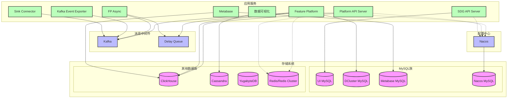

### 详细服务调用关系图

#### 前端到后端服务调用链
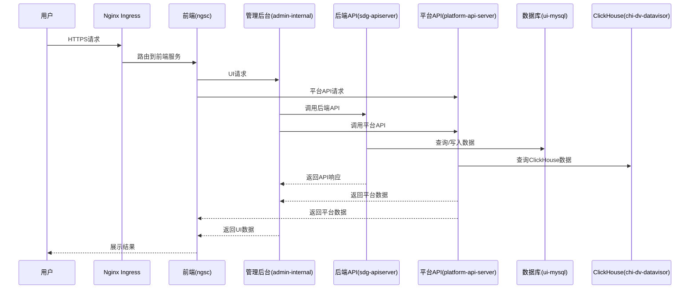

#### 实时检测流程 (FP服务)
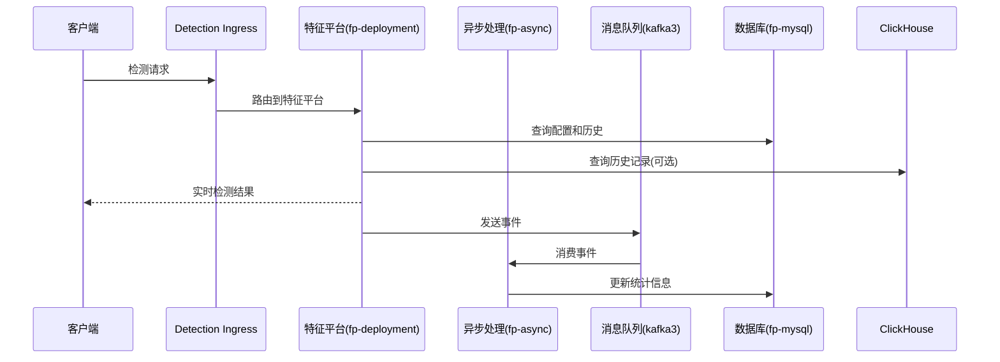

#### NGSC前端服务架构
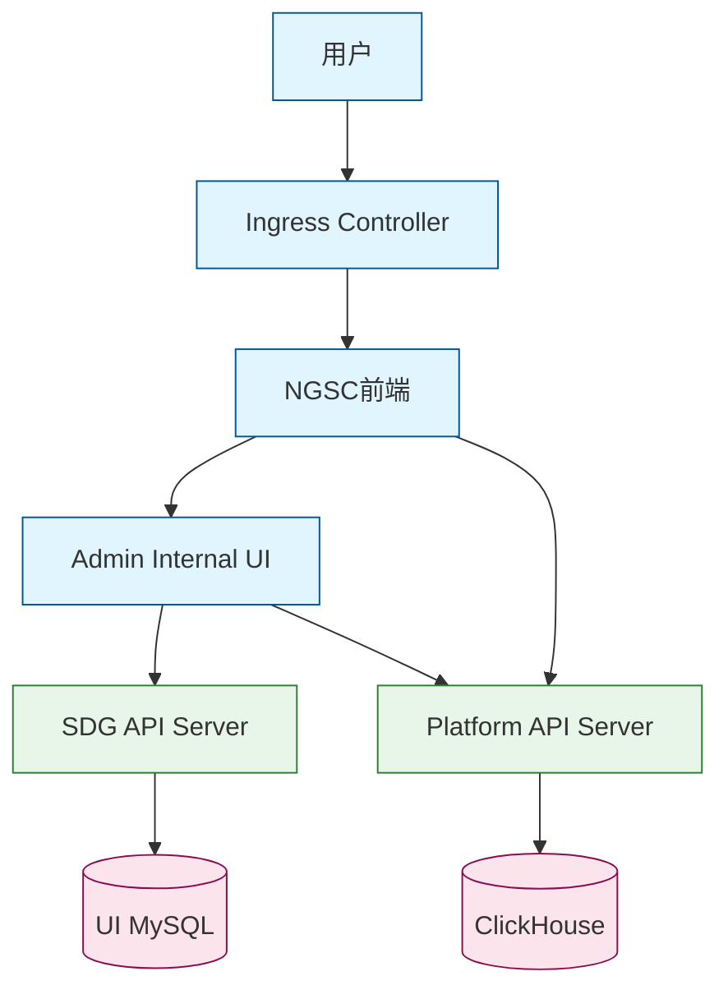

#### Feature Platform服务架构 
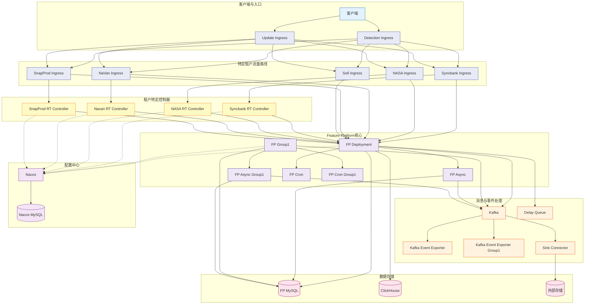

#### Metabase分析平台架构
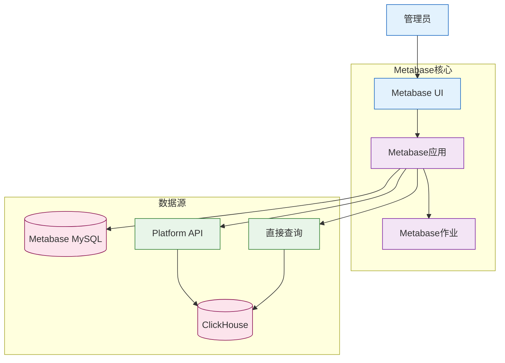

#### 多租户与多环境架构
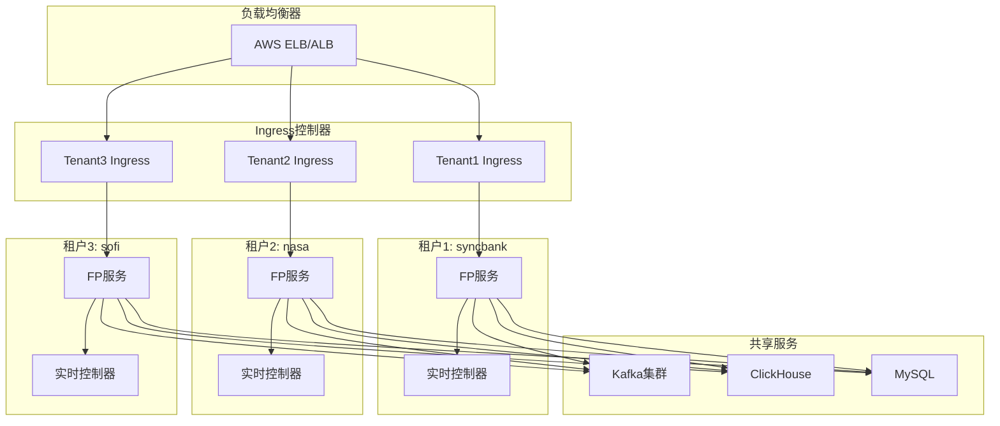

#### 数据库迁移流程
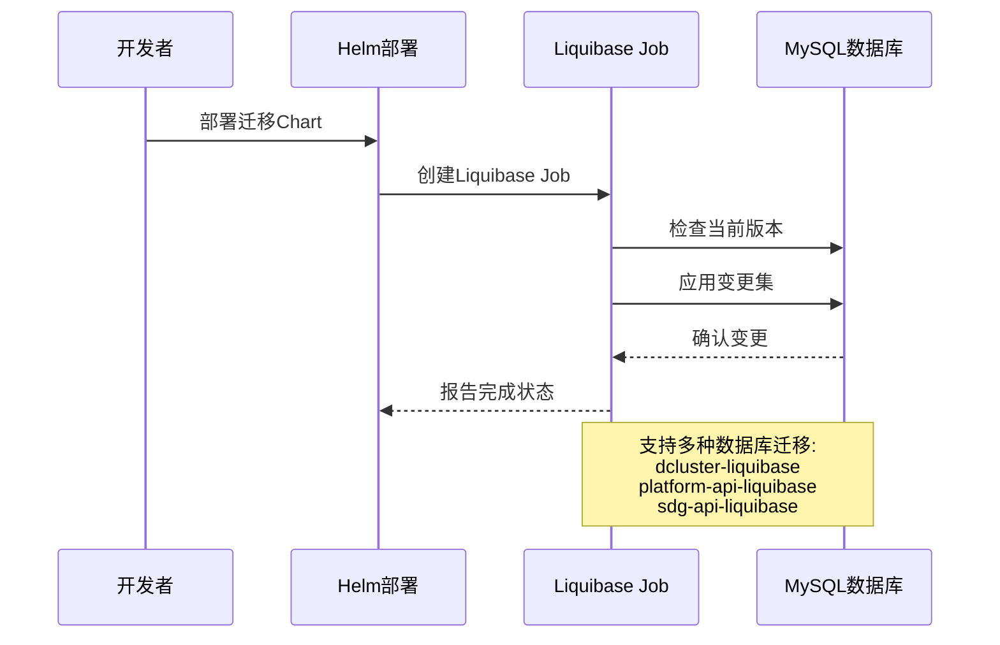

#### 监控与告警流程
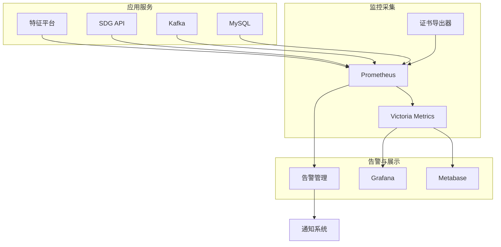


```mermaid
graph TB
    subgraph "前端与管理层"
        NGSC[NGSC前端]
        AdminInternalUI[Admin Internal UI]
        AdminUI[Admin UI]
        DFE9500[DFE9500]
    end

    subgraph "API服务层"
        SDGAPI[SDG API Server]
        SDGAPI_Group1[SDG API Server Group1]
        PlatformAPI[Platform API Server]
    end
    
    subgraph "Feature Platform核心"
        FP[FP Deployment]
        FPAsync[FP Async]
        FPCron[FP Cron]
        FPGroup1[FP Group1]
        FPAsyncGroup1[FP Async Group1]
        FPCronGroup1[FP Cron Group1]
    end
    
    subgraph "租户RT控制器"
        NASARTController[NASA RT Controller]
        SyncbankRTController[Syncbank RT Controller]
        NavanRTController[Navan RT Controller]
        SnapProdRTController[SnapProd RT Controller]
    end
    
    subgraph "配置中心"
        Nacos[Nacos配置中心]
        NacosDB[Nacos MySQL]
    end
    
    subgraph "消息队列"
        Kafka[Kafka集群]
        KafkaExporter[Kafka Event Exporter]
        KafkaExporterGroup1[Kafka Event Exporter Group1]
        SinkConnector[Sink Connector]
        MirrorMaker[Mirror Maker]
        DelayQueue[Delay Queue]
    end
    
    subgraph "数据存储"
        ClickHouse[ClickHouse]
        FPMYSQL[FP MySQL]
        UIMYSQL[UI MySQL]
        DClusterMySQL[DCluster MySQL]
        YugabyteClient[YugabyteDB Client]
    end
    
    subgraph "Spark资源管理"
        DCluster[DCluster]
        DClusterDeploy[DCluster Deployment]
        SparkLongLivingCluster[Spark Long Living Cluster]
        SparkNamespace[Spark 客户命名空间]
    end
    
    subgraph "数据库迁移"
        DClusterLiquibase[DCluster Liquibase]
        DVLiquibase[DV Liquibase]
        DVLiquibaseGroup1[DV Liquibase Group1]
        PlatformAPILiquibase[Platform API Liquibase]
        SDGAPILiquibaseV2[SDG API Liquibase V2]
        SDGAPILiquibaseV2Group1[SDG API Liquibase V2 Group1]
    end
    
    subgraph "分析工具"
        Metabase[Metabase]
        MetabaseDB[Metabase MySQL]
    end
    
    %% 前端与管理层连接
    NGSC --> AdminInternalUI
    NGSC --> PlatformAPI
    AdminUI --> SDGAPI
    
    %% API服务层连接
    SDGAPI --> UIMYSQL
    SDGAPI_Group1 --> UIMYSQL
    PlatformAPI --> ClickHouse
    
    %% Feature Platform连接
    FP --> FPMYSQL
    FP --> ClickHouse
    FP --> Kafka
    FP --> DelayQueue
    FPAsync --> FPMYSQL
    FPAsync --> Kafka
    FPGroup1 --> FPMYSQL
    FPAsyncGroup1 --> FPMYSQL
    
    %% RT控制器连接
    NASARTController --> FP
    SyncbankRTController --> FP
    NavanRTController --> FP
    SnapProdRTController --> FP
    
    %% 配置中心连接
    Nacos --> NacosDB
    FP -.-> Nacos
    SDGAPI -.-> Nacos
    PlatformAPI -.-> Nacos
    
    %% 消息队列连接
    Kafka --> KafkaExporter
    Kafka --> KafkaExporterGroup1
    Kafka --> SinkConnector
    Kafka --> MirrorMaker
    
    %% Spark资源管理连接
    DCluster --> SparkLongLivingCluster
    DCluster --> SparkNamespace
    DClusterDeploy --> DCluster
    DClusterLiquibase --> DClusterMySQL
    
    %% 数据库迁移连接
    DVLiquibase --> FPMYSQL
    DVLiquibaseGroup1 --> FPMYSQL
    PlatformAPILiquibase --> UIMYSQL
    SDGAPILiquibaseV2 --> UIMYSQL
    SDGAPILiquibaseV2Group1 --> UIMYSQL
    
    %% 分析工具连接
    Metabase --> MetabaseDB
    Metabase --> ClickHouse
    
    %% 样式定义
    classDef frontend fill:#e1f5fe,stroke:#01579b
    classDef api fill:#e8f5e9,stroke:#2e7d32
    classDef fp fill:#ede7f6,stroke:#4527a0
    classDef rtcontroller fill:#fff9c4,stroke:#f57f17
    classDef config fill:#f3e5f5,stroke:#7b1fa2
    classDef messaging fill:#fff3e0,stroke:#e65100
    classDef storage fill:#fce4ec,stroke:#880e4f
    classDef spark fill:#e8f5e9,stroke:#2e7d32
    classDef migration fill:#e0f7fa,stroke:#006064
    classDef analytics fill:#ffebee,stroke:#b71c1c
    
    class NGSC,AdminInternalUI,AdminUI,DFE9500 frontend
    class SDGAPI,SDGAPI_Group1,PlatformAPI api
    class FP,FPAsync,FPCron,FPGroup1,FPAsyncGroup1,FPCronGroup1 fp
    class NASARTController,SyncbankRTController,NavanRTController,SnapProdRTController rtcontroller
    class Nacos,NacosDB config
    class Kafka,KafkaExporter,KafkaExporterGroup1,SinkConnector,MirrorMaker,DelayQueue messaging
    class FPMYSQL,ClickHouse,ExternalDB storage
    class DCluster,DClusterDeploy,SparkLongLivingCluster,SparkNamespace spark
    class DClusterLiquibase,DVLiquibase,DVLiquibaseGroup1,PlatformAPILiquibase,SDGAPILiquibaseV2,SDGAPILiquibaseV2Group1 migration
    class Metabase,MetabaseDB analytics
```

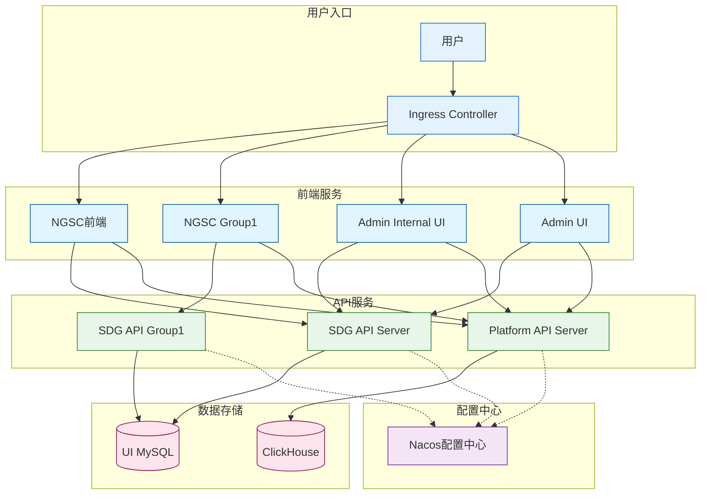

// Add a DCluster and Spark relationship diagram
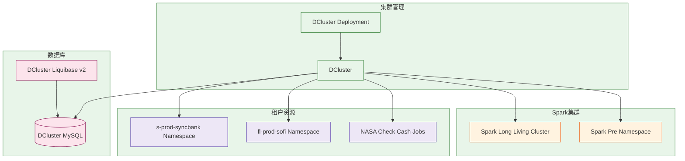

## Project Overview
This is a comprehensive Helm charts repository for deploying and managing various applications and services on Kubernetes clusters across multiple cloud providers and environments.

## Repository Structure

### Directory Organization
```
charts-repo/
├── application-services/    # Application-specific charts
│   ├── apiserver/           # API service deployments
│   ├── dapp-server/         # Dapp service components
│   ├── dapp-ui/             # Dapp UI components
│   ├── fp/                  # Feature Platform components
│   ├── fp-async/            # Async processing components
│   └── fp-cron/             # Scheduled jobs
│
├── databases/               # Database deployments
│   ├── clickhouse/          # ClickHouse analytics database
│   ├── dv-cassandra/        # Cassandra database
│   ├── mysql/               # MySQL databases
│   ├── redis/               # Redis cache
│   └── yugabytes/           # YugabyteDB distributed database
│
├── messaging/               # Messaging systems
│   ├── kafka/               # Kafka messaging platform
│   ├── kafka3/              # Kafka v3 deployments
│   └── delay-queue/         # Delayed processing queue
│
├── monitoring/              # Monitoring and observability
│   ├── alertmanager/        # Alert management system
│   ├── prometheus/          # Metrics collection
│   ├── victoria-metrics/    # Long-term metrics storage
│   └── x509-exporter/       # Certificate monitoring
│
├── migrations/              # Database migrations
│   ├── dcluster-liquibase/  # dCluster schema migrations
│   ├── dv-liquibase/        # Data visualization migrations
│   └── platform-api-liquibase/ # Platform API migrations
│
└── analytics/               # Data analytics and dashboards
    ├── metabase/            # BI and analytics platform
    └── daskhub/             # Jupyter and Dask integration
```

### Detailed Repository Structure with Annotations

```
.
├── .git/                               # Git repository data
├── .cursorrules                        # Rules file for Cursor assistant
├── alertmanager/                       # Helm chart for AlertManager (alerting system)
│   ├── Chart.yaml                      # Chart metadata
│   ├── values.yaml                     # Default configurations
│   └── templates/                      # Kubernetes manifest templates
│       └── ...                         # Alert templates and configurations
├── apiserver/                          # Helm chart for API Server service
│   ├── Chart.yaml                      # Chart metadata
│   ├── values.yaml                     # Default configurations
│   ├── awsuseast1proda/                # AWS US East 1 Production A environment configs
│   ├── awsuswest2proda/                # AWS US West 2 Production A environment configs
│   └── templates/                      # Kubernetes manifest templates
│       ├── deployment.yaml             # API Server deployment definition
│       ├── service.yaml                # Service definition for network access
│       └── ...                         # Other resources (configmaps, etc.)
├── apiserver-group1/                   # Helm chart for a group of API servers
│   └── ...                             # Similar structure as apiserver
├── clickhouse/                         # Helm chart for ClickHouse database
│   ├── Chart.yaml                      # Chart metadata
│   ├── values.yaml                     # Default configurations
│   └── templates/                      # Kubernetes manifest templates
│       ├── statefulset.yaml            # StatefulSet for running ClickHouse
│       ├── service.yaml                # Service for network access
│       └── ...                         # PVCs, configs, etc.
├── cloudwatch-exporter/                # Helm chart for AWS CloudWatch metric exporter
│   └── ...                             # Standard chart structure
├── dapp-liquibase/                     # Database migration for dapp service
│   └── ...                             # Contains migration scripts and config
├── dapp-server/                        # Server component for dapp service
│   └── ...                             # Standard chart structure
├── dapp-ui/                            # UI component for dapp service
│   └── ...                             # Standard chart structure
├── daskhub/                            # Helm chart for Dask + JupyterHub deployment
│   ├── Chart.yaml                      # Chart metadata
│   ├── values.yaml                     # Default configurations
│   └── charts/                         # Subchart dependencies
│       ├── dask-gateway/               # Dask Gateway subchart
│       └── jupyterhub/                 # JupyterHub subchart
├── dcluster/                           # Core cluster management chart
│   ├── Chart.yaml                      # Chart metadata
│   ├── values.yaml                     # Default configurations
│   ├── awsuseast1proda/                # AWS US East 1 Production A environment configs
│   └── templates/                      # Kubernetes manifest templates
│       └── ...                         # Core service definitions
├── dcluster-deployment/                # Deployment configurations for dcluster
│   └── ...                             # Environment-specific deployment settings
├── dcluster-liquibase/                 # Database migrations for dcluster
│   └── ...                             # Migration scripts and configuration
├── dcluster-liquibase-v2/              # Updated database migrations for dcluster
│   └── ...                             # New version of migration scripts
├── dcluster-mysql/                     # MySQL database for dcluster
│   └── ...                             # MySQL configuration and resources
├── dedge-side-car/                     # Sidecar container for dedge service
│   └── ...                             # Sidecar configurations
├── delay-queue/                        # Queue service for delayed processing
│   ├── Chart.yaml                      # Chart metadata
│   ├── values.yaml                     # Default configurations 
│   └── templates/                      # Kubernetes manifest templates
│       ├── deployment.yaml             # Deployment definition
│       ├── service.yaml                # Service for network access
│       └── ...                         # Other resources
├── fp/                                 # Feature Platform main application
│   ├── Chart.yaml                      # Chart metadata
│   ├── values.yaml                     # Default configurations
│   ├── awsuseast1proda/                # AWS US East 1 Production A environment configs
│   └── templates/                      # Kubernetes manifest templates
│       ├── FPDeployment.yaml           # Feature Platform deployment definition
│       ├── service.yaml                # Service for network access
│       ├── fp-rt-ingress.yaml          # Ingress for runtime API
│       └── fp-ui-ingress.yaml          # Ingress for user interface
├── fp-async/                           # Asynchronous processing for Feature Platform
│   └── ...                             # Similar to fp structure
├── fp-cron/                            # Scheduled jobs for Feature Platform
│   └── ...                             # Cron job configurations
├── kafka/                              # Kafka messaging platform
│   ├── Chart.yaml                      # Chart metadata
│   ├── values.yaml                     # Default configurations
│   └── templates/                      # Kubernetes manifest templates
│       ├── statefulset.yaml            # StatefulSet for Kafka brokers
│   │   └── ...                         # Other resources
│   ├── kafka3/                         # Kafka version 3.x deployment
│   │   └── ...                         # Updated Kafka chart
│   └── kafka-event-exporter-application/   # Exports Kafka events
│       └── ...                             # Standard chart structure
├── metabase/                           # Analytics and BI platform
│   ├── Chart.yaml                      # Chart metadata
│   ├── values.yaml                     # Default configurations
│   └── templates/                      # Kubernetes manifest templates
│       └── ...                         # Metabase deployment resources
├── metabase-init-job/                  # Initialization job for Metabase
│   └── ...                             # Initial setup scripts
├── metabase-mysql/                     # MySQL database for Metabase
│   └── ...                             # Database configuration
├── mysql/                              # General MySQL database chart
│   ├── Chart.yaml                      # Chart metadata
│   ├── values.yaml                     # Default configurations
│   └── templates/                      # Kubernetes manifest templates
│       ├── statefulset.yaml            # StatefulSet for MySQL
│   │   └── ...                         # Persistent volume claims, etc.
│   └── prometheus/                         # Metrics collection and monitoring
│       ├── Chart.yaml                      # Chart metadata
│   │   └── ...                         # Chart metadata
│   └── values-original.yaml            # Original values from upstream
│       └── ...                         # Original values from upstream
│   └── templates/                      # Kubernetes manifest templates
│       ├── deploy.yaml                 # Prometheus server deployment
│   │   └── ...                         # Service, RBAC, etc.
│   └── cm.yaml                         # ConfigMap for Prometheus config
│       └── ...                         # ConfigMap for Prometheus config
├── prometheus-node-exporter/           # Node metrics collector for Prometheus
│   └── ...                             # Standard chart structure
├── redis/                              # Redis in-memory data store
│   └── ...                             # Standard chart structure
├── redis-cluster/                      # Redis cluster deployment
│   └── ...                             # Cluster-specific configurations
├── tools/                              # Utility scripts directory
│   ├── web_scraper.py                  # Web scraping utility
│   ├── search_engine.py                # Search engine integration
│   ├── llm_api.py                      # Language model API integration
│   └── screenshot_utils.py             # Web screenshot capture utility
├── victoria-metrics-agent/             # Alternative metrics collection agent
│   └── ...                             # Standard chart structure
├── victoria-metrics-alert/             # Alerting for Victoria Metrics
│   └── ...                             # Alert configuration
├── x509-certificate-exporter/          # SSL certificate monitoring
│   └── ...                             # Certificate export configurations
└── yugabytes/                          # YugabyteDB distributed SQL database
    └── ...                             # Standard chart structure
```

### Chart Types and Categories

#### Application/Service Charts
- **apiserver**: API server deployments across regions
- **apiserver-group1**: Specialized group of API servers
- **dapp-server**: Server component for dapp service
- **dapp-ui**: UI component for dapp service
- **dcluster**: Core cluster deployments
- **dcluster-deployment**: Deployment configurations for clusters
- **dedge-side-car**: Sidecar container for dedge service 
- **fp**: Main application (Feature Platform) deployments
- **fp-async**: Asynchronous processing components
- **fp-cron**: Scheduled job components
- **ngsc**: Frontend service

#### Database Systems
- **clickhouse**: ClickHouse analytics database deployments
- **dcluster-mysql**: dCluster specialized MySQL database
- **dv-cassandra**: Cassandra database deployments
- **metabase-mysql**: Metabase analytics database
- **mysql**: General MySQL database deployments
- **redis**: Redis cache deployments
- **redis-cluster**: Redis clustered deployments
- **yugabytes**: YugabyteDB distributed SQL database

#### Messaging Systems
- **delay-queue**: Queue service for delayed processing
- **kafka**: Kafka messaging platform
- **kafka3**: Kafka version 3.x deployments
- **kafka-event-exporter-application**: Exports Kafka events

#### Monitoring & Observability
- **alertmanager**: Alert management system
- **cloudwatch-exporter**: AWS CloudWatch metrics exporter
- **prometheus**: Metrics collection and monitoring
- **prometheus-node-exporter**: Node metrics collection
- **victoria-metrics-agent**: Alternative metrics agent
- **victoria-metrics-alert**: Victoria Metrics alerting
- **x509-certificate-exporter**: SSL certificate monitoring

#### Analytics & Dashboards
- **daskhub**: Dask and JupyterHub for data analysis
- **metabase**: Analytics and BI platform
- **metabase-init-job**: Initialization job for Metabase

#### Database Migrations
- **dapp-liquibase**: Database migration for dapp service
- **dcluster-liquibase**: Database migrations for dcluster
- **dcluster-liquibase-v2**: Updated database migrations
- **dv-liquibase**: Data visualization migrations
- **platform-api-liquibase**: Platform API migrations

### Environment Structure
Each component typically contains:
- Environment-specific directories (aws*, gcp*, etc.)
- `templates/` directory with Kubernetes manifest templates
- `Chart.yaml` defining chart metadata
- `values.yaml` with default configurations

### Cloud Providers & Regions

#### AWS Regions
- **useast1**: US East (N. Virginia)
- **uswest2**: US West (Oregon)
- **euwest1**: Europe (Ireland)
- **afsouth1**: Africa (Cape Town)
- **apsoutheast1**: Asia Pacific (Singapore)
- **cacentral1**: Canada (Central)

#### GCP Regions
- **uswest1**: US West (Oregon)

#### Environment Types
- **prod**: Production environments
- **dev**: Development environments
- **preprod**: Pre-production/staging environments
- **sandbox**: Isolated testing environments
- **demo**: Demonstration environments

## Standard Chart Structure

Most charts follow this standard structure:
```
chart-name/
├── Chart.yaml              # Metadata: name, version, dependencies
├── values.yaml             # Default configuration values
├── templates/              # Kubernetes manifest templates
│   ├── deployment.yaml     # Workload definition
│   ├── service.yaml        # Network service
│   ├── configmap.yaml      # Configuration
│   ├── secret.yaml         # Sensitive data
│   ├── pvc.yaml            # Storage requests
│   └── _helpers.tpl        # Template helpers
├── aws*/                   # AWS-specific environments
│   └── values.yaml         # AWS environment overrides
└── gcp*/                   # GCP-specific environments
    └── values.yaml         # GCP environment overrides
```

## Components in Kubernetes Architecture

### Core Components

#### Feature Platform (FP) System
- **fp-deployment**: Main service handling real-time detection and updates
- **fp-async-deployment**: Asynchronous processing component  
- **fp-cron-deployment**: Scheduled tasks and batch processing
- **fp-group1-deployment**: Tenant-specific service group

#### API Layer
- **sdg-apiserver**: Backend API service
- **platform-api-server**: Platform API server for data access
- **ngsc**: Frontend service

#### Databases and Storage
- **fp-mysql**: Feature Platform dedicated MySQL database
- **dcluster-mysql**: dCluster dedicated MySQL database
- **chi-dv-datavisor**: ClickHouse instance for analytics
- **metabase-mysql**: Metabase analytics database
- **nacos-mysql**: Configuration service database

#### Message Systems
- **kafka3**: Kafka message queue (3-node cluster)
- **delay-queue**: Queue for delayed task execution

### Namespaces and Logical Organization
- **prod**: Main production services
- **preprod**: Pre-production environment
- **dapp**: Application services namespace
- **infra**: Infrastructure components
- **monitoring**: Monitoring systems
- **spark-long-living-cluster**: Spark long-running cluster

## Workflow for Helm Chart Management

1. Identify target service and environment
2. Examine existing templates and values
3. Create/modify environment-specific values
4. Test in non-production environment
5. Deploy using helm with appropriate values

## Helm Commands

### View Helm Release Information
```bash
# View detailed release information (config, resources, status)
helm get all <release-name>

# View deployed Kubernetes resource manifests
helm get manifest <release-name>

# View current values configuration
helm get values <release-name>

# View release status
helm status <release-name>

# View release version history
helm history <release-name>
```

### Manage Helm Releases
```bash
# List all releases
helm list
helm list -A  # All namespaces
helm list -n <namespace>  # Specific namespace

# Install new release
helm install <release-name> <chart> \
  -f values.yaml \
  -f env-specific-values.yaml \
  --namespace <namespace> \
  --create-namespace

# Upgrade existing release
helm upgrade <release-name> <chart> \
  -f values.yaml \
  -f env-specific-values.yaml \
  --namespace <namespace>

# Install or upgrade (if exists)
helm upgrade --install <release-name> <chart> \
  -f values.yaml \
  --namespace <namespace>

# Rollback to previous version
helm rollback <release-name> <revision> -n <namespace>

# Uninstall release
helm uninstall <release-name> -n <namespace>
```

### View Deployed Resources with kubectl
```bash
# View all pods for a specific release
kubectl get pods -l app.kubernetes.io/instance=<release-name>

# View all services for a specific release
kubectl get svc -l app.kubernetes.io/instance=<release-name>

# View all resources for a specific release
kubectl get all -l app.kubernetes.io/instance=<release-name>

# View pod details
kubectl describe pod <pod-name>

# View application logs
kubectl logs -l app.kubernetes.io/instance=<release-name>
```


---

# k8s cluster details of dv

## west cluster as example 
```sh
kwestproda get ns 
kwestproda get pod -nprod 

kwestproda get ns
NAME                              STATUS   AGE
dapp                              Active   2y111d
default                           Active   2y111d
fl-prod-sofi-45948                Active   14m
infra                             Active   2y111d
ingress-nginx                     Active   2y111d
kube-node-lease                   Active   2y111d
kube-public                       Active   2y111d
kube-system                       Active   2y111d
kubecost                          Active   677d
kubernetes-dashboard              Active   2y111d
monitoring                        Active   2y111d
prefect                           Active   2y19d
preprod                           Active   315d
prod                              Active   2y110d
qaautotest                        Active   70d
s-prod-syncbank-701bc665-946537   Active   256d
spark-long-living-cluster         Active   2y26d
spark-pre--708                    Active   34d
```

```sh
❯ kwestproda get pod -nprod

NAME                                                       READY   STATUS      RESTARTS        AGE
admin-internal-65f6bdc48c-c4xxp                            1/1     Running     1 (48d ago)     169d
admin-ui-f4c98c468-qpcn6                                   1/1     Running     0               4d3h
chi-dv-datavisor-0-0-0                                     2/2     Running     0               21d
dcluster-deployment-c75899959-4m8s8                        1/1     Running     0               12d
dcluster-deployment-c75899959-bd6vf                        1/1     Running     0               12d
dcluster-liquibase-v2-smrv7                                0/1     Completed   0               12d
dcluster-mysql-0                                           2/2     Running     0               21d
dfe9500-bcdff75c8-7hmv2                                    1/1     Running     1 (48d ago)     169d
dv-liquibase-fdcbh                                         0/1     Completed   0               4d5h
dv-liquibase-group1-d8l54                                  0/1     Completed   0               4d4h
fp-async-deployment-8d6565fc-4p7bb                         1/1     Running     0               13h
fp-async-deployment-8d6565fc-dlg6c                         1/1     Running     0               13h
fp-async-deployment-8d6565fc-ffj5s                         1/1     Running     0               4d4h
fp-async-deployment-8d6565fc-jh2jb                         1/1     Running     0               4d4h
fp-async-deployment-8d6565fc-sgx7x                         1/1     Running     0               4d4h
fp-async-deployment-8d6565fc-zsg2h                         1/1     Running     0               14h
fp-async-deployment-8d6565fc-zvngq                         1/1     Running     0               4d4h
fp-async-group1-deployment-7487bcbc5b-gxs7q                1/1     Running     0               4d4h
fp-async-group1-deployment-7487bcbc5b-qxw7n                1/1     Running     0               4d3h
fp-cron-deployment-8577c47d7f-gnfxl                        1/1     Running     0               4d5h
fp-cron-group1-deployment-db7fcfb4c-tkrs8                  1/1     Running     0               4d4h
fp-deployment-845489447f-4xjff                             1/1     Running     0               4d5h
fp-deployment-845489447f-6pqxg                             1/1     Running     0               4d4h
fp-deployment-845489447f-7cfs2                             1/1     Running     0               4d5h
fp-deployment-845489447f-bzdlf                             1/1     Running     0               4d5h
fp-deployment-845489447f-gx492                             1/1     Running     0               4d4h
fp-deployment-845489447f-l64ls                             1/1     Running     0               4d4h
fp-deployment-845489447f-t66t8                             1/1     Running     0               4d4h
fp-group1-deployment-9d779c666-bq4h4                       1/1     Running     0               4d4h
fp-group1-deployment-9d779c666-hc9b9                       1/1     Running     0               4d4h
fp-mysql-0                                                 2/2     Running     6 (48d ago)     380d
general-side-car-654bcc6f84-brnrt                          1/1     Running     0               44d
kafka-event-exporter-application-85d47fddcf-xj4z9          1/1     Running     65 (11d ago)    162d
kafka-event-exporter-application-group1-698c8cf66f-vrgm9   1/1     Running     13 (17d ago)    74d
kafka3-0                                                   1/1     Running     1 (48d ago)     113d
kafka3-1                                                   1/1     Running     2 (48d ago)     292d
kafka3-2                                                   1/1     Running     2 (48d ago)     292d
kafka3-exporter-b8787754c-pb448                            1/1     Running     1 (48d ago)     169d
metabase-5579f69f6b-zflb7                                  3/3     Running     3 (48d ago)     159d
metabase-mysql-0                                           2/2     Running     2 (48d ago)     169d
mirrormaker2-746b5d6bfb-kvdx4                              1/1     Running     0               47d
nacos-0                                                    1/1     Running     1 (48d ago)     132d
nacos-mysql-0                                              2/2     Running     6 (48d ago)     304d
nacos-prod-db-mysql-0                                      2/2     Running     2 (48d ago)     169d
nasa-check-cash-2-20240722-pf59h                           0/1     Completed   0               267d
nasa-check-cash-2-29075940-7bnvr                           0/1     Completed   0               2d15h
nasa-check-cash-2-29077380-fkkzg                           0/1     Completed   0               39h
nasa-check-cash-2-29078820-jcq9v                           0/1     Completed   0               15h
nasa-check-cash-3-20240722-6pk6p                           0/1     Completed   0               267d
nasa-check-cash-3-29076780-4bmdr                           0/1     Completed   0               2d1h
nasa-check-cash-3-29078220-qm4g8                           0/1     Completed   0               25h
nasa-check-cash-3-29079660-dsjxh                           0/1     Completed   0               76m
nasa-rtcontroller-5b55ccccc5-tvbqn                         1/1     Running     238 (13d ago)   380d
navan-rtcontroller-7d5686ccf9-xcrph                        1/1     Running     117 (24m ago)   117d
ngsc-c79d444fc-cdsxm                                       1/1     Running     0               4d3h
ngsc-c79d444fc-g9xss                                       1/1     Running     0               4d4h
ngsc-c79d444fc-pdmkm                                       1/1     Running     0               4d4h
ngsc-c79d444fc-zh2px                                       1/1     Running     0               4d4h
ngsc-group1-7bbfb767d8-fvkd6                               1/1     Running     0               4d3h
ngsc-group1-7bbfb767d8-rfzkv                               1/1     Running     0               4d3h
platform-api-liquibase-job-f5p7g                           0/1     Completed   0               11d
platform-api-server-8f4b89846-28kdq                        1/1     Running     0               11d
platform-api-server-8f4b89846-vvqpr                        1/1     Running     0               4d3h
sdg-api-liquibase-v2-group1-job-c6kwq                      0/1     Completed   0               11d
sdg-api-liquibase-v2-job-xh7jb                             0/1     Completed   0               11d
sdg-apiserver-5cc54fd4db-87g5n                             1/1     Running     0               4d4h
sdg-apiserver-5cc54fd4db-98zsw                             1/1     Running     1 (7d7h ago)    11d
sdg-apiserver-5cc54fd4db-cmvz6                             1/1     Running     2 (7d6h ago)    11d
sdg-apiserver-5cc54fd4db-kd4wg                             1/1     Running     2 (7d6h ago)    11d
sdg-apiserver-5cc54fd4db-r5978                             1/1     Running     0               7d6h
sdg-apiserver-5cc54fd4db-w8lpw                             1/1     Running     0               4d3h
sdg-apiserver-group1-6d6f69c89f-4nrss                      1/1     Running     0               4d4h
sdg-apiserver-group1-6d6f69c89f-7sdx5                      1/1     Running     0               11d
sink-connector-lightweight-6c6df98676-ghrgz                1/1     Running     0               35d
snapprod-rtcontroller-68847977f9-jprxn                     1/1     Running     114 (19m ago)   113d
syncbank-rtcontroller-5cfd774bb4-6zk2v                     1/1     Running     367 (15h ago)   380d
ui-mysql-0                                                 2/2     Running     0               21d
yugabytedb-client-79c89c9b9f-h6b67                         1/1     Running     1 (48d ago)     169d
```


```sh
❯ kwestproda get ingress -A | grep detec

prod                   argo-detection-ingress                           nginx    argo.dv-api.com                                        18.236.69.138,44.247.209.114   80, 443   614d
prod                   baselane-detection-ingress                       nginx    baselane.dv-api.com                                    18.236.69.138,44.247.209.114   80, 443   292d
prod                   bdc-detection-ingress                            nginx    bdc.dv-api.com                                         18.236.69.138,44.247.209.114   80, 443   706d
prod                   bdc-fp-detection-ingress-apisix                  nginx    bdc-apisix.dv-api.com                                  18.236.69.138,44.247.209.114   80, 443   706d
prod                   brighthorizons-fp-detection-ingress-apigateway   nginx    brighthorizons-internal-prod-a.dv-api.com              18.236.69.138,44.247.209.114   80, 443   90d
prod                   brighthorizons-fp-detection-ingress-apisix       nginx    brighthorizons-awsuswest2prod-prod-apisix.dv-api.com   18.236.69.138,44.247.209.114   80, 443   144d
prod                   cuoc-detection-ingress                           nginx    cuoc.dv-api.com                                        18.236.69.138,44.247.209.114   80, 443   391d
prod                   cuoc-detection-ingress-apisix                    nginx    cuoc-apisix.dv-api.com                                 18.236.69.138,44.247.209.114   80, 443   235d
prod                   elevatert-fp-detection-ingress                   nginx    elevate-rt-prod.dv-api.com                             18.236.69.138,44.247.209.114   80, 443   2y68d
prod                   marqeta-fp-detection-ingress-apisix              nginx    marqeta-apisix.dv-api.com                              18.236.69.138,44.247.209.114   80, 443   2y19d
prod                   nasa-fp-detection-ingress-apigateway             nginx    nasa-internal-prod-a.dv-api.com                        18.236.69.138,44.247.209.114   80, 443   20d
prod                   nasafcn-fp-detection-ingress                     nginx    nasafcu.dv-api.com                                     18.236.69.138,44.247.209.114   80, 443   2y66d
prod                   navan-fp-detection-ingress-apisix                nginx    navan-awsuswest2prod-prod-apisix.dv-api.com            18.236.69.138,44.247.209.114   80, 443   169d
prod                   pefcu-fp-detection-ingress-apisix                nginx    pefcu-awsuswest2prod-prod-apisix.dv-api.com            18.236.69.138,44.247.209.114   80, 443   84d
prod                   rippling-fp-detection-ingress-apisix             nginx    rippling-apisix.dv-api.com                             18.236.69.138,44.247.209.114   80, 443   195d
prod                   snapprod-fp-detection-ingress                    nginx    snapprod.dv-api.com                                    18.236.69.138,44.247.209.114   80, 443   379d
prod                   sofi-fp-detection-ingress-apisix                 nginx    sofi-apisix.dv-api.com                                 18.236.69.138,44.247.209.114   80, 443   680d
prod                   sphere-fp-detection-ingress-apigateway           nginx    sphere-internal-prod-a.dv-api.com                      18.236.69.138,44.247.209.114   80, 443   25d
prod                   syncbank-detection-ingress                       nginx    syncbank.dv-api.com                                    18.236.69.138,44.247.209.114   80, 443   658d
prod                   syncbank-fp-detection-ingress-apigateway         nginx    syncbank-internal-prod-a.dv-api.com                    18.236.69.138,44.247.209.114   80, 443   62d
prod                   syncbank-fp-detection-ingress-apisix             nginx    syncbank-awsuswest2prod-prod-apisix.dv-api.com         18.236.69.138,44.247.209.114   80, 443   77d
prod                   taskrabbit-detection-ingress                     nginx    taskrabbit.dv-api.com                                  18.236.69.138,44.247.209.114   80, 443   2y66d
❯ kwestproda get ingress -A | grep update

prod                   argo-update-ingress                              nginx    argo.dv-api.com                                        18.236.69.138,44.247.209.114   80, 443   614d
prod                   baselane-update-ingress                          nginx    baselane.dv-api.com                                    18.236.69.138,44.247.209.114   80, 443   292d
prod                   bdc-fp-update-ingress-apisix                     nginx    bdc-apisix.dv-api.com                                  18.236.69.138,44.247.209.114   80, 443   706d
prod                   bdc-update-ingress                               nginx    bdc.dv-api.com                                         18.236.69.138,44.247.209.114   80, 443   706d
prod                   brighthorizons-fp-update-ingress-apigateway      nginx    brighthorizons-internal-prod-a.dv-api.com              18.236.69.138,44.247.209.114   80, 443   90d
prod                   brighthorizons-fp-update-ingress-apisix          nginx    brighthorizons-awsuswest2prod-prod-apisix.dv-api.com   18.236.69.138,44.247.209.114   80, 443   144d
prod                   cuoc-update-ingress                              nginx    cuoc.dv-api.com                                        18.236.69.138,44.247.209.114   80, 443   391d
prod                   cuoc-update-ingress-apisix                       nginx    cuoc-apisix.dv-api.com                                 18.236.69.138,44.247.209.114   80, 443   235d
prod                   marqeta-fp-update-ingress-apisix                 nginx    marqeta-apisix.dv-api.com                              18.236.69.138,44.247.209.114   80, 443   2y19d
prod                   nasa-fp-update-ingress-apigateway                nginx    nasa-internal-prod-a.dv-api.com                        18.236.69.138,44.247.209.114   80, 443   20d
prod                   nasafcn-fp-update-ingress                        nginx    nasafcu.dv-api.com                                     18.236.69.138,44.247.209.114   80, 443   2y66d
prod                   navan-fp-update-ingress-apisix                   nginx    navan-awsuswest2prod-prod-apisix.dv-api.com            18.236.69.138,44.247.209.114   80, 443   169d
prod                   pefcu-fp-update-ingress-apisix                   nginx    pefcu-awsuswest2prod-prod-apisix.dv-api.com            18.236.69.138,44.247.209.114   80, 443   84d
prod                   rippling-fp-update-ingress-apisix                nginx    rippling-apisix.dv-api.com                             18.236.69.138,44.247.209.114   80, 443   195d
prod                   snapprod-fp-update-ingress                       nginx    snapprod.dv-api.com                                    18.236.69.138,44.247.209.114   80, 443   379d
prod                   sofi-fp-update-ingress-apisix                    nginx    sofi-apisix.dv-api.com                                 18.236.69.138,44.247.209.114   80, 443   680d
prod                   sphere-fp-update-ingress-apigateway              nginx    sphere-internal-prod-a.dv-api.com                      18.236.69.138,44.247.209.114   80, 443   25d
prod                   syncbank-fp-update-ingress-apigateway            nginx    syncbank-internal-prod-a.dv-api.com                    18.236.69.138,44.247.209.114   80, 443   62d
prod                   syncbank-fp-update-ingress-apisix                nginx    syncbank-awsuswest2prod-prod-apisix.dv-api.com         18.236.69.138,44.247.209.114   80, 443   77d
prod                   syncbank-update-ingress                          nginx    syncbank.dv-api.com                                    18.236.69.138,44.247.209.114   80, 443   658d
prod                   taskrabbit-update-ingress                        nginx    taskrabbit.dv-api.com                                  18.236.69.138,44.247.209.114   80, 443   2y66d
```
