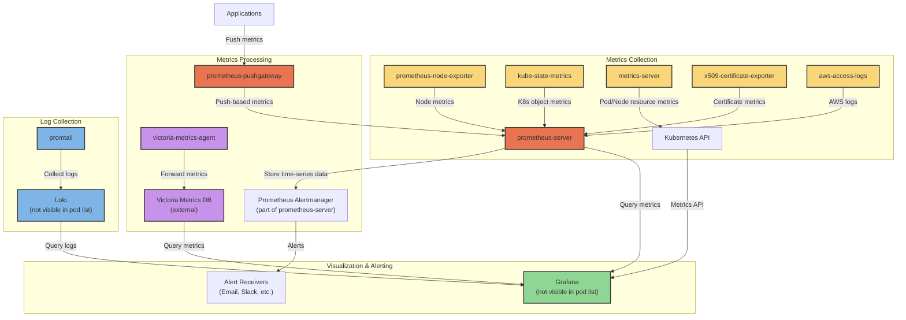
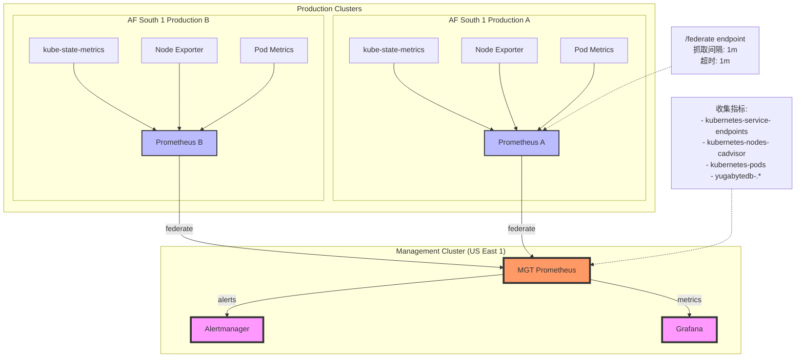
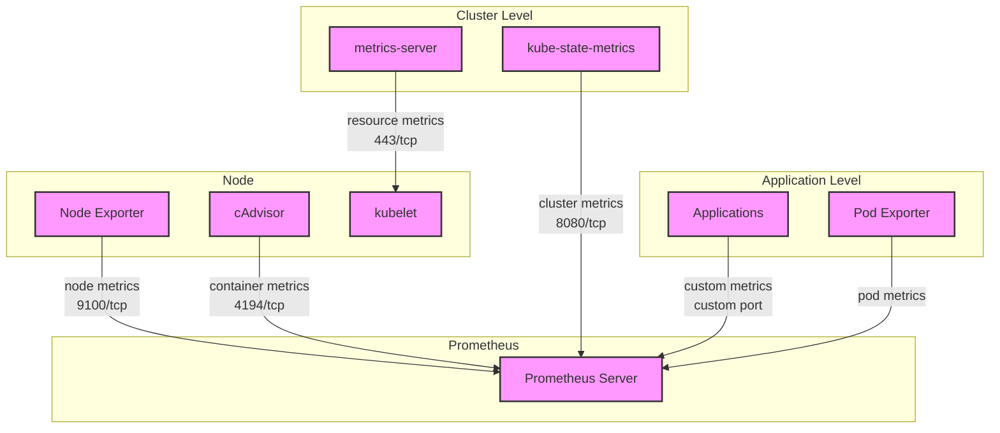
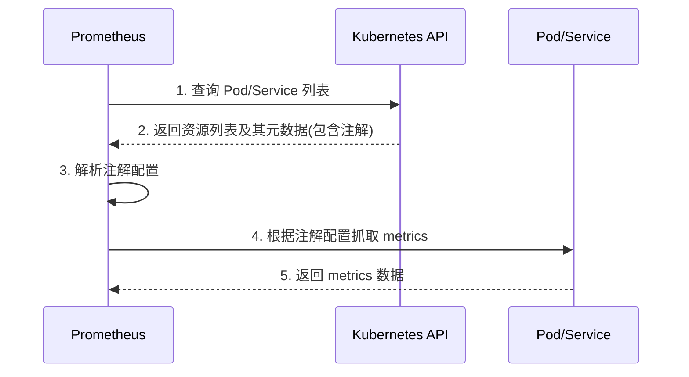
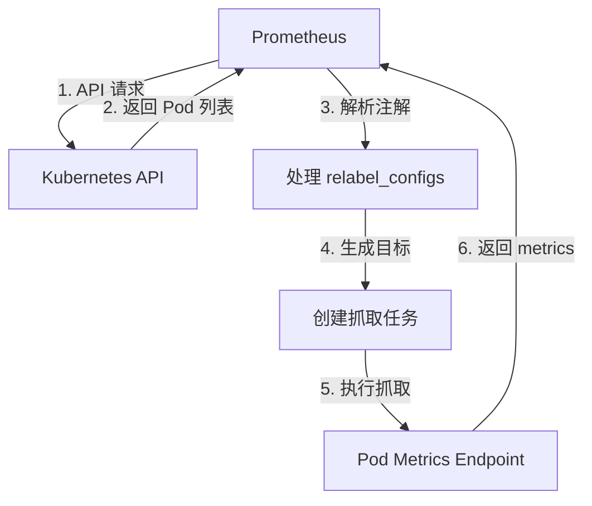

## Kubernetes Monitoring Pipeline Explanation

This chart illustrates the metrics and monitoring pipeline in your Kubernetes cluster. Here's how it works:

### Metrics Collection
- **prometheus-node-exporter**: Deployed as a DaemonSet (one per node), collects hardware and OS metrics from each Kubernetes node
- **kube-state-metrics**: Collects metrics about the state of Kubernetes objects (deployments, pods, etc.)
- **metrics-server**: Provides resource metrics (CPU/memory) for Kubernetes autoscaling
- **x509-certificate-exporter**: Monitors certificate expiration dates
- **aws-access-logs**: Collects AWS-related logs and metrics

### Metrics Processing
- **prometheus-server**: The central time-series database that scrapes and stores metrics from exporters
- **prometheus-pushgateway**: Allows batch jobs or services to push their metrics to Prometheus
- **victoria-metrics-agent**: An agent that forwards metrics to Victoria Metrics (appears to be an external time-series database)

### Log Collection
- **promtail**: Collects logs from pods/nodes and forwards them to Loki (Loki pod isn't visible in your list but is likely present in another namespace or deployed externally)

### Visualization & Alerting
- **Prometheus Alertmanager**: Part of the prometheus-server deployment, handles alerting based on metrics
- **Grafana**: The visualization layer where dashboards display metrics and logs (likely deployed in another namespace or externally)

This pipeline provides comprehensive monitoring of your Kubernetes infrastructure, applications, and services through metrics collection, log aggregation, visualization, and alerting. 



系统级（Node Exporter）
容器级（cAdvisor）
集群级（kube-state-metrics）
资源使用（metrics-server）
应用级（自定义指标）

```
Node Exporter (9100) ----\
cAdvisor (4194) ---------> Prometheus -----> Alertmanager
kube-state-metrics (8080) /        \
Application metrics ------/         \-----> Grafana
```

