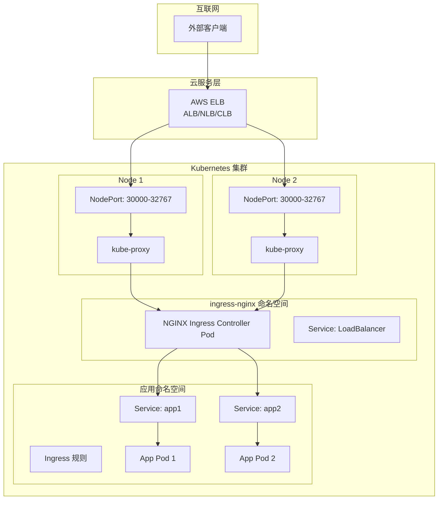
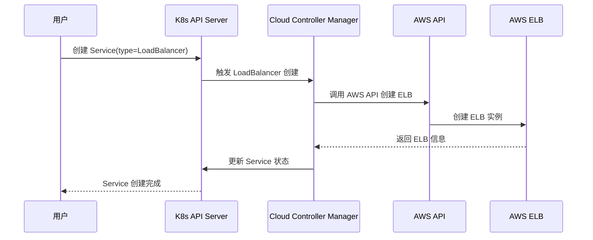
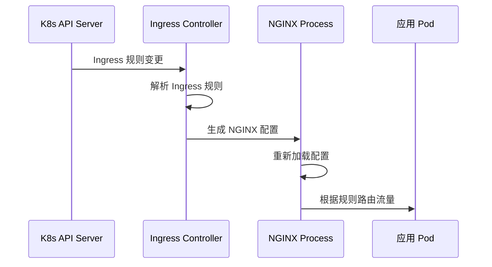
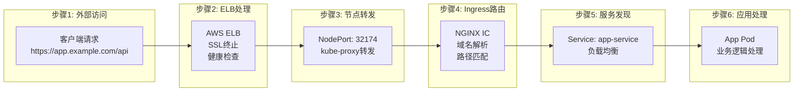
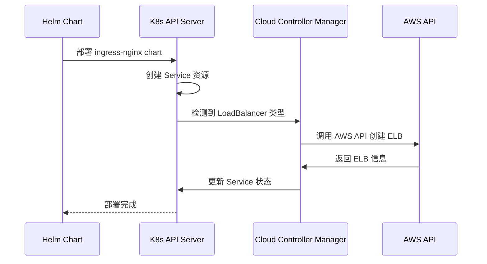
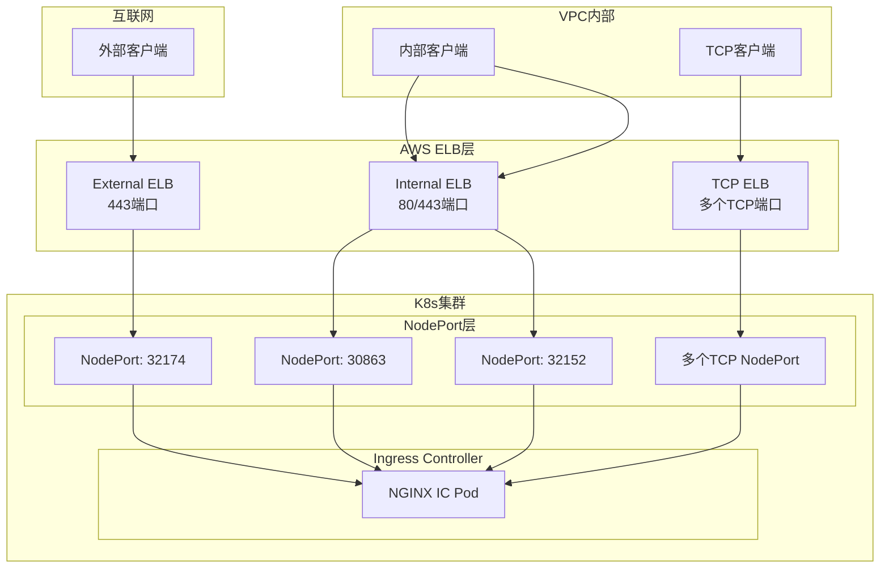

# AWS ELB 与 NGINX Ingress Controller 在 Kubernetes 集群中的深度解析

## 目录
1. [核心概念与定位](#核心概念与定位)
2. [架构层次与作用域](#架构层次与作用域)
3. [工作原理详解](#工作原理详解)
4. [信息传输流程](#信息传输流程)
5. [NGINX Ingress Controller Service详解](#nginx-ingress-controller-service详解)
6. [实际应用场景](#实际应用场景)
7. [配置示例](#配置示例)

---

## 核心概念与定位

### AWS ELB (Elastic Load Balancer)
**定位**: 集群外部的流量入口网关
- **作用域**: 云服务层面，位于K8s集群外部
- **主要职责**: 
  - 提供高可用的外部访问入口
  - 处理来自互联网的初始流量分发
  - 提供SSL终止、健康检查等基础功能
  - 自动扩缩容以应对流量变化

### NGINX Ingress Controller
**定位**: 集群内部的智能路由控制器
- **作用域**: K8s集群内部，作为Pod运行
- **主要职责**:
  - 基于域名、路径、Header等规则进行精确路由
  - 实现应用层的负载均衡
  - 提供高级流量管理功能（重写、重定向、限流等）
  - 动态配置更新

---

## 架构层次与作用域



### 层次关系总结
1. **ELB层**: 云服务层，负责外部流量接入
2. **NodePort层**: 节点层，提供集群内部访问端口
3. **Ingress Controller层**: 应用层，负责智能路由
4. **Service层**: 服务发现层，负责Pod访问
5. **Pod层**: 应用运行层，实际处理业务逻辑

---

## 工作原理详解

### AWS ELB 工作原理

#### 1. 自动创建流程


#### 2. 流量分发机制
- **健康检查**: ELB定期检查后端NodePort的健康状态
- **负载均衡算法**: 支持轮询、最少连接数等算法
- **会话保持**: 可配置基于Cookie的会话亲和性
- **自动扩缩容**: 根据流量自动调整ELB容量

### NGINX Ingress Controller 工作原理

#### 1. 配置监听与更新


#### 2. 路由规则处理
- **域名匹配**: 基于Host字段进行虚拟主机路由
- **路径匹配**: 基于URL路径进行精确路由
- **Header匹配**: 基于HTTP Header进行高级路由
- **权重分发**: 支持蓝绿部署和灰度发布

---

## 信息传输流程

### 完整请求流程



### 详细传输步骤

#### 1. 客户端到ELB
```
客户端请求: GET https://app.example.com/api/users
↓
DNS解析: app.example.com → ELB IP地址
↓
TCP连接: 客户端 ↔ ELB (443端口)
↓
SSL握手: 客户端 ↔ ELB (SSL终止)
```

#### 2. ELB到NodePort
```
ELB接收: HTTP请求 (已解密)
↓
健康检查: ELB检查NodePort健康状态
↓
负载均衡: ELB选择健康的Node
↓
转发请求: ELB → NodeIP:NodePort
```

#### 3. NodePort到Ingress Controller
```
kube-proxy接收: NodePort请求
↓
iptables规则: 根据Service规则转发
↓
转发到Pod: NodePort → Ingress Controller Pod
↓
NGINX处理: 接收HTTP请求
```

#### 4. Ingress Controller到应用
```
NGINX解析: 域名 + 路径匹配
↓
路由决策: 根据Ingress规则选择后端Service
↓
服务发现: 查询Service对应的Endpoints
↓
负载均衡: 选择健康的Pod
↓
代理转发: NGINX → 应用Pod
```

---

## NGINX Ingress Controller Service详解

### 实际部署中的Service分析

基于你提供的`kubectl get service -A | grep nginx`输出，我们可以看到NGINX Ingress Controller实际部署了4个Service：

```bash
ingress-nginx                  ingress-nginx-external                    LoadBalancer   10.96.40.61     af78b74ff8a9148cc9a9824cb74d4556-28f2ee20d6805966.elb.us-west-2.amazonaws.com   443:32174/TCP                                                                                                                                                                                                                                                     2y229d
ingress-nginx                  ingress-nginx-internal                    LoadBalancer   10.96.108.99    a1bcefe26c02945009c059eea5b6c56c-f3c8e52d67e83295.elb.us-west-2.amazonaws.com   80:30863/TCP,443:32152/TCP                                                                                                                                                                                                                                        2y229d
ingress-nginx                  ingress-nginx-internal-tcp                LoadBalancer   10.96.217.128   a4d271a97bfbe4160b56f5a3e5dc2ff7-d7e3380abfa47ae8.elb.us-west-2.amazonaws.com   30001:31430/TCP,31090:30539/TCP,31091:31086/TCP,31092:30412/TCP,31390:31630/TCP,31391:32306/TCP,31392:30142/TCP,32000:31359/TCP,32100:31206/TCP,32200:31887/TCP,32300:30400/TCP,32400:30889/TCP,32500:30051/TCP,32600:32648/TCP,38123:30220/TCP,39042:31951/TCP   2y229d
ingress-nginx                  memcached                                 ClusterIP      10.96.150.232   <none>                                                                          11211/TCP
```

### Service类型与作用分析

#### 1. ingress-nginx-external (外部访问Service)
```yaml
# 配置分析
名称: ingress-nginx-external
类型: LoadBalancer
ClusterIP: 10.96.40.61
外部ELB: af78b74ff8a9148cc9a9824cb74d4556-28f2ee20d6805966.elb.us-west-2.amazonaws.com
端口映射: 443:32174/TCP
```

**作用**:
- **外部流量入口**: 处理来自互联网的HTTPS流量
- **SSL终止**: 在ELB层处理SSL/TLS加密
- **NodePort映射**: 443端口映射到NodePort 32174
- **高可用**: 通过AWS ELB提供多AZ负载均衡

#### 2. ingress-nginx-internal (内部访问Service)
```yaml
# 配置分析
名称: ingress-nginx-internal
类型: LoadBalancer
ClusterIP: 10.96.108.99
外部ELB: a1bcefe26c02945009c059eea5b6c56c-f3c8e52d67e83295.elb.us-west-2.amazonaws.com
端口映射: 80:30863/TCP,443:32152/TCP
```

**作用**:
- **内部流量入口**: 处理来自VPC内部的HTTP/HTTPS流量
- **双协议支持**: 同时支持HTTP(80)和HTTPS(443)
- **NodePort映射**: 
  - 80端口 → NodePort 30863
  - 443端口 → NodePort 32152
- **安全隔离**: 内部ELB不直接暴露到互联网

#### 3. ingress-nginx-internal-tcp (TCP服务Service)
```yaml
# 配置分析
名称: ingress-nginx-internal-tcp
类型: LoadBalancer
ClusterIP: 10.96.217.128
外部ELB: a4d271a97bfbe4160b56f5a3e5dc2ff7-d7e3380abfa47ae8.elb.us-west-2.amazonaws.com
端口映射: 多个TCP端口映射
```

**作用**:
- **TCP协议支持**: 处理非HTTP协议的TCP流量
- **多端口映射**: 支持多个TCP服务的端口转发
- **数据库访问**: 通常用于MySQL、Redis、MongoDB等TCP服务
- **内部网络**: 仅VPC内部可访问

#### 4. memcached (缓存Service)
```yaml
# 配置分析
名称: memcached
类型: ClusterIP
ClusterIP: 10.96.150.232
端口: 11211/TCP
```

**作用**:
- **会话存储**: 为NGINX Ingress Controller提供会话存储
- **缓存加速**: 提高路由性能和响应速度
- **集群内部**: 仅集群内部可访问

### Service创建过程详解

#### 1. 部署时的自动创建


#### 2. 多Service设计原理


### AWS ELB与Service的对应关系

#### 1. ELB类型与用途
| Service名称 | ELB类型 | 访问范围 | 主要用途 |
|------------|---------|----------|----------|
| ingress-nginx-external | Internet-facing ALB | 互联网 | 外部用户访问 |
| ingress-nginx-internal | Internal ALB | VPC内部 | 内部服务访问 |
| ingress-nginx-internal-tcp | Internal NLB | VPC内部 | TCP协议服务 |

#### 2. 端口映射详解
```yaml
# 外部访问端口映射
ingress-nginx-external:
  ELB端口: 443 (HTTPS)
  NodePort: 32174
  协议: TCP
  
# 内部访问端口映射  
ingress-nginx-internal:
  ELB端口: 80 (HTTP)
  NodePort: 30863
  协议: TCP
  
  ELB端口: 443 (HTTPS)  
  NodePort: 32152
  协议: TCP

# TCP服务端口映射
ingress-nginx-internal-tcp:
  ELB端口: 30001-39042 (多个端口)
  NodePort: 31430-31951 (对应NodePort)
  协议: TCP
```

### 实际流量路径分析

#### 1. 外部HTTPS流量路径
```
外部客户端 → External ELB (443) → NodePort 32174 → NGINX IC → 应用Pod
```

#### 2. 内部HTTP流量路径  
```
内部客户端 → Internal ELB (80) → NodePort 30863 → NGINX IC → 应用Pod
```

#### 3. 内部HTTPS流量路径
```
内部客户端 → Internal ELB (443) → NodePort 32152 → NGINX IC → 应用Pod
```

#### 4. TCP流量路径
```
TCP客户端 → TCP ELB (特定端口) → 对应NodePort → NGINX IC → TCP服务Pod
```

### 配置示例与最佳实践

#### 1. 查看Service详细配置
```bash
# 查看Service详细信息
kubectl describe service ingress-nginx-external -n ingress-nginx

# 查看Endpoints
kubectl get endpoints ingress-nginx-external -n ingress-nginx

# 查看ELB健康状态
aws elbv2 describe-target-health \
  --target-group-arn $(aws elbv2 describe-target-groups \
    --load-balancer-arn $(aws elbv2 describe-load-balancers \
      --names af78b74ff8a9148cc9a9824cb74d4556-28f2ee20d6805966.elb.us-west-2.amazonaws.com \
      --query 'LoadBalancers[0].LoadBalancerArn' --output text) \
    --query 'TargetGroups[0].TargetGroupArn' --output text)
```

#### 2. 测试流量路径
```bash
# 测试外部HTTPS访问
curl -k https://af78b74ff8a9148cc9a9824cb74d4556-28f2ee20d6805966.elb.us-west-2.amazonaws.com

# 测试内部HTTP访问
curl http://a1bcefe26c02945009c059eea5b6c56c-f3c8e52d67e83295.elb.us-west-2.amazonaws.com

# 测试NodePort直接访问
curl http://<node-ip>:32174
```

#### 3. 监控与调试
```bash
# 查看NGINX IC日志
kubectl logs -n ingress-nginx deployment/ingress-nginx-controller

# 查看Service流量统计
kubectl top pods -n ingress-nginx

# 查看ELB指标
aws cloudwatch get-metric-statistics \
  --namespace AWS/ApplicationELB \
  --metric-name RequestCount \
  --dimensions Name=LoadBalancer,Value=af78b74ff8a9148cc9a9824cb74d4556-28f2ee20d6805966.elb.us-west-2.amazonaws.com \
  --start-time 2024-01-01T00:00:00Z \
  --end-time 2024-01-02T00:00:00Z \
  --period 3600 \
  --statistics Sum
```

### 关键要点总结

1. **分层设计**: 通过多个Service实现流量分层管理
2. **安全隔离**: 外部和内部流量使用不同的ELB
3. **协议支持**: 同时支持HTTP、HTTPS和TCP协议
4. **高可用**: 每个Service都有对应的AWS ELB提供高可用
5. **自动管理**: Service创建时自动触发ELB创建
6. **端口映射**: 通过NodePort实现ELB到Pod的流量转发

---

## 实际应用场景

### 场景1: 单应用部署
```yaml
# Service: LoadBalancer
apiVersion: v1
kind: Service
metadata:
  name: app-service
spec:
  type: LoadBalancer
  ports:
  - port: 80
    targetPort: 8080
  selector:
    app: myapp
---
# Ingress
apiVersion: networking.k8s.io/v1
kind: Ingress
metadata:
  name: app-ingress
spec:
  rules:
  - host: app.example.com
    http:
      paths:
      - path: /
        pathType: Prefix
        backend:
          service:
            name: app-service
            port:
              number: 80
```

### 场景2: 多应用路由
```yaml
# Ingress with multiple services
apiVersion: networking.k8s.io/v1
kind: Ingress
metadata:
  name: multi-app-ingress
spec:
  rules:
  - host: api.example.com
    http:
      paths:
      - path: /users
        pathType: Prefix
        backend:
          service:
            name: user-service
            port:
              number: 80
      - path: /orders
        pathType: Prefix
        backend:
          service:
            name: order-service
            port:
              number: 80
  - host: web.example.com
    http:
      paths:
      - path: /
        pathType: Prefix
        backend:
          service:
            name: web-service
            port:
              number: 80
```

### 场景3: 蓝绿部署
```yaml
# Ingress with traffic splitting
apiVersion: networking.k8s.io/v1
kind: Ingress
metadata:
  name: canary-ingress
  annotations:
    nginx.ingress.kubernetes.io/canary: "true"
    nginx.ingress.kubernetes.io/canary-weight: "20"
spec:
  rules:
  - host: app.example.com
    http:
      paths:
      - path: /
        pathType: Prefix
        backend:
          service:
            name: app-v2-service  # 新版本
            port:
              number: 80
```

---

## 配置示例

### AWS ELB 配置
```bash
# 查看ELB信息
aws elbv2 describe-load-balancers --names ingress-nginx-external

# 查看目标组
aws elbv2 describe-target-groups --load-balancer-arn arn:aws:elasticloadbalancing:...

# 查看健康检查状态
aws elbv2 describe-target-health --target-group-arn arn:aws:elasticloadbalancing:...
```

### NGINX Ingress Controller 配置
```yaml
# ConfigMap for NGINX configuration
apiVersion: v1
kind: ConfigMap
metadata:
  name: nginx-configuration
  namespace: ingress-nginx
data:
  proxy-connect-timeout: "30"
  proxy-send-timeout: "600"
  proxy-read-timeout: "600"
  proxy-body-size: "50m"
  proxy-buffer-size: "4k"
  proxy-buffers-number: "8"
```

### 监控与调试
```bash
# 查看Ingress Controller日志
kubectl logs -n ingress-nginx deployment/ingress-nginx-controller

# 查看NGINX配置
kubectl exec -n ingress-nginx deployment/ingress-nginx-controller -- cat /etc/nginx/nginx.conf

# 测试路由
curl -H "Host: app.example.com" http://ELB_IP/api/users
```

---

## 总结

### 核心区别对比

| 特性 | AWS ELB | NGINX Ingress Controller |
|------|---------|-------------------------|
| **定位** | 云服务层网关 | 应用层路由控制器 |
| **作用域** | 集群外部 | 集群内部 |
| **主要功能** | 外部访问、SSL终止、健康检查 | 智能路由、流量管理、高级功能 |
| **配置方式** | AWS控制台/CLI | Kubernetes YAML |
| **扩展性** | 云服务自动扩展 | Pod水平扩展 |
| **成本** | 按流量计费 | 集群资源消耗 |

### 最佳实践建议

1. **分层设计**: ELB负责外部接入，Ingress负责内部路由
2. **高可用配置**: 使用多AZ部署ELB，多副本部署Ingress Controller
3. **监控告警**: 监控ELB和Ingress Controller的健康状态
4. **安全配置**: 在ELB层配置WAF，在Ingress层配置认证
5. **性能优化**: 合理配置连接池、超时时间等参数

### 一句话记忆法
- **AWS ELB**: 集群的"大门"，负责把外部流量引入集群
- **NGINX Ingress Controller**: 集群的"交通指挥员"，负责把流量精确送到具体应用
- **NodePort**: ELB和Ingress Controller之间的"传送通道"

