# AWS/Kubernetes 网络架构学习指南

## 📚 学习目标

本指南将帮助您系统性地理解：
- AWS网络基础架构和安全组件
- Kubernetes网络模型和组件交互
- Kubernetes LoadBalancer与AWS云控制器的集成机制
- 生产环境中的网络架构设计
- 故障排查和最佳实践

---

## 🏗️ 第一章：AWS网络基础架构

### 1.1 网络请求流程概览

**Why**: 理解网络请求的完整流程是掌握AWS网络架构的基础

**What**: 从应用发起请求到最终到达目标的完整路径

**How**: 请求经过多个网络组件的验证和路由

```mermaid
sequenceDiagram
    participant App as 应用(Pod/EC2)
    participant ENI as 网卡(ENI)
    participant SG as Security Group
    participant RT as Route Table
    participant NextHop as NAT/IGW/VPC Peering

    App->>ENI: 发起请求（目标IP）
    ENI->>SG: 检查出站规则
    SG-->>ENI: 允许 or 拒绝
    ENI->>RT: 查找目标 IP 的路由
    RT-->>ENI: 给出下一跳
    ENI->>NextHop: 转发请求
```

**关键要点**:
- 每个网络请求都要经过安全组检查
- 路由表决定数据包的下一跳目标
- ENI是连接虚拟网络和物理网络的桥梁

### 1.2 VPC网络拓扑结构

**Why**: VPC是AWS网络的基础，理解其结构对于设计安全、高效的网络架构至关重要

**What**: VPC内部的网络分层和流量路径

**How**: 通过子网、路由表、网关实现网络隔离和互连

```mermaid
flowchart TB
    subgraph Internet ["🌐 Internet"]
        ext_user["🌍 外部用户/服务"]
    end

    subgraph VPC1["🏙️ 主VPC"]
        igw["IGW\n（Internet Gateway）"]
        nat["NAT Gateway\n（代驾）"]
        
        subnet_public["Public Subnet\n（公有子网）"]
        subnet_private["Private Subnet\n（私有子网）"]

        ec2_public["EC2 公网实例\n（有公网IP）"]
        ec2_private["EC2 私网实例\n（无公网IP）"]
    end

    subgraph VPC2["🏙️ 另一VPC"]
        ec2_vpc2["EC2 in VPC2"]
    end

    peering["VPC Peering\n（城市专线）"]

    %% 路径连接
    ext_user --> igw --> ec2_public
    ec2_public --> igw --> ext_user

    ec2_private --> nat --> igw --> ext_user
    ext_user -.->|不能访问| ec2_private

    ec2_private <-->|Peering| peering <-->|Peering| ec2_vpc2
```

**设计原则**:
- **Public Subnet**: 可以直接访问互联网，适合放置负载均衡器、NAT网关
- **Private Subnet**: 通过NAT网关访问互联网，适合放置应用服务器、数据库
- **VPC Peering**: 实现VPC间的私有网络连接

### 1.3 子网类型和用途详解

**Why**: 不同类型的子网有不同的安全要求和网络访问模式，正确选择子网类型是网络安全的基础

**What**: Public、Private、Isolated三种子网类型的特点和适用场景

**How**: 通过路由表配置和Security Group实现不同的网络访问控制

#### 📦 AWS 中典型的 Subnet 用法场景

| Subnet 类型 | 用途 | 路由表配置 | 举例 |
|-------------|------|------------|------|
| **Public Subnet** | 放面向公网的资源（如 LoadBalancer） | 0.0.0.0/0 → IGW | ALB、NAT Gateway、Bastion |
| **Private Subnet** | 放业务 EC2 / Pod | 0.0.0.0/0 → NAT Gateway | 应用服务、数据库 |
| **Isolated Subnet** | 放不出网的资源 | 无任何公网路由 | 数据仓库、Redis、RDS |


**子网类型详解**:

1. **Public Subnet（公有子网）**
   - **特点**: 有到Internet Gateway的路由
   - **用途**: 放置需要直接访问互联网的资源
   - **安全考虑**: 需要严格的安全组规则，只开放必要端口
   - **典型应用**: 负载均衡器、NAT网关、堡垒机

2. **Private Subnet（私有子网）**
   - **特点**: 通过NAT网关访问互联网，外部无法直接访问
   - **用途**: 放置业务应用和数据库
   - **安全考虑**: 相对安全，但仍需要适当的安全组配置
   - **典型应用**: Web服务器、应用服务器、数据库

3. **Isolated Subnet（隔离子网）**
   - **特点**: 完全无法访问互联网，只能访问内网资源
   - **用途**: 放置最敏感的数据和资源
   - **安全考虑**: 最高安全级别，适合存放核心数据
   - **典型应用**: 数据仓库、缓存服务、核心数据库

#### 🧾 实际路由表配置示例

**路由表：rtb-0a1b2c3d4e5f6g7h8 （用于私有子网）**

| Destination | Target | Type | State | Description |
|-------------|--------|------|-------|-------------|
| 10.0.0.0/16 | local | VPC 内部通信 | active | 子网之间通信（VPC 内部默认） |
| 0.0.0.0/0 | nat-0123456789abcdef0 | NAT Gateway | active | 私有子网访问公网 |
| 192.168.0.0/16 | pcx-0a1b2c3d | VPC Peering | active | 和另一 VPC 的 peering 通信 |

**路由表：rtb-1a2b3c4d5e6f7g8h9 （用于公有子网）**

| Destination | Target | Type | State | Description |
|-------------|--------|------|-------|-------------|
| 10.0.0.0/16 | local | VPC 内部通信 | active | 子网之间通信 |
| 0.0.0.0/0 | igw-0123456789abcdef0 | Internet Gateway | active | 公有子网可访问 Internet |

**路由表配置说明**:

- **local路由**: 所有路由表都有的默认路由，用于VPC内部通信
- **0.0.0.0/0路由**: 默认路由，决定子网如何访问互联网
  - 公有子网：直接通过Internet Gateway
  - 私有子网：通过NAT Gateway（隐藏源IP）
- **VPC Peering路由**: 实现跨VPC的私有通信，避免公网传输

### 1.4 多可用区高可用架构

**Why**: 单一可用区存在单点故障风险，多AZ部署提供高可用性

**What**: 跨多个可用区部署资源，每个AZ都有独立的NAT网关

**How**: 通过路由表配置实现流量的分布和故障转移


**最佳实践**:
- 每个AZ都部署独立的NAT网关，避免跨AZ流量费用
- 使用弹性IP确保NAT网关的IP地址固定
- 路由表配置要确保流量优先使用同AZ内的NAT网关

---

## 🔐 第二章：AWS网络安全组件

### 2.1 网络安全层次架构

**Why**: 多层防护策略提供更强的安全保障，不同层次处理不同类型的威胁

**What**: 从子网级别到资源级别的多层安全控制

**How**: 通过NACL、Security Group、DHCP Options、VPC Endpoint协同工作


### 2.2 Security Group vs NACL 对比

**Why**: 理解两种安全控制机制的区别，选择合适的安全策略

**What**: 资源级别的有状态防火墙 vs 子网级别的无状态防火墙

**How**: Security Group控制到达ENI的流量，NACL控制子网边界的流量

```mermaid
flowchart TD
    EC2[EC2 / Pod] --> ENI
    ENI --> SG[Security Group]
    SG --> IngressRules[入站规则]
    SG --> EgressRules[出站规则]
    style SG fill:#bbf,stroke:#333,stroke-width:1px
```


**对比分析**:

| 组件 | 层级 | 状态 | 规则类型 | 主要用途 |
|------|------|------|----------|----------|
| Security Group | 资源级 | Stateful | 仅 Allow | 白名单控制 |
| NACL | 子网级 | Stateless | Allow/Deny | 黑名单/隔离 |

### 2.3 VPC Endpoint 内网服务访问

**Why**: 避免AWS服务访问流量经过公网，提升安全性和性能

**What**: 在VPC内部提供AWS服务的私有访问点

**How**: 通过路由表配置和DNS解析实现服务重定向


**使用场景**:
- **Gateway Endpoint**: S3、DynamoDB（免费，仅支持这两个服务）
- **Interface Endpoint**: 大部分AWS服务（按小时收费，需要ENI）

---

## ☸️ 第三章：Kubernetes网络架构

### 3.1 Kubernetes控制平面组件

**Why**: 控制平面是Kubernetes集群的大脑，理解其组件有助于排查问题

**What**: API Server、etcd、控制器、调度器等核心组件

**How**: 组件间通过API Server进行通信，etcd存储集群状态

```mermaid
flowchart LR
  subgraph Control_Plane["Control Plane (Master Nodes)"]
    direction TB
    A[etcd\n持久化集群状态]
    B[kube-apiserver\nAPI 入口，处理所有请求]
    C[kube-controller-manager\n内置控制循环]
    D[kube-scheduler\n调度 Pod 到节点]
    E[aws-cloud-controller-manager\n管理 AWS 云资源，3 副本] 
    F[calico-kube-controllers\nCalico 网络控制器]
    G[ebs-csi-controller\nEBS 存储控制器，2 副本]
  end

  A --> B
  B --> C
  B --> D
  B --> E
  B --> F
  B --> G
```

**组件职责**:
- **etcd**: 分布式键值存储，保存集群配置和状态
- **kube-apiserver**: 集群入口，处理所有API请求
- **kube-controller-manager**: 运行控制循环，维护期望状态
- **kube-scheduler**: 将Pod调度到合适的节点
- **cloud-controller-manager**: 与云平台集成，管理负载均衡器等

### 3.2 Worker节点网络组件

**Why**: Worker节点负责实际运行工作负载，其网络组件决定了Pod间的通信

**What**: kubelet、kube-proxy、CNI插件等网络相关组件

**How**: 通过CNI实现Pod网络，kube-proxy实现Service网络

```mermaid
flowchart LR
  subgraph Worker_Node_A["Worker Node A"]
    direction LR
    CN1[calico-node<br/>管理路由规则]
    CSI1[ebs-csi-node<br/>挂载/卸载 EBS 卷]
    KP1[kube-proxy<br/>Service 网络代理]
    DNS1[node-local-dns<br/>Pod 级 DNS 缓存]
  end

  subgraph Worker_Node_B["Worker Node B"]
    direction LR
    CN2[calico-node]
    CSI2[ebs-csi-node]
    KP2[kube-proxy]
    DNS2[node-local-dns]
  end

  subgraph Worker_Node_C["Worker Node C"]
    direction LR
    CN3[calico-node]
    CSI3[ebs-csi-node]
    KP3[kube-proxy]
    DNS3[node-local-dns]
  end

  %% 可视化它们同属于一个大集群
  Worker_Node_A --- Worker_Node_B --- Worker_Node_C
```

**网络组件说明**:
- **calico-node**: 使用BGP协议管理Pod间的路由
- **kube-proxy**: 实现Service的负载均衡和流量转发
- **node-local-dns**: 提供DNS缓存，减少DNS查询延迟

### 3.3 Pod网络通信机制

**Why**: 理解Pod之间如何通信是掌握Kubernetes网络的关键

**What**: 基于CNI的Pod网络实现，支持跨节点通信

**How**: 通过veth pair、ENI、VPC路由实现Pod网络

```mermaid
flowchart TD
    subgraph VPC["Virtual Private Cloud (城市网络)"]
        direction LR

        subgraph AZ-A["可用区 A（商圈 A）"]
            direction TB
            SubnetA[Subnet-A<br>（商圈A的配电网）]
            ENI1[ENI-1<br>网卡（物业分配）]
            CNI1[CNI 插件<br>Amazon VPC CNI]
            NodeA[EC2 Node A]
            Pod1[Pod-1<br>餐厅]

            Pod1 -->|veth pair| CNI1
            CNI1 -->|分配IP<br>绑定ENI| ENI1
            ENI1 -->|挂载在| NodeA
            NodeA --> SubnetA
        end

        subgraph AZ-B["可用区 B（商圈 B）"]
            direction TB
            SubnetB[Subnet-B]
            ENI2[ENI-2]
            CNI2[CNI 插件]
            NodeB[EC2 Node B]
            Pod2[Pod-2]

            Pod2 --> CNI2
            CNI2 --> ENI2
            ENI2 --> NodeB
            NodeB --> SubnetB
        end

        SubnetA -->|VPC 内网路由| SubnetB
        SubnetB -->|VPC 内网路由| SubnetA
    end

    %% 强调 AZ 不影响通信
    AZ-A -.->|只影响物理位置<br>不影响逻辑通信| AZ-B
```

**Amazon VPC CNI特点**:
- 每个Pod获得VPC子网中的真实IP地址
- 利用多个ENI实现高密度Pod部署
- 支持Security Group直接应用到Pod

### 3.4 Kubernetes LoadBalancer与AWS云控制器集成

**Why**: 理解Kubernetes Service如何与AWS负载均衡器集成，对于设计生产级应用暴露至关重要

**What**: Cloud Controller Manager将Kubernetes Service转换为AWS负载均衡器和目标组

**How**: 通过aws-cloud-controller-manager和aws-load-balancer-controller实现自动化的负载均衡器管理

#### 🔄 LoadBalancer Service 工作原理

Kubernetes的cloud controller会将Service (type=LoadBalancer)转换为AWS的Load Balancer和Target Group资源，Target Group是用来管理后端Pod的实际目标集合，而Load Balancer则是对外暴露的入口。

```mermaid
flowchart TD
  %% Clients & DNS
  U[Client] -->|HTTPS/TCP| R53[Route53 / DNS]

  %% L7 Path (ALB + Ingress)
  subgraph L7["L7 路径（Ingress + ALB）"]
    R53 --> ALB[(AWS ALB)]
    ALB -->|Listener+Rules| TGi[(TG: IP targets)]
    TGi -->|HealthCheck OK| PODS_ALB["Pods (readiness OK)"]
    subgraph IngressPlane["控制面：aws-load-balancer-controller"]
      ING[Ingress]
      ING -.reconcile.-> ALB
      ING -.reconcile.-> TGi
    end
  end

  %% L4 Path (NLB + Service LB)
  subgraph L4["L4 路径（Service: LoadBalancer + NLB）"]
    R53 --> NLB[(AWS NLB)]
    NLB -->|TCP/UDP| TGn[(TG: IP or Instance)]
    TGn --> PODS_NLB["Pods 或 NodePort"]
    subgraph SVCPlane["控制面：CCM / aws-lb-controller"]
      SVC_LB["Service (type=LoadBalancer)"]
      SVC_LB -.reconcile.-> NLB
      SVC_LB -.reconcile.-> TGn
    end
  end

  %% K8s Core
  subgraph K8s["Kubernetes 核心"]
    SVC_CIP["Service (ClusterIP)"]
    EPS[EndpointSlice]
    SVC_CIP <--selects--> EPS
    EPS --> PODS[Pods]
    KCM[kube-controller-manager] -.creates/updates.-> EPS
  end

  %% Data plane helpers
  subgraph Dataplane["数据面/网络"]
    CNI[AWS VPC CNI]
    KP[kube-proxy / eBPF]
  end
  CNI --- PODS
  KP --- SVC_CIP

  %% Relations
  TGi --- EPS
  TGn --- EPS

  style IngressPlane fill:#f4f9ff,stroke:#8ab
  style SVCPlane fill:#f4f9ff,stroke:#8ab
  style K8s fill:#f9fff4,stroke:#8b8
  style Dataplane fill:#fffaf4,stroke:#bb8
```

#### 🎯 两种负载均衡路径对比

| 特性 | L4路径 (Service LoadBalancer) | L7路径 (Ingress + ALB) |
|------|------------------------------|------------------------|
| **负载均衡器类型** | Network Load Balancer (NLB) | Application Load Balancer (ALB) |
| **协议支持** | TCP/UDP | HTTP/HTTPS |
| **路径路由** | 不支持 | 支持基于路径的路由 |
| **SSL终止** | 不支持 | 支持SSL终止和证书管理 |
| **健康检查** | TCP/UDP端口检查 | HTTP状态码检查 |
| **成本** | 较低 | 较高 |
| **适用场景** | 数据库、缓存、TCP服务 | Web应用、API网关 |

#### 🔧 Cloud Controller Manager 组件详解

**aws-cloud-controller-manager**:
- **功能**: 管理AWS云资源（负载均衡器、目标组、安全组）
- **部署**: 在控制平面节点上运行，通常3副本
- **职责**: 
  - 监听Service (type=LoadBalancer)资源
  - 自动创建/更新AWS NLB和Target Group
  - 管理负载均衡器的安全组规则
  - 处理节点注册/注销时的目标组更新

**aws-load-balancer-controller**:
- **功能**: 专门管理Ingress资源和ALB
- **部署**: 在集群中作为Deployment运行
- **职责**:
  - 监听Ingress资源变化
  - 创建和管理ALB实例
  - 配置ALB监听器和路由规则
  - 管理SSL证书和域名绑定

#### 📋 Service LoadBalancer 配置示例

```yaml
apiVersion: v1
kind: Service
metadata:
  name: my-app-service
  annotations:
    service.beta.kubernetes.io/aws-load-balancer-type: "nlb"
    service.beta.kubernetes.io/aws-load-balancer-scheme: "internet-facing"
    service.beta.kubernetes.io/aws-load-balancer-nlb-target-type: "ip"
    service.beta.kubernetes.io/aws-load-balancer-healthcheck-protocol: "TCP"
    service.beta.kubernetes.io/aws-load-balancer-healthcheck-port: "8080"
spec:
  type: LoadBalancer
  ports:
    - port: 80
      targetPort: 8080
      protocol: TCP
  selector:
    app: my-app
```

#### 🌐 Ingress 配置示例

```yaml
apiVersion: networking.k8s.io/v1
kind: Ingress
metadata:
  name: my-app-ingress
  annotations:
    kubernetes.io/ingress.class: "alb"
    alb.ingress.kubernetes.io/scheme: "internet-facing"
    alb.ingress.kubernetes.io/target-type: "ip"
    alb.ingress.kubernetes.io/listen-ports: '[{"HTTP": 80}, {"HTTPS": 443}]'
    alb.ingress.kubernetes.io/certificate-arn: "arn:aws:acm:region:account:certificate/cert-id"
spec:
  rules:
    - host: myapp.example.com
      http:
        paths:
          - path: /
            pathType: Prefix
            backend:
              service:
                name: my-app-service
                port:
                  number: 80
```

#### 🔍 关键组件交互流程

1. **Service创建流程**:
   ```
   kubectl apply -f service.yaml
   ↓
   kube-apiserver 接收请求
   ↓
   aws-cloud-controller-manager 监听Service变化
   ↓
   创建AWS NLB和Target Group
   ↓
   更新Service的external-ip字段
   ```

2. **Ingress创建流程**:
   ```
   kubectl apply -f ingress.yaml
   ↓
   aws-load-balancer-controller 监听Ingress变化
   ↓
   创建AWS ALB和Listener
   ↓
   配置路由规则和SSL证书
   ↓
   更新Ingress的address字段
   ```

3. **Pod健康检查流程**:
   ```
   AWS Load Balancer 定期检查目标组
   ↓
   向Pod发送健康检查请求
   ↓
   Pod返回健康状态
   ↓
   更新目标组健康状态
   ↓
   流量路由到健康Pod
   ```

#### 🛡️ 安全考虑

- **安全组配置**: 负载均衡器安全组应只开放必要端口
- **网络隔离**: 使用私有子网部署Pod，通过负载均衡器暴露服务
- **SSL/TLS**: 使用AWS Certificate Manager管理SSL证书
- **访问控制**: 通过IAM角色控制云控制器的权限范围

#### 💰 成本优化建议

- **选择合适的负载均衡器类型**: NLB适合TCP服务，ALB适合HTTP服务
- **使用内部负载均衡器**: 对于内部服务，使用`internal`方案
- **合理配置健康检查**: 避免过于频繁的健康检查增加成本
- **清理未使用的资源**: 定期清理不再使用的负载均衡器

---

## 🌍 第四章：跨区域和跨VPC通信

### 4.1 VPC间通信方案

**Why**: 微服务架构中，不同服务可能部署在不同VPC中，需要安全的通信机制

**What**: VPC Peering、Transit Gateway、PrivateLink等连接方案

**How**: 通过配置路由表和安全组实现VPC间的选择性通信

```mermaid
flowchart TD
    subgraph VPC-A
        A1[EC2-A] --> P1[Pod-1]
    end
    subgraph VPC-B
        B1[EC2-B] --> P2[Pod-2]
    end
    A1 -->|通过 VPC Peering 或 TGW| B1
```

**方案选择**:
- **VPC Peering**: 适合少量VPC的一对一连接
- **Transit Gateway**: 适合多VPC的hub-and-spoke架构
- **PrivateLink**: 适合服务间的私有连接

### 4.2 Transit Gateway 架构详解

**Why**: 当需要连接大量VPC时，VPC Peering的连接数量会呈指数级增长，Transit Gateway提供了更高效的解决方案

**What**: Transit Gateway是一个区域性的网络中心，可以连接多个VPC、VPN连接和Direct Connect

**How**: 通过路由表配置实现VPC间的选择性路由和流量控制

#### 🌉 Transit Gateway 核心概念

| 组件 | 功能 | 特点 |
|------|------|------|
| **Transit Gateway** | 区域网络中心 | 支持5000+ VPC连接 |
| **Transit Gateway Attachment** | VPC连接点 | 每个VPC一个Attachment |
| **Transit Gateway Route Table** | 路由控制 | 支持多个路由表 |
| **Transit Gateway Peering** | 跨区域连接 | 连接不同区域的TGW |


#### 🔄 Transit Gateway 路由表配置示例

```mermaid
flowchart LR
    subgraph "Transit Gateway Route Tables"
        direction TB
        
        subgraph RT_Prod["Production Route Table"]
            direction LR
            R1["10.0.0.0/16 → VPC-Prod"]
            R2["10.100.0.0/16 → VPC-Shared"]
            R3["10.200.0.0/16 → VPC-Data"]
            R4["0.0.0.0/0 → VPN"]
        end
        
        subgraph RT_Dev["Development Route Table"]
            direction LR
            R5["10.1.0.0/16 → VPC-Dev"]
            R6["10.100.0.0/16 → VPC-Shared"]
            R7["0.0.0.0/0 → VPN"]
        end
        
        subgraph RT_Shared["Shared Services Route Table"]
            direction LR
            R8["10.0.0.0/8 → All VPCs"]
            R9["0.0.0.0/0 → NAT Gateway"]
        end
    end
    
    subgraph "VPC Attachments"
        VPC_Prod_Att["VPC-Prod Attachment"]
        VPC_Dev_Att["VPC-Dev Attachment"]
        VPC_Shared_Att["VPC-Shared Attachment"]
        VPC_Data_Att["VPC-Data Attachment"]
    end
    
    VPC_Prod_Att --> RT_Prod
    VPC_Dev_Att --> RT_Dev
    VPC_Shared_Att --> RT_Shared
    VPC_Data_Att --> RT_Prod
    
    classDef rt fill:#e8f5e8,stroke:#4caf50,stroke-width:1px;
    classDef att fill:#fff3e0,stroke:#ff9800,stroke-width:1px;
    
    class RT_Prod,RT_Dev,RT_Shared rt;
    class VPC_Prod_Att,VPC_Dev_Att,VPC_Shared_Att,VPC_Data_Att att;
```

**Transit Gateway 优势**:

1. **可扩展性**
   - 单个TGW可连接5000+ VPC
   - 支持跨区域连接
   - 支持多种连接类型（VPC、VPN、Direct Connect）

2. **路由控制**
   - 多个路由表支持复杂的路由策略
   - 支持路由传播和静态路由
   - 可以实现VPC间的选择性通信

3. **成本效益**
   - 相比大量VPC Peering更经济
   - 按小时计费，按数据传输量收费
   - 支持资源共享

4. **管理简化**
   - 集中化的网络管理
   - 简化的路由配置
   - 更好的网络可见性

**使用场景**:

- **企业多环境**: 连接生产、开发、测试环境
- **多租户架构**: 为不同客户提供隔离的VPC
- **混合云**: 连接AWS和本地数据中心
- **全球部署**: 跨区域的服务连接

### 4.3 跨区域通信架构

**Why**: 全球化部署需要跨区域的服务通信，同时要考虑延迟和成本

**What**: 通过公网、专线、全球加速器等方式实现跨区域通信

**How**: 利用AWS Global Accelerator和Transit Gateway实现优化的跨区域连接

```mermaid
flowchart TD
    subgraph Region-us-east-1
        subgraph VPC-A
            A1[Node-A] --> P1[Pod-A]
        end
    end

    subgraph Region-ap-northeast-1
        subgraph VPC-C
            C1[Node-C] --> P2[Pod-C]
        end
    end

    P1 -->|出城| IGW1
    P2 -->|出城| IGW2
    IGW1 -->|公网传输| Internet --> IGW2
```


**性能优化**:
- 使用Global Accelerator减少网络延迟
- 配置Transit Gateway Inter-Region Peering
- 考虑数据传输成本和合规要求

---

## 🚀 第五章：自动扩缩容机制

### 5.1 Cluster Autoscaler工作原理

**Why**: 动态的工作负载需要弹性的基础设施，自动扩缩容可以优化成本和性能

**What**: 基于Pod调度状态和节点资源使用情况自动调整集群规模

**How**: 监控Pending Pod，通过AWS API调整Auto Scaling Group

```mermaid
sequenceDiagram
    participant Pod as cluster-autoscaler (Pod)
    participant API as kube-apiserver
    participant ETCD as etcd
    participant CM as kube-controller-manager
    participant ASG as AWS Auto Scaling Group
    participant EC2 as New EC2 Node
    participant Node as kubelet (new node)
    
    Note over Pod: 1. 监听 pending Pod & Node utilization
    Pod->>API: watch unschedulable pods
    API-->>Pod: list pods (Pending)

    Note over Pod: 2. 发现调度失败，决定扩容
    Pod->>ASG: DescribeAutoScalingGroups

    Note over Pod: 3. 触发 AWS 扩容操作
    Pod->>ASG: SetDesiredCapacity(+1) / LaunchTemplate

    Note over ASG: 4. AWS 创建新 EC2 实例
    ASG-->>EC2: launch EC2 instance with user-data

    Note over EC2: 5. kubelet 启动并注册自己
    EC2->>API: register new node
    API->>ETCD: update Node list
    API->>CM: trigger NodeController

    Note over Pod: 6. 再次检查 pending pod
    Pod->>API: watch pod status
    API-->>Pod: Pod scheduled ✅
```

### 5.2 节点启动和加入流程

**Why**: 理解节点启动过程有助于排查扩容问题和优化启动时间

**What**: 从ASG触发到节点加入集群的完整流程

**How**: 通过Launch Template和User Data实现自动化节点配置


**关键配置**:
- **AMI**: 预装kubelet、containerd、CNI插件的镜像
- **User Data**: 节点启动时执行的初始化脚本
- **IAM Role**: 节点访问AWS API的权限配置

### 5.3 多节点组架构

**Why**: 不同工作负载对计算资源的需求不同，需要灵活的节点类型

**What**: 按需实例、Spot实例、GPU实例等不同类型的节点组

**How**: 通过多个Auto Scaling Group和Launch Template支持多样化的节点类型

```mermaid
flowchart TB
    subgraph WorkerPool["ASG Worker Pools (多个 Node Group)"]
        direction TB
        ASG_onDemand["ASG - OnDemand"]
        ASG_spot["ASG - Spot"]
        ASG_gpu["ASG - GPU"]
    end

    subgraph LaunchTemplates["Launch Templates"]
        LT_onDemand["LaunchTemplate-OnDemand"]
        LT_spot["LaunchTemplate-Spot"]
        LT_gpu["LaunchTemplate-GPU"]
    end

    LT_onDemand --> ASG_onDemand
    LT_spot --> ASG_spot
    LT_gpu --> ASG_gpu

    ASG_onDemand --> Node1["EC2 Node (OnDemand)"]
    ASG_spot --> Node2["EC2 Node (Spot)"]
    ASG_gpu --> Node3["EC2 Node (GPU)"]

    Node1 & Node2 & Node3 -->|加入| K8sCluster["Kubernetes Cluster"]

    Node1 & Node2 & Node3 -->|Attach IAM Role| IRSA["IAM Roles for Service Accounts"]
    IRSA --> AWS["AWS Services (S3 / STS / CloudWatch)"]

    K8sCluster --> Prometheus["Prometheus"]
    Prometheus --> Grafana["Grafana Dashboard"]
```

**节点组策略**:
- **On-Demand**: 稳定的生产工作负载
- **Spot**: 成本敏感的批处理任务
- **GPU**: 机器学习和高性能计算

---

## 🏭 第六章：生产环境网络架构

### 6.1 企业级多环境网络架构

**Why**: 生产环境需要支持开发、测试、生产等多个环境，每个环境需要隔离且互通

**What**: 跨区域、多VPC、多环境的完整网络架构

**How**: 通过VPC、子网、路由表、Transit Gateway实现环境隔离和选择性互通

```mermaid
flowchart TD
    %% === REGION 1 ===
    subgraph us-east-1
        direction TB

        subgraph PROD1["prod-vpc (10.0.0.0/16)"]
            direction LR
            P1_PUB["Public Subnet (10.0.1.0/24)"]
            P1_PRI["Private Subnet (10.0.2.0/24)"]
            P1_DB["DB Subnet (10.0.3.0/28)"]
            P1_RT["Route Table"]
            P1_IGW["Internet GW"]
            P1_NAT["NAT Gateway"]
        end

        subgraph DEV1["dev-vpc (10.1.0.0/16)"]
            D1_PUB["Public Subnet"]
            D1_PRI["Private Subnet"]
            D1_RT["Route Table"]
            D1_NAT["NAT Gateway"]
        end

        subgraph SHARED1["shared-vpc (10.100.0.0/16)"]
            direction LR
            S1_TOOLS["Monitoring / Bastion / NAT"]
            S1_RT["Route Table"]
        end
    end

    %% === REGION 2 ===
    subgraph ap-northeast-1
        direction TB

        subgraph PROD2["prod-vpc (10.10.0.0/16)"]
            P2_PUB["Public Subnet"]
            P2_PRI["Private Subnet"]
            P2_DB["DB Subnet"]
            P2_RT["Route Table"]
            P2_IGW["Internet GW"]
            P2_NAT["NAT Gateway"]
        end

        subgraph DEV2["dev-vpc (10.11.0.0/16)"]
            D2_PUB["Public Subnet"]
            D2_PRI["Private Subnet"]
            D2_RT["Route Table"]
            D2_NAT["NAT Gateway"]
        end

        subgraph SHARED2["shared-vpc (10.101.0.0/16)"]
            direction LR
            S2_TOOLS["Monitoring / Bastion"]
            S2_RT["Route Table"]
        end
    end

    %% === LOCAL CONNECTIONS ===
    P1_PUB --> P1_RT --> P1_IGW
    P1_PRI --> P1_RT --> P1_NAT --> P1_PUB
    P1_DB --> P1_RT

    D1_PUB --> D1_RT --> P1_IGW
    D1_PRI --> D1_RT --> D1_NAT --> D1_PUB

    P2_PUB --> P2_RT --> P2_IGW
    P2_PRI --> P2_RT --> P2_NAT --> P2_PUB
    P2_DB --> P2_RT

    D2_PUB --> D2_RT --> P2_IGW
    D2_PRI --> D2_RT --> D2_NAT --> D2_PUB

    SHARED1 --> S1_TOOLS
    SHARED2 --> S2_TOOLS

    %% === CROSS REGION CONNECTION ===
    SHARED1 <-- TGW Peering --> SHARED2

    %% === ENV LINK TO SHARED ===
    PROD1 --> SHARED1
    DEV1 --> SHARED1
    PROD2 --> SHARED2
    DEV2 --> SHARED2
```

### 6.2 完整的生产VPC架构

**Why**: 标准化的VPC架构可以确保安全性、可扩展性和可维护性

**What**: 包含所有必要组件的完整VPC架构

**How**: 通过层次化的子网设计和完整的安全控制实现

```mermaid
flowchart TD
    %% === Region ===
    subgraph REGION["🌎 Region: us-east-1"]
        direction TB

        %% === VPC: prod ===
        subgraph VPC_PROD["🏙 VPC: prod-vpc (10.0.0.0/16)"]
            direction TB

            %% AZ-a
            subgraph AZ1["🗺 AZ-a"]
                PUB_A1["🌐 Public Subnet A1"]
                PRI_A1["🔒 Private Subnet A1"]
                DB_A1["🗄 DB Subnet A1"]
            end

            %% AZ-b
            subgraph AZ2["🗺 AZ-b"]
                PUB_B1["🌐 Public Subnet B1"]
                PRI_B1["🔒 Private Subnet B1"]
                DB_B1["🗄 DB Subnet B1"]
            end

            %% Networking
            IGW["🌐 Internet Gateway"]
            NAT_A["🧭 NAT Gateway (AZ-a)"]
            NAT_B["🧭 NAT Gateway (AZ-b)"]
            RT_PUB["🛣 RouteTable - Public"]
            RT_PRI["🛣 RouteTable - Private"]
            ENDPOINT["🏪 VPC Endpoint (S3/EC2)"]

            %% Clusters
            EKS["☸️ EKS Cluster (prod)"]
            ECS["📦 ECS Cluster (prod)"]

            %% Security & Infra
            SG["🔐 Security Group"]
            NACL["🚧 Network ACL"]
            DHCP["📡 DHCP Options"]

        end
    end

    %% === 路由连接关系 ===
    PUB_A1 --> RT_PUB --> IGW
    PUB_B1 --> RT_PUB
    PRI_A1 --> RT_PRI --> NAT_A --> IGW
    PRI_B1 --> RT_PRI --> NAT_B --> IGW

    %% === 集群部署在私有子网 ===
    PRI_A1 --> EKS
    PRI_B1 --> ECS

    %% === 安全绑定 ===
    SG -.-> PRI_A1
    SG -.-> PRI_B1
    NACL -.-> PUB_A1
    NACL -.-> PUB_B1
    NACL -.-> PRI_A1
    NACL -.-> PRI_B1
    DHCP --> VPC_PROD

    %% === Endpoint 提供私有子网访问 AWS 服务 ===
    ENDPOINT --> PRI_A1
    ENDPOINT --> PRI_B1

    %% === 样式定义 ===
    classDef region fill:#F9F9F9,stroke:#666,stroke-width:2px;
    classDef vpc fill:#B4C7E7,stroke:#333,stroke-width:2px;
    classDef az fill:#D9EAD3,stroke:#333,stroke-width:1px;
    classDef subnet fill:#EAD1DC,stroke:#333,stroke-width:1px;
    classDef route fill:#F6B26B,stroke:#333,stroke-width:1px;
    classDef gateway fill:#C9DAF8,stroke:#333,stroke-width:1px;
    classDef cluster fill:#FFF2CC,stroke:#333,stroke-width:1px;
    classDef security fill:#F4CCCC,stroke:#333,stroke-width:1px;

    class REGION region
    class VPC_PROD vpc
    class AZ1,AZ2 az
    class PUB_A1,PRI_A1,DB_A1,PUB_B1,PRI_B1,DB_B1 subnet
    class IGW,NAT_A,NAT_B gateway
    class RT_PUB,RT_PRI route
    class EKS,ECS cluster
    class SG,NACL,DHCP,ENDPOINT security
```

---

## 🔧 第七章：网络故障排查和最佳实践

### 7.1 网络故障排查流程

**Why**: 网络问题是生产环境中最常见的问题之一，需要系统化的排查方法

**What**: 从下到上的分层排查方法

**How**: 按照网络层次逐步排查，从基础连通性到应用层

```mermaid
flowchart TD
    Start[网络连接问题] --> CheckSG{检查 Security Group}
    CheckSG -->|拒绝| FixSG[修改 SG 规则]
    CheckSG -->|允许| CheckNACL{检查 NACL}
    CheckNACL -->|拒绝| FixNACL[修改 NACL 规则]
    CheckNACL -->|允许| CheckRoute{检查路由表}
    CheckRoute -->|路由错误| FixRoute[修改路由]
    CheckRoute -->|路由正确| CheckEndpoint{检查 Endpoint}
    CheckEndpoint -->|Endpoint问题| FixEndpoint[配置 Endpoint]
    CheckEndpoint -->|正常| CheckDNS{检查 DNS}
    CheckDNS -->|DNS问题| FixDNS[修改 DHCP Option Set]
    CheckDNS -->|正常| Success[连接正常]

    style Start fill:#ffd
    style Success fill:#dfd
    style FixSG fill:#fdd
    style FixNACL fill:#fdd
    style FixRoute fill:#fdd
    style FixEndpoint fill:#fdd
    style FixDNS fill:#fdd
```

### 7.2 安全最佳实践

**Why**: 网络安全是多层防护的结果，需要在不同层次实施相应的安全措施

**What**: 从网络层到应用层的全面安全策略

**How**: 通过多层安全控制和最小权限原则实现

```mermaid
flowchart TD
    subgraph "安全层级设计"
        L1[第一层: NACL 子网级控制]
        L2[第二层: Security Group 资源级控制]
        L3[第三层: IAM 身份认证]
        L4[第四层: 应用级安全]
    end

    L1 --> L2 --> L3 --> L4

    subgraph "网络隔离策略"
        Public[Public Subnet<br/>NACL: 允许 80/443<br/>SG: 限制源IP]
        Private[Private Subnet<br/>NACL: 拒绝公网<br/>SG: 内网白名单]
        Data[Data Subnet<br/>NACL: 最严格<br/>SG: 仅DB端口]
    end

    Public --> Private --> Data
```

### 7.3 性能优化建议

**性能优化要点**:

1. **网络延迟优化**
   - 使用Placement Groups减少节点间延迟
   - 选择合适的实例类型和网络性能
   - 优化CNI配置减少网络跳数

2. **带宽优化**
   - 避免跨AZ流量，优化数据locality
   - 使用Enhanced Networking提升网络性能
   - 合理配置Service网格减少网络负载

3. **成本优化**
   - 使用VPC Endpoint避免NAT网关费用
   - 优化跨AZ数据传输
   - 合理使用Spot实例和预留实例

---

## 📋 第八章：快速参考

### 8.1 网络组件对比表

| 组件 | 层级 | 状态 | 规则类型 | 主要用途 | 适用场景 |
|------|------|------|----------|----------|----------|
| Security Group | 资源级 | Stateful | 仅 Allow | 白名单控制 | 精细化访问控制 |
| NACL | 子网级 | Stateless | Allow/Deny | 黑名单/隔离 | 子网级安全策略 |
| VPC Endpoint | VPC级 | - | 路由规则 | 内网服务访问 | 私有云服务访问 |
| Route Table | 子网级 | - | 路由规则 | 流量路由 | 网络路径控制 |

### 8.2 VPC连接方案对比

| 方案 | 连接数量 | 路由复杂度 | 成本 | 适用场景 | 限制 |
|------|----------|------------|------|----------|------|
| **VPC Peering** | 1:1 | 简单 | 低 | 少量VPC连接 | 最多125个连接 |
| **Transit Gateway** | 1:N | 中等 | 中等 | 大量VPC连接 | 5000+ VPC支持 |
| **PrivateLink** | 1:1 | 简单 | 高 | 服务间私有连接 | 按连接收费 |
| **VPN Connection** | 1:1 | 中等 | 中等 | 混合云连接 | 带宽限制 |

### 8.3 Transit Gateway 路由表配置示例

| 路由表 | 目标网段 | 下一跳 | 说明 |
|--------|----------|--------|------|
| **Production RT** | 10.0.0.0/16 | VPC-Prod | 生产环境路由 |
| **Production RT** | 10.100.0.0/16 | VPC-Shared | 共享服务路由 |
| **Production RT** | 0.0.0.0/0 | VPN | 出网路由 |
| **Development RT** | 10.1.0.0/16 | VPC-Dev | 开发环境路由 |
| **Development RT** | 10.100.0.0/16 | VPC-Shared | 共享服务路由 |
| **Shared RT** | 10.0.0.0/8 | All VPCs | 内网路由传播 |

### 8.4 常用网络CIDR规划

| 环境 | VPC CIDR | 子网规划 | 说明 |
|------|----------|----------|------|
| 生产环境 | 10.0.0.0/16 | /24 per subnet | 最大65536个IP |
| 开发环境 | 10.1.0.0/16 | /24 per subnet | 与生产环境隔离 |
| 测试环境 | 10.2.0.0/16 | /24 per subnet | 独立测试网络 |
| 共享服务 | 10.100.0.0/16 | /24 per subnet | 跨环境共享组件 |

### 8.5 路由表配置快速参考

#### 公有子网路由表
| Destination | Target | 说明 |
|-------------|--------|------|
| 10.0.0.0/16 | local | VPC内部通信 |
| 0.0.0.0/0 | igw-xxx | 互联网访问 |

#### 私有子网路由表
| Destination | Target | 说明 |
|-------------|--------|------|
| 10.0.0.0/16 | local | VPC内部通信 |
| 0.0.0.0/0 | nat-xxx | 通过NAT访问互联网 |
| 192.168.0.0/16 | pcx-xxx | VPC Peering通信 |

#### 隔离子网路由表
| Destination | Target | 说明 |
|-------------|--------|------|
| 10.0.0.0/16 | local | VPC内部通信 |
| 10.100.0.0/16 | pcx-xxx | 共享服务访问 |

### 8.6 Kubernetes LoadBalancer 配置参考

#### Service LoadBalancer 注解配置

| 注解 | 值 | 说明 |
|------|----|------|
| `service.beta.kubernetes.io/aws-load-balancer-type` | `nlb` | 使用Network Load Balancer |
| `service.beta.kubernetes.io/aws-load-balancer-scheme` | `internet-facing` | 面向互联网的负载均衡器 |
| `service.beta.kubernetes.io/aws-load-balancer-nlb-target-type` | `ip` | 目标类型为Pod IP |
| `service.beta.kubernetes.io/aws-load-balancer-healthcheck-protocol` | `TCP` | 健康检查协议 |
| `service.beta.kubernetes.io/aws-load-balancer-healthcheck-port` | `8080` | 健康检查端口 |
| `service.beta.kubernetes.io/aws-load-balancer-additional-resource-tags` | `Environment=prod` | 资源标签 |

#### Ingress 注解配置

| 注解 | 值 | 说明 |
|------|----|------|
| `kubernetes.io/ingress.class` | `alb` | 使用ALB Ingress Controller |
| `alb.ingress.kubernetes.io/scheme` | `internet-facing` | 面向互联网的ALB |
| `alb.ingress.kubernetes.io/target-type` | `ip` | 目标类型为Pod IP |
| `alb.ingress.kubernetes.io/listen-ports` | `[{"HTTP": 80}]` | 监听端口配置 |
| `alb.ingress.kubernetes.io/certificate-arn` | `arn:aws:acm:...` | SSL证书ARN |
| `alb.ingress.kubernetes.io/ssl-redirect` | `443` | SSL重定向端口 |

### 8.7 负载均衡器类型对比

| 特性 | Network Load Balancer | Application Load Balancer |
|------|----------------------|---------------------------|
| **协议支持** | TCP, UDP, TLS | HTTP, HTTPS |
| **端口范围** | 1-65535 | 1-65535 |
| **目标类型** | IP, Instance | IP, Instance |
| **健康检查** | TCP/UDP | HTTP/HTTPS |
| **SSL终止** | 不支持 | 支持 |
| **路径路由** | 不支持 | 支持 |
| **主机路由** | 不支持 | 支持 |
| **成本** | 较低 | 较高 |
| **延迟** | 较低 | 较高 |

### 8.8 常见问题解决方案

**问题1**: Pod无法访问外网
- 检查NAT Gateway配置
- 验证路由表设置
- 确认Security Group出站规则

**问题2**: 跨节点Pod通信失败
- 检查CNI插件状态
- 验证Security Group规则
- 确认VPC路由配置

**问题3**: Service无法访问
- 检查kube-proxy状态
- 验证Service和Endpoint配置
- 确认DNS解析正常

**问题4**: LoadBalancer Service无法创建
- 检查aws-cloud-controller-manager状态
- 验证IAM角色权限
- 确认VPC和子网配置
- 检查安全组规则

**问题5**: Ingress无法访问
- 检查aws-load-balancer-controller状态
- 验证ALB创建是否成功
- 确认SSL证书配置
- 检查目标组健康状态

**问题6**: Transit Gateway连接失败
- 检查VPC Attachment状态
- 验证路由表配置
- 确认Security Group规则
- 检查TGW Peering连接状态

**问题7**: 跨VPC通信延迟高
- 检查是否使用了最优的TGW路由
- 验证VPC CIDR是否有重叠
- 考虑使用TGW Peering减少跨区域延迟

**问题8**: 负载均衡器健康检查失败
- 检查Pod的readiness probe配置
- 验证目标端口是否正确
- 确认安全组允许健康检查流量
- 检查Pod是否正常运行

---

## 🎯 总结

通过本指南，您应该能够：

1. **理解AWS网络基础**: 掌握VPC、子网、路由表、安全组等核心概念
2. **掌握Kubernetes网络**: 理解Pod网络、Service网络、CNI插件的工作原理
3. **掌握负载均衡器集成**: 理解Kubernetes Service与AWS负载均衡器的集成机制
4. **设计生产架构**: 能够设计多环境、高可用的网络架构
5. **排查网络问题**: 使用系统化的方法快速定位和解决网络问题
6. **优化网络性能**: 通过最佳实践提升网络性能和降低成本

网络架构是一个复杂的系统工程，需要在安全性、性能、成本之间找到平衡。建议在实际应用中，先从简单的架构开始，逐步优化和完善。

**关键要点回顾**:
- **Cloud Controller Manager**: 负责将Kubernetes Service转换为AWS负载均衡器资源
- **两种负载均衡路径**: L4路径(Service LoadBalancer + NLB)和L7路径(Ingress + ALB)
- **目标组管理**: AWS Target Group管理后端Pod的健康状态和流量分发
- **安全考虑**: 通过安全组、网络隔离、SSL/TLS确保负载均衡器的安全性
- **成本优化**: 选择合适的负载均衡器类型，合理配置健康检查，及时清理未使用资源

**下一步建议**:
- 动手实践搭建测试环境
- 学习更多高级网络功能（Service Mesh、Istio等）
- 关注云原生网络技术发展趋势
- 深入理解AWS负载均衡器的高级功能和最佳实践 