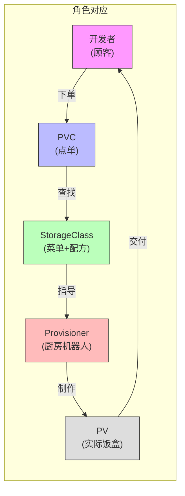
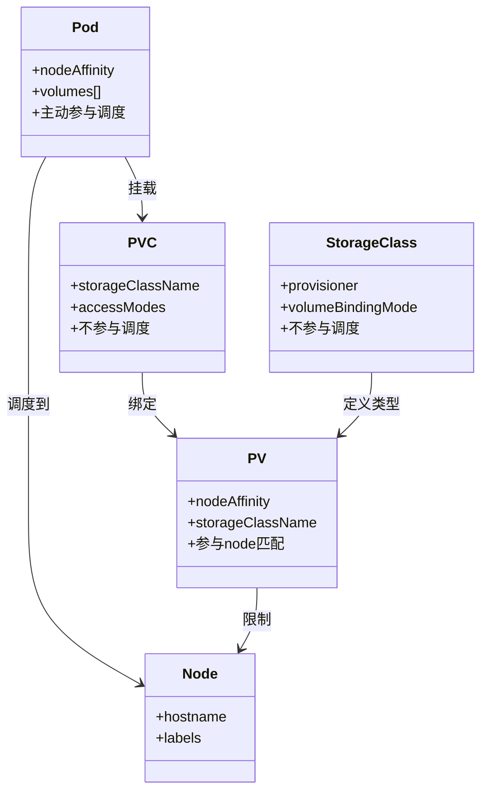
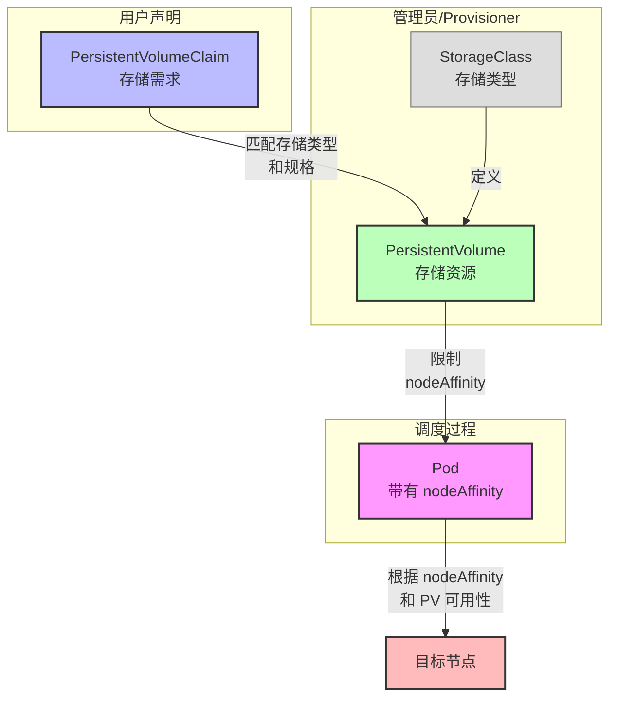
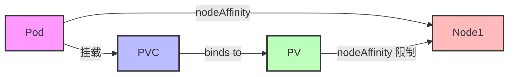
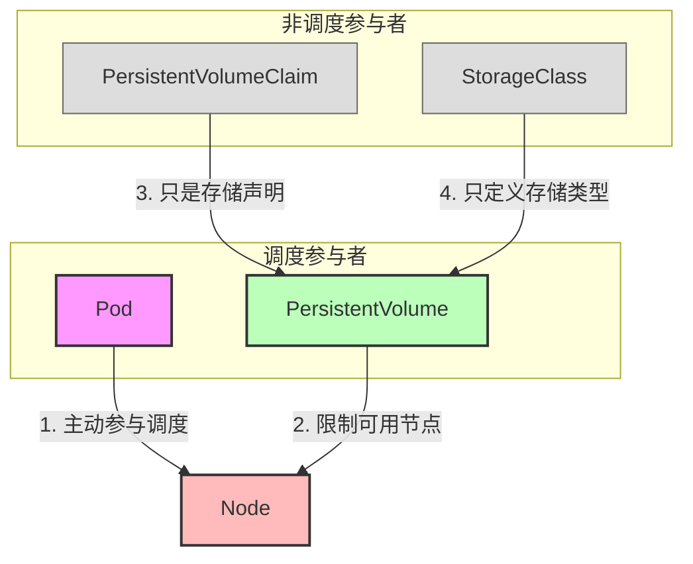
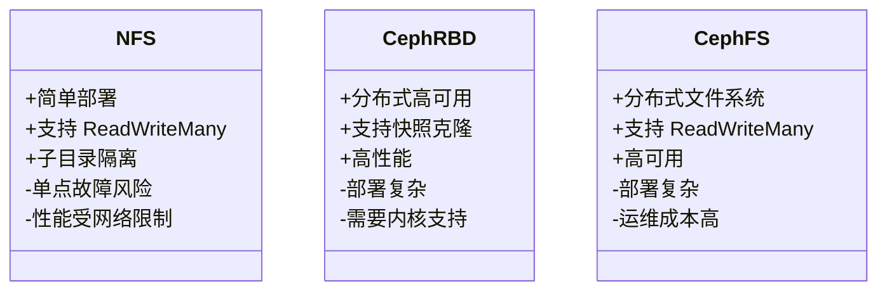
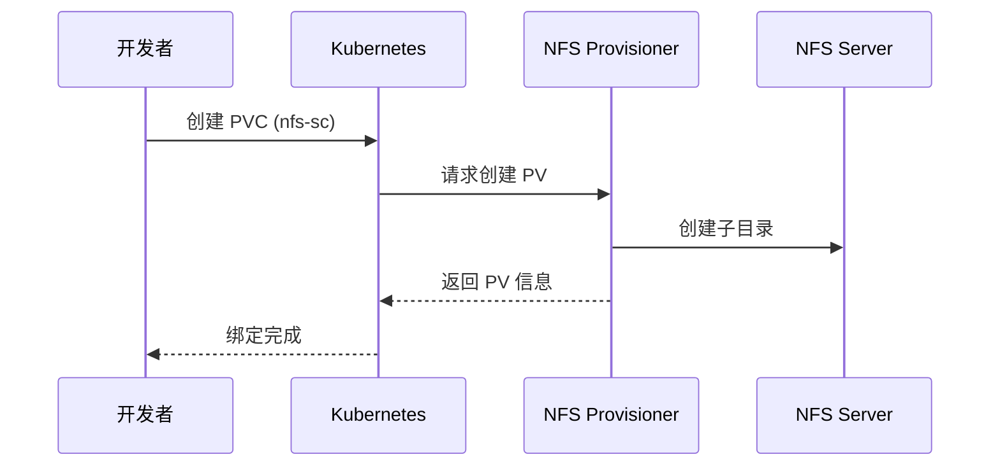
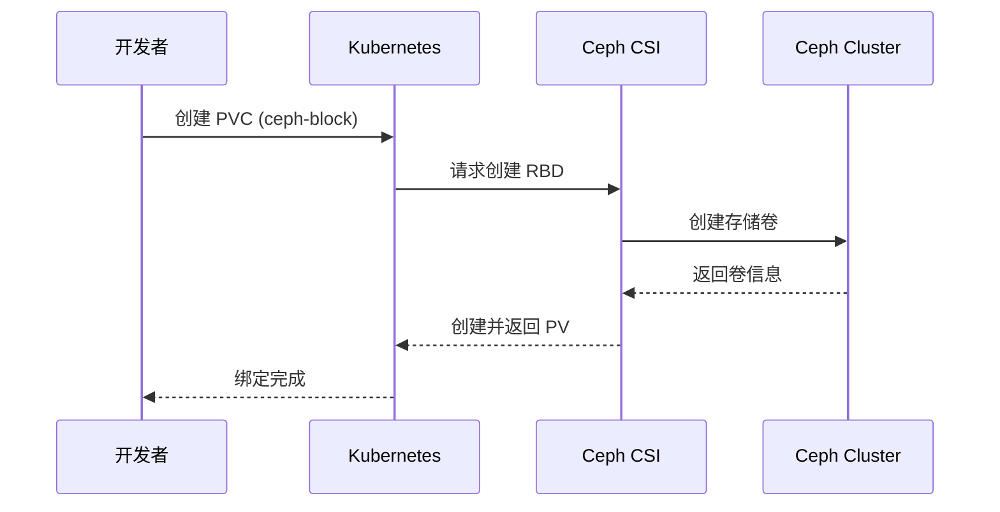
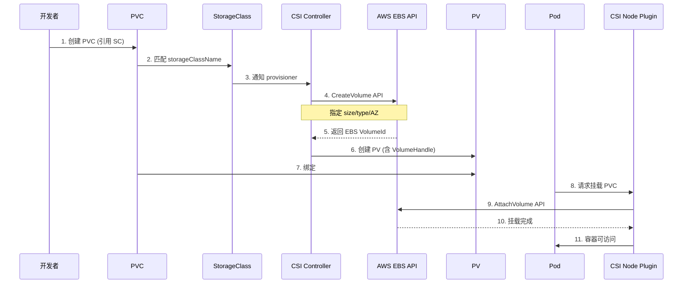
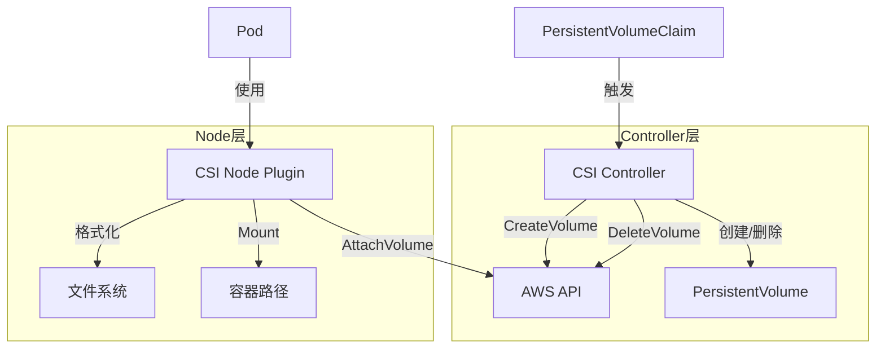

# Kubernetes 中 Pod 与 Storage 的亲和性调度机制

## StorageClass 概述

### 一句话定义
StorageClass 是 Kubernetes 中用于动态创建 PV 的"说明书"或"配方"，它定义了存储的创建方式（Provisioner）、类型、性能特征和访问策略。

### 形象类比：点外卖系统


### 关键配置字段
```yaml
apiVersion: storage.k8s.io/v1
kind: StorageClass
metadata:
  name: fast-ssd
provisioner: kubernetes.io/aws-ebs  # 存储提供者
parameters:
  type: gp3                        # 存储类型
reclaimPolicy: Delete             # PV 回收策略
volumeBindingMode: WaitForFirstConsumer  # 绑定时机
```

### 常见 StorageClass 类型对比

| 类型 | Provisioner | 用途说明 |
|------|-------------|----------|
| fast-ssd | kubernetes.io/aws-ebs | AWS 上的 SSD 存储 |
| standard | kubernetes.io/gce-pd | GCP 默认存储卷 |
| local-storage | kubernetes.io/no-provisioner | 本地存储（需预创建） |
| nfs | example.com/nfs | 网络文件系统 |
| ceph-block | ceph.com/rbd | Ceph 块存储 |

## 实现目标
让 Pod 都部署在一个特定节点上，使用挂载在该节点的特定 PV。

## 背后原理概览

| 组件          | 本质角色                                          | 是否参与调度 |
|---------------|--------------------------------------------------|--------------|
| PVC           | 用户声明的存储需求（容量/模式/类型）              | ❌ 不参与调度 |
| PV            | 实际存储资源的抽象，挂载路径与 node 有关联        | ✅ 参与 node 匹配 |
| Pod           | 执行单元，挂载 PVC，通过 nodeAffinity 控制调度目标 | ✅ 主动参与调度 |
| StorageClass  | 提供 PV 的方式定义（动态/静态，provisioner 等）   | ❌ 不参与调度 |

### 组件关系图



## 实现步骤流程图



## 配置示例

1. **创建 StorageClass（静态或本地卷）**
   ```yaml
   apiVersion: storage.k8s.io/v1
   kind: StorageClass
   metadata:
     name: local-storage
   provisioner: kubernetes.io/no-provisioner
   volumeBindingMode: WaitForFirstConsumer
   ```
   `WaitForFirstConsumer` 确保 PV 不会提前绑定，直到 Pod 确定要调度。

2. **创建 PV（绑定到指定节点）**
   ```yaml
   apiVersion: v1
   kind: PersistentVolume
   metadata:
     name: local-pv-node1
   spec:
     capacity:
       storage: 5Gi
     volumeMode: Filesystem
     accessModes:
       - ReadWriteOnce
     storageClassName: local-storage
     local:
       path: /mnt/disks/vol1
     nodeAffinity:
       required:
         nodeSelectorTerms:
           - matchExpressions:
               - key: kubernetes.io/hostname
                 operator: In
                 values:
                   - node1  # 要绑定的节点名
   ```

3. **创建 PVC（普通方式即可）**
   ```yaml
   apiVersion: v1
   kind: PersistentVolumeClaim
   metadata:
     name: mypvc
   spec:
     accessModes:
       - ReadWriteOnce
     resources:
       requests:
         storage: 5Gi
     storageClassName: local-storage
   ```

4. **创建 Pod，指定 nodeAffinity 并挂载 PVC**
   ```yaml
   apiVersion: v1
   kind: Pod
   metadata:
     name: mypod
   spec:
     containers:
       - name: app
         image: nginx
         volumeMounts:
           - mountPath: /data
             name: myvol
     volumes:
       - name: myvol
         persistentVolumeClaim:
           claimName: mypvc
     affinity:
       nodeAffinity:
         requiredDuringSchedulingIgnoredDuringExecution:
           nodeSelectorTerms:
             - matchExpressions:
                 - key: kubernetes.io/hostname
                   operator: In
                   values:
                     - node1
   ```

## 成功的判定标准
- PVC 状态为 Bound，且绑定到了正确的 PV；
- Pod 成功被调度到 node1；
- Pod 内的容器能访问到挂载路径 /data；
- 不会出现调度失败、挂载失败或 PVC pending。

## 关键原理图解（抽象视角）



## 常见误区说明

| 误区                                       | 正解                                       |
|--------------------------------------------|--------------------------------------------|
| ❌ 可以在 PVC 上设置 node 亲和性           | PVC 不参与调度，只是声明；真正限制 node 的是 PV 和 Pod |
| ❌ 所有 PV 都可以跨 node 共享              | 本地 PV、EBS 等存储是有节点限制的，必须通过 nodeAffinity 指定 |
| ❌ 设置了 PVC + PV 就能调度成功            | Pod 也必须明确指定 nodeAffinity，否则可能调度失败 |
| ❌ StorageClass 可以控制调度              | 它只是一个描述提供者和参数的对象，不参与调度逻辑 |

### 正确的调度流程图解



## 检查调试常用命令
```bash
# 查看节点名称
kubectl get nodes -o wide

# 查看 PV nodeAffinity
kubectl get pv local-pv-node1 -o yaml

# 查看 PVC 绑定状态
kubectl get pvc mypvc -o wide

# 查看 Pod 的调度情况
kubectl describe pod mypod
```

## 思维模型（一句话理解）
Kubernetes 的调度是以 Pod 为中心的，PV 是声明资源，PVC 是声明需求，StorageClass 是构建桥梁。调度过程的本质是：Pod（主动）寻找匹配的 PV（被动），在节点限制（affinity）约束下建立挂载绑定。

## 存储 Provisioner 深度解析

### Provisioner 概述
Provisioner 是 StorageClass 中的核心组件，负责 PV 的创建和管理：
- **静态 Provisioning**: 管理员手动创建 PV
- **动态 Provisioning**: 系统根据 StorageClass 自动创建 PV

### NFS vs Ceph 对比


### NFS Provisioner 工作流程


### Ceph Provisioner 工作流程


### 功能对比表

| 特性 | NFS | Ceph RBD | CephFS |
|------|-----|----------|---------|
| 类型 | 文件共享 | 块设备 | 分布式文件系统 |
| RWX 支持 | ✅ | ❌ | ✅ |
| 动态供应 | ✅ | ✅ | ✅ |
| 快照/克隆 | ❌ | ✅ | ✅ |
| 部署复杂度 | ⭐⭐ | ⭐⭐⭐⭐ | ⭐⭐⭐⭐ |
| 高可用性 | ❌ | ✅ | ✅ |

### 最佳实践建议
1. **开发环境**: 使用 NFS（简单快速）
2. **生产环境**: 
   - 需要高性能块存储：Ceph RBD
   - 需要共享文件系统：CephFS
3. **特殊场景**:
   - 仅 RWX 需求：考虑 Longhorn 或 OpenEBS
   - 云环境：优先使用云供应商的存储服务

## AWS EBS 与 Kubernetes 存储联动机制

### 核心组件交互流程



### 配置示例

1. **创建 StorageClass**
```yaml
apiVersion: storage.k8s.io/v1
kind: StorageClass
metadata:
  name: gp3-sc
provisioner: ebs.csi.aws.com
parameters:
  type: gp3
  fsType: ext4
volumeBindingMode: WaitForFirstConsumer  # 重要：等待 Pod 调度再创建卷
```

2. **创建 PVC**
```yaml
apiVersion: v1
kind: PersistentVolumeClaim
metadata:
  name: mypvc
spec:
  accessModes:
    - ReadWriteOnce
  resources:
    requests:
      storage: 20Gi
  storageClassName: gp3-sc
```

3. **自动创建的 PV 示例**
```yaml
apiVersion: v1
kind: PersistentVolume
metadata:
  name: pvc-abcde
spec:
  capacity:
    storage: 20Gi
  volumeHandle: vol-1234567890abcdef0
  csi:
    driver: ebs.csi.aws.com
    volumeHandle: vol-1234567890abcdef0
    fsType: ext4
  accessModes:
    - ReadWriteOnce
  persistentVolumeReclaimPolicy: Delete
  storageClassName: gp3-sc
  nodeAffinity:
    required:
      nodeSelectorTerms:
        - matchExpressions:
            - key: topology.kubernetes.io/zone
              operator: In
              values:
                - us-west-2a
```

### CSI 插件工作机制



### 常见问题与解决方案

| 问题 | 可能原因 | 解决方案 |
|------|---------|----------|
| PVC 一直 Pending | 未设置 WaitForFirstConsumer | 修改 SC 的 volumeBindingMode |
| | Pod 未调度 | 检查 Pod 调度约束 |
| 挂载失败 | EBS 已被其他节点使用 | EBS 限制：单节点独占使用 |
| | AZ 不匹配 | 确保 Pod 与 EBS 在同一 AZ |

### 调试命令
```bash
# 查看 StorageClass 配置
kubectl get sc gp3-sc -o yaml

# 检查 PVC 状态
kubectl get pvc mypvc -o wide

# 查看 PV 详情（包含 EBS ID）
kubectl get pv -o wide

# 检查 Pod 挂载状态
kubectl describe pod mypod

# 节点上的卷检查
lsblk
mount | grep ebs
```