# AWS/Kubernetes 存储架构学习指南

## 📚 学习目标

本指南将帮助您系统性地理解：
- AWS 云存储基础与核心服务
- Kubernetes 存储模型与组件交互
- 企业级生产环境的存储架构设计
- 故障排查与最佳实践

---

## 🏗️ 第一章：AWS 云存储基础

### 1.1 AWS 存储服务全景

**Why**: 了解 AWS 提供的多样化存储服务，选择合适的存储方案是企业架构设计的基础。

**What**: AWS 主要存储服务及其适用场景。

**How**: 通过对象存储、块存储、文件存储等满足不同业务需求。

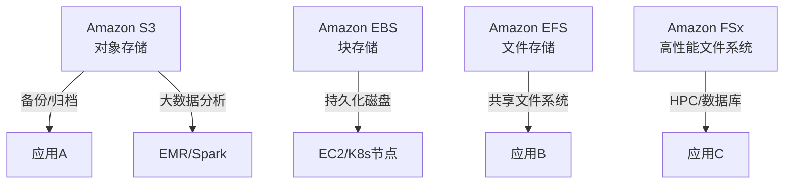

| 存储类型 | 服务 | 典型场景 | 优势 | 限制 |
|----------|------|----------|------|------|
| 对象存储 | S3   | 备份、归档、数据湖 | 高可扩展、低成本 | 不能直接挂载 |
| 块存储   | EBS  | 数据库、持久卷 | 高性能、可快照 | 仅单实例挂载 |
| 文件存储 | EFS  | 共享存储、微服务 | 多实例共享、弹性扩展 | 成本较高 |
| 文件存储 | FSx  | HPC、Windows | 高性能、兼容性好 | 复杂度高 |

### 1.2 存储服务对比与选型

**Why**: 不同业务需求对应不同存储方案，合理选型提升性能与成本效益。

**What**: 存储服务的核心对比。

**How**: 通过表格和场景分析进行选型。

| 需求 | 推荐服务 | 说明 |
|------|----------|------|
| 大数据湖/归档 | S3 | 低成本、无限扩展 |
| 高性能数据库 | EBS | 低延迟、高IOPS |
| 多节点共享 | EFS/FSx | 支持NFS/SMB协议 |
| Windows应用 | FSx for Windows | 完全兼容NTFS |
| HPC/AI | FSx for Lustre | 高带宽、低延迟 |

---

## ☸️ 第二章：Kubernetes 存储架构

### 2.1 Kubernetes 存储模型

**Why**: 理解K8s存储抽象，才能正确配置和排查持久化问题。

**What**: PV、PVC、StorageClass、CSI等核心组件。

**How**: 通过声明式API实现存储资源的动态/静态分配。

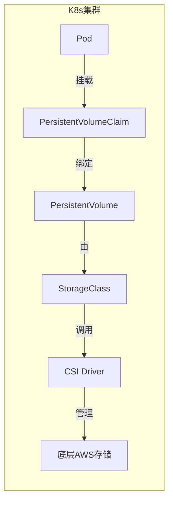

| 组件 | 作用 | 说明 |
|------|------|------|
| PV | 持久卷 | 集群级存储资源 |
| PVC | 持久卷声明 | 用户请求存储 |
| StorageClass | 存储类 | 定义存储类型/参数 |
| CSI | 容器存储接口 | 驱动后端存储 |

### 2.2 AWS EBS/EFS/FSx 在 K8s 的集成

**Why**: 企业级K8s集群需与云存储深度集成，满足多样化持久化需求。

**What**: 各类AWS存储在K8s中的集成方式。

**How**: 通过CSI插件实现自动化卷管理。

| 存储类型 | K8s集成方式 | 适用场景 | 优势 | 注意事项 |
|----------|-------------|----------|------|----------|
| EBS | EBS CSI Driver | 单Pod持久卷 | 高性能、快照 | 仅单AZ、单节点挂载 |
| EFS | EFS CSI Driver | 多Pod共享 | 跨AZ、弹性扩展 | 性能受限于NFS |
| FSx | FSx CSI Driver | HPC/Windows | 高性能、兼容性 | 需额外配置 |

### 2.3 K8s 与 AWS 存储的详细调用链

**Why**: 理解完整的调用链有助于排查存储问题，优化性能，确保高可用性。

**What**: 从Pod创建到存储挂载的完整流程。

**How**: 通过CSI接口、AWS API、IAM权限实现自动化存储管理。

#### 🔄 EBS CSI Driver 调用链详解

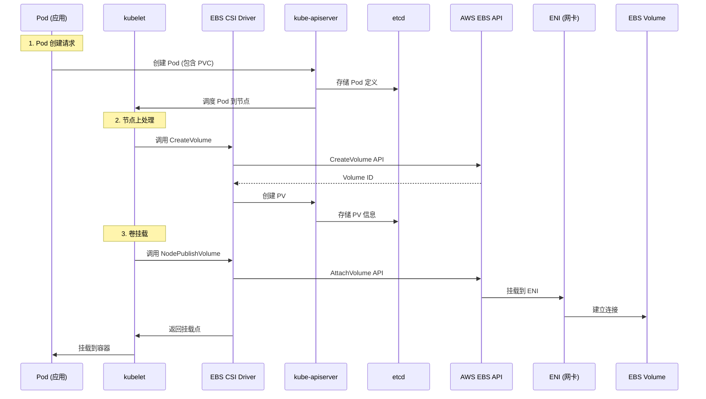

#### 🌐 EFS CSI Driver 调用链详解

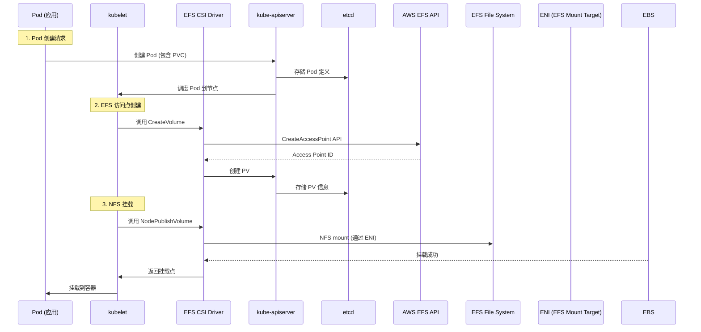

#### ⚡ FSx CSI Driver 调用链详解

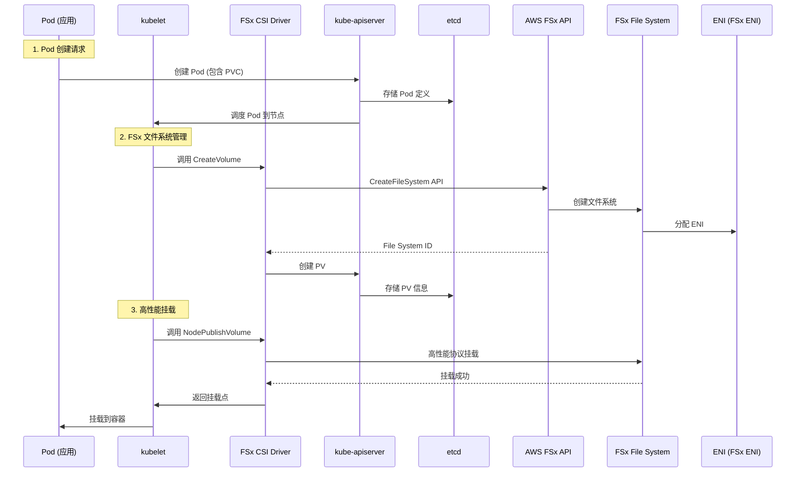

### 2.4 CSI Driver 组件架构详解

**Why**: CSI Driver是K8s与云存储的桥梁，理解其架构有助于优化配置和排查问题。

**What**: CSI Driver的内部组件和通信机制。

**How**: 通过Controller和Node组件实现存储生命周期管理。

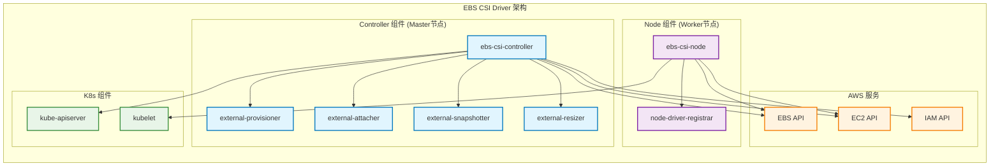

#### 📋 CSI Driver 组件职责表

| 组件 | 部署位置 | 主要职责 | 关键功能 |
|------|----------|----------|----------|
| **ebs-csi-controller** | Master节点 | 卷生命周期管理 | 创建/删除卷、快照管理 |
| **ebs-csi-node** | Worker节点 | 节点级卷操作 | 挂载/卸载、格式化 |
| **external-provisioner** | Master节点 | 动态供应 | 根据PVC自动创建PV |
| **external-attacher** | Master节点 | 卷附加管理 | 管理卷与节点的绑定 |
| **external-snapshotter** | Master节点 | 快照管理 | 创建/删除/恢复快照 |
| **external-resizer** | Master节点 | 卷扩容 | 在线扩容EBS卷 |
| **node-driver-registrar** | Worker节点 | 节点注册 | 向kubelet注册CSI驱动 |

### 2.5 IAM 权限与安全机制

**Why**: 正确的IAM权限配置是CSI Driver正常工作的前提，也是安全最佳实践。

**What**: CSI Driver需要的AWS权限和IRSA配置。

**How**: 通过IAM Roles for Service Accounts (IRSA)实现细粒度权限控制。

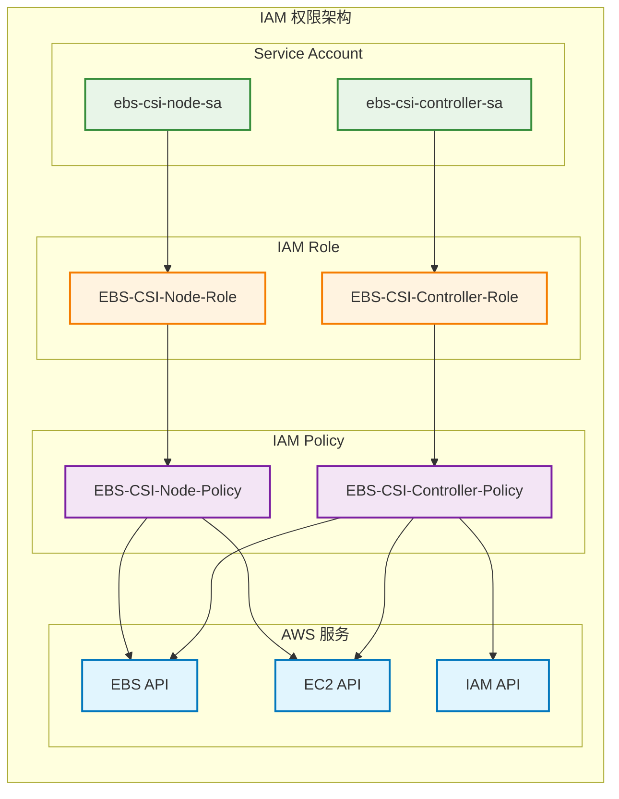

#### 🔐 EBS CSI Driver 权限配置

**Controller 权限 (ebs-csi-controller-sa)**:

```json
{
  "Version": "2012-10-17",
  "Statement": [
    {
      "Effect": "Allow",
      "Action": [
        "ec2:CreateVolume",
        "ec2:DeleteVolume",
        "ec2:AttachVolume",
        "ec2:DetachVolume",
        "ec2:ModifyVolume",
        "ec2:DescribeVolumes",
        "ec2:DescribeInstances",
        "ec2:DescribeAvailabilityZones",
        "ec2:CreateSnapshot",
        "ec2:DeleteSnapshot",
        "ec2:DescribeSnapshots"
      ],
      "Resource": "*"
    }
  ]
}
```

**Node 权限 (ebs-csi-node-sa)**:

```json
{
  "Version": "2012-10-17",
  "Statement": [
    {
      "Effect": "Allow",
      "Action": [
        "ec2:AttachVolume",
        "ec2:DetachVolume",
        "ec2:DescribeVolumes",
        "ec2:DescribeInstances"
      ],
      "Resource": "*"
    }
  ]
}
```

### 2.6 存储类 (StorageClass) 配置详解

**Why**: StorageClass定义了存储的供应策略，影响性能、成本和可用性。

**What**: 不同类型存储的StorageClass配置参数。

**How**: 通过YAML配置实现存储的自动化管理。

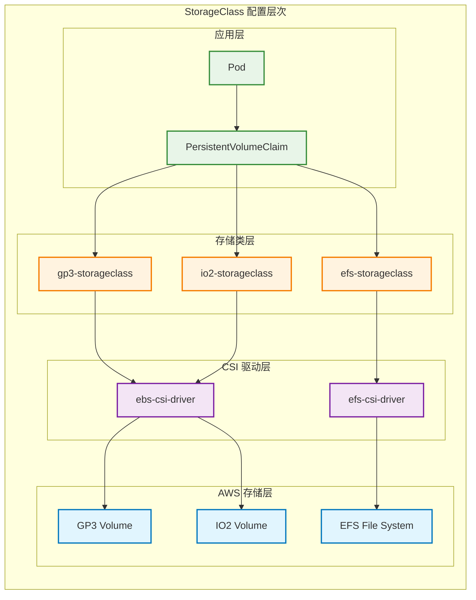

#### 📊 StorageClass 配置示例

**GP3 StorageClass (通用SSD)**:

```yaml
apiVersion: storage.k8s.io/v1
kind: StorageClass
metadata:
  name: gp3-storageclass
provisioner: ebs.csi.aws.com
parameters:
  type: gp3
  iops: "3000"
  throughput: "125"
  encrypted: "true"
  kmsKeyId: "arn:aws:kms:us-east-1:123456789012:key/abcd1234-5678-90ef-ghij-klmnopqrstuv"
volumeBindingMode: WaitForFirstConsumer
allowVolumeExpansion: true
```

**IO2 StorageClass (高性能SSD)**:

```yaml
apiVersion: storage.k8s.io/v1
kind: StorageClass
metadata:
  name: io2-storageclass
provisioner: ebs.csi.aws.com
parameters:
  type: io2
  iops: "16000"
  encrypted: "true"
volumeBindingMode: WaitForFirstConsumer
allowVolumeExpansion: true
```

**EFS StorageClass (文件存储)**:

```yaml
apiVersion: storage.k8s.io/v1
kind: StorageClass
metadata:
  name: efs-storageclass
provisioner: efs.csi.aws.com
parameters:
  provisioningMode: efs-ap
  fileSystemId: fs-12345678
  directoryPerms: "700"
  gidRangeStart: "1000"
  gidRangeEnd: "2000"
```

#### 🎯 StorageClass 参数详解

| 参数 | EBS类型 | 说明 | 推荐值 |
|------|---------|------|--------|
| **type** | gp3/io2 | 卷类型 | gp3(通用), io2(高性能) |
| **iops** | gp3/io2 | IOPS配置 | gp3: 3000-16000, io2: 100-64000 |
| **throughput** | gp3 | 吞吐量(MB/s) | 125-1000 |
| **encrypted** | 所有 | 是否加密 | true(推荐) |
| **kmsKeyId** | 所有 | KMS密钥ID | 自定义密钥ARN |
| **volumeBindingMode** | 所有 | 绑定模式 | WaitForFirstConsumer |

---

## 🏭 第三章：企业级存储架构设计

### 3.1 多AZ高可用存储架构

**Why**: 生产环境需要跨可用区的存储高可用性，避免单点故障。

**What**: 通过多AZ部署和存储复制实现高可用。

**How**: 结合EBS、EFS、RDS等服务的多AZ特性。

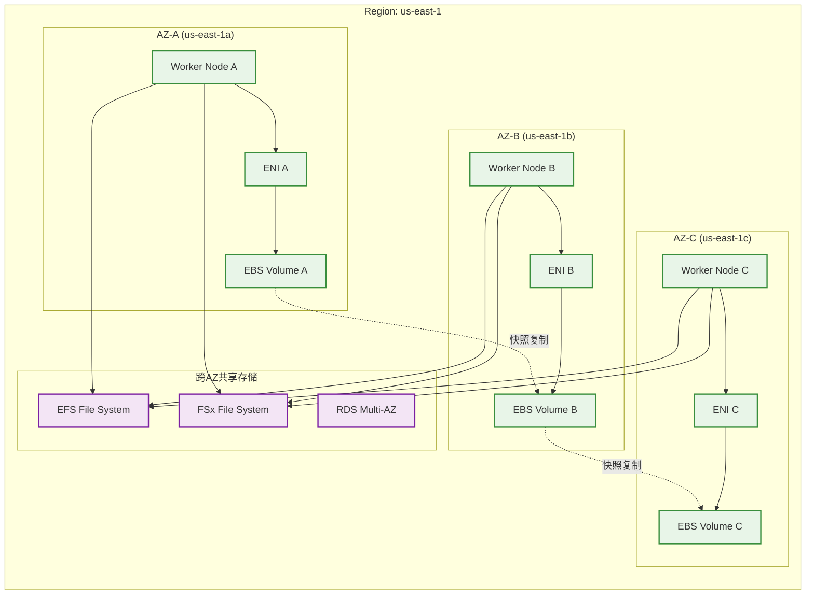

#### 📊 多AZ存储策略对比

| 存储类型 | 多AZ策略 | 故障转移时间 | 数据一致性 | 成本影响 |
|----------|----------|--------------|------------|----------|
| **EBS** | 快照复制 | 分钟级 | 最终一致 | 中等 |
| **EFS** | 原生多AZ | 秒级 | 强一致 | 高 |
| **FSx** | 原生多AZ | 秒级 | 强一致 | 高 |
| **RDS** | 同步复制 | 秒级 | 强一致 | 高 |

### 3.2 存储性能优化架构

**Why**: 不同应用对存储性能要求不同，需要针对性的优化策略。

**What**: 通过存储类型选择、IOPS配置、缓存策略优化性能。

**How**: 结合应用特性和成本考虑选择最优存储方案。

```mermaid
flowchart TD
    subgraph "存储性能分层架构"
        direction TB
        
        subgraph "高性能层 (IO2)"
            direction LR
            DB1[MySQL Database]
            DB2[PostgreSQL Database]
            Cache1[Redis Cache]
        end
        
        subgraph "通用层 (GP3)"
            direction LR
            App1[Web Application]
            App2[API Service]
            App3[Batch Processing]
        end
        
        subgraph "共享层 (EFS/FSx)"
            direction LR
            Share1[Shared Configs]
            Share2[Log Files]
            Share3[User Uploads]
        end
        
        subgraph "归档层 (S3)"
            direction LR
            Backup1[Database Backups]
            Backup2[Application Logs]
            Backup3[Old Data]
        end
        
        %% 性能连接
        DB1 -->|高IOPS| IO2_Vol1[IO2 Volume]
        DB2 -->|高IOPS| IO2_Vol2[IO2 Volume]
        Cache1 -->|低延迟| IO2_Vol3[IO2 Volume]
        
        App1 -->|平衡性能| GP3_Vol1[GP3 Volume]
        App2 -->|平衡性能| GP3_Vol2[GP3 Volume]
        App3 -->|平衡性能| GP3_Vol3[GP3 Volume]
        
        Share1 -->|共享访问| EFS_Vol[EFS Volume]
        Share2 -->|共享访问| EFS_Vol
        Share3 -->|共享访问| EFS_Vol
        
        Backup1 -->|低成本| S3_Bucket[S3 Bucket]
        Backup2 -->|低成本| S3_Bucket
        Backup3 -->|低成本| S3_Bucket
    end
    
    classDef high fill:#ffebee,stroke:#f44336,stroke-width:2px;
    classDef medium fill:#fff3e0,stroke:#ff9800,stroke-width:2px;
    classDef shared fill:#e8f5e8,stroke:#4caf50,stroke-width:2px;
    classDef archive fill:#f3e5f5,stroke:#9c27b0,stroke-width:2px;
    
    class DB1,DB2,Cache1,IO2_Vol1,IO2_Vol2,IO2_Vol3 high;
    class App1,App2,App3,GP3_Vol1,GP3_Vol2,GP3_Vol3 medium;
    class Share1,Share2,Share3,EFS_Vol shared;
    class Backup1,Backup2,Backup3,S3_Bucket archive;
```

#### 🚀 性能优化配置表

| 应用类型 | 推荐存储 | IOPS配置 | 吞吐量 | 缓存策略 |
|----------|----------|----------|--------|----------|
| **OLTP数据库** | IO2 | 16000+ | 1000MB/s | 应用层缓存 |
| **OLAP分析** | GP3 | 3000-16000 | 500-1000MB/s | 查询缓存 |
| **Web应用** | GP3 | 3000 | 125MB/s | CDN + 应用缓存 |
| **文件服务** | EFS | 自动扩展 | 自动扩展 | 客户端缓存 |
| **HPC/AI** | FSx Lustre | 极高 | 极高 | 内存缓存 |

### 3.3 存储安全与合规架构

**Why**: 企业级应用需要满足安全合规要求，存储安全是数据保护的关键。

**What**: 通过加密、访问控制、审计实现存储安全。

**How**: 结合AWS KMS、IAM、CloudTrail等安全服务。

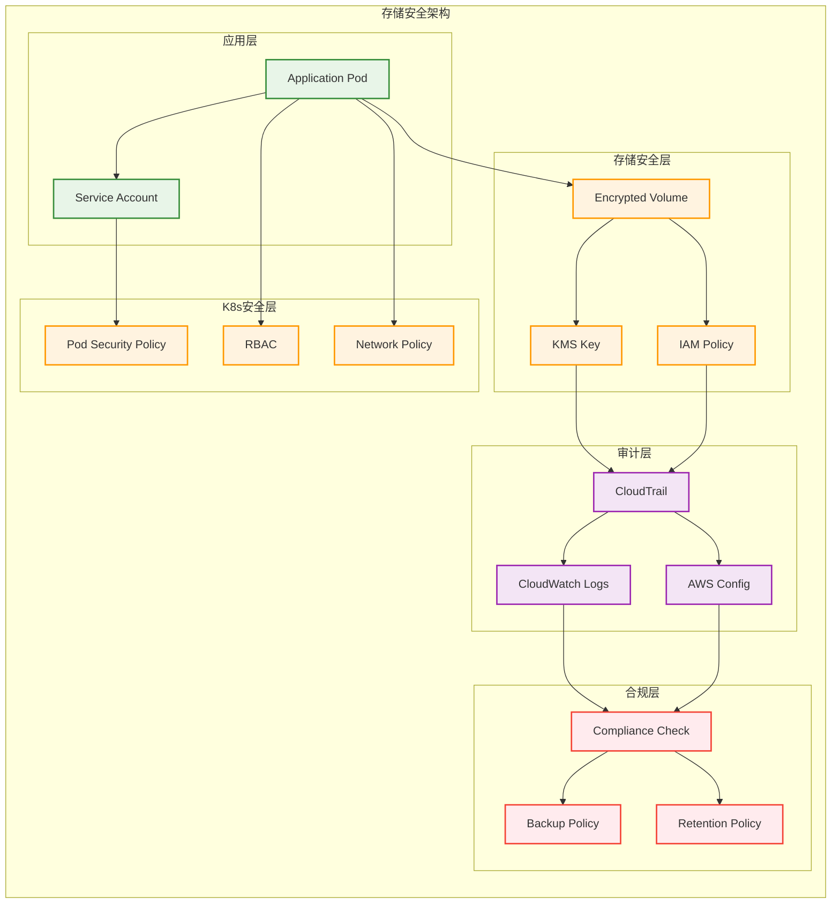

#### 🔐 存储安全配置示例

**加密存储类配置**:

```yaml
apiVersion: storage.k8s.io/v1
kind: StorageClass
metadata:
  name: encrypted-gp3
provisioner: ebs.csi.aws.com
parameters:
  type: gp3
  encrypted: "true"
  kmsKeyId: "arn:aws:kms:us-east-1:123456789012:key/abcd1234-5678-90ef-ghij-klmnopqrstuv"
  iops: "3000"
  throughput: "125"
volumeBindingMode: WaitForFirstConsumer
allowVolumeExpansion: true
```

**Pod安全策略**:

```yaml
apiVersion: policy/v1beta1
kind: PodSecurityPolicy
metadata:
  name: storage-psp
spec:
  privileged: false
  allowPrivilegeEscalation: false
  requiredDropCapabilities:
    - ALL
  volumes:
    - 'configMap'
    - 'emptyDir'
    - 'projected'
    - 'secret'
    - 'downwardAPI'
    - 'persistentVolumeClaim'
  hostNetwork: false
  hostIPC: false
  hostPID: false
  runAsUser:
    rule: 'MustRunAsNonRoot'
  seLinux:
    rule: 'RunAsAny'
  fsGroup:
    rule: 'RunAsAny'
```

---

## 🔧 第四章：存储故障排查与最佳实践

### 4.1 存储问题排查流程

**Why**: 存储问题是生产环境中的常见问题，需要系统化的排查方法。

**What**: 从应用层到基础设施层的分层排查。

**How**: 通过日志分析、监控指标、AWS控制台进行问题定位。

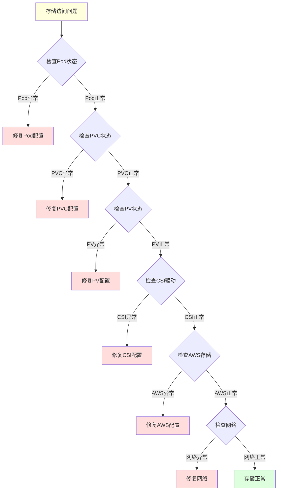

### 4.2 常见存储问题与解决方案

**Why**: 了解常见问题有助于快速定位和解决存储故障。

**What**: 典型存储问题的症状、原因和解决方法。

**How**: 通过具体的命令和配置进行问题修复。

#### 📋 常见问题排查表

| 问题类型 | 症状 | 可能原因 | 排查命令 | 解决方案 |
|----------|------|----------|----------|----------|
| **PVC Pending** | PVC一直处于Pending状态 | StorageClass不存在或配置错误 | `kubectl get pvc`<br>`kubectl describe pvc` | 检查StorageClass配置 |
| **卷挂载失败** | Pod启动失败，卷挂载错误 | CSI驱动问题或权限不足 | `kubectl describe pod`<br>`kubectl logs -n kube-system ebs-csi-node-xxx` | 检查CSI驱动状态和IAM权限 |
| **性能问题** | 应用响应慢，IO延迟高 | 存储类型或IOPS配置不当 | `kubectl top pod`<br>AWS CloudWatch指标 | 升级存储类型或增加IOPS |
| **数据丢失** | 数据无法访问或丢失 | 卷删除或快照问题 | `kubectl get pv`<br>AWS控制台检查 | 从快照恢复或联系AWS支持 |

#### 🔍 详细排查命令

**检查存储组件状态**:

```bash
# 检查CSI驱动状态
kubectl get pods -n kube-system | grep csi

# 检查StorageClass
kubectl get storageclass
kubectl describe storageclass gp3-storageclass

# 检查PVC和PV
kubectl get pvc
kubectl get pv
kubectl describe pvc my-pvc
kubectl describe pv pvc-12345678-1234-1234-1234-123456789012

# 检查CSI驱动日志
kubectl logs -n kube-system ebs-csi-controller-xxx
kubectl logs -n kube-system ebs-csi-node-xxx
```

**检查AWS存储状态**:

```bash
# 检查EBS卷状态
aws ec2 describe-volumes --volume-ids vol-12345678

# 检查卷附加状态
aws ec2 describe-volumes --filters "Name=attachment.instance-id,Values=i-12345678"

# 检查快照状态
aws ec2 describe-snapshots --snapshot-ids snap-12345678

# 检查EFS文件系统
aws efs describe-file-systems --file-system-id fs-12345678
```

### 4.3 存储监控与告警

**Why**: 主动监控存储状态可以提前发现问题，避免数据丢失。

**What**: 通过CloudWatch、Prometheus等工具监控存储指标。

**How**: 设置合理的告警阈值和通知机制。

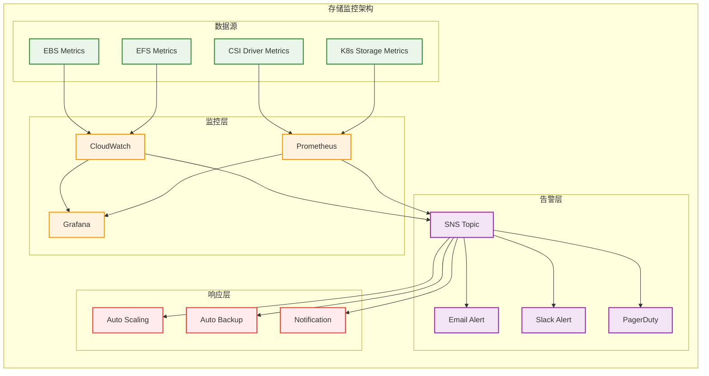

#### 📊 关键监控指标

| 指标类型 | 指标名称 | 告警阈值 | 说明 |
|----------|----------|----------|------|
| **EBS性能** | VolumeReadOps | >1000 ops/sec | 读取操作数 |
| **EBS性能** | VolumeWriteOps | >1000 ops/sec | 写入操作数 |
| **EBS性能** | VolumeReadBytes | >100MB/s | 读取字节数 |
| **EBS性能** | VolumeWriteBytes | >100MB/s | 写入字节数 |
| **EBS性能** | VolumeQueueLength | >10 | 队列长度 |
| **EBS性能** | VolumeTotalReadTime | >100ms | 总读取时间 |
| **EBS性能** | VolumeTotalWriteTime | >100ms | 总写入时间 |
| **EBS可用性** | VolumeStatusCheckFailed | >0 | 状态检查失败 |
| **EFS性能** | ClientConnections | >1000 | 客户端连接数 |
| **EFS性能** | DataReadIOBytes | >1GB/s | 读取数据量 |
| **EFS性能** | DataWriteIOBytes | >1GB/s | 写入数据量 |

### 4.4 存储最佳实践

**Why**: 遵循最佳实践可以避免常见问题，提升存储性能和可靠性。

**What**: 存储设计、配置、运维的最佳实践。

**How**: 通过具体的配置示例和操作指南实现最佳实践。

#### 🎯 存储设计最佳实践

1. **存储类型选择**
   - 数据库应用使用IO2或GP3
   - 通用应用使用GP3
   - 共享存储使用EFS
   - 高性能计算使用FSx

2. **容量规划**
   - 预留30%容量用于增长
   - 监控存储使用率
   - 定期清理无用数据

3. **性能优化**
   - 根据应用需求配置IOPS
   - 使用合适的卷大小
   - 避免跨AZ的存储访问

4. **安全配置**
   - 启用存储加密
   - 使用KMS密钥管理
   - 配置适当的IAM权限

#### 📋 运维最佳实践

| 实践项目 | 频率 | 操作内容 | 工具/命令 |
|----------|------|----------|-----------|
| **存储监控** | 实时 | 监控存储性能和可用性 | CloudWatch、Prometheus |
| **容量检查** | 每日 | 检查存储使用率 | `kubectl get pvc`、AWS控制台 |
| **快照备份** | 每日 | 创建重要数据快照 | AWS控制台、自动化脚本 |
| **性能分析** | 每周 | 分析存储性能趋势 | CloudWatch、Grafana |
| **安全审计** | 每月 | 检查存储安全配置 | AWS Config、CloudTrail |
| **成本优化** | 每月 | 分析存储成本 | AWS Cost Explorer |

#### 🔧 自动化运维脚本示例

**自动快照脚本**:

```bash
#!/bin/bash
# 自动创建EBS快照

# 获取所有EBS卷
VOLUMES=$(aws ec2 describe-volumes --query 'Volumes[*].VolumeId' --output text)

for VOLUME in $VOLUMES; do
    # 创建快照
    SNAPSHOT_ID=$(aws ec2 create-snapshot \
        --volume-id $VOLUME \
        --description "Auto backup $(date +%Y-%m-%d)" \
        --query 'SnapshotId' --output text)
    
    # 添加标签
    aws ec2 create-tags \
        --resources $SNAPSHOT_ID \
        --tags Key=BackupType,Value=Auto Key=Date,Value=$(date +%Y-%m-%d)
    
    echo "Created snapshot $SNAPSHOT_ID for volume $VOLUME"
done
```

**存储使用率检查脚本**:

```bash
#!/bin/bash
# 检查存储使用率

# 检查PVC使用率
echo "=== PVC Usage ==="
kubectl get pvc --all-namespaces -o custom-columns=NAMESPACE:.metadata.namespace,NAME:.metadata.name,STATUS:.status.phase,SIZE:.spec.resources.requests.storage

# 检查PV使用率
echo "=== PV Usage ==="
kubectl get pv -o custom-columns=NAME:.metadata.name,STATUS:.status.phase,SIZE:.spec.capacity.storage,STORAGECLASS:.spec.storageClassName

# 检查EBS卷状态
echo "=== EBS Volume Status ==="
aws ec2 describe-volumes --query 'Volumes[*].[VolumeId,State,Size,VolumeType]' --output table
```

---

## 📋 第五章：快速参考

### 5.1 存储服务对比表

| 服务 | 类型 | 性能 | 成本 | 适用场景 | 限制 |
|------|------|------|------|----------|------|
| **EBS GP3** | 块存储 | 中等 | 低 | 通用应用 | 单AZ、单节点 |
| **EBS IO2** | 块存储 | 高 | 高 | 数据库 | 单AZ、单节点 |
| **EFS** | 文件存储 | 中等 | 高 | 共享存储 | NFS协议限制 |
| **FSx** | 文件存储 | 高 | 高 | HPC/Windows | 复杂度高 |
| **S3** | 对象存储 | 中等 | 低 | 备份/归档 | 不能直接挂载 |

### 5.2 CSI Driver 对比表

| CSI Driver | 支持存储 | 部署复杂度 | 性能 | 成本 | 维护难度 |
|------------|----------|------------|------|------|----------|
| **EBS CSI** | EBS | 中等 | 高 | 中等 | 低 |
| **EFS CSI** | EFS | 低 | 中等 | 高 | 低 |
| **FSx CSI** | FSx | 高 | 高 | 高 | 高 |
| **S3 CSI** | S3 | 中等 | 中等 | 低 | 中等 |

### 5.3 StorageClass 配置快速参考

#### EBS StorageClass 模板

```yaml
apiVersion: storage.k8s.io/v1
kind: StorageClass
metadata:
  name: gp3-storageclass
provisioner: ebs.csi.aws.com
parameters:
  type: gp3
  iops: "3000"
  throughput: "125"
  encrypted: "true"
volumeBindingMode: WaitForFirstConsumer
allowVolumeExpansion: true
```

#### EFS StorageClass 模板

```yaml
apiVersion: storage.k8s.io/v1
kind: StorageClass
metadata:
  name: efs-storageclass
provisioner: efs.csi.aws.com
parameters:
  provisioningMode: efs-ap
  fileSystemId: fs-12345678
  directoryPerms: "700"
```

### 5.4 常用命令快速参考

#### K8s 存储命令

```bash
# 查看存储类
kubectl get storageclass

# 查看PVC
kubectl get pvc --all-namespaces

# 查看PV
kubectl get pv

# 查看CSI驱动
kubectl get pods -n kube-system | grep csi

# 查看存储事件
kubectl get events --sort-by='.lastTimestamp'
```

#### AWS 存储命令

```bash
# 查看EBS卷
aws ec2 describe-volumes

# 查看快照
aws ec2 describe-snapshots --owner-ids self

# 查看EFS文件系统
aws efs describe-file-systems

# 查看存储成本
aws ce get-cost-and-usage --time-period Start=2024-01-01,End=2024-01-31 --granularity MONTHLY --metrics BlendedCost --group-by Type=DIMENSION,Key=SERVICE
```

### 5.5 存储容量规划参考

| 应用类型 | 初始容量 | 增长预测 | 备份策略 | 监控指标 |
|----------|----------|----------|----------|----------|
| **数据库** | 100GB | 20%/月 | 每日快照 | IOPS、延迟 |
| **Web应用** | 50GB | 10%/月 | 每周快照 | 吞吐量 |
| **文件服务** | 1TB | 50%/月 | 每日快照 | 连接数 |
| **日志存储** | 500GB | 30%/月 | 每月归档 | 写入速度 |

### 5.6 故障排查检查清单

#### 存储问题排查清单

- [ ] 检查Pod状态和事件
- [ ] 检查PVC绑定状态
- [ ] 检查PV状态和配置
- [ ] 检查StorageClass配置
- [ ] 检查CSI驱动状态
- [ ] 检查IAM权限配置
- [ ] 检查AWS存储状态
- [ ] 检查网络连接
- [ ] 检查存储性能指标
- [ ] 检查安全组和NACL配置

#### 性能问题排查清单

- [ ] 检查存储类型是否合适
- [ ] 检查IOPS配置
- [ ] 检查卷大小
- [ ] 检查网络带宽
- [ ] 检查应用缓存配置
- [ ] 检查并发访问模式
- [ ] 检查存储队列长度
- [ ] 检查跨AZ访问

---

## 🎯 总结

通过本指南，您应该能够：

1. **理解AWS存储基础**: 掌握EBS、EFS、FSx、S3等核心存储服务的特点和适用场景
2. **掌握K8s存储模型**: 理解PV、PVC、StorageClass、CSI等组件的交互机制
3. **设计企业级架构**: 能够设计多AZ、高性能、安全的存储架构
4. **排查存储问题**: 使用系统化的方法快速定位和解决存储问题
5. **优化存储性能**: 通过最佳实践提升存储性能和降低成本

### 关键要点回顾

#### 🏗️ 架构设计原则
- **分层存储**: 根据性能需求选择不同存储类型
- **多AZ部署**: 确保存储高可用性
- **安全优先**: 启用加密和访问控制
- **成本优化**: 平衡性能和成本

#### 🔧 运维最佳实践
- **监控先行**: 建立完善的监控和告警体系
- **自动化运维**: 使用脚本和工具自动化日常操作
- **定期备份**: 建立可靠的数据备份策略
- **性能调优**: 持续优化存储性能

#### 🚀 技术发展趋势
- **Serverless存储**: 关注AWS Lambda和存储的集成
- **AI/ML存储**: 针对机器学习工作负载的存储优化
- **混合云存储**: 本地存储与云存储的统一管理
- **边缘存储**: 边缘计算场景下的存储解决方案

### 下一步建议

1. **动手实践**: 在测试环境中搭建完整的存储架构
2. **深入学习**: 研究更多高级存储功能（如存储类、快照管理）
3. **性能测试**: 进行存储性能基准测试和优化
4. **安全加固**: 实施更严格的存储安全策略
5. **成本分析**: 使用AWS Cost Explorer分析存储成本
6. **自动化**: 开发存储自动化运维工具和脚本

存储架构是企业级应用的基础设施核心，需要在性能、可靠性、安全性和成本之间找到最佳平衡。建议在实际应用中，先从简单的架构开始，逐步优化和完善。

**持续学习资源**:
- AWS官方文档和最佳实践指南
- Kubernetes存储相关文档和社区资源
- 云原生存储技术发展趋势
- 企业级存储架构设计模式

--- 