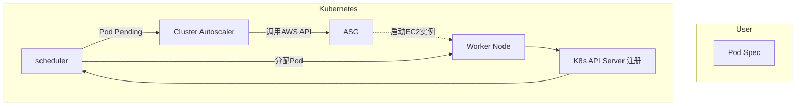

# AWS ASG 与 Kubernetes Worker Node 交互架构总结

## 1. 涉及的组件

**AWS 层**
- **Auto Scaling Group (ASG)**：弹性伸缩池，负责起/停 EC2 实例。
- **Launch Template/Configuration**：定义实例类型、AMI、标签、UserData（启动时加入集群的 bootstrap 脚本）。
- **EC2 Instance**：实际的 Worker 节点。

**Kubernetes 层**
- **Worker Node**：由 kubelet 运行，加入集群，执行 Pod。
- **kube-scheduler**：决定 Pod 调度到哪个节点。
- **Cluster Autoscaler (CA)**：监控 Pending Pod 并调用 AWS ASG API 扩缩容。
- **Cloud Provider 插件**：负责节点注册时设置 label/taint，处理负载均衡、卷挂载等。

## 2. 典型交互流程



**流程说明**：
1. 用户提交 Pod。
2. Scheduler 无法找到合适节点 → Pod Pending。
3. Cluster Autoscaler 检测到 Pending Pod，分析所需资源/约束。
4. CA 调用 AWS API，要求 ASG 起新实例。
5. ASG 根据 Launch Template 启动新 EC2。
6. kubelet 启动，执行 bootstrap，将节点注册到 API Server。
7. Scheduler 重新分配 Pending Pod，调度到新节点。

## 3. 常用命令
- 查看 ASG:
  ```bash
  aws autoscaling describe-auto-scaling-groups --auto-scaling-group-names my-asg
  ```
  ```bash
  aws ec2 describe-launch-templates \
    --launch-template-ids lt-013c8b6a12565b169 \
    --region us-west-2

    aws ec2 describe-launch-template-versions \
        --launch-template-id lt-013c8b6a12565b169 \
        --versions $Default \
        --region us-west-2
  ```
- 查看节点状态:
  ```bash
  kubectl get nodes -o wide
  ```
- 查看 Pending Pod:
  ```bash
  kubectl get pods --all-namespaces | grep Pending
  ```
- Debug Pod 为什么调度不上:
  ```bash
  kubectl describe pod <pod-name>
  ```
  （看 Events，如 0/10 nodes are available: insufficient cpu）

- 查看 Cluster Autoscaler 日志:
  ```bash
  kubectl -n kube-system logs deploy/cluster-autoscaler
  ```

## 4. 常见问题与解决方案

1. **Pod Pending 但 ASG 不扩容**
   - **原因**：
     - Pod 资源需求太大（超过 ASG 节点 instance type 的容量）。
     - Pod 使用了 nodeSelector/nodeAffinity，但 ASG 节点没有对应 label。
     - Pod 需要 GPU/特殊硬件，ASG 节点不支持。
     - CA 没有权限调用 AWS API（IAM Role 权限不足）。
   - **解决方案**：
     - 调整 Pod requests/limits。
     - 确认节点模板的 label 与 Pod 匹配。
     - 检查 cluster-autoscaler 日志是否有 skipped 信息。
     - 给 CA 的 IAM Role 加上 autoscaling:Describe* 和 autoscaling:SetDesiredCapacity 等权限。

2. **节点已经启动，但 kubectl get nodes 里看不到**
   - **原因**：
     - kubelet 启动失败（证书、配置错误）。
     - 节点 UserData/Bootstrap 没有正确执行（EKS 使用 --apiserver-endpoint 和 --b64-cluster-ca）。
     - 安全组/防火墙阻止了 API Server 访问。
   - **解决方案**：
     - 登录节点看 kubelet 日志：`journalctl -u kubelet`。
     - 确认 IAM Instance Profile 附加了正确的 eks:DescribeCluster 权限。
     - 检查 VPC 安全组配置。

3. **节点起了但 Pod 仍然 Pending**
   - **原因**：
     - Node 有 taint，Pod 没有对应的 toleration。
     - Pod 的调度约束（例如 topologySpreadConstraints）无法满足。
     - Pod 使用的 PVC 无法挂载到该节点的 AZ。
   - **解决方案**：
     - 加上 toleration 或移除 node taint。
     - 检查 Pod 的 affinity/anti-affinity 配置。
     - 确认 EBS PVC 与节点在同一 AZ。

4. **ASG 没有收缩节点**
   - **原因**：
     - 节点上仍有 DaemonSet Pod，导致节点非空。
     - Pod 有本地存储或 PodDisruptionBudget 限制，无法驱逐。
     - CA 的 scale-down 延迟（默认 10 分钟）。
   - **解决方案**：
     - 给 DaemonSet 加上 `cluster-autoscaler.kubernetes.io/safe-to-evict=true`。
     - 检查 PDB 和本地卷配置。
     - 调整 CA 参数：`--scale-down-delay-after-add=10m` 等。

## 5. 总结
ASG 提供节点资源池，Cluster Autoscaler 决定何时扩缩容。触发扩容条件：有 Pending Pod，且现有节点不足。匹配条件：Pod requests/limits、nodeSelector、taints、affinity、AZ 等。常见问题集中在：权限、节点 bootstrap、Pod 调度约束、scale-down 逻辑。