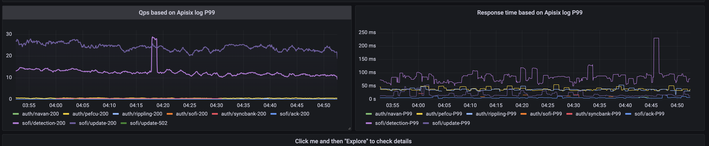
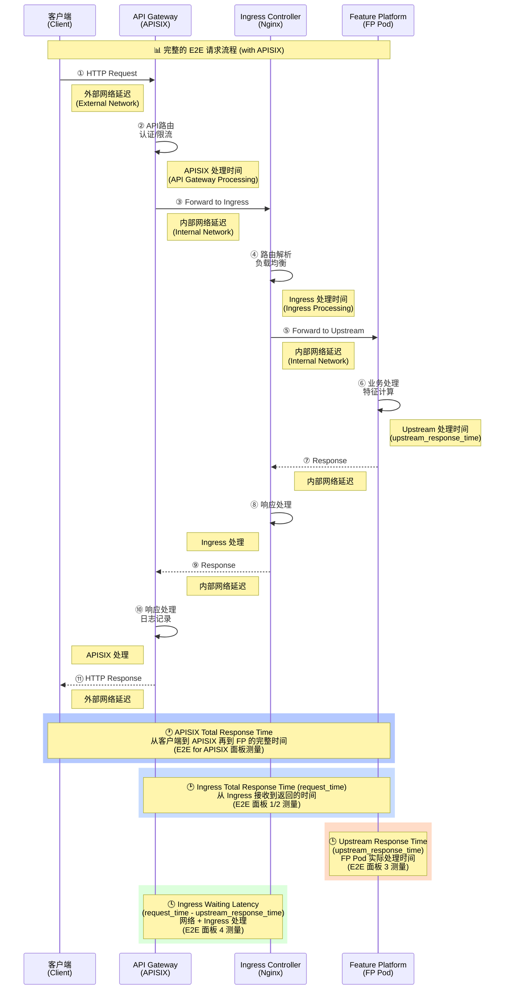
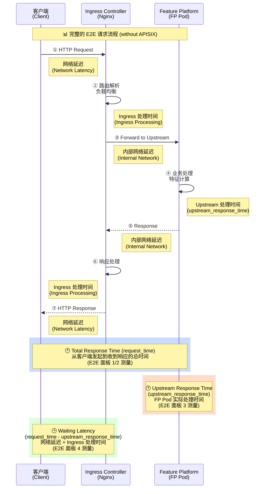
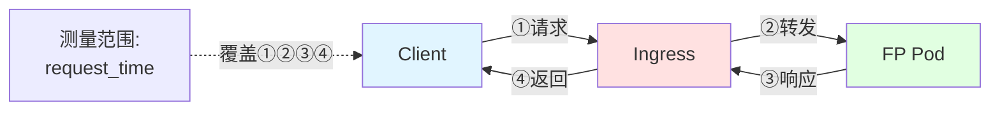
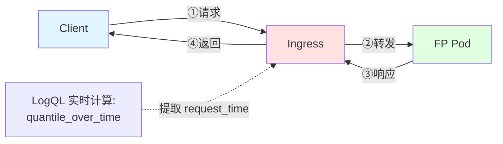
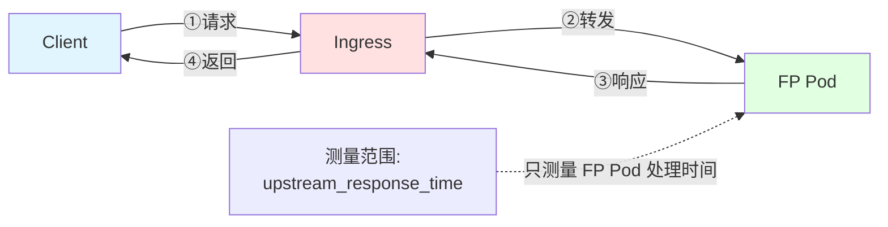
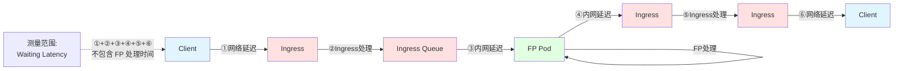
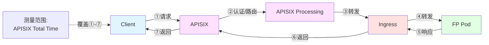
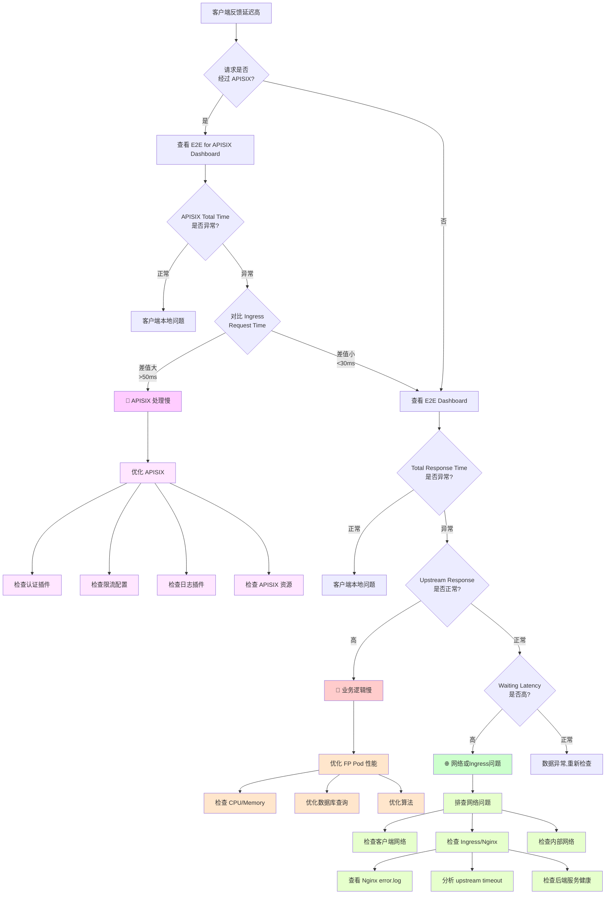
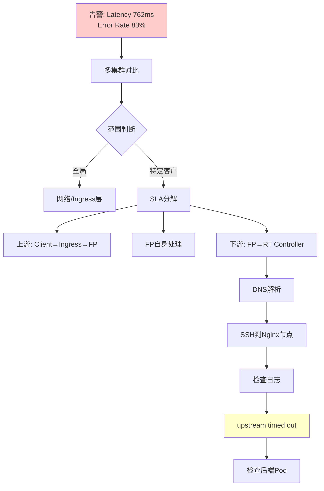

# Grafana E2E Latency 面板架构分析

## guide book

`Cluster aws-useast1-prod-b has encountered some issues, detector rule: latency-p999-500ms, issued services: fp, reason: Latency: 1187ms, failed rate: 84.62%`

1. check infra's status
   1. qps - high
   2. pod - cpu/mem
   3. sla 
      1. sla - success rate
      2. qps 
      3. latency - 完整的link process / ingress / apisix / upstream
2. yugabyte status
   1. cpu/mem
   2. speed / latency
3. @oncall-fp could you help check this one? yugabyte look like fine.

## related slack message
```
https://datavisor.slack.com/archives/CJT8ZPRJL/p1764047362404669

https://datavisor.slack.com/archives/CJT8ZPRJL/p1763353492281109
```
## related dashboard

### SLA: Ingress / Upstream Latency 指标对照表（修正版）

| Panel 名称（当前） | 建议标准名称 | 实际量到的含义（严格） | 链路位置（精确） | 常见误解点 | 实际 Query |
|-------------------|------------|---------------------|----------------|----------|-----------|
| Response Percentiles from Ingress for $client from logql | `ingress_request_time_p95` | Ingress 视角的一次完整代理请求耗时：从 ingress 收到请求开始，到 ingress 完成响应返回为止（墙钟时间） | Ingress → Upstream → Ingress（整体） | ❌ 不是端到端用户体验<br>❌ 不包含 client→ingress 网络 | `quantile_over_time(0.95, {namespace="ingress-nginx", client="$client", request_url=~".*(clientEvent...` |
| Upstream latency graph (Feature platform) | `ingress_upstream_latency_p95` | Ingress 成功将请求转发给 upstream 后，到 upstream 返回响应为止的耗时（不含 ingress 内部等待） | Ingress ↔ Upstream | ❌ 不代表业务"端到端"<br>❌ ingress 排队不会反映在这里 | `quantile_over_time(0.95, {client="$client", pod=~".*", stream=~"stdout...` |
| Waiting Latency between Ingress and Upstream | `ingress_internal_waiting_latency_p95` | 请求已经到达 ingress，但尚未（或未完全）在 upstream 中执行时，在 ingress 内部消耗的时间（排队 / proxy / 调度 / buffer） | Ingress 内部 | ⚠️ 不一定是"network issue"<br>⚠️ 更多反映 ingress 自身压力 | `quantile_over_time(0.95, {client="$client", pod=~".*", stream=~"stdout...` |

#### 关键要点

##### 1️⃣ 三个指标的数学关系

```
ingress_request_time
≈ ingress_upstream_latency
+ ingress_internal_waiting_latency
```

**注意：** 这是 ingress 视角的模型。详细说明请参考 [Waiting Latency 面板详解](#4️⃣-waiting-latency-between-ingress-and-upstream)。

##### 2️⃣ Waiting Latency 的快速理解

**计算公式**: `waiting_latency = request_time - upstream_response_time`

**实际含义**: ingress 内部等待/排队/proxy/调度/限流等开销

**⚠️ 常见误解**: 不一定是"network issue"，更多反映 ingress 自身压力

**详细说明**: 请参考 [Waiting Latency 面板详解](#4️⃣-waiting-latency-between-ingress-and-upstream) 章节。

##### 3️⃣ 分位数选择建议

**Debug 阶段（P95）：**

- **request_time P95** → 检测是否存在明显 tail
- **upstream_latency P95** → 检测后端是否慢
- **waiting_latency P95** → 检测 ingress 是否有排队

**SLO / 日常监控建议：**

- **request_time**：P50 + P95
- **upstream_latency**：P50 / P75
- **waiting_latency**：P50（避免 tail 误导）

### nginx request_time (绝对时间)
[ingress nginx access log](https://grafana-mgt.dv-api.com/explore?left=%7B%22datasource%22:%22Loki%22,%22queries%22:%5B%7B%22datasource%22:%7B%22type%22:%22loki%22,%22uid%22:%22M2q8i3Q7z%22%7D,%22expr%22:%22%7Bcluster%3D%5C%22aws-uswest2-prod-a%5C%22,namespace%3D%5C%22ingress-nginx%5C%22,pod%3D~%5C%22.*%5C%22,stream%3D~%5C%22stdout%7Cstderr%5C%22,container%3D%5C%22controller%5C%22%7D%5Cn%7C~%20%5C%22%2Fsofi%2Fupdate%20%5C%22%5Cn%7C%20pattern%20%5C%22%3C_%3E%20%3C_%3E%20%3C_%3E%20%5B%3C_%3E%5D%20%5C%5C%5C%22%3C_%3E%20%3C_%3E%20%3C_%3E%5C%5C%5C%22%20%3C_%3E%20%3C_%3E%20%3C_%3E%20%3C_%3E%20%3C_%3E%20%3C_%3E%20%3C_%3E%20%3C_%3E%20%3C_%3E%20%3C_%3E%20%3Crequest_time%3E%20%3C_%3E%20%3C_%3E%5C%22%5Cn%7C~%20%5C%22%20%5B0-9%5D%2B%20(0%5C%5C%5C%5C.00%5B5-9%5D%7C0%5C%5C%5C%5C.0%5B1-9%5D%5B0-9%5D*%7C0%5C%5C%5C%5C.%5B1-9%5D%5B0-9%5D*)%20200%20%5C%22%5Cn%22,%22refId%22:%22A%22%7D%5D,%22range%22:%7B%22from%22:%22now-2d%22,%22to%22:%22now%22%7D%7D&orgId=1)

第 13 位的 0.001
👉 request_time（client → ingress → response 完整耗时）

第 18 位的 0.001 / 0.002
👉 upstream_response_time（ingress → upstream → ingress 这一跳的耗时）

request_time	upstream_response_time	含义
0.001	0.001	后端极快，ingress 几乎无额外开销
0.002	0.001	ingress + client 侧多了 ~1ms
0.010	0.002	后端快，但 ingress/client 有瓶颈
0.200	0.180	明显是后端慢
0.200	0.010	ingress / network / queue 问题

```
client
  ↓
ingress-nginx（接收请求、解析、rewrite、转发）
  ↓
upstream pod（真正的业务服务）
  ↓
ingress-nginx（收到 upstream 响应、写日志）
  ↓
client
```
ingress nginx access log format:
```
192.168.13.192 - - [1764334116.638] "POST /sofi/update HTTP/1.1" 200 5 "-" "ReactorNetty/1.2.10" 5667 0.001 [prod-fp-8080] [] 192.168.252.7:8080 5 0.001 200 96f3efd036ebe...

 1  192.168.13.192
 2  -
 3  -
 4  [1764334116.638]
 5  "POST
 6  /sofi/update
 7  HTTP/1.1"
 8  200
 9  5
10  "-"
11  "ReactorNetty/1.2.10"
12  5667
13  0.001   ← 你之前 pattern 抓的字段（不对）
14  [prod-fp-8080]
15  []
16  192.168.252.7:8080
17  5
18  0.001   ← 你真正想抓的 upstream_response_time
19  200
20  trace_id

<_>                   # 1 client_ip
<_>                   # 2 -
<_>                   # 3 -
[<_>]                 # 4 timestamp
"<_>                  # 5 method
<_>                   # 6 path
<_>"                  # 7 protocol
<_>                   # 8 status
<_>                   # 9 body_bytes_sent
<_>                   # 10 "-"
<_>                   # 11 ua
<_>                   # 12 request_length
<_>                   # 13 rtime_client (你不需要)
<_>                   # 14 [proxy]
<_>                   # 15 []
<_>                   # 16 upstream_addr
<_>                   # 17 upstream_status
<request_time>        # 18  👈 你真正想抓的 upstream_response_time
<_>                   # 19 repeated status
<_>                   # 20 trace id
```
`> 300ms (0.3s)`
```
{cluster="aws-uswest2-prod-a",namespace="ingress-nginx",pod=~".*",stream=~"stdout|stderr",container="controller"}
|~ "/sofi/update "
| pattern "<_> <_> <_> [<_>] \"<_> <_> <_>\" <_> <_> <_> <_> <_> <_> <_> <_> <_> <_> <request_time> <_> <_>"
|~ " [0-9]+ (0\\.[3-9][0-9]*|[1-9]\\.[0-9]+) 200 "

```

<!-- > 0.1s (100ms)
```
{cluster="aws-uswest2-prod-a", namespace="ingress-nginx", container="controller"}
|~ "/sofi/update"
| pattern `<_> <_> <_> [<_>] "<_> <_> <_>" <_> <_> <_> <_> <_> [<_>] [] <_> <_> <upstream_latency> <_> <_>`
|~ " 0\\.(1[0-9]{2,}|[2-9][0-9]{2,})"

``` -->

`> 4ms (0.004s)`
```
{cluster="aws-uswest2-prod-a",namespace="ingress-nginx",pod=~".*",stream=~"stdout|stderr",container="controller"}
|~ "/sofi/update "
| pattern "<_> <_> <_> [<_>] \"<_> <_> <_>\" <_> <_> <_> <_> <_> <_> <_> <_> <_> <_> <request_time> <_> <_>"
|~ " [0-9]+ (0\\.00[5-9]|0\\.0[1-9][0-9]*|0\\.[1-9][0-9]*) 200 "

```

#### latency 

alert:
```
```
process:
```
@PI-Sender sent Opsgenie alerts to on-call teams about a high response time issue for the /sofi/update endpoint, which @Caiwei Li and @Yang Zhou investigated. They found no issues in the recent access logs, so @Jianglin Guo and @Rui Shao looked into the ingress controller and potential latency between Nginx and the backend pod.

Less detail
@PI-Sender sent Opsgenie alerts about a high response time issue for the /sofi/update endpoint [1], [2]
@Yang Zhou did not find any update API response time > 500ms in recent 30 mins in access log [3]
@Jianglin Guo suggested the latency might be between Nginx and the backend pod [4]
@Rui Shao was asked to check the ingress controller log [5]
@Rui Shao shared a URL for the ingress controller log [6]
```
1. client 到 apisix 的问题？前端公网的网络抖动
  - 这个先不管
2. apisix 的问题？
  
3. ingress nginx 的问题？
  - ingress nginx 本身 `rtime_client`
  - fp 本身 `upstream_response_time`
4. fp 的问题？
  - 后端 db 的问题？
    - TODO charts 看一下 fp 后端依赖了哪些？


#### 502 erorr code: 
```
Alertmanager :robot_face: reported a high-priority alert about a K8s cluster in the aws-uswest2-prod-b environment returning HTTP 502 errors for the sofi client on the /update request URL, with the upstream prod-fp-8080 service as the source. @Caiwei Li, @Rui Shao, @Jianglin Guo, and @Kelly He investigated the issue, finding that the 502 errors were occurring daily but not visible in the FP logs as they were being returned directly by Tomcat.

Less detail
@Caiwei Li noted that there were a few 502 errors [1]
@Jianglin Guo confirmed the 502 errors were coming from the FP service [2]
@Caiwei Li questioned if the update API was still calling fp-async instead of the FP service as expected [3]
@Jianglin Guo indicated the 502 errors seemed to be a recurring issue [4]
@Jianglin Guo suggested checking the ingress logs to investigate the 502 errors [5]
```
- metrics: sla dashboard 
- nginx log
  - why fp log not show? The Fp log will not find the 502 status log because it is directly returned by tomcat level 

前面的 200 是 ingress 返回给 client 的最终状态码
后面的 200 是 ingress 从 upstream 收到的状态码

```
{cluster="aws-uswest2-prod-b",namespace="ingress-nginx",pod=~".*",stream=~"stdout|stderr",container="controller"} |~ "1.1\" 502"
```

### apisix log
https://grafana-mgt.dv-api.com/d/0lpCu9kHk/apisix-logging?orgId=1&from=now-1h&to=now&var-cluster=aws-uswest2-prod&var-client=sofi&var-search=

```
字段	示例	含义
client_ip	52.10.42.230	真实来访 IP
ident	-	HTTP auth 用户
user	-	HTTP auth 用户
timestamp	[28/Nov/2025...]	日志时间
host	gateway-uswest2-prod.dv-api.com	请求域名
method	POST	HTTP 方法
uri	/sofi/update	路由路径
status_code	200	最终返回给 client 的 code
body_bytes_sent	5	body 大小
request_time	0.002	APISIX 总耗时（包含 upstream）
referer	"-"	HTTP Referer
user_agent	ReactorNetty	客户端 UA
upstream_addr	172.31.35.120:443	APISIX 代理目标
upstream_status	200	upstream 返回的 code
upstream_response_time	0.003	upstream 的处理时间
full_url	https://sofi-apisix
...	原始 URL

字段	值	含义
request_time	0.002	APISIX 整体处理时间（从 receive 到 send）
upstream_response_time	0.003	upstream 服务处理时间
```
`> 50ms (0.05)`
```
{external_cluster="external_apisix", cluster=~"aws-uswest2-prod"}
| pattern "<client_ip> <ident> <user> [<time_local>] <host> \"<method> <uri> <protocol>\" <status> <body_bytes_sent> <request_time> \"<referer>\" \"<user_agent>\" <upstream_addr> <upstream_status> <upstream_time> \"<full_url>\""
|~ " [0-9]+ (0\\.[0-9]{2,}|[1-9]\\.[0-9]+) \""

```
### sla
https://grafana-mgt.dv-api.com/d/p1KqfRAMk/sla-batch-and-realtime?orgId=1&var-PromDs=default&var-client=affirm&var-sandbox_client=airasia&var-pipeline=prod.realtime.rtserver.awsuseast1&var-Batch_Pipeline=prod.awsuseast1
### multiple cluster
https://grafana-mgt.dv-api.com/d/X2qhqpjSk/multi-cluster-traffic-distribution?orgId=1

### loki fp service log
**FP 服务日志查询**（排查业务逻辑问题）:
```
https://grafana-mgt.dv-api.com/explore?left=%7B%22datasource%22:%22Loki%22,%22queries%22:%5B%7B%22datasource%22:%7B%22type%22:%22loki%22,%22uid%22:%22M2q8i3Q7z%22%7D,%22expr%22:%22%7Bcluster%3D%5C%22aws-useast1-prod-a%5C%22,namespace%3D%5C%22prod%5C%22,pod%3D~%5C%22fp-deployment-.*%5C%22,stream%3D~%5C%22stdout%7Cstderr%5C%22,container%3D%5C%22fp%5C%22%7D%22%7D%5D%7D&orgId=1
```

### dashboard面板速查

**主要Dashboard链接**:
- **E2E Dashboard**: [SLA Batch and Realtime](https://grafana-mgt.dv-api.com/d/p1KqfRAMk/sla-batch-and-realtime) (21个面板)
- **E2E for APISIX Dashboard**: [Multi-Cluster Traffic Distribution](https://grafana-mgt.dv-api.com/d/X2qhqpjSk/multi-cluster-traffic-distribution) (11个面板)

**详细面板列表**: 请参考 [🛠️ 排查工具速查表 - Grafana Dashboards](#1-grafana-dashboards) 章节。

impova: 
`curl -I https://admin-sandbox.datavisor.com -H "User-Agent: Mozilla/5.0" -v`
## 🏗️ 完整请求链路架构（包含 APISIX）

### 架构 A: 经过 APISIX 的请求路径



### 架构 B: 直连 Ingress 的请求路径（不经过 APISIX）



---

## 🔀 APISIX 在架构中的位置

### APISIX 是什么？
**APISIX** 是一个高性能的 API Gateway（API 网关），位于请求链路的**最前端**。

### 完整的架构层级
```
Client (客户端)
   ↓
API Gateway Layer (API 网关层)
   ├─ APISIX (API 路由、认证、限流)
   ├─ API Gateway (版本管理)
   ├─ ALB (应用负载均衡)
   └─ Imperva (WAF 安全防护)
   ↓
Ingress Controller Layer (Ingress 控制器层)
   └─ Nginx Ingress (K8s 流量入口)
   ↓
Service Layer (服务层)
   └─ Kubernetes Service (服务发现、负载均衡)
   ↓
Pod Layer (应用层)
   ├─ FP Pod (单租户特征平台)
   └─ FP-GROUP Pod (多租户批处理)
```

### APISIX 的主要功能
1. **API 路由**: 根据 URL、Header 等规则路由请求
2. **认证授权**: API Key、JWT、OAuth2 等认证
3. **限流熔断**: Rate Limiting、Circuit Breaker
4. **协议转换**: HTTP/HTTPS、gRPC、WebSocket
5. **可观测性**: 日志、指标、追踪

### 为什么有两个 E2E Dashboard？

#### 📊 E2E Dashboard (21 个面板)
- **监控对象**: Ingress Controller → FP Pod
- **起始点**: 从 **Nginx Ingress** 接收到请求开始
- **适用场景**: 
  - 直连 Ingress 的请求（不经过 APISIX）
  - 监控 Ingress 和 FP Pod 的性能
  - 大部分客户端使用这个路径

#### 🚀 E2E for APISIX Dashboard (11 个面板)
- **监控对象**: APISIX → Ingress Controller → FP Pod
- **起始点**: 从 **APISIX** 接收到请求开始
- **适用场景**:
  - 经过 APISIX 的请求（部分高级客户）
  - 监控完整的 API Gateway 链路
  - 需要 APISIX 提供的额外功能（认证、限流等）

### 延迟层级分解（包含 APISIX）

```
┌─────────────────────────────────────────────────────────────────┐
│        APISIX Total Response Time (最完整的延迟)                │
│  = APISIX Processing + Ingress Request Time + Network Overhead  │
├─────────────────────────────────────────────────────────────────┤
│                                                                  │
│  ┌──────────────┐  ┌──────────────────────────────────────────┐│
│  │   APISIX     │  │    Ingress Total Response Time           ││
│  │  Processing  │  │  = Waiting Latency + Upstream Response   ││
│  │              │  │                                           ││
│  │ • API 路由   │  │  ┌─────────────┐  ┌──────────────────┐  ││
│  │ • 认证鉴权   │  │  │  Waiting    │  │    Upstream      │  ││
│  │ • 限流检查   │  │  │  Latency    │  │    Response      │  ││
│  │ • 日志记录   │  │  │             │  │                  │  ││
│  └──────────────┘  │  │ • 网络延迟  │  │  • FP 处理时间   │  ││
│                    │  │ • Ingress   │  │  • 特征计算      │  ││
│                    │  │   处理时间  │  │  • 数据库查询    │  ││
│                    │  └─────────────┘  └──────────────────┘  ││
│                    └──────────────────────────────────────────┘│
└─────────────────────────────────────────────────────────────────┘
```

### APISIX 对延迟的影响

#### ✅ 正常情况
- **APISIX 处理时间**: 5-20ms（P95）
- **额外延迟**: 相比直连 Ingress 增加 10-30ms
- **优势**: 提供了认证、限流、路由等企业级功能

#### ⚠️ APISIX 可能导致的延迟问题

1. **认证插件延迟**
   - JWT 验证: +5-10ms
   - 外部认证服务: +50-200ms
   - OAuth2: +100-500ms

2. **限流插件延迟**
   - Redis 限流: +2-5ms
   - 本地限流: +1ms

3. **日志插件延迟**
   - 同步日志: +10-50ms
   - 异步日志: +1-2ms

4. **APISIX 性能瓶颈**
   - CPU 不足: +100-1000ms
   - 内存不足: +100-2000ms
   - 网络拥塞: +50-500ms

---

## 📊 四个 Latency 面板详解（E2E Dashboard）

### 1️⃣ Response Percentiles from Ingress (近似值)
**测量对象**: 📈 **Total Response Time (request_time)**



**数据源**: Loki recording rules  
**指标**: `record:loki_kubernetes_monitoring_requests_percentage_time_ingress_nginx_P50/P75/P90/P95/P99/P99.9/P100`

**含义**: 
- 从 Ingress 接收请求到返回响应的**完整时间**
- 包含：网络延迟 + Ingress 处理 + Upstream 处理
- 这是**客户端感知到的总延迟**

---

### 2️⃣ Response Percentiles from Ingress (LogQL)
**测量对象**: 📈 **Total Response Time (request_time)** - 实时计算版本



**数据源**: LogQL 查询（实时从日志计算）  
**查询**: 
```logql
quantile_over_time(0.50,
  {namespace="ingress-nginx", client="$client"} 
  | pattern "... <request_time:float> ..."
  | line_format "{{.request_time}}"
[5m])
```

**含义**: 
- 与面板 1 相同，都是测量 **request_time**
- 区别：这个是从日志**实时计算**，面板 1 使用**预聚合的 recording rule**
- 更准确，但查询性能较低

---

### 3️⃣ Upstream latency graph (Feature Platform)
**测量对象**: 🎯 **Upstream Response Time (upstream_response_time)**



**数据源**: LogQL 从 Ingress 日志提取  
**查询**: 
```logql
quantile_over_time(0.50,
  {namespace="ingress-nginx", client="$client"} 
  | pattern "... <upstream_response_time> ..."
  | upstream_response_time != "-"
  | line_format "{{.upstream_response_time}}"
[5m])
```

**含义**: 
- **只测量 FP Pod 的处理时间**
- 从 FP Pod 收到请求到返回响应的时间
- **不包含网络延迟和 Ingress 处理时间**
- 这是**业务逻辑的实际处理时间**

---

### 4️⃣ Waiting Latency between Ingress and Upstream
**测量对象**: ⏳ **Waiting Time = request_time - upstream_response_time**



**计算公式**: 
```
Waiting Latency = Total Response Time - Upstream Response Time
                = request_time - upstream_response_time
                
其中：
  • request_time (external_latency): Ingress 视角的整体代理耗时
  • upstream_response_time (internal_latency): Ingress ↔ Upstream 耗时
```

**重要说明**: client → ingress 网络延迟不包含在这两个量中。

**实际含义**: 
> ingress 内部等待 / 排队 / proxy / 调度 / 限流 等开销

**包含内容**: 
- 客户端到 Ingress 的网络延迟（往返）
- Ingress 路由解析、负载均衡时间
- Ingress 到 FP Pod 的内部网络延迟（往返）
- Ingress 内部排队、proxy、调度、buffer 等开销

**⚠️ 常见误解**:
- ❌ 不一定是"network issue"
- ⚠️ 更多反映 ingress 自身压力

**高 Waiting Latency 说明**: 网络或 Ingress 有问题，需要排查：
- Ingress Controller 性能（CPU/Memory）
- 网络质量（客户端到 DataVisor 的网络路径）
- K8s 内部网络
- Ingress 日志中的连接超时

---

## 🚀 E2E for APISIX 的 Latency 面板

### 📊 Response Percentiles from Apisix (1 个面板)

**测量对象**: 📈 **APISIX Total Response Time**



**数据源**: APISIX Prometheus Metrics  
**指标**: `apisix_monitoring_requests_percentage_time_apisix_bucket`  
**计算方法**: `histogram_quantile(0.95, rate(apisix_monitoring_requests_percentage_time_apisix_bucket[5m]))`

**含义**: 
- 从 APISIX 接收请求到返回响应的**完整时间**
- 包含：APISIX 处理 + Ingress 处理 + FP Pod 处理 + 所有网络延迟
- 这是经过 APISIX 的客户端感知到的**总延迟**

### 🔄 APISIX vs Ingress 延迟对比

| 监控视角 | E2E (Ingress) | E2E for APISIX | 差异 |
|---------|---------------|----------------|------|
| **起始点** | Ingress Controller | APISIX Gateway | APISIX 更前端 |
| **监控范围** | Ingress → FP Pod | APISIX → Ingress → FP Pod | APISIX 路径更长 |
| **总延迟** | request_time | APISIX total time | APISIX 多 10-30ms |
| **适用场景** | 直连 Ingress | 经过 API Gateway | 不同客户路径 |

### 🔍 如何计算 APISIX 的处理时间？

**计算公式**: 详细说明请参考 [📐 核心延迟分解公式 - 公式 3](#公式-3-apisix-processing-time-的计算) 章节。

**计算示例**:
```
  APISIX Total Time:   150ms (E2E for APISIX 面板)
  Ingress Request Time: 120ms (E2E 面板 1)
  ───────────────────────────
  APISIX Processing:     30ms (差值)
```

**优化建议**: 如果 APISIX Processing > 50ms，可能需要优化：
- 认证插件配置
- 限流策略
- 日志记录方式
- APISIX 实例资源

---

## 📐 核心延迟分解公式

### 公式 1: 不经过 APISIX 的请求

```
Total Response Time (request_time) = Waiting Latency + Upstream Response Time
     (E2E 面板 1/2)                      (E2E 面板 4)        (E2E 面板 3)
```

**可视化分解**:
```
┌─────────────────────────────────────────────────────────┐
│         Total Response Time (request_time)              │
│  = Waiting Latency + Upstream Response Time             │
├─────────────────────────────────────────────────────────┤
│                                                          │
│  ┌────────────────────────┐  ┌────────────────────────┐│
│  │   Waiting Latency      │  │  Upstream Response     ││
│  │                        │  │       Time             ││
│  │ • 客户端网络延迟(往返) │  │  • FP Pod 处理时间     ││
│  │ • Ingress 处理时间     │  │  • 特征计算            ││
│  │ • 内部网络延迟(往返)   │  │  • 数据库查询          ││
│  │ • 负载均衡             │  │  • 业务逻辑            ││
│  └────────────────────────┘  └────────────────────────┘│
└─────────────────────────────────────────────────────────┘
```

### 公式 2: 经过 APISIX 的请求

```
APISIX Total Time = APISIX Processing + Ingress Request Time
(E2E for APISIX)    (差值计算)           (E2E 面板 1/2)

完整展开:
APISIX Total Time = APISIX Processing + Waiting Latency + Upstream Response Time
(E2E for APISIX)    (差值计算)            (E2E 面板 4)        (E2E 面板 3)
```

### 公式 3: APISIX Processing Time 的计算

```
APISIX Processing Time = APISIX Total Time - Ingress Request Time
                       = (E2E for APISIX) - (E2E 面板 1/2)

APISIX Processing 包含:
  • API 路由匹配时间
  • 认证授权验证时间
  • 限流规则检查时间
  • 插件执行时间
  • 日志记录时间
  • APISIX 到 Ingress 的网络传输时间
```

---

## 🎯 什么情况看什么延迟？

### 🆕 场景 0: 先确定请求路径（是否经过 APISIX）

**步骤 1**: 确认客户端使用的入口
```
经过 APISIX 的客户端：
  → 查看 "E2E for APISIX" Dashboard
  → 使用 APISIX Total Response Time

直连 Ingress 的客户端：
  → 查看 "E2E" Dashboard
  → 使用 Ingress Total Response Time
```

**步骤 2**: 如何判断请求是否经过 APISIX？
- 查看客户端配置的 API 端点
- 检查 DNS 解析结果
- 查看 APISIX QPS 面板是否有该客户端的流量
- 检查请求 Header 中是否有 APISIX 特定标识

**步骤 3**: 如果两个 Dashboard 都有数据
```
对比 APISIX Total Time vs Ingress Request Time:

APISIX Total:  200ms
Ingress Total: 180ms
差值:           20ms  ← APISIX 处理时间

如果差值 > 50ms，需要优化 APISIX 配置
```

---

### 场景 1: 客户端抱怨响应慢（经过 APISIX）

**步骤 1**: 先看 **E2E for APISIX** Dashboard 的 Response Percentiles
- 确认 APISIX Total Time 是否真的高

**步骤 2**: 对比 **E2E for APISIX** vs **E2E Dashboard**
```
APISIX Total Time:  500ms  (E2E for APISIX)
Ingress Request Time: 450ms  (E2E 面板 1)
差值:                 50ms  ← APISIX 处理时间

如果差值大（>50ms）:
  → 🔧 APISIX 处理慢
  → 排查: APISIX 插件、认证、限流、日志

如果差值小（<30ms）:
  → 继续用 E2E Dashboard 排查 Ingress/FP Pod
```

**步骤 3**: 使用 E2E Dashboard 细分问题
- 查看 **Upstream latency** (面板 3)
- 查看 **Waiting Latency** (面板 4)
- 按之前的逻辑判断是业务慢还是网络慢

---

### 场景 1a: 客户端抱怨响应慢（不经过 APISIX）
**先看**: 📊 **Response Percentiles from Ingress** (面板 1 或 2)
- 这是客户端感知到的总延迟
- 查看 P95、P99 是否超标
- **目标**: 确认问题是否真实存在

---

### 场景 2: 确定是网络问题还是业务逻辑慢
**对比**: 🆚 **Upstream latency** (面板 3) vs **Total Response Time** (面板 1)

#### 情况 A: Upstream latency 高，Total Response Time 也高
```
Total Response Time:  1500ms  ❌
Upstream Response:    1400ms  ❌
Waiting Latency:      100ms   ✅
```
**结论**: 🎯 **业务逻辑慢**（FP Pod 处理慢）
**排查方向**:
- 检查 FP Pod CPU/Memory 使用率
- 查看数据库查询性能
- 分析特征计算算法优化
- 检查是否有外部依赖调用慢

---

#### 情况 B: Upstream latency 正常，但 Total Response Time 高
```
Total Response Time:  1500ms  ❌
Upstream Response:    200ms   ✅
Waiting Latency:      1300ms  ❌
```
**结论**: 🌐 **网络或 Ingress 问题**
**排查方向**:
- 查看 **Waiting Latency** 面板 (面板 4)
- 检查客户端到 Ingress 的网络质量
- 检查 Ingress Controller 性能（CPU/Memory）
- 检查 Ingress 到 FP Pod 的内部网络
- 查看 Ingress 日志是否有连接超时

---

### 场景 3: 间歇性高延迟
**先看**: 📊 **Response Percentiles from Ingress (LogQL)** (面板 2)
- 实时计算，更准确
- 查看 **P99** 和 **P99.9** 的差距
- 如果 P99.9 >> P99，说明有少量请求极慢

**然后看**: ⏳ **Waiting Latency** (面板 4)
- 如果 Waiting Latency 的 P99.9 特别高，可能是：
  - 网络抖动
  - Ingress 负载均衡问题
  - 某些 FP Pod 健康检查失败导致连接重试

---

### 场景 4: 特定客户端延迟高
**步骤 1**: 查看 **Response Percentiles from Ingress** (面板 1)
- 使用 `$client` 变量筛选特定客户端
- 对比该客户端与其他客户端的延迟

**步骤 2**: 查看 **Upstream latency** (面板 3)
- 确定是否该客户端的请求更复杂（业务逻辑慢）

**步骤 3**: 查看 **Waiting Latency** (面板 4)
- 如果 Waiting Latency 特别高，可能是：
  - 该客户端网络质量差（地理位置远）
  - 该客户端被路由到性能较差的 Ingress/FP Pod

---

### 场景 5: 排查网络问题
**重点看**: ⏳ **Waiting Latency between Ingress and Upstream** (面板 4)

**正常情况**:
```
Waiting Latency P50:   50ms  ✅
Waiting Latency P95:  100ms  ✅
Waiting Latency P99:  150ms  ✅
```

**网络问题**:
```
Waiting Latency P50:  500ms  ⚠️
Waiting Latency P95: 2000ms  ❌
Waiting Latency P99: 5000ms  ❌
```

**排查方向**:
- 客户端和 DataVisor 之间的网络路径
- 跨区域/跨国网络问题
- Ingress Controller 到 FP Pod 的 K8s 网络性能
- 检查是否有网络策略（NetworkPolicy）限制

---

### 场景 6: 优化性能
**步骤 1**: 查看 **Upstream latency** (面板 3) 的 **P95/P99**
- 如果 > 200ms，优化业务逻辑

**步骤 2**: 查看 **Waiting Latency** (面板 4) 的 **P95/P99**
- 如果 > 100ms，优化网络/Ingress

**步骤 3**: 查看 **Total Response Time** (面板 1) 的改善
- 验证优化效果

---

## 📈 监控指标参考值（包含 APISIX）

### ✅ 正常情况（参考值）
| 指标 | P50 | P95 | P99 | P99.9 |
|------|-----|-----|-----|-------|
| **APISIX Total Time** | < 120ms | < 330ms | < 550ms | < 1050ms |
| **APISIX Processing** | < 20ms | < 30ms | < 50ms | < 100ms |
| **Total Response Time** | < 100ms | < 300ms | < 500ms | < 1000ms |
| **Upstream Response** | < 50ms | < 150ms | < 300ms | < 500ms |
| **Waiting Latency** | < 50ms | < 100ms | < 200ms | < 500ms |

### ⚠️ 需要关注（黄色警告）
| 指标 | P50 | P95 | P99 | P99.9 |
|------|-----|-----|-----|-------|
| **APISIX Total Time** | 120-220ms | 330-550ms | 550-1050ms | 1050-2050ms |
| **APISIX Processing** | 20-50ms | 30-100ms | 50-200ms | 100-500ms |
| **Total Response Time** | 100-200ms | 300-500ms | 500-1000ms | 1000-2000ms |
| **Upstream Response** | 50-100ms | 150-300ms | 300-500ms | 500-1000ms |
| **Waiting Latency** | 50-100ms | 100-200ms | 200-500ms | 500-1000ms |

### ❌ 严重问题（红色告警）
| 指标 | P50 | P95 | P99 | P99.9 |
|------|-----|-----|-----|-------|
| **APISIX Total Time** | > 220ms | > 550ms | > 1050ms | > 2050ms |
| **APISIX Processing** | > 50ms | > 100ms | > 200ms | > 500ms |
| **Total Response Time** | > 200ms | > 500ms | > 1000ms | > 2000ms |
| **Upstream Response** | > 100ms | > 300ms | > 500ms | > 1000ms |
| **Waiting Latency** | > 100ms | > 200ms | > 500ms | > 1000ms |

### 📊 APISIX Processing Time 的合理范围

| APISIX 配置 | 预期延迟 (P95) |
|-------------|----------------|
| **仅路由** | 5-10ms |
| **+ 本地认证** | 10-20ms |
| **+ Redis 限流** | 15-25ms |
| **+ 外部认证** | 50-200ms |
| **+ 同步日志** | 20-50ms |
| **+ 多个插件** | 30-100ms |

**注意**: 如果 APISIX Processing > 50ms (P95)，需要检查：
- 是否启用了耗时的外部认证
- 日志插件是否使用同步模式
- APISIX 实例是否资源不足
- 是否有过多的插件配置

---

## 🛠️ 快速诊断决策树（包含 APISIX）



---

## 🔬 高级调试技巧

### 技巧 1: 计算网络延迟占比
```
Network Percentage = (Waiting Latency / Total Response Time) × 100%

如果 > 50%: 主要是网络问题
如果 < 20%: 主要是业务逻辑慢
```

### 技巧 2: 对比不同时间范围的延迟
- P50 正常但 P99 高 → 间歇性问题（可能是某些请求或某些 Pod）
- P50/P95/P99 都高 → 系统性问题（整体性能下降）

### 技巧 3: 关联 QPS 和 Latency
- 如果 QPS 上升时 Latency 也上升 → 系统负载问题
- 如果 QPS 正常但 Latency 高 → 其他原因（网络/数据库/算法）

### 技巧 4: 使用 Non-200 QPS 面板
- 如果 5xx 错误多 → FP Pod 问题
- 如果 4xx 错误多 → 客户端请求问题
- 如果 499 错误多 → 客户端超时断开（可能是延迟太高导致）

---

## 📝 实战案例分析

### 案例 1: Nginx Upstream Timeout



**关键发现**:
- FP日志: `ResourceAccessException` → RT Controller无响应
- DNS: `rt-internal-useast1.dv-api.com` → `172.30.106.23`
- Nginx error.log: `upstream timed out (110)` → 后端`172.30.4.159:25104`超时
- 根因: RT Controller响应超时，Nginx等待后端超时

**Nginx日志分析**: 详细说明请参考 [Nginx request_time 说明](#nginx-request_time-绝对时间) 章节。

**关键字段**:
- 字段13: `request_time` - 总延迟
- 字段18: `upstream_response_time` - 后端延迟

**对比分析示例**:
| request_time | upstream_time | 问题定位 |
|-------------|---------------|----------|
| 0.200 | 0.180 | 后端慢 |
| 0.200 | 0.010 | Nginx/网络慢 |

---

### 案例 2: 标准Debug流程

**Step 1: 告警定位**
- 确认告警来源（SLA/Prometheus规则）
- 判断是ingress latency还是downstream latency

**Step 2: FP服务端排查**
```bash
# 搜索异常
grep "ResourceAccessException\|NoHttpResponseException" fp.log
# 结合trace ID定位客户/接口
```

**Step 3: SLA Dashboard分解**
- 对比FP处理时间 vs 下游调用时间
- 多集群同客户指标对比

**Step 4: RT Controller/Nginx排查**
```bash
# DNS解析
nslookup rt-internal-useast1.dv-api.com
# 连接测试
curl -vk https://rt-internal-useast1.dv-api.com/health
# SSH到Nginx节点
ssh -i /path/to/pem ubuntu@172.30.106.23
# 配置检查
nginx -t
# 错误日志
grep -i "timed\|upstream" /mnt/log/nginx/error.log | tail -100
# 访问日志（upstream_response_time）
tail -f /mnt/log/nginx/access.log | awk '{print $18}'
```

**Step 5: 后端应用健康**
```bash
kubectl get pod -n <ns>
kubectl logs <pod>
# 检查OOM/报错/负载
```

**Step 6: 链路对比**
- 画出FP→RT Controller→Upstream链路
- 标注每层QPS/Latency找瓶颈

---

## 📚 总结

### E2E Dashboard (不经过 APISIX)

| 面板 | 测量对象 | 主要用途 | 关键场景 |
|------|----------|----------|----------|
| **1. Response Percentiles (Recording Rule)** | Total Response Time | 快速查看总延迟 | 日常监控 |
| **2. Response Percentiles (LogQL)** | Total Response Time | 实时精确延迟 | 问题排查 |
| **3. Upstream latency** | FP Pod 处理时间 | 定位业务逻辑性能 | 优化业务代码 |
| **4. Waiting Latency** | 网络+Ingress延迟 | 定位网络/Ingress问题 | 排查网络故障 |

### E2E for APISIX Dashboard (经过 APISIX)

| 面板 | 测量对象 | 主要用途 | 关键场景 |
|------|----------|----------|----------|
| **Response Percentiles from Apisix** | APISIX Total Time | 完整 API Gateway 延迟 | APISIX 客户端监控 |

### 核心公式

详细公式说明请参考 [📐 核心延迟分解公式](#-核心延迟分解公式) 章节。

---

## 🎯 最佳实践建议

### 1. 监控策略

#### 经过 APISIX 的客户端
```
优先级 1: 监控 APISIX Total Time (E2E for APISIX)
优先级 2: 对比 Ingress Total Time 计算 APISIX Processing
优先级 3: 使用 E2E Dashboard 细分 Ingress/FP Pod 问题
```

#### 直连 Ingress 的客户端
```
优先级 1: 监控 Total Response Time (E2E 面板 1/2)
优先级 2: 对比 Upstream vs Waiting Latency
优先级 3: 定位问题在业务逻辑还是网络层
```

### 2. 告警配置建议

```yaml
# APISIX 客户端告警
- alert: APISIX_High_Latency
  expr: histogram_quantile(0.95, apisix_monitoring_requests_percentage_time_apisix_bucket) > 500
  duration: 5m
  severity: warning
  
- alert: APISIX_Processing_Slow
  expr: (apisix_total_time - ingress_request_time) > 50
  duration: 5m
  severity: warning

# Ingress 客户端告警
- alert: Ingress_High_Latency
  expr: histogram_quantile(0.95, ingress_request_time_bucket) > 500
  duration: 5m
  severity: warning

# 通用告警
- alert: Upstream_Processing_Slow
  expr: histogram_quantile(0.95, upstream_response_time_bucket) > 300
  duration: 5m
  severity: warning
  
- alert: Network_Latency_High
  expr: histogram_quantile(0.95, waiting_latency_bucket) > 200
  duration: 5m
  severity: warning
```

### 3. 性能优化优先级

#### 场景 A: APISIX Processing 高 (> 50ms)
```
优先级 1: 将同步日志改为异步日志
优先级 2: 使用本地限流替代 Redis 限流
优先级 3: 优化认证插件（使用缓存）
优先级 4: 增加 APISIX 实例资源
```

#### 场景 B: Upstream Response 高 (> 300ms)
```
优先级 1: 优化数据库查询
优先级 2: 优化算法和业务逻辑
优先级 3: 增加 FP Pod 资源
优先级 4: 启用应用缓存
```

#### 场景 C: Waiting Latency 高 (> 200ms)
```
优先级 1: 检查客户端到 DataVisor 的网络路径
优先级 2: 优化 Ingress Controller 性能
优先级 3: 检查 K8s 内部网络
优先级 4: 考虑使用 CDN 或边缘节点
```

### 4. 快速排查 Checklist

```
□ 确认请求路径（是否经过 APISIX）
□ 查看对应的 E2E Dashboard
□ 记录 Total Response Time 的 P50/P95/P99
□ 如果经过 APISIX，计算 APISIX Processing Time
□ 对比 Upstream Response Time 和 Waiting Latency
□ 确定问题类型：
  - APISIX 慢: 优化 API Gateway 配置
  - Upstream 慢: 优化业务逻辑
  - Waiting 慢: 优化网络/Ingress
□ 根据问题类型执行相应的优化措施
□ 验证优化效果并持续监控
```

---

## 🛠️ 排查工具速查表

### 1. Grafana Dashboards
```
# E2E Dashboard (Ingress)
https://grafana-mgt.dv-api.com/d/p1KqfRAMk/sla-batch-and-realtime

# E2E for APISIX Dashboard
https://grafana-mgt.dv-api.com/d/X2qhqpjSk/multi-cluster-traffic-distribution

# Loki FP 服务日志
https://grafana-mgt.dv-api.com/explore?left=%7B%22datasource%22:%22Loki%22...

# Nginx Ingress 日志
{cluster="aws-uswest2-prod-a",namespace="ingress-nginx",container="controller"}
|~ "/sofi/update"

# APISIX 日志
{external_cluster="external_apisix", cluster=~"aws-uswest2-prod"}
```

### 2. Nginx 诊断
```bash
# === 状态检查 ===
systemctl status nginx
ss -tulnp | grep nginx
ps -ef | grep nginx

# === 日志分析 ===
# 错误日志
tail -f /var/log/nginx/error.log
journalctl -fu nginx

# 超时问题
grep -i "timed\|upstream" /mnt/log/nginx/error.log | tail -100

# 访问日志（延迟分析）
tail -f /mnt/log/nginx/access.log | awk '{print $18}'  # upstream_response_time
tail -f /mnt/log/nginx/access.log | awk '{print $13}'  # request_time

# === 配置管理 ===
# 测试配置
nginx -t
# 查看完整配置
nginx -T | less
# 重载配置
nginx -t && systemctl reload nginx

# === 端口占用 ===
ss -tulnp | grep ':80\|:443'
lsof -i :80

# === 常见问题 ===
# 502 Bad Gateway
tail -f /var/log/nginx/error.log | grep upstream

# 504 Gateway Timeout
# 调整配置: proxy_read_timeout, proxy_connect_timeout
```

### 3. 网络诊断
```bash
# DNS 解析
nslookup rt-internal-useast1.dv-api.com

# 连接测试
curl -vk https://rt-internal-useast1.dv-api.com/health
openssl s_client -connect rt-internal-useast1.dv-api.com:443

# Pod 网络测试
kubectl exec -it <pod> -- curl -v http://<service>:8080
```

### 4. K8s 诊断
```bash
# Pod 状态
kubectl get pod -n <namespace>
kubectl describe pod <pod> -n <namespace>

# 日志查看
kubectl logs <pod> -n <namespace> --tail=100 -f

# Service 检查
kubectl get svc -n <namespace>
kubectl get endpoints <service> -n <namespace>

# Ingress 检查
kubectl get ingress -n <namespace>
kubectl describe ingress <ingress> -n <namespace>
```

---

## 🔗 相关文档

- **系统架构文档**: `blogs/architecture-request-routing-flow.md`
- **E2E Dashboard 分析**: `grafana_e2e_summary.md`
- **Nginx 排查实战**: `blogs/monitoring-latency_troubleshooting_guide-with-nginx.md`
- **APISIX 配置文档**: (请补充链接)

---

**文档版本**: v3.1 (重构版本 - 去除重复内容，优化结构)  
**最后更新**: 2025-12-23  
**作者**: Grafana E2E Dashboard Analysis  

**重构优化**:
- ✅ **去除重复内容**: 整合了4处重复的延迟公式、2处Waiting Latency说明、2处Nginx日志格式说明
- ✅ **优化文档结构**: 统一公式到核心公式章节，简化指标对照表，合并Dashboard速查表
- ✅ **改进可读性**: 使用章节引用代替重复内容，提高文档维护性

**整合内容**:
- ✅ 完整的请求链路架构（包含 APISIX）
- ✅ E2E 和 E2E for APISIX Dashboard 对比
- ✅ 4+1 个 Latency 面板详细分析
- ✅ 核心延迟分解公式（统一版本）
- ✅ 6+ 个实战场景排查指南
- ✅ 快速诊断决策树（包含 APISIX 和 Nginx）
- ✅ 监控指标参考值
- ✅ 最佳实践和优化建议
- ✅ **2个实战案例**（Nginx Upstream Timeout + 标准Debug流程）
- ✅ **Dashboard 面板速查表**（在工具速查表中）
- ✅ **完整排查工具集**（Grafana + Nginx + 网络 + K8s）
- ✅ **Nginx 诊断命令大全**（状态/日志/配置/故障）

**已整合文档**:
- `oncall-fp-latency-issues.md` → 实战案例部分
- `monitoring-grafana_sla_ec2_summary.md` → Dashboard 速查表
- `monitoring-latency_troubleshooting_guide-with-nginx.md` → Nginx 排查部分

