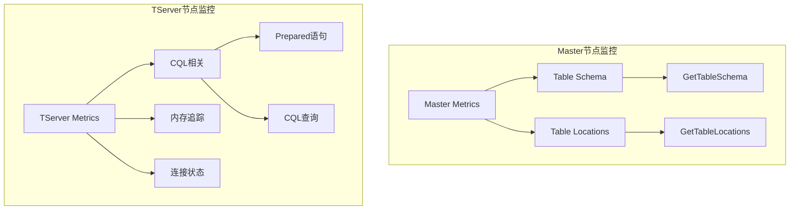
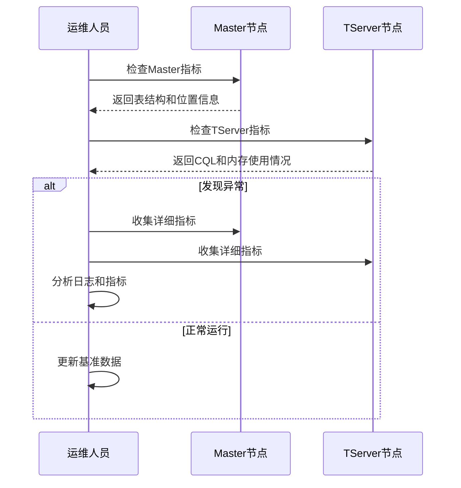

# YugabyteDB 监控和调试命令指南

## 监控指标收集流程图



## Master 节点监控命令

### 基础指标收集
```bash
# 收集所有指标
curl -s "http://<master-ip>:32230/metrics?format=pretty" > master.log

# 查看表结构和位置信息
egrep -i -A3 "GetTable(Schema|Locations)" master.log
```

### 特定指标查询
```bash
# 查询表结构和位置服务指标
curl -s "http://<master-ip>:32230/metrics?format=pretty" | \
    egrep -A2 "MasterService_(GetTableSchema|GetTableLocations)"

# 内存使用情况
curl -s "http://<master-ip>:32230/memz"
```

## TServer 节点监控命令

### CQL 相关指标
```bash
# 收集所有指标
curl -s "http://<tserver-ip>:31020/metrics?format=pretty" > tserver.log

# 查看 CQL 和预处理语句相关指标
egrep -i -A3 "cql|prepare|CQL|Prepared" tserver.log
```

### 内存和连接监控
```bash
# 内存追踪器信息（按数值排序）
egrep -i -A3 "mem_tracker" tserver.log | sort -k2 -n > memory_tracking.log

# 连接和 CQL 相关信息
egrep -i -A3 "connection|cql" tserver.log > connection_info.log
```

## 多集群监控示例

### US-WEST 集群
```bash
# Master 节点 (10.50.216.15)
curl -s "http://10.50.216.15:32230/metrics?format=pretty" > uswest-master.log
egrep -i -A3 "GetTable(Schema|Locations)" uswest-master.log

# TServer 节点
curl -s "http://10.50.216.15:31020/metrics?format=pretty" > uswest-tserver.log
egrep -i -A3 "cql|prepare|CQL|Prepared" uswest-tserver.log
```

### Africa 集群
```bash
# Master 节点 (10.180.128.221)
curl -s "http://10.180.128.221:32290/metrics?format=pretty" > af-master.log
egrep -A3 "GetTable(Schema|Locations)" af-master.log

# TServer 节点
curl -s "http://10.180.128.221:32291/metrics?format=pretty" > af-tserver.log
egrep -i -A3 "cql|prepare|CQL|Prepared" af-tserver.log
```

## 监控端口参考

| 服务类型 | 默认端口 | 用途 |
|---------|---------|------|
| Master | 32230 | 主节点指标和管理接口 |
| TServer | 31020 | 表服务器指标 |
| TServer | 32291 | 表服务器管理接口（Africa集群） |
| Master | 32290 | 主节点管理接口（Africa集群） |

## 常用指标说明

### Master 指标
- `GetTableSchema`: 表结构查询性能
- `GetTableLocations`: 表位置信息查询性能

### TServer 指标
- `CQL_*`: CQL 查询相关指标
- `Prepared_*`: 预处理语句相关指标
- `mem_tracker`: 内存使用追踪
- `connection_*`: 连接状态指标

## 最佳实践

1. **定期监控**
   - 收集基准指标数据
   - 建立性能基线
   - 定期比对变化

2. **问题排查**
   - 先检查 Master 节点状态
   - 再查看 TServer 指标
   - 特别关注内存使用和连接状态

3. **数据保存**
   - 使用有意义的文件名保存指标
   - 按时间和集群分类存储
   - 保留历史数据用于对比

4. **自动化建议**
```bash
#!/bin/bash
# 监控脚本示例
CLUSTER_NAME=$1
MASTER_IP=$2
TSERVER_IP=$3
DATE=$(date +%Y%m%d_%H%M%S)

# 创建日志目录
mkdir -p "logs/${CLUSTER_NAME}/${DATE}"
cd "logs/${CLUSTER_NAME}/${DATE}"

# 收集 Master 指标
curl -s "http://${MASTER_IP}:32230/metrics?format=pretty" > master.log
egrep -i -A3 "GetTable(Schema|Locations)" master.log > master_tables.log

# 收集 TServer 指标
curl -s "http://${TSERVER_IP}:31020/metrics?format=pretty" > tserver.log
egrep -i -A3 "cql|prepare|CQL|Prepared" tserver.log > tserver_cql.log
egrep -i -A3 "mem_tracker" tserver.log | sort -k2 -n > tserver_memory.log
egrep -i -A3 "connection|cql" tserver.log > tserver_connections.log
```

## 故障排查流程


