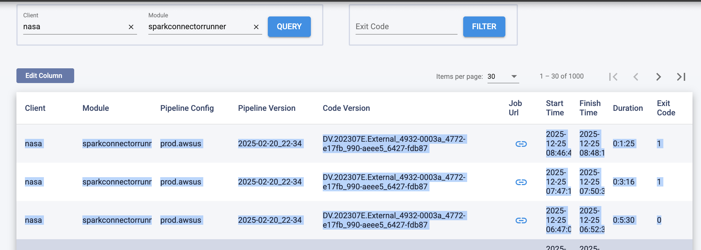

job-notifier
APP  21 minutes ago
@channel [Nasa-Luigi] Nasa sparkconnectorrunner failed to run in the last 10 minutes
2 replies
Rui Shao
  7 minutes ago
checking
Rui Shao
  1 minute ago
master already marked the application as FAILED and removed it from the cluster, while the driver was still waiting for executor scheduling.
let waiting for the next schedule

https://chatgpt.com/c/694cfe53-60f4-8326-8380-053aeadb6cd6

https://grafana-mgt.dv-api.com/d/9aBY8rWMz/logging?orgId=1&from=1766651805000&to=1766653090000&var-pod=All&var-level=All&var-search=&var-namespace=s-prod-nasa-73f02c0-1442748&var-cluster=aws-uswest2-prod-b&var-PromDs=prometheus-pods&var-container=spark-agent

https://eng-mgt-a.dv-api.com/oncall/logs/production-job?releaseGroup=Platform&area=aws-uswest2-prod_a_prod&client=nasa&module=sparkconnectorrunner&exitCode=

