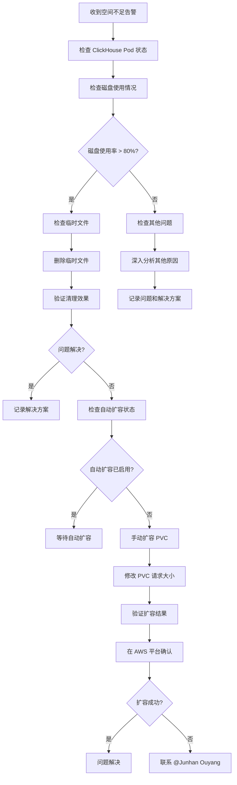

# ClickHouse 空间不足问题排查指南

## 快速参考

### 🚨 紧急联系人
- **主要联系人**: @Junhan Ouyang
- **问题类型**: ClickHouse 存储空间相关问题

## 常见问题

### 1. ClickHouse 空间不足

#### 问题现象
```
- ClickHouse 服务异常
- 数据导入失败
- 磁盘使用率达到 80% 以上
- Pod 状态异常或重启
```

#### 问题描述
ClickHouse 集群存储空间不足，导致数据无法正常写入，服务性能下降或服务中断。

#### 排查步骤

### 1. 初步诊断
```bash
# 检查 ClickHouse Pod 状态
kubectl get pods -n prod | grep clickhouse

# 查看 Pod 详细信息
kubectl describe pod <clickhouse-pod-name> -n prod

# 检查 PVC 状态
kubectl get pvc -n prod | grep clickhouse
```

### 2. 检查存储使用情况
```bash
# 进入 ClickHouse Pod 检查磁盘使用
kubectl exec -it <clickhouse-pod-name> -n prod -- df -h

# 查看 ClickHouse 数据目录大小
kubectl exec -it <clickhouse-pod-name> -n prod -- du -sh /var/lib/clickhouse/*

# 检查临时文件
kubectl exec -it <clickhouse-pod-name> -n prod -- find /var/lib/clickhouse -name "*.tmp" -type f
```

### 3. 检查 AWS EBS 状态
```bash
# 查看 PVC 对应的 EBS 卷
kubectl describe pvc <clickhouse-pvc-name> -n prod

# 在 AWS 控制台检查 EBS 卷状态
# 1. 登录 AWS 控制台
# 2. 进入 EC2 -> Volumes
# 3. 查找对应的 EBS 卷
# 4. 检查卷状态和大小
```

## 解决方案

### 方案 1: 清理临时文件 (快速解决)

#### 1. 删除临时文件
```bash
# 进入 ClickHouse Pod
kubectl exec -it <clickhouse-pod-name> -n prod -- bash

# 查找并删除临时文件
find /var/lib/clickhouse -name "*.tmp" -type f -delete
find /var/lib/clickhouse -name "*.tmp" -type d -exec rm -rf {} +

# 清理 ClickHouse 临时目录
rm -rf /var/lib/clickhouse/tmp/*
rm -rf /var/lib/clickhouse/store/tmp/*

# 清理日志文件 (可选)
find /var/lib/clickhouse -name "*.log" -mtime +7 -delete
```

#### 2. 验证清理效果
```bash
# 检查磁盘使用情况
df -h

# 检查 ClickHouse 服务状态
kubectl get pods -n prod | grep clickhouse
```

### 方案 2: 检查自动扩容状态

#### 1. 检查 PVC 自动扩容配置
```bash
# 查看 PVC 详细信息
kubectl describe pvc <clickhouse-pvc-name> -n prod

# 检查是否启用了自动扩容
kubectl get pvc <clickhouse-pvc-name> -n prod -o yaml | grep -A 5 -B 5 "allowVolumeExpansion"
```

#### 2. 检查 StorageClass 配置
```bash
# 查看 StorageClass 配置
kubectl get storageclass

# 查看具体 StorageClass 详情
kubectl describe storageclass <storageclass-name>
```

#### 3. 在 AWS 平台检查
- 登录 AWS 控制台
- 进入 EC2 -> Volumes
- 查找对应的 EBS 卷
- 检查卷的自动扩容设置
- 查看卷的当前大小和使用情况

### 方案 3: 手动扩容 PVC (推荐)

#### 1. 修改 PVC 请求大小
```bash
# 备份当前 PVC 配置
kubectl get pvc <clickhouse-pvc-name> -n prod -o yaml > clickhouse-pvc-backup.yaml

# 编辑 PVC 配置
kubectl edit pvc <clickhouse-pvc-name> -n prod

# 修改 resources.requests.storage 字段
# 例如: 从 100Gi 改为 200Gi
```

#### 2. 验证扩容结果
```bash
# 检查 PVC 状态
kubectl get pvc <clickhouse-pvc-name> -n prod

# 检查 Pod 中的磁盘使用
kubectl exec -it <clickhouse-pod-name> -n prod -- df -h

# 等待几分钟后再次检查
```

#### 3. 在 AWS 平台验证
- 检查 EBS 卷是否已自动扩容
- 确认卷状态为 "available"
- 验证新的卷大小

## 预防措施

### 1. 监控设置
```bash
# 设置磁盘使用率监控告警
# 建议阈值: 70% 警告, 80% 严重

# 监控 ClickHouse 表大小
# 定期检查大表和数据分布
```

### 2. 定期维护
```bash
# 定期清理临时文件 (建议每周执行)
kubectl exec -it <clickhouse-pod-name> -n prod -- find /var/lib/clickhouse -name "*.tmp" -type f -delete

# 定期检查磁盘使用情况
kubectl exec -it <clickhouse-pod-name> -n prod -- df -h
```

### 3. 配置优化
- 启用 PVC 自动扩容
- 设置合理的存储类配置
- 优化 ClickHouse 数据保留策略

## 故障处理流程



## 常用命令

### 1. 检查命令
```bash
# 检查 Pod 状态
kubectl get pods -n prod | grep clickhouse

# 检查 PVC 状态
kubectl get pvc -n prod | grep clickhouse

# 检查磁盘使用
kubectl exec -it <pod-name> -n prod -- df -h

# 检查 ClickHouse 服务状态
kubectl exec -it <pod-name> -n prod -- clickhouse-client --query "SELECT 1"
```

### 2. 清理命令
```bash
# 删除临时文件
kubectl exec -it <pod-name> -n prod -- find /var/lib/clickhouse -name "*.tmp" -type f -delete

# 清理临时目录
kubectl exec -it <pod-name> -n prod -- rm -rf /var/lib/clickhouse/tmp/*

# 清理旧日志
kubectl exec -it <pod-name> -n prod -- find /var/lib/clickhouse -name "*.log" -mtime +7 -delete
```

### 3. 扩容命令
```bash
# 编辑 PVC
kubectl edit pvc <pvc-name> -n prod

# 检查扩容状态
kubectl get pvc <pvc-name> -n prod -w
```

---

**注意**: 
1. 遇到空间不足问题时，首先尝试删除临时文件
2. 检查 AWS 平台的自动扩容状态
3. 必要时直接修改 PVC 的 request 大小进行扩容
4. 如果问题持续存在，请及时联系 @Junhan Ouyang


