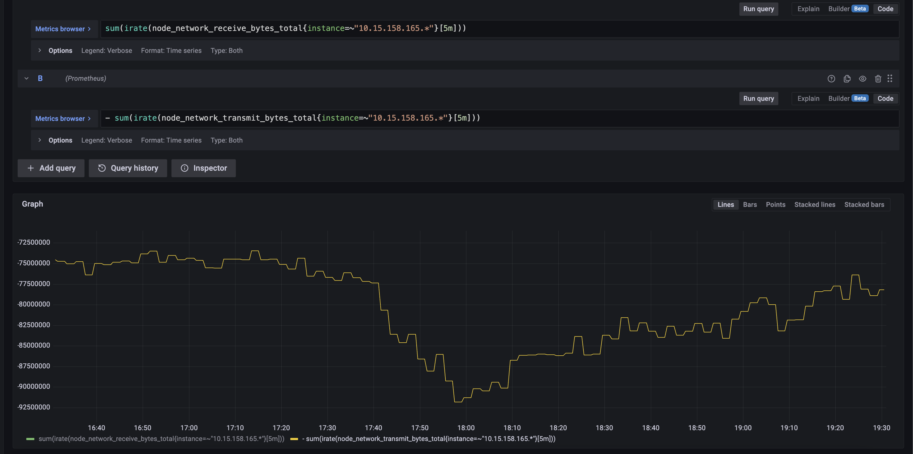
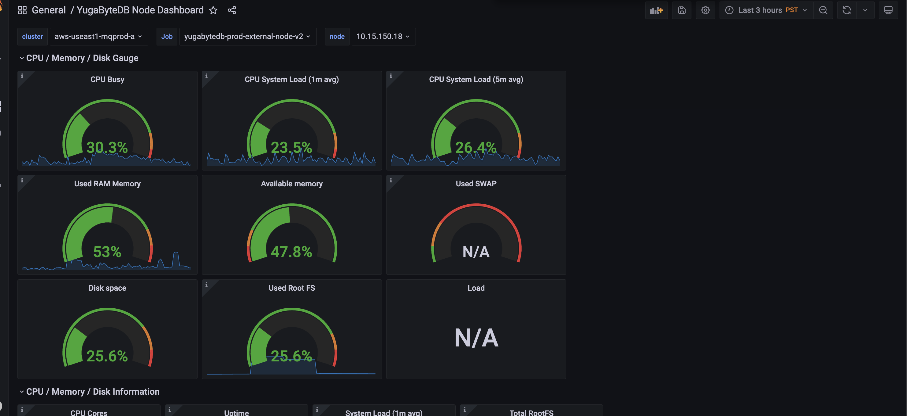
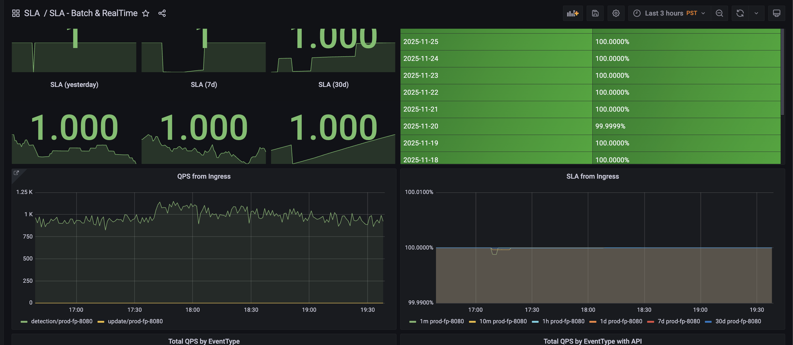

# Maqeta / MQ

## Slack Channels

- **onsite-marqeta-alerts** - Onsite Marqeta alerts channel
- **x-datavisor-mq-incident-response** - Incident response channel
  - Start an oncall event
    - Priority: High
    - Action: Switch traffic
- **ext-datavisor-marqeta** - External Marqeta channel

## Important Notice

⚠️ **Connect VPN first** before accessing any resources.

## Grafana Access

### Credentials
- **Username**: `admin`
- **Password**: `Dv123456`

### Grafana Dashboards

#### SLA Monitoring
- **SLA Batch and Realtime**: https://grafana-mqmgt-a.marqetariskcontroldecisioning.com/d/p1KqfRAMk/sla-batch-and-realtime?orgId=1&from=now-3h&to=now

#### YugabyteDB Metrics
- **YugabyteDB Dashboard**: https://grafana-mqmgt-a.marqetariskcontroldecisioning.com/d/1IGjQaiMk/yugabytedb?orgId=1&var-cluster=[…]de=All&var-serverNode=All&from=now-1h&to=now

#### Feature Platform
- **Feature Platform Metrics**: https://grafana-mqmgt-a.marqetariskcontroldecisioning.com/d/EP_yHg7Gk/feature-platform-metrics?orgId=1
- **Feature Platform Logs**: https://grafana-mqmgt-a.marqetariskcontroldecisioning.com/d/CFAzjjGGz/feature-platform-log?orgId=1

## Troubleshooting Common Alerts

### Network Traffic Alerts

When you see alerts like:
```
node=10.15.150.18:19100 device=ens5 network output  > 300Mbps ##### Value=315.9
node=10.15.158.165:19100 device=ens5 network output  > 300Mbps ##### Value=538
Click https://eng.datavisor.com/#/alert to check all alerts status.
```

**Context**: These nodes are YB (YugabyteDB) nodes. Marqeta traffic typically runs at ~1k QPS, so high traffic is expected.

### Diagnostic Checklist

When investigating alerts, follow these steps:

#### 1. Check Network Traffic / QPS
- Is this traffic pattern consistent?
- If traffic has always been at this level, it's likely normal
- Use the SLA dashboard to monitor QPS trends

#### 2. Check SLA Performance
- Review [SLA Batch and Realtime Dashboard](https://grafana-mqmgt-a.marqetariskcontroldecisioning.com/d/p1KqfRAMk/sla-batch-and-realtime?orgId=1&from=now-3h&to=now)
- If SLA is 100%, system is healthy despite high traffic

#### 3. Check YugabyteDB (Backend Database)
- Monitor CPU utilization
- Monitor memory usage
- Monitor disk I/O
- Use [YugabyteDB Dashboard](https://grafana-mqmgt-a.marqetariskcontroldecisioning.com/d/1IGjQaiMk/yugabytedb?orgId=1)

### Reference Metrics






### Key Observations
- YB node load typically looks good even with high traffic
- Marqeta is a high-traffic client (~1k QPS)
- Network output > 300Mbps on YB nodes is expected and acceptable

## Team Contacts

@jorozco @kpurre @kpawar @mzhang

