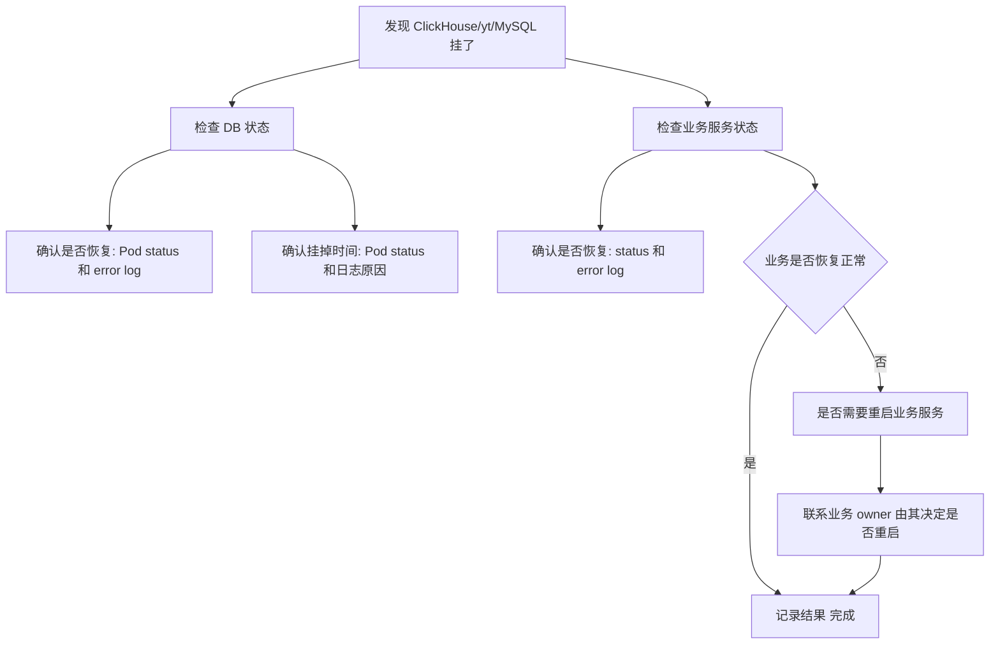

# Oncall 排查流程（DB/业务故障场景）

## 一、看 DB 层面

1. **确认 ClickHouse 是否恢复**
   - 检查 pod 状态：
     ```bash
     kubectl get pods -n <namespace> | grep clickhouse
     ```
   - 检查 error log：
     ```bash
     kubectl logs <clickhouse-pod>
     ```
   - 这是最基本的确认动作。

2. **确认 ClickHouse 什么时候挂的**
   - **Pod status**：看 RESTARTS、LAST RESTART TIME
   - **日志**：分析挂掉的原因（资源不足 / crash / 网络）。

## 二、看业务层面

1. **确认业务是否恢复**
   - 检查 fp 等依赖 DB 的服务：
     ```bash
     kubectl get pods -n <namespace> | grep fp
     ```
   - 看 error log：
     ```bash
     kubectl logs <fp-pod>
     ```

2. **是否需要重启业务**
   - 如果业务自己还没恢复，要确认是否需要重启（但不要自己动手，应让业务 owner 操作）。

## Mermaid 流程图


## 总结
这样排下来：
- 先看 DB → 再看业务 → 最后决定是否需要业务重启。
- 严格区分责任边界：DB 这边确认、记录，业务服务重启交给 owner。