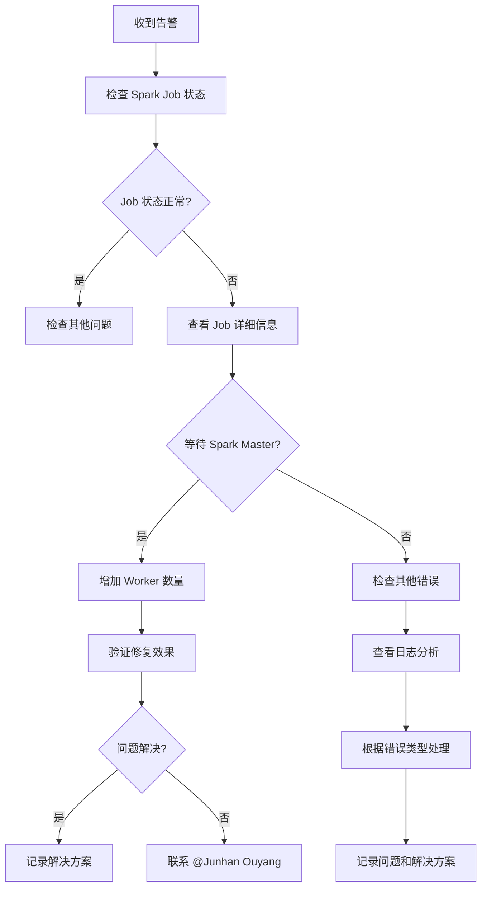

# DCluster Spark Job 故障排查指南

## 快速参考

### 🚨 紧急联系人
- **主要联系人**: @Junhan Ouyang
- **问题类型**: DCluster Spark Job 相关问题

## 常见问题

### 1. Spark Job 状态异常

#### 问题现象
```
Spark Job Status: waiting for spark master ready
```

#### 问题描述
Spark Job 一直处于等待 Spark Master 准备就绪的状态，无法正常启动。

#### 可能原因
- Spark Master 服务未正常启动
- 集群资源不足
- 网络连接问题
- 配置问题

#### 解决方案

**临时解决方案**：
1. **增加租户信息 Worker 数量**
   ```bash
   # 将 tenant info worker 数量增加到 60 以上
   # 这通常可以解决 Spark Master 准备就绪的问题
   ```

2. **检查 Spark Master 状态**
   ```bash
   # 检查 Spark Master Pod 状态
   kubectl get pods -n dcluster | grep spark-master
   
   # 查看 Spark Master 日志
   kubectl logs -n dcluster <spark-master-pod-name>
   ```

3. **检查集群资源**
   ```bash
   # 检查节点资源使用情况
   kubectl top nodes
   
   # 检查 Pod 资源使用情况
   kubectl top pods -n dcluster
   ```

**长期解决方案**：
- 优化 Spark 集群配置
- 增加集群资源容量
- 实现自动扩缩容机制

#### 预期解决时间
- **临时方案**: 立即生效
- **根本解决**: 预计很快会得到解决

## 排查步骤

### 1. 初步诊断
1. **检查 Spark Job 状态**
   ```bash
   kubectl get sparkapplications -n dcluster
   ```

2. **查看 Job 详细信息**
   ```bash
   kubectl describe sparkapplication <job-name> -n dcluster
   ```

3. **检查相关 Pod 状态**
   ```bash
   kubectl get pods -n dcluster | grep spark
   ```

### 2. 深入分析
1. **查看 Spark Master 日志**
   ```bash
   kubectl logs -n dcluster <spark-master-pod-name> --tail=100
   ```

2. **检查 Worker 节点状态**
   ```bash
   kubectl get pods -n dcluster | grep worker
   ```

3. **检查资源配额**
   ```bash
   kubectl describe resourcequota -n dcluster
   ```

### 3. 网络诊断
1. **检查服务连通性**
   ```bash
   kubectl get svc -n dcluster | grep spark
   ```

2. **测试网络连接**
   ```bash
   kubectl exec -n dcluster <pod-name> -- curl -v <spark-master-service>
   ```

## 预防措施

### 1. 监控设置
- 设置 Spark Master 健康检查监控
- 监控集群资源使用率
- 设置 Job 执行时间告警

### 2. 配置优化
- 合理配置 Spark 资源参数
- 设置合适的超时时间
- 优化内存和 CPU 分配

### 3. 文档维护
- 记录常见问题和解决方案
- 更新故障处理手册
- 定期回顾和优化流程

## 相关资源

### 1. 官方文档
- [Spark on Kubernetes](https://spark.apache.org/docs/latest/running-on-kubernetes.html)
- [Kubernetes Spark Operator](https://github.com/GoogleCloudPlatform/spark-on-k8s-operator)

### 2. 内部资源
- DCluster 配置文档
- Spark 集群管理手册
- 故障处理流程文档

## 故障处理流程



## 联系信息

### 紧急情况
- **主要联系人**: @Junhan Ouyang
- **联系方式**: 通过 Slack 或邮件联系
- **响应时间**: 紧急问题 30 分钟内响应

### 非紧急问题
- 通过工单系统提交
- 详细描述问题现象和已尝试的解决方案
- 附上相关的日志和配置信息

---

**注意**: 如果遇到 "waiting for spark master ready" 问题，首先尝试增加 tenant info worker 数量到 60 以上，这通常可以快速解决问题。如果问题持续存在，请及时联系 @Junhan Ouyang。


