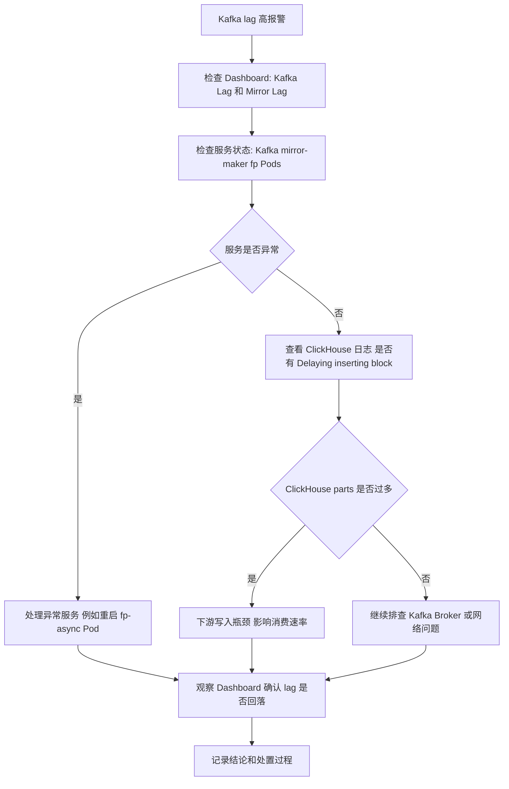

# 分析:

## 现象
Alertmanager 报警：velocity.prod_a 消费组在多个 Kafka topic 上 lag 很高（airasia, blibli, prod_fp_velocity 等），数值在几千到几万之间。

**时间点**：2025-06-14 00:21 左右。

**日志（ClickHouse）**：反复出现


## 说明
表分片/parts 数量过多，写入被强制延迟。

## 线索
Kafka lag 和 ClickHouse 写入延迟同时出现。

- cluster-b 的 lag 升高，可能是 cluster-a QPS 高，导致 fp-async 消费不过来。

## 处理动作
重启 fp-async pod，问题消失。

## 后续确认
消费已经追平（lag 回到正常）。

## 结论 / 经验

### 问题特征
- Kafka lag 突增，同时 ClickHouse 报告 parts 太多导致 insert 延迟。
- 消费端 (fp-async) 堆积，表现为无法跟上 QPS。

### 可能根因
- ClickHouse parts 过多 → insert 延迟 → 导致消费速率下降。
- Kafka lag 高并不一定是 Kafka 本身问题，而可能是下游写入（ClickHouse）拖慢。

### 处置经验
- 简单重启 fp-async pod，可以临时恢复消费能力。
- 属于“治标不治本”的手段，背后问题可能是：
  - ClickHouse 表的分区/合并策略需要优化（parts 数量控制）。
  - fp-async 的 backpressure 或资源配置不足。

## 总结一句话
当出现 cluster-b Kafka lag 高时，不一定是 Kafka 问题，可能是下游 ClickHouse insert 卡住。重启 fp-async 能缓解，但从根本上需要优化 ClickHouse parts 管理和消费端 backpressure。

Dashboard: http://0.0.0.0:5000/urls/


# notes:
有时候重启一下fp，可以解决一些问题


# notes:
有时候重启一下fp，可以解决一些问题

```
Alertmanager
APP  Saturday at 3:08 PM
[HIGH][RT] cluster: aws-apsoutheast1-prod-a, namespace: kubernetes-pods 192.168.184.171:9308: The consumer group velocity.prod_a, Topic: cluster_b.extds.airasia lag is High. Current value is 49810 of last 5 minutes.
[HIGH][RT] cluster: aws-apsoutheast1-prod-a, namespace: kubernetes-pods 192.168.184.171:9308: The consumer group velocity.prod_a, Topic: cluster_b.extds.blibli lag is High. Current value is 9328 of last 5 minutes.
[HIGH][RT] cluster: aws-apsoutheast1-prod-a, namespace: kubernetes-pods 192.168.184.171:9308: The consumer group velocity.prod_a, Topic: extds.airasia lag is High. Current value is 11387 of last 5 minutes.
[HIGH][RT] cluster: aws-apsoutheast1-prod-a, namespace: kubernetes-pods 192.168.184.171:9308: The consumer group velocity.prod_a, Topic: prod_fp_velocity-al-.airasia lag is High. Current value is 30779 of last 5 minutes.
[HIGH][RT] cluster: aws-apsoutheast1-prod-a, namespace: kubernetes-pods 192.168.184.171:9308: The consumer group velocity.prod_a, Topic: prod_fp_velocity-al-.blibli l…
Click https://eng.datavisor.com/#/alert to check all alerts status.
20 replies
```
```
Caiwei Li
  Saturday at 3:22 PM
2025-06-14 00:21:10	
2025.06.14 07:21:10.682101 [ 19422 ] {db4e2c90-c394-4205-adc4-7fb23690155f} <Information> airasia.rtuserstats_airasia_ext_datasource_extds_data: Delaying inserting block by 10 ms. because there are 1015 parts and their average size is 5.58 MiB
2025-06-14 00:21:10	
2025.06.14 07:21:10.694848 [ 19427 ] {4edcb0c4-031b-45ce-be6d-68722d7e255f} <Information> airasia.dedge_airasia_https_ext_datasourcev0_extds_data: Delaying inserting block by 10 ms. because there are 1053 parts and their average size is 2.41 MiB
2025-06-14 00:21:11	
2025.06.14 07:21:11.259503 [ 19366 ] {1323c318-cf0e-40b4-8731-e840ef2707fa} <Information> airasia.rtuserstats_airasia_ext_datasource_extds_data: Delaying inserting block by 10 ms. because there are 1016 parts and their average size is 5.57 MiB
2025-06-14 00:21:11	
2025.06.14 07:21:11.273984 [ 19405 ] {8fa2bf96-e61a-45ad-864e-d0091409c3b3} <Information> airasia.dedge_airasia_https_ext_datasourcev0_extds_data: Delaying inserting block by 11 ms. because there are 1054 parts and their average size is 2.40 MiB
2025-06-14 00:21:12	
2025.06.14 07:21:12.899843 [ 19365 ] {32a801c2-9c02-4cd1-9d8a-e78e44ec2220} <Information> airasia.rtuserstats_airasia_ext_datasource_extds_data: Delaying inserting block by 10 ms. because there are 1017 parts and their average size is 5.57 MiB
2025-06-14 00:21:12	
2025.06.14 07:21:12.913045 [ 19396 ] {47ee54a2-6fe6-498f-a61a-5cdd06d27463} <Information> airasia.dedge_airasia_https_ext_datasourcev0_extds_data: Delaying inserting block by 11 ms. because there are 1055 parts and their average size is 2.40 MiB
2025-06-14 00:21:14	
2025.06.14 07:21:14.116649 [ 19427 ] {0187534d-9875-40c1-80e4-9056df0d79ba} <Information> airasia.rtuserstats_airasia_ext_datasource_extds_data: Delaying inserting block by 10 ms. because there are 1018 parts and their average size is 5.56 MiB
2025-06-14 00:21:14	
2025.06.14 07:21:14.133645 [ 19269 ] {9dbc5312-b80d-4218-8652-f4506c15b678} <Information> airasia.dedge_airasia_https_ext_datasourcev0_extds_data: Delaying inserting block by 11 ms. because there are 1056 parts and their average size is 2.40 MiB
2025-06-14 00:21:14	
2025.06.14 07:21:14.357515 [ 19366 ] {32b68ad2-a432-4cf1-83a1-75a59f078175} <Information> airasia.rtuserstats_airasia_ext_datasource_extds_data: Delaying inserting block by 10 ms. because there are 1019 parts and their average size is 5.55 MiB
2025-06-14 00:21:14	
2025.06.14 07:21:14.371145 [ 19405 ] {c874cd88-db3e-4222-ad05-0f17037f3d32} <Information> airasia.dedge_airasia_https_ext_datasourcev0_extds_data: Delaying inserting block by 11 ms. because there are 1057 parts and their average size is 2.40 MiB
2025-06-14 00:21:16	
2025.06.14 07:21:16.315671 [ 19420 ] {ba46f58e-b4f8-4536-ad7d-9e0834840988} <Information> airasia.rtuserstats_airasia_ext_datasource_extds_data: Delaying inserting block by 10 ms. because there are 1020 parts and their average size is 5.55 MiB
2025-06-14 00:21:16	
2025.06.14 07:21:16.328843 [ 19425 ] {b8446bc8-b98a-4bd6-b438-164773450340} <Information> airasia.dedge_airasia_https_ext_datasourcev0_extds_data: Delaying inserting block by 11 ms. because there are 1058 parts and their average size is 2.39 MiB
3:23
looks like clickhouse issue
```

It has been consume completed. back normal (edited) 

seem that i restarted fp-async pod and the issue was gone (edited) 


https://grafana-mgt.dv-api.com/d/cluster_kafkfa_exporter/kafka-exporter-for-all?orgId=1&var-PromDs=vms-victoria-metrics-single-server&var-job=kubernetes-pods&var-cluster=aws-apsoutheast1-prod-a&var-namespace=prod&var-pod=kafka3-exporter-66c5987d49-lfpgw&var-topic=cluster_b.api_command&var-topic=cluster_b.backfillds.admin&var-topic=cluster_b.backfillds.airasia&var-topic=cluster_b.backfillds.autoswitchtraffic&var-topic=cluster_b.backfillds.autotest013&var-topic=cluster_b.backfillds.autotest014&var-topic=cluster_b.backfillds.binance&var-topic=cluster_b.backfillds.blibli&var-topic=cluster_b.backfillds.dvgin&var-topic=cluster_b.backfillds.dvloginprotectinternal&var-topic=cluster_b.backfillds.ggpoker&var-topic=cluster_b.backfillds.okcoin&var-topic=cluster_b.backfillds.okg&var-topic=cluster_b.backfillds.okx&var-topic=cluster_b.backfillds.qaautomationtest&var-topic=cluster_b.backfillds.qaautotest&var-topic=cluster_b.backfillds.qatenant1685695013&var-topic=cluster_b.backfillds.qatenant1685699607&var-topic=cluster_b.backfillds.qatest&var-topic=cluster_b.backfillds.qatestb&var-topic=cluster_b.backfillevent.admin&var-topic=cluster_b.backfillevent.airasia&var-topic=cluster_b.backfillevent.autoswitchtraffic&var-topic=cluster_b.backfillevent.autotest013&var-topic=cluster_b.backfillevent.autotest014&var-topic=cluster_b.backfillevent.binance&var-topic=cluster_b.backfillevent.blibli&var-topic=cluster_b.backfillevent.dvgin&var-topic=cluster_b.backfillevent.dvloginprotectinternal&var-topic=cluster_b.backfillevent.ggpoker&var-topic=cluster_b.backfillevent.okcoin&var-topic=cluster_b.backfillevent.okg&var-topic=cluster_b.backfillevent.okx&var-topic=cluster_b.backfillevent.qaautomationtest&var-topic=cluster_b.backfillevent.qaautotest&var-topic=cluster_b.backfillevent.qatenant1685695013&var-topic=cluster_b.backfillevent.qatenant1685699607&var-topic=cluster_b.backfillevent.qatest&var-topic=cluster_b.backfillevent.qatestb&var-topic=cluster_b.casemanagement-alertreview-prod.admin&var-topic=cluster_b.casemanagement-alertreview-prod.airasia&var-topic=cluster_b.casemanagement-alertreview-prod.autoswitchtraffic&var-topic=cluster_b.casemanagement-alertreview-prod.binance&var-topic=cluster_b.casemanagement-alertreview-prod.blibli&var-topic=cluster_b.casemanagement-alertreview-prod.dvloginprotectinternal&var-topic=cluster_b.casemanagement-alertreview-prod.ggpoker&var-topic=cluster_b.casemanagement-alertreview-prod.okcoin&var-topic=cluster_b.casemanagement-alertreview-prod.okg&var-topic=cluster_b.casemanagement-alertreview-prod.okx&var-topic=cluster_b.casemanagement-alertreview-prod.qaautomationtest&var-topic=cluster_b.casemanagement-alertreview-prod.qaautotest&var-topic=cluster_b.casemanagement-alertreview-prod.qatest&var-topic=cluster_b.casemanagement-alertreview-prod.qatestsgprodb&var-topic=cluster_b.casemanagement-postback-prod.admin&var-topic=cluster_b.casemanagement-postback-prod.airasia&var-topic=cluster_b.casemanagement-postback-prod.autoswitchtraffic&var-topic=cluster_b.casemanagement-postback-prod.binance&var-topic=cluster_b.casemanagement-postback-prod.blibli&var-topic=cluster_b.casemanagement-postback-prod.dvloginprotectinternal&var-topic=cluster_b.casemanagement-postback-prod.ggpoker&var-topic=cluster_b.casemanagement-postback-prod.okcoin&var-topic=cluster_b.casemanagement-postback-prod.okg&var-topic=cluster_b.casemanagement-postback-prod.okx&var-topic=cluster_b.casemanagement-postback-prod.qaautomationtest&var-topic=cluster_b.casemanagement-postback-prod.qaautotest&var-topic=cluster_b.casemanagement-postback-prod.qatest&var-topic=cluster_b.casemanagement-postback-prod.qatestsgprodb&var-topic=cluster_b.checkpoints.internal&var-topic=cluster_b.datavisor-backfillprofile.admin&var-topic=cluster_b.datavisor-backfillprofile.airasia&var-topic=cluster_b.datavisor-backfillprofile.autoswitchtraffic&var-topic=cluster_b.datavisor-backfillprofile.blibli&var-topic=cluster_b.datavisor-backfillprofile.dvloginprotectinternal&var-topic=cluster_b.datavisor-backfillprofile.ggpoker&var-topic=cluster_b.datavisor-backfillprofile.qaautotest&var-topic=cluster_b.datavisor-monitoring&var-topic=cluster_b.entity_alerts-prod.admin&var-topic=cluster_b.entity_alerts-prod.airasia&var-topic=cluster_b.entity_alerts-prod.autoswitchtraffic&var-topic=cluster_b.entity_alerts-prod.binance&var-topic=cluster_b.entity_alerts-prod.blibli&var-topic=cluster_b.entity_alerts-prod.dvloginprotectinternal&var-topic=cluster_b.entity_alerts-prod.ggpoker&var-topic=cluster_b.entity_alerts-prod.okg&var-topic=cluster_b.entity_alerts-prod.okx&var-topic=cluster_b.entity_alerts-prod.qaautomationtest&var-topic=cluster_b.entity_alerts-prod.qaautotest&var-topic=cluster_b.entity_alerts-prod.qatest&var-topic=cluster_b.extds.admin&var-topic=cluster_b.extds.airasia&var-topic=cluster_b.extds.autoswitchtraffic&var-topic=cluster_b.extds.autotest013&var-topic=cluster_b.extds.autotest014&var-topic=cluster_b.extds.binance&var-topic=cluster_b.extds.blibli&var-topic=cluster_b.extds.dvgin&var-topic=cluster_b.extds.dvloginprotectinternal&var-topic=cluster_b.extds.ggpoker&var-topic=cluster_b.extds.okcoin&var-topic=cluster_b.extds.okg&var-topic=cluster_b.extds.okx&var-topic=cluster_b.extds.qaautomationtest&var-topic=cluster_b.extds.qaautotest&var-topic=cluster_b.extds.qatenant1685640319&var-topic=cluster_b.extds.qatenant1685642411&var-topic=cluster_b.extds.qatenant1685695013&var-topic=cluster_b.extds.qatenant1685699607&var-topic=cluster_b.extds.qatest&var-topic=cluster_b.extds.qatestb&var-topic=cluster_b.extds.qatestsgprodb&var-topic=cluster_b.external.admin&var-topic=cluster_b.external.airasia&var-topic=cluster_b.external.autoswitchtraffic&var-topic=cluster_b.external.autotest013&var-topic=cluster_b.external.autotest014&var-topic=cluster_b.external.binance&var-topic=cluster_b.external.blibli&var-topic=cluster_b.external.dvloginprotectinternal&var-topic=cluster_b.external.ggpoker&var-topic=cluster_b.external.okcoin&var-topic=cluster_b.external.okg&var-topic=cluster_b.external.okx&var-topic=cluster_b.external.qaautomationtest&var-topic=cluster_b.external.qaautotest&var-topic=cluster_b.external.qatenant1685695013&var-topic=cluster_b.external.qatenant1685699607&var-topic=cluster_b.external.qatest&var-topic=cluster_b.external.qatestb&var-topic=cluster_b.external.qatestsgprodb&var-topic=cluster_b.heartbeats&var-topic=cluster_b.prod_fp_velocity.admin&var-topic=cluster_b.prod_fp_velocity.airasia&var-topic=cluster_b.prod_fp_velocity.autoswitchtraffic&var-topic=cluster_b.prod_fp_velocity.autotest013&var-topic=cluster_b.prod_fp_velocity.autotest014&var-topic=cluster_b.prod_fp_velocity.binance&var-topic=cluster_b.prod_fp_velocity.blibli&var-topic=cluster_b.prod_fp_velocity.dvgin&var-topic=cluster_b.prod_fp_velocity.dvloginprotectinternal&var-topic=cluster_b.prod_fp_velocity.ggpoker&var-topic=cluster_b.prod_fp_velocity.okcoin&var-topic=cluster_b.prod_fp_velocity.okg&var-topic=cluster_b.prod_fp_velocity.okx&var-topic=cluster_b.prod_fp_velocity.qaautomationtest&var-topic=cluster_b.prod_fp_velocity.qaautotest&var-topic=cluster_b.prod_fp_velocity.qatenant1685695013&var-topic=cluster_b.prod_fp_velocity.qatenant1685699607&var-topic=cluster_b.prod_fp_velocity.qatest&var-topic=cluster_b.prod_fp_velocity.qatestb&var-topic=cluster_b.prod_fp_velocity.qatestsgprodb&var-topic=cluster_b.widget-update-prod.admin&var-topic=cluster_b.widget-update-prod.airasia&var-topic=cluster_b.widget-update-prod.autoswitchtraffic&var-topic=cluster_b.widget-update-prod.binance&var-topic=cluster_b.widget-update-prod.blibli&var-topic=cluster_b.widget-update-prod.dvloginprotectinternal&var-topic=cluster_b.widget-update-prod.ggpoker&var-topic=cluster_b.widget-update-prod.okg&var-topic=cluster_b.widget-update-prod.okx&var-topic=cluster_b.widget-update-prod.qaautomationtest&var-topic=cluster_b.widget-update-prod.qaautotest&var-topic=cluster_b.widget-update-prod.qatest&var-topic=mm2-configs.cluster_b.internal&var-topic=mm2-offset-syncs.cluster_b.internal&var-topic=mm2-offsets.cluster_b.internal&var-topic=mm2-status.cluster_b.internal&var-consumergroup=velocity.prod_a&from=1750142464193&to=1750144381702
