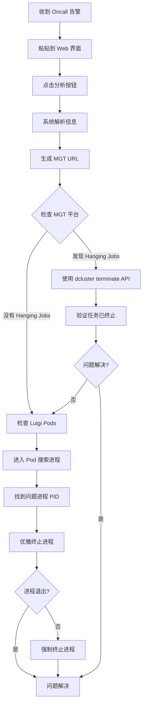

# Luigi 进程调试助手使用指南

## 概述

Luigi Debug Helper 是一个基于 FastAPI 的 Luigi 进程调试工具，帮助快速分析 oncall 信息并生成相应的调试命令。该工具可以自动解析 oncall 信息，提取关键字段，并根据 region 自动生成对应的调试命令序列。

## 功能特性

- **📋 智能解析**: 自动解析 oncall 信息，提取关键字段（Module、Client、Region、Date等）
- **⏰ 时间分析**: 计算进程运行时长和总 pending 时间
- **🔗 自动生成**: 根据 region 自动生成对应的 MGT 平台 URL
- **🏗️ Cluster Alias 支持**: 使用配置化的集群别名（如 `ksga`, `ksgb`）替代完整的 kubectl 命令
- **📂 动态 Kubeconfig 检测**: 自动检测可用的 kubeconfig 文件路径
- **📝 命令生成**: 按优先级生成完整的调试命令序列，使用集群别名
- **⚡ 命令执行**: 支持直接执行 kubectl、curl 等命令（可选）
- **🎛️ 集群管理**: 专用界面查看和管理集群别名及 kubeconfig 文件

## 访问方式

- **Web 界面**: http://localhost:8000/luigi_job
- **集群管理**: http://localhost:8000/luigi_job/clusters
- **API 文档**: http://localhost:8000/luigi_job/docs
- **健康检查**: http://localhost:8000/luigi_job/api/health

## 使用流程

### 步骤 1: 输入 Oncall 信息

在 Web 界面中粘贴 oncall 信息，例如：

```
Process in Luigi has running for 299.11 minutes. Recent avg running time is 60.00 minutes (For fast jobs, default avg is 60min):
Module: monitortracker
Client: uopx
Region: us-east-1
Date: 2025-06-29
Please check luigi process!
```

### 步骤 2: 分析并生成命令

点击 "🔍 Analyze & Generate Commands" 按钮，系统会：

1. **解析信息**: 提取 Module、Client、Region、Date、运行时间等关键信息
2. **计算时间**: 分析进程运行时长和总 pending 时间
3. **生成 URL**: 自动生成 MGT 平台 URL
4. **生成命令**: 按优先级生成完整的调试命令序列

### 步骤 3: 按步骤执行调试

系统会按照以下优先级生成调试步骤：

---

## 调试步骤详解

### 1️⃣ 检查 MGT 平台（第一优先级）

**目的**: 检查是否有 hanging jobs 在 MGT 平台上

**操作**:
1. 系统会自动生成对应的 MGT URL
2. 在浏览器中打开该 URL
3. 检查是否有挂起的任务

**MGT URL 格式**:
```
https://eng-mgt-a.dv-api.com/oncall/logs/production-job?area=aws-REGION-prod_b_prod&client=CLIENT_NAME&module=MODULE_NAME&exitCode=
```

**实际 URL 示例**:
```
# US West 2 Production 集群的通用监控 URL
https://eng-mgt.datavisor.com/oncall/logs/production-job?releaseGroup=Platform&area=aws-uswest2-prod_a_prod

# 针对特定客户端和模块的 URL
https://eng-mgt-a.dv-api.com/oncall/logs/production-job?area=aws-uswest2-prod_a_prod&client=syncbank&module=monitortracker&exitCode=
```

**URL 参数说明**:
- `releaseGroup=Platform`: 过滤 Platform 相关的任务
- `area=aws-uswest2-prod_a_prod`: 指定集群和环境
- `client=syncbank`: 过滤特定客户端
- `module=monitortracker`: 过滤特定模块
- `exitCode=`: 显示所有退出码（可以指定如 `exitCode=1` 查看失败任务）

**重要提示**: 
- ⚠️ **如果发现 hanging jobs，优先使用 dcluster terminate API 终止任务，而不是直接 kill 进程**
- 这样可以避免数据不一致问题

---

### 2️⃣ 检查和终止 Hanging Jobs via Dcluster

如果在 MGT 平台上发现了 hanging jobs，使用以下命令检查和终止：

#### 2.1 检查 dcluster ingress

```bash
# 根据 region 使用对应的集群别名
keastprodb get ing -n prod | grep dcluster    # US East
kwestprodb get ing -n prod | grep dcluster    # US West
ksgb get ing -n prod | grep dcluster          # Singapore
keuwestprodb get ing -n prod | grep dcluster  # EU West
kafsouthprodb get ing -n prod | grep dcluster # AF South
```

**目的**: 获取 dcluster ingress 信息，找到 dcluster API 的 URL

#### 2.2 检查客户端命名空间

```bash
# 查找包含客户端名称的命名空间
keastprodb get ns | grep CLIENT_NAME          # US East
kwestprodb get ns | grep CLIENT_NAME          # US West
ksgb get ns | grep CLIENT_NAME                # Singapore
```

**目的**: 查找挂起任务的命名空间（通常格式为 `s-prod-CLIENT-JOBID`）

**示例输出**:
```
s-prod-uopx-abc123def456
s-prod-uopx-xyz789ghi012
```

#### 2.3 终止 Hanging Job

**自动生成 curl 命令**:
- 系统可以从 ingress 和 namespace 输出中自动提取 dcluster URL 和 job ID
- 点击 "🔄 Auto-Generate" 按钮可以自动生成 curl 命令

**手动命令格式**:
```bash
# 从 namespace 名称中提取 job ID（通常是最后一部分）
# 例如: s-prod-uopx-abc123def456 -> job ID 是 abc123def456 或最后一段数字

curl -X POST http://dcluster-CLUSTER-prod.dv-api.com/cluster/job/terminate/JOBID
```

**示例**:
```bash
# US East
curl -X POST http://dcluster-useast1-prod.dv-api.com/cluster/job/terminate/abc123def456

# US West
curl -X POST http://dcluster-uswest2-prod.dv-api.com/cluster/job/terminate/abc123def456

# Singapore
curl -X POST http://dcluster-apsoutheast1-prod.dv-api.com/cluster/job/terminate/abc123def456
```

**说明**:
- 将 `JOBID` 替换为实际的 job ID（从 namespace 名称中提取）
- 如果 namespace 是 `s-prod-uopx-abc123def456-12345`，job ID 可能是 `12345`（最后一段数字）

---

### 3️⃣ 检查 Luigi Pods（如果 MGT 上没有 hanging jobs）

如果在 MGT 平台上没有发现 hanging jobs，需要检查 Luigi pods 中的进程。

#### 3.1 列出 Luigi Pods

```bash
# 基本列表
keastprodb get pods -n prod -l app=luigi-deployment    # US East
kwestprodb get pods -n prod -l app=luigi-deployment    # US West
ksgb get pods -n prod -l app=luigi-deployment          # Singapore
```

**实际示例**:
```bash
# 查找所有 namespace 中的 luigi pod
k get pod -A | grep luigi
```

**输出示例**:
```
prod                               luigi-deployment-55bc6dc7f9-4kbvr                                     1/1     Running             0                  3d2h
```

#### 3.2 获取详细 Pod 信息

```bash
# 详细信息（包括节点、IP等）
keastprodb get pods -n prod -l app=luigi-deployment -o wide    # US East
kwestprodb get pods -n prod -l app=luigi-deployment -o wide    # US West
ksgb get pods -n prod -l app=luigi-deployment -o wide          # Singapore
```

**实际示例**:
```bash
# 获取特定 pod 的详细信息
k get pod -n prod luigi-deployment-55bc6dc7f9-4kbvr
```

**输出示例**:
```
NAME                                READY   STATUS    RESTARTS   AGE
luigi-deployment-55bc6dc7f9-4kbvr   1/1     Running   0          3d2h
```

**目的**: 
- 查看哪些 pods 正在运行
- 确定需要检查的 pod 名称
- 查看 pod 的状态和资源使用情况

---

### 4️⃣ 在 Luigi Pods 中搜索进程

找到需要检查的 pod 后，进入 pod 并搜索相关进程。

#### 4.1 连接到 Luigi Pod

**手动选择 pod**:
```bash
keastprodb exec -n prod -it POD_NAME -- bash    # US East
kwestprodb exec -n prod -it POD_NAME -- bash   # US West
ksgb exec -n prod -it POD_NAME -- bash          # Singapore
```

**实际示例**:
```bash
# 进入特定的 luigi pod
k exec -it -n prod luigi-deployment-55bc6dc7f9-4kbvr -- bash
```

**成功进入后会看到**:
```bash
root@luigi-deployment-55bc6dc7f9-4kbvr:/home/datavisor#
```

**自动选择第一个 pod**:
```bash
keastprodb exec -n prod -it $(keastprodb get pods -n prod -l app=luigi-deployment -o jsonpath='{.items[0].metadata.name}') -- bash
```

#### 4.2 搜索 Luigi 进程

```bash
# 搜索所有 luigi 进程
ps aux | grep luigi | grep -v grep

# 或者查看所有进程（推荐，可以看到完整情况）
ps uax
```

**实际输出示例**:
```
USER         PID %CPU %MEM    VSZ   RSS TTY      STAT START   TIME COMMAND
root           1  0.0  0.0   4496  3328 ?        Ss   Nov18   0:00 /bin/bash /home/datavisor/entrypoint.sh
root           8  0.0  0.0   4040  2176 ?        Ss   Nov18   0:00 /usr/sbin/cron
root           9  0.7  0.1  41580 37460 ?        S    Nov18  33:53 /usr/local/bin/python /usr/local/bin/luigid
root       41802  0.0  0.0   4500  2452 ?        S    08:10   0:00 /usr/sbin/CRON
root       41803  0.0  0.0   2576  1536 ?        Ss   08:10   0:00 /bin/sh -c /bin/bash /home/datavisor/cronjob_20minute.sh +syncbank
root       41804  0.0  0.0   3924  2816 ?        S    08:10   0:00 /bin/bash /home/datavisor/cronjob_20minute.sh +syncbank
root       41807  0.0  0.1  59972 50752 ?        S    08:10   0:00 /usr/local/bin/python /home/datavisor/luigitasks_dcluster/cronjob_20minute.py +syncbank
root       41824  0.2  0.1 133740 50484 ?        Sl   08:10   0:01 /usr/local/bin/python /usr/local/bin/luigi --module batch_tasks Labeling --client=syncbank --workers=1 --date=2025-11-21
root       41846  1.1  0.1 136436 53936 ?        Sl   08:15   0:01 /usr/local/bin/python /usr/local/bin/luigi --module batch_tasks ResultSender --client=syncbank --date=2025-11-21 --workers=5
root       41859  0.3  0.1 133716 50572 ?        Sl   08:15   0:00 /usr/local/bin/python /usr/local/bin/luigi --module batch_tasks SparkConnectorRunner --client=syncbank --workers=1 --date=2025-11-21
root       41871  0.4  0.1 133740 50612 ?        Sl   08:15   0:00 /usr/local/bin/python /usr/local/bin/luigi --module batch_tasks CronFeaturePlatformFerry --client=syncbank --workers=1 --date=2025-11-21
root       41877  0.4  0.1 133736 50676 ?        Sl   08:15   0:00 /usr/local/bin/python /usr/local/bin/luigi --module batch_tasks MonitorTracker --client=syncbank --workers=1 --date=2025-11-21
```

**关键信息说明**:
- **PID**: 进程 ID（如 41824, 41846 等）
- **%CPU**: CPU 使用率
- **%MEM**: 内存使用率
- **START**: 进程启动时间
- **TIME**: 累计 CPU 时间
- **COMMAND**: 完整的命令行，可以看到模块名、客户端、日期等信息

#### 4.3 按模块搜索

```bash
# 搜索特定模块的进程
ps aux | grep -i MODULE_NAME

# 示例
ps aux | grep -i monitortracker
```

#### 4.4 按客户端搜索

```bash
# 搜索特定客户端的进程
ps aux | grep -i CLIENT_NAME

# 示例
ps aux | grep -i uopx
```

**目的**: 
- 找到长时间运行的进程
- 确认进程的 PID
- 检查进程的运行时间和资源使用

---

### 4️⃣.5 检查 Crontab 配置（可选）

在 pod 中，可以查看 crontab 配置来了解 Luigi 任务的调度规则。

#### 查看 crontab 配置

```bash
# 在 luigi pod 中执行
crontab -l
```

**实际输出示例**:
```bash
20 * * * * /bin/bash /home/datavisor/cronjob_20minute.sh -syncbank -appsflyer -sofi -nasa
*/5 * * * * /bin/bash /home/datavisor/cronjob_20minute.sh +syncbank
45 0-3,6-23 * * * /bin/bash /home/datavisor/cronjob_20minute.sh +nasa
30 4,5 * * * /bin/bash /home/datavisor/luigitasks_dcluster/batch_pipeline_cronfpferry.sh +nasa
50 * * * * /bin/bash /home/datavisor/luigitasks_dcluster/batch_pipeline_hourly_run.sh
0 0 1,15 * * /bin/bash /home/datavisor/luigitasks_dcluster/batch_pipeline_8hour_run.sh
0 0 7,14,21,28 * * /bin/bash /home/datavisor/cronjob_monthly.sh
0 3 * * * /bin/bash /home/datavisor/luigitasks_dcluster/batch_pipeline_daily_once_run.sh
```

**Crontab 规则说明**:
- `*/5 * * * *`: 每 5 分钟运行一次
- `20 * * * *`: 每小时的第 20 分钟运行
- `45 0-3,6-23 * * *`: 每小时的第 45 分钟运行（跳过 4-5 点）
- `0 3 * * *`: 每天凌晨 3 点运行

**目的**:
- 了解任务的调度频率
- 确认任务是否应该在当前时间运行
- 识别可能的调度冲突

---

### 5️⃣ 终止进程（找到 PID 后）

找到问题进程的 PID 后，使用以下命令终止：

#### 5.1 优雅终止

```bash
kill PID
```

**说明**: 
- 发送 SIGTERM 信号，允许进程优雅退出
- 进程可以清理资源并保存状态
- 如果进程在几秒内没有退出，可能需要强制终止

#### 5.2 强制终止

```bash
kill -9 PID
```

**说明**: 
- 发送 SIGKILL 信号，立即终止进程
- 进程无法清理资源，可能导致数据不一致
- **仅在优雅终止失败时使用**

**警告**: 
- ⚠️ 强制终止可能导致数据丢失或不一致
- 优先使用 dcluster terminate API 而不是直接 kill 进程
- 只有在无法通过 API 终止时才使用 kill 命令

---

## Cluster Alias 映射

系统支持使用短别名替代完整的集群名称，提高命令输入效率：

| Region | Cluster Alias | 完整集群名称 |
|--------|---------------|--------------|
| us-east-1 | `keastprodb` | aws-useast1-prod-b |
| us-west-2 | `kwestprodb` | aws-uswest2-prod-b |
| eu-west-1 | `keuwestprodb` | aws-euwest1-prod-b |
| eu-west-2 | `keuwest2prodb` | aws-euwest2-prod-b |
| ap-southeast-1 | `ksgb` | aws-apsoutheast1-prod-b |
| af-south-1 | `kafsouthprodb` | aws-afsouth1-prod-b |

**使用方式**:
- 在命令中使用别名，例如: `keastprodb get pods -n prod`
- 系统会自动映射到完整的集群名称
- 别名定义在 `CLUSTER_ALIAS_MAPPING` 配置中

---

## 信息解析规则

系统使用正则表达式和模式匹配来解析 oncall 信息：

### 解析字段

- **Module**: 从 "Module: MODULE_NAME" 或类似模式中提取
- **Client**: 从 "Client: CLIENT_NAME" 或常见客户端名称列表中匹配
- **Region**: 从 "Region: REGION_NAME" 或 AWS region 格式中提取
- **Date**: 从 "Date: YYYY-MM-DD" 或日期格式中提取
- **Running Time**: 从 "running for X minutes" 中提取
- **Avg Time**: 从 "avg running time is X minutes" 中提取

### 常见客户端名称

系统会自动识别以下常见客户端：
- airasia, affirm, uopx, grab, shopee, sea, gojek, tokopedia

### 灵活匹配

系统支持多种输入格式：
- 完整的结构化文本
- 部分信息（会尝试推断缺失字段）
- 不同的大小写和格式变体

---

## API 使用

### 分析 Oncall 信息

```bash
curl -X POST http://localhost:8000/luigi_job/api/analyze \
  -H "Content-Type: application/json" \
  -d '{
    "oncall_text": "Process in Luigi has running for 299.11 minutes. Recent avg running time is 60.00 minutes:\nModule: monitortracker\nClient: uopx\nRegion: us-east-1\nDate: 2025-06-29"
  }'
```

**响应示例**:
```json
{
  "success": true,
  "parsed_info": {
    "module": "monitortracker",
    "client": "uopx",
    "region": "us-east-1",
    "date": "2025-06-29",
    "running_time": "299.11",
    "avg_time": "60.00"
  },
  "timing_info": {
    "process_date": "2025-06-29",
    "running_minutes": 299.11,
    "total_pending_hours": 168.5
  },
  "mgt_result": {
    "url": "https://eng-mgt-a.dv-api.com/oncall/logs/production-job?area=aws-useast1-prod_b_prod&client=uopx&module=monitortracker&exitCode=",
    "cluster": "aws-useast1-prod-b"
  },
  "command_sets": {
    "dcluster_check_ing": {
      "description": "Check dcluster ingress",
      "copy_text": "keastprodb get ing -n prod | grep dcluster"
    },
    ...
  }
}
```

### 获取集群别名信息

```bash
curl -X GET http://localhost:8000/luigi_job/api/cluster-aliases
```

### 执行命令（可选）

```bash
curl -X POST http://localhost:8000/luigi_job/api/execute \
  -H "Content-Type: application/json" \
  -d '{
    "command": "keastprodb get pods -n prod -l app=luigi-deployment",
    "command_type": "kubectl"
  }'
```

**注意**: 命令执行功能需要配置正确的 kubeconfig 文件路径。

---

## 调试流程总结



---

## 最佳实践

### 1. 优先级顺序

1. **首先检查 MGT 平台**: 这是最快速的方式，可以直观看到所有挂起的任务
2. **优先使用 dcluster API**: 如果发现 hanging jobs，使用 API 终止比直接 kill 进程更安全
3. **最后才 kill 进程**: 只有在无法通过 API 终止时才使用 kill 命令

### 2. 安全注意事项

- ⚠️ **不要直接 kill 进程**: 优先使用 dcluster terminate API
- ⚠️ **确认进程信息**: 在 kill 之前，确认 PID 和进程信息正确
- ⚠️ **优雅终止优先**: 先尝试 `kill PID`，等待几秒后再考虑 `kill -9 PID`
- ⚠️ **记录操作**: 记录终止的进程和原因，便于后续分析

### 3. 故障排查技巧

- **查看进程运行时间**: 如果运行时间远超平均时间，可能是卡住了
- **检查资源使用**: 使用 `top` 或 `htop` 查看进程的 CPU 和内存使用
- **查看日志**: 在 pod 中查看相关日志，了解进程状态
- **检查网络**: 如果进程在等待网络请求，检查网络连接

### 4. 预防措施

- **监控设置**: 设置进程运行时间告警
- **定期检查**: 定期检查长时间运行的进程
- **资源优化**: 优化进程的资源使用，避免资源耗尽
- **超时设置**: 为进程设置合理的超时时间

---

## 常见问题

### Q1: 如何确定使用哪个集群别名？

**A**: 系统会根据 oncall 信息中的 region 自动选择对应的集群别名。你也可以在集群管理界面查看所有可用的别名。

### Q2: 如何从 namespace 名称中提取 job ID？

**A**: namespace 格式通常是 `s-prod-CLIENT-JOBID` 或 `s-prod-CLIENT-PREFIX-JOBID`。job ID 通常是最后一段，可能是完整的 UUID 或最后一段数字。在 terminate API 中，通常使用最后一段数字作为 job ID。

### Q3: dcluster terminate API 返回错误怎么办？

**A**: 
1. 检查 job ID 是否正确
2. 确认 dcluster URL 是否正确
3. 检查任务是否已经完成或终止
4. 如果 API 失败，可以考虑直接 kill 进程（但要注意数据一致性）

### Q4: 如何确认进程已经被终止？

**A**: 
1. 在 MGT 平台上检查任务状态
2. 在 pod 中再次运行 `ps aux | grep luigi` 确认进程不存在
3. 检查进程的退出码和日志

### Q5: 优雅终止和强制终止的区别？

**A**: 
- **优雅终止** (`kill PID`): 发送 SIGTERM，进程可以清理资源，推荐使用
- **强制终止** (`kill -9 PID`): 发送 SIGKILL，立即终止，可能导致数据丢失，仅在必要时使用

---

## 相关资源

### 内部文档
- DCluster API 文档: `/dcluster/api`
- Kubernetes 诊断工具: `/k8s`
- 集群管理: `/luigi_job/clusters`

### 外部资源
- [Luigi 官方文档](https://luigi.readthedocs.io/)
- [Kubernetes kubectl 文档](https://kubernetes.io/docs/reference/kubectl/)

---

## 更新日志

- **2025-11-20**: 初始版本，整合 Web 界面功能到文档
- 包含完整的调试流程和命令说明
- 添加最佳实践和常见问题解答

---

## 联系和支持

如有问题或建议：
1. 查看 API 文档: http://localhost:8000/luigi_job/docs
2. 检查集群配置: http://localhost:8000/luigi_job/clusters
3. 查看系统日志


