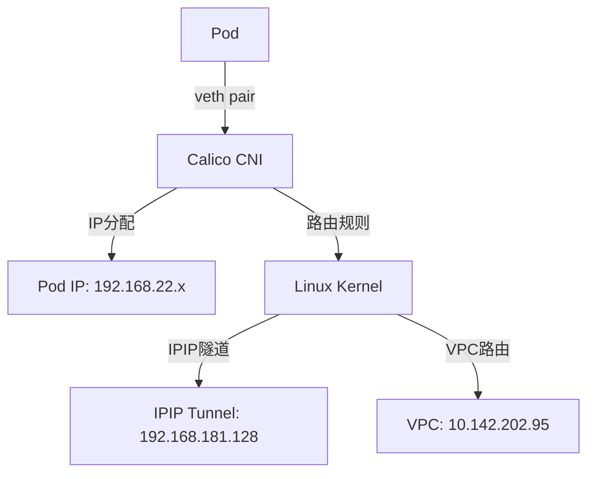
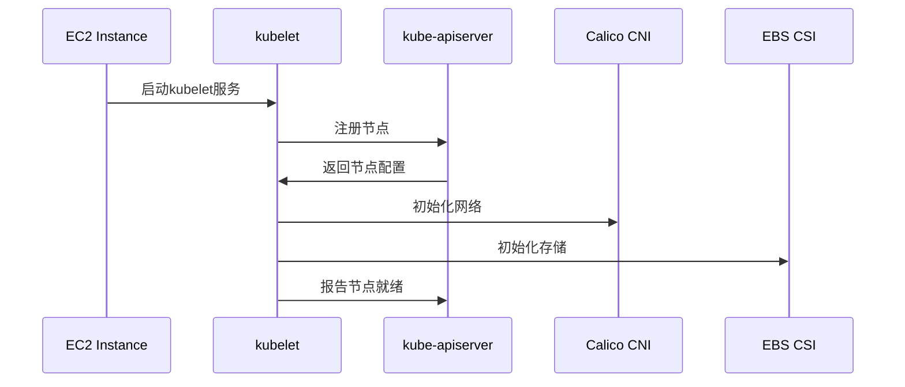
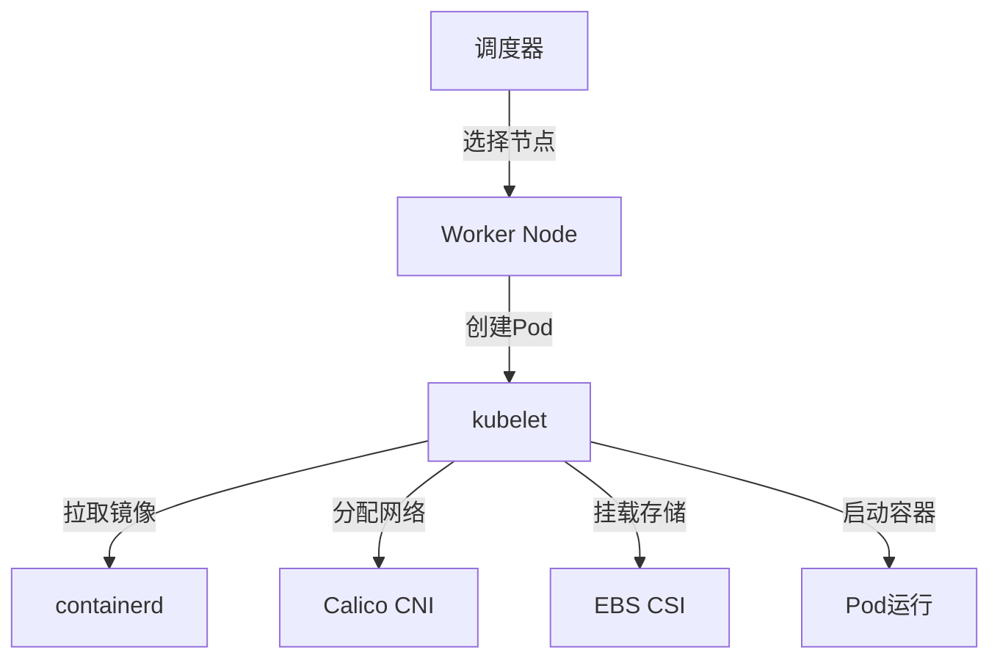
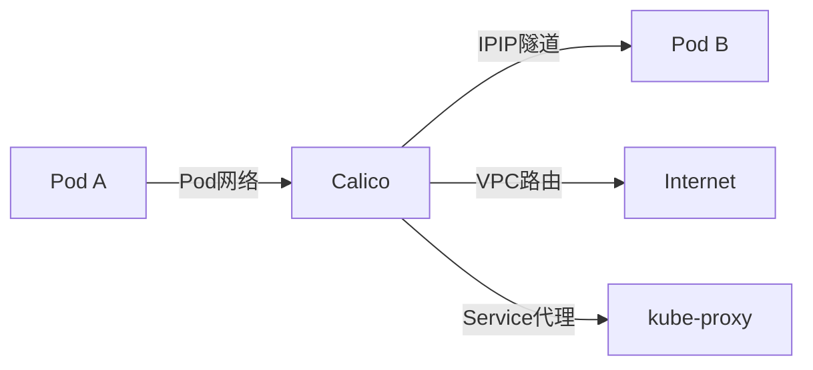

```
root@ip-10-142-207-117:~# kubectl describe node  ip-10-142-202-95.ec2.internal
Name:               ip-10-142-202-95.ec2.internal
Roles:              <none>
Labels:             beta.kubernetes.io/arch=amd64
                    beta.kubernetes.io/instance-type=r6i.2xlarge
                    beta.kubernetes.io/os=linux
                    failure-domain.beta.kubernetes.io/region=us-east-1
                    failure-domain.beta.kubernetes.io/zone=us-east-1c
                    kubernetes.io/arch=amd64
                    kubernetes.io/hostname=ip-10-142-202-95.ec2.internal
                    kubernetes.io/os=linux
                    nlb=true
                    node.kubernetes.io/instance-type=r6i.2xlarge
                    topology.ebs.csi.aws.com/zone=us-east-1c
                    topology.kubernetes.io/region=us-east-1
                    topology.kubernetes.io/zone=us-east-1c
Annotations:        csi.volume.kubernetes.io/nodeid: {"ebs.csi.aws.com":"i-0585ad5dcd422067c"}
                    kubeadm.alpha.kubernetes.io/cri-socket: unix:///var/run/containerd/containerd.sock
                    node.alpha.kubernetes.io/ttl: 0
                    projectcalico.org/IPv4Address: 10.142.202.95/20
                    projectcalico.org/IPv4IPIPTunnelAddr: 192.168.181.128
                    volumes.kubernetes.io/controller-managed-attach-detach: true
CreationTimestamp:  Thu, 10 Jul 2025 09:52:26 +0000
Taints:             <none>
Unschedulable:      false
Lease:
  HolderIdentity:  ip-10-142-202-95.ec2.internal
  AcquireTime:     <unset>
  RenewTime:       Tue, 12 Aug 2025 11:17:07 +0000
Conditions:
  Type                 Status  LastHeartbeatTime                 LastTransitionTime                Reason                       Message
  ----                 ------  -----------------                 ------------------                ------                       -------
  NetworkUnavailable   False   Mon, 28 Jul 2025 01:58:09 +0000   Mon, 28 Jul 2025 01:58:09 +0000   CalicoIsUp                   Calico is running on this node
  MemoryPressure       False   Tue, 12 Aug 2025 11:15:21 +0000   Mon, 28 Jul 2025 01:58:03 +0000   KubeletHasSufficientMemory   kubelet has sufficient memory available
  DiskPressure         False   Tue, 12 Aug 2025 11:15:21 +0000   Mon, 28 Jul 2025 01:58:03 +0000   KubeletHasNoDiskPressure     kubelet has no disk pressure
  PIDPressure          False   Tue, 12 Aug 2025 11:15:21 +0000   Mon, 28 Jul 2025 01:58:03 +0000   KubeletHasSufficientPID      kubelet has sufficient PID available
  Ready                True    Tue, 12 Aug 2025 11:15:21 +0000   Mon, 28 Jul 2025 01:58:03 +0000   KubeletReady                 kubelet is posting ready status. AppArmor enabled
Addresses:
  InternalIP:   10.142.202.95
  ExternalIP:   3.85.198.217
  InternalDNS:  ip-10-142-202-95.ec2.internal
  Hostname:     ip-10-142-202-95.ec2.internal
  ExternalDNS:  ec2-3-85-198-217.compute-1.amazonaws.com
Capacity:
  cpu:                8
  ephemeral-storage:  101430960Ki
  hugepages-1Gi:      0
  hugepages-2Mi:      0
  memory:             64779052Ki
  pods:               110
Allocatable:
  cpu:                8
  ephemeral-storage:  101430960Ki
  hugepages-1Gi:      0
  hugepages-2Mi:      0
  memory:             64574252Ki
  pods:               110
System Info:
  Machine ID:                 ec2d35b755da9991aa7d7f99f6a7b371
  System UUID:                ec2c0014-3733-ef2f-c244-b8a2e440df52
  Boot ID:                    c037fbe9-dbb5-45d0-a132-65d4ee964e15
  Kernel Version:             6.8.0-1032-aws
  OS Image:                   Ubuntu 22.04.5 LTS
  Operating System:           linux
  Architecture:               amd64
  Container Runtime Version:  containerd://1.7.27
  Kubelet Version:            v1.29.8
  Kube-Proxy Version:         v1.29.8
PodCIDR:                      192.168.22.0/24
PodCIDRs:                     192.168.22.0/24
ProviderID:                   aws:///us-east-1c/i-0585ad5dcd422067c
Non-terminated Pods:          (12 in total)
  Namespace                   Name                                CPU Requests  CPU Limits  Memory Requests  Memory Limits  Age
  ---------                   ----                                ------------  ----------  ---------------  -------------  ---
  deepflow                    deepflow-agent-pvf9b                100m (1%)     300m (3%)   128Mi (0%)       512Mi (0%)     29d
  deepflow                    deepflow-clickhouse-0               4 (50%)       4 (50%)     16Gi (25%)       16Gi (25%)     33d
  deepflow                    deepflow-server-7bf785584d-vwpl5    2 (25%)       2 (25%)     6Gi (9%)         6Gi (9%)       31d
  infra                       patch-agent-twcn9                   0 (0%)        0 (0%)      0 (0%)           0 (0%)         32d
  infra                       wazuh-agent-jh6vk                   100m (1%)     100m (1%)   125Mi (0%)       125Mi (0%)     33d
  kube-system                 calico-node-fddg5                   250m (3%)     0 (0%)      0 (0%)           0 (0%)         33d
  kube-system                 ebs-csi-node-7rc8g                  30m (0%)      0 (0%)      120Mi (0%)       768Mi (1%)     33d
  kube-system                 kube-proxy-bb5vd                    0 (0%)        0 (0%)      0 (0%)           0 (0%)         33d
  monitoring                  prometheus-node-exporter-fnn2d      10m (0%)      200m (2%)   20Mi (0%)        50Mi (0%)      33d
  monitoring                  promtail-bcncl                      100m (1%)     300m (3%)   128Mi (0%)       256Mi (0%)     33d
  qa-oneclick                 qaautotest-86c587c576-52drf         1 (12%)       1 (12%)     4Gi (6%)         4Gi (6%)       33d
  sentinelone                 s1-agent-zfwdv                      400m (5%)     400m (5%)   500Mi (0%)       500Mi (0%)     33d
Allocated resources:
  (Total limits may be over 100 percent, i.e., overcommitted.)
  Resource           Requests       Limits
  --------           --------       ------
  cpu                7990m (99%)    8300m (103%)
  memory             27645Mi (43%)  28835Mi (45%)
  ephemeral-storage  0 (0%)         0 (0%)
  hugepages-1Gi      0 (0%)         0 (0%)
  hugepages-2Mi      0 (0%)         0 (0%)
Events:              <none>
```
---

# 📊 Kubernetes节点描述信息深度分析

## 🎯 节点基本信息分析

### 节点标识和角色
- **节点名称**: `ip-10-142-202-95.ec2.internal` - AWS EC2实例的内部DNS名称
- **角色**: `<none>` - 这是一个Worker节点，不是Master节点
- **实例类型**: `r6i.2xlarge` - AWS内存优化型实例，8 vCPU，64GB内存

### AWS集成信息
- **ProviderID**: `aws:///us-east-1c/i-0585ad5dcd422067c`
  - 表明这是AWS云中的EC2实例
  - 位于us-east-1c可用区
  - EC2实例ID: i-0585ad5dcd422067c

## 🏷️ 标签(Labels)分析

### 系统标签
```yaml
# 架构和操作系统
beta.kubernetes.io/arch=amd64
kubernetes.io/arch=amd64
beta.kubernetes.io/os=linux
kubernetes.io/os=linux

# AWS实例信息
beta.kubernetes.io/instance-type=r6i.2xlarge
node.kubernetes.io/instance-type=r6i.2xlarge

# 故障域信息（高可用性）
failure-domain.beta.kubernetes.io/region=us-east-1
failure-domain.beta.kubernetes.io/zone=us-east-1c
topology.kubernetes.io/region=us-east-1
topology.kubernetes.io/zone=us-east-1c

# 存储拓扑
topology.ebs.csi.aws.com/zone=us-east-1c

# 网络负载均衡器标识
nlb=true
```

**关键概念**:
- **故障域(Failure Domain)**: 用于Pod反亲和性调度，确保高可用性
- **拓扑标签**: 帮助调度器理解节点的地理位置和资源分布
- **NLB标签**: 标识此节点可用于Network Load Balancer

## 🔧 注解(Annotations)分析

### 容器运行时接口(CRI)
```yaml
kubeadm.alpha.kubernetes.io/cri-socket: unix:///var/run/containerd/containerd.sock
```
- **CRI**: Container Runtime Interface，Kubernetes与容器运行时的标准接口
- **containerd**: 轻量级容器运行时，替代Docker

### 网络配置
```yaml
projectcalico.org/IPv4Address: 10.142.202.95/20
projectcalico.org/IPv4IPIPTunnelAddr: 192.168.181.128
```
- **Calico**: 网络策略和路由管理插件
- **IPIP隧道**: 用于跨子网的Pod通信

### 存储配置
```yaml
csi.volume.kubernetes.io/nodeid: {"ebs.csi.aws.com":"i-0585ad5dcd422067c"}
volumes.kubernetes.io/controller-managed-attach-detach: true
```
- **CSI**: Container Storage Interface，标准存储接口
- **EBS CSI**: AWS EBS存储驱动
- **控制器管理**: 由Kubernetes控制器自动管理存储卷的挂载/卸载

## 📊 节点状态(Conditions)分析

### 健康状态监控
```yaml
Conditions:
  NetworkUnavailable: False  # 网络正常，Calico运行中
  MemoryPressure: False      # 内存充足
  DiskPressure: False        # 磁盘空间充足
  PIDPressure: False         # 进程ID充足
  Ready: True               # 节点就绪，可接受Pod调度
```

**工作流程**:
1. **kubelet** 定期检查节点资源状态
2. **节点控制器** 监控节点条件变化
3. **调度器** 根据节点条件决定Pod调度

## 🌐 网络配置分析

### IP地址分配
```yaml
Addresses:
  InternalIP: 10.142.202.95      # VPC内网IP
  ExternalIP: 3.85.198.217       # 公网IP
  PodCIDR: 192.168.22.0/24       # Pod网段
```

**网络架构**:
- **VPC内网**: 10.142.202.95/20 (VPC子网)
- **Pod网络**: 192.168.22.0/24 (Calico分配的Pod网段)
- **IPIP隧道**: 192.168.181.128 (跨子网Pod通信)

### 网络组件工作流程


## 💾 资源容量分析

### 硬件规格
```yaml
Capacity:
  cpu: 8                    # 8个vCPU
  memory: 64779052Ki        # ~64GB内存
  pods: 110                 # 最大Pod数量
  ephemeral-storage: 101430960Ki  # ~100GB临时存储
```

### 资源分配
```yaml
Allocated resources:
  cpu: 7990m (99%)          # 已分配99%的CPU
  memory: 27645Mi (43%)      # 已分配43%的内存
```

**关键观察**:
- **CPU过载**: 99%的CPU已分配，可能导致性能问题
- **内存充足**: 还有57%的内存可用
- **Pod密度**: 12个Pod运行在110个Pod容量的节点上

## 🐳 运行中的Pod分析

### 系统组件
```yaml
kube-system:
  - calico-node-fddg5        # Calico网络组件
  - ebs-csi-node-7rc8g       # EBS存储驱动
  - kube-proxy-bb5vd         # Service网络代理
```

### 监控组件
```yaml
monitoring:
  - prometheus-node-exporter-fnn2d  # 节点指标收集
  - promtail-bcncl                  # 日志收集
```

### 应用组件
```yaml
deepflow:                    # 网络流量分析
  - deepflow-agent-pvf9b
  - deepflow-clickhouse-0    # 数据库
  - deepflow-server-7bf785584d-vwpl5

infra:                       # 基础设施
  - patch-agent-twcn9        # 补丁管理
  - wazuh-agent-jh6vk        # 安全监控

sentinelone:                 # 安全防护
  - s1-agent-zfwdv

qa-oneclick:                 # 测试应用
  - qaautotest-86c587c576-52drf
```

## 🔄 组件工作流程

### 1. 节点启动流程


### 2. Pod调度和运行流程


### 3. 网络通信流程


## 🛡️ 安全配置分析

### 安全组件
- **Wazuh Agent**: 安全监控和威胁检测
- **SentinelOne Agent**: 端点安全防护
- **Patch Agent**: 系统补丁管理

### 网络安全
- **Calico**: 网络策略和Pod间通信控制
- **Security Groups**: AWS安全组控制网络访问
- **VPC隔离**: 私有子网部署，通过NAT访问外网

## 📈 性能监控

### 资源使用情况
- **CPU使用率**: 99% (接近饱和)
- **内存使用率**: 43% (健康)
- **Pod数量**: 12/110 (低密度)

### 监控指标
- **Node Exporter**: 收集系统级指标
- **Promtail**: 收集容器日志
- **DeepFlow**: 网络流量分析

## 🚨 潜在问题和建议

### 1. CPU资源紧张
- **问题**: 99%的CPU已分配，可能导致性能问题
- **建议**: 
  - 监控CPU使用率
  - 考虑扩容或Pod迁移
  - 优化资源请求和限制

### 2. 节点角色缺失
- **问题**: 节点没有明确的角色标签
- **建议**: 添加适当的节点角色标签便于管理

### 3. 安全配置
- **现状**: 已部署安全组件
- **建议**: 定期检查安全策略和网络策略

## 🎯 总结

这个节点是一个典型的AWS EKS Worker节点，具有以下特点：

1. **云原生架构**: 完全集成AWS云服务
2. **网络隔离**: 使用Calico进行Pod网络管理
3. **存储集成**: 通过EBS CSI提供持久化存储
4. **安全防护**: 多层安全组件保护
5. **监控完善**: 全面的监控和日志收集
6. **资源优化**: 需要关注CPU资源使用情况

这个节点配置体现了现代Kubernetes集群的最佳实践，包括云集成、网络隔离、安全防护和监控告警。