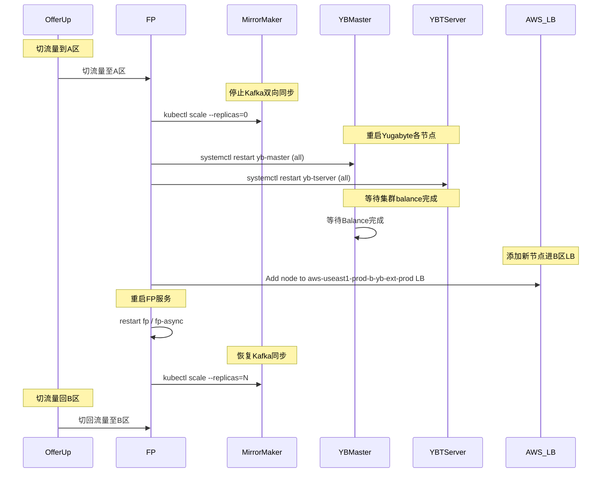
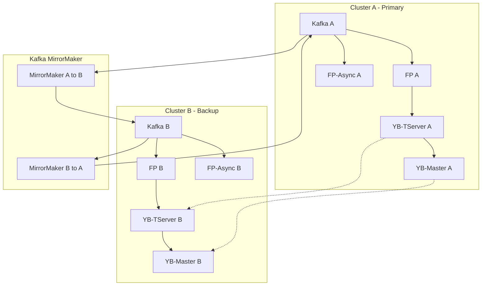

一个典型的yuga 处理过程，涉及到业务（fp）和基础组件（mirror maker）

1. offerup 切到A
2. 关闭Kafka mirror maker (a&b)
kubectl scale --replicas 0 deployment -n prod  mirrormaker2 
3. 重启yugabyte yb-master all node
systemctl restart yb-master
4. 重启yugabyte yb-tserver all node
systemctl restart yb-tserver
5. 等待yugabyte balance
6. 添加new node 到 aws-useast1-prod-b-yb-ext-prod  LB https://us-east-1.console.aws.amazon.com/ec2/home?region=us-east-1#TargetGroup:targetGroupArn=arn:aws:elasticloadbalancing:us-east-1:480609039449:targetgroup/aws-useast1-prod-b-yb-ext-prod/acf8b6179eda946b
7. 重启fp/fp-async
8. 启动 kafka mirror maker
8. offerup 切回B

