# DAPP 部署操作手册

## 概述

DAPP系统采用双平台架构：
- **MGT Platform**: 负责构建镜像，触发Jenkins pre-process
- **DAPP Platform**: 负责应用发布和部署

## 系统架构

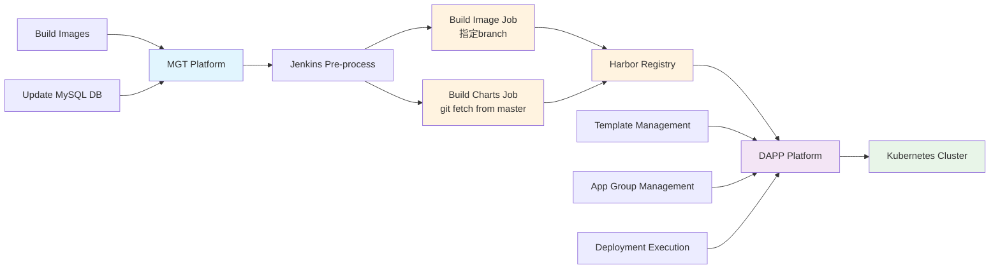

### 数据流向图

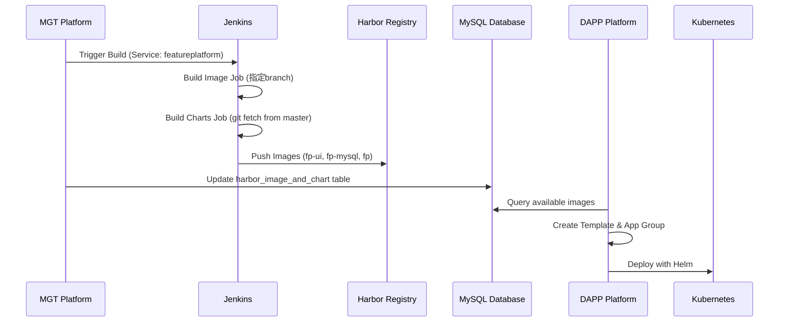

### 平台职责分工

| 平台 | 职责 | 关键功能 |
|------|------|----------|
| **MGT Platform** | 镜像构建 | - 构建Docker镜像<br>- 触发Jenkins pre-process<br>- 更新DAPP MySQL数据库 |
| **Jenkins** | 构建执行 | - Build Image Job（指定branch）<br>- Build Charts Job（git fetch from master）<br>- 推送镜像到Harbor |
| **DAPP Platform** | 应用发布 | - Template管理<br>- App Group管理<br>- 部署执行<br>- 审批流程 |

## MGT Platform 操作

### 1. 构建镜像流程

#### 1.1 配置构建参数
在MGT平台上构建一个service时，需要指定以下参数：

- **Service Name**: 必须与应用名称一致（重要！）
- **Branch**: 指定应用本身的repo branch
  - charts repo默认从master分支获取（git fetch from master）

#### 1.2 构建过程
1. MGT平台触发Jenkins pre-process
2. Jenkins执行两个子任务：
   - **Build Image Job**: 根据指定的应用repo branch构建Docker镜像
   - **Build Charts Job**: 从master分支获取charts文件（默认git fetch from master）
3. 构建Docker镜像并推送到Harbor Registry
4. 自动更新DAPP MySQL数据库中的镜像信息
5. 镜像信息存储在`harbor_image_and_chart`表中

#### 1.3 注意事项
- **Service Name必须与应用名称一致**，否则DAPP无法找到对应的镜像
- 一个service可能包含多个镜像，但service name是统一的标识符
- Branch配置影响最终构建的镜像版本
- Charts文件始终从master分支获取，确保配置的一致性

## DAPP Platform 操作

### 1. 系统数据分类

DAPP平台包含两类数据：

#### 1.1 基础设施数据（oneclick-*）
- 由系统自动插入
- 包含基础应用的部署模板
- 例如：`one-click`、`one-click-prod`

#### 1.2 平台应用数据
- 由用户手动创建
- 用于部署新的业务应用
- 需要完整的Template和App Group配置

### 2. 部署新应用的完整流程

#### 2.1 前置条件
1. MGT平台已构建并推送镜像到Harbor
2. Charts仓库中已存在对应的values文件
3. 应用名称与MGT平台构建的service name一致

#### 2.2 第一步：创建Template Group

**路径**: `App Manager` → `Templates` → `Add new Application Template`

**FeaturePlatform配置示例**:
```
App Name: featureplatform
Template Group: featureplatform
Image TAG: DV.1.0.External_featureplatform
Chart Version: 1.0.0
Chart Name: featureplatform
Sequence: 1
Git Values Path: featureplatform/values.yaml
Values Content: [从Git仓库加载的values文件内容]
```

**配置字段说明**:
```
App Name: [应用名称，必须与MGT service name一致]
Template Group: [模板组名称，建议与应用名称一致]
Image TAG: [从Harbor仓库选择，格式如DV.1.0.External_appname]
Chart Version: [自动填充]
Chart Name: [必须与应用名称一致]
Sequence: 1
Git Values Path: [应用名称]/values.yaml
Values Content: [从Git仓库加载的values文件内容]
```

**重要说明**:
- Chart Name必须与应用名称一致
- Git Values Path格式为`应用名称/values.yaml`
- Image TAG从Harbor仓库获取，通过`/image-chart/get` API

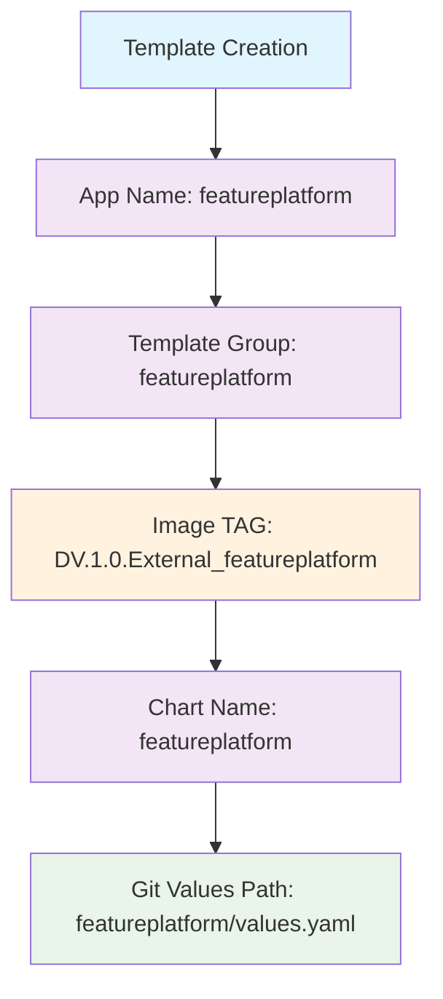

#### 2.3 第二步：创建App Group

**路径**: `App Manager` → `Application Group` → `Groups` → `Create`

**FeaturePlatform配置示例**:
```
Group Name: featureplatform
Apps to Deploy: [fp-ui, fp-mysql, fp]
```

**配置说明**:
```
Group Name: [应用组名称，建议与Template Group一致]
Apps to Deploy: [应用名称列表]
```

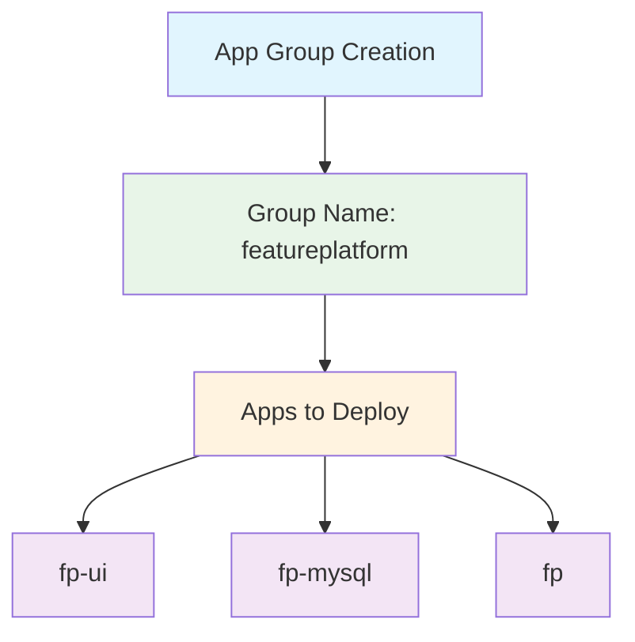

#### 2.4 第三步：执行部署

**推荐方式**: Active Release模式

**路径**: `App Manager` → `Application Group` → `Launch` → `Advance`

**FeaturePlatform部署配置示例**:

**Step 1 - Basic Info**:
```
Cluster: deva
Namespace: qaautotest
选择应用: [fp-ui, fp-mysql, fp]
```

**Step 2 - Apps Configuration**:
```
Template: featureplatform(deva)
Branch: master
可以编辑应用配置
```

**Step 3 - View**:
```
确认配置信息
点击Request提交
```

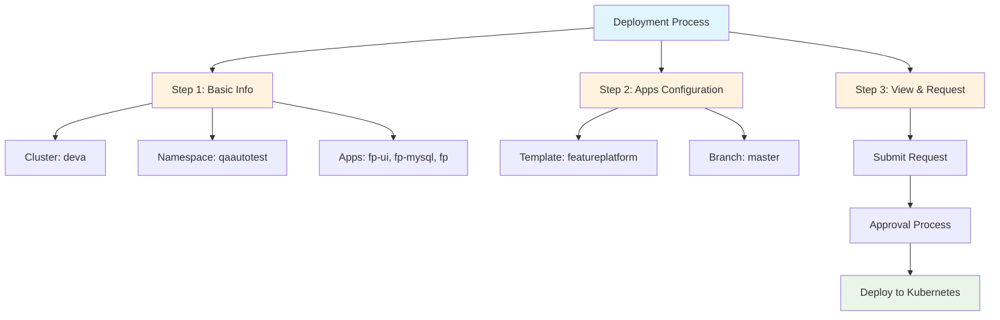

### 3. 部署流程详解

#### 3.1 数据验证
系统会验证以下匹配关系：
- App Group中的应用是否在Template Group中有对应配置
- Chart Name是否与应用名称一致
- Image TAG是否在Harbor仓库中存在

#### 3.2 审批流程
1. 提交部署请求
2. 进入审批队列
3. 管理员审批
4. 审批通过后执行部署

#### 3.3 实际部署
1. 创建Kubernetes Namespace
2. 使用Helm部署应用
3. 配置网络和存储
4. 启动应用服务

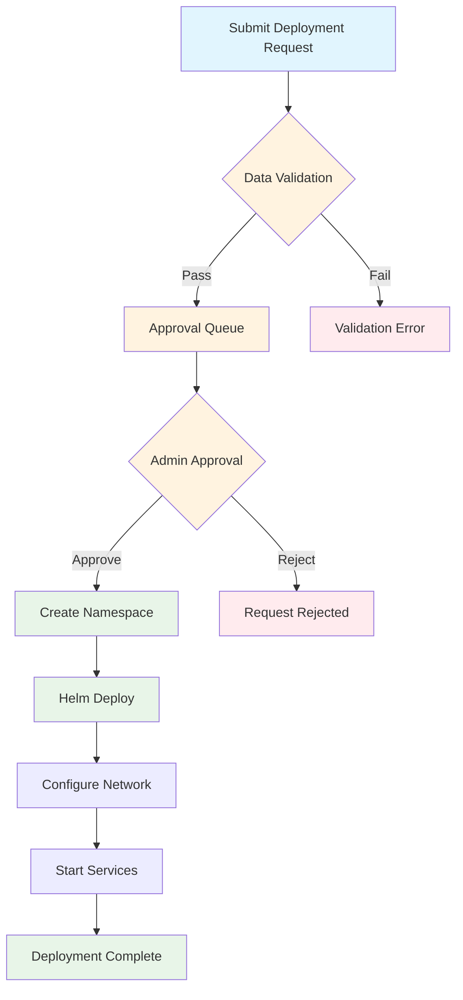

### 4. 部署状态跟踪

#### 4.1 状态变化
```
pending → approved → Deploying → Done/Failed
```

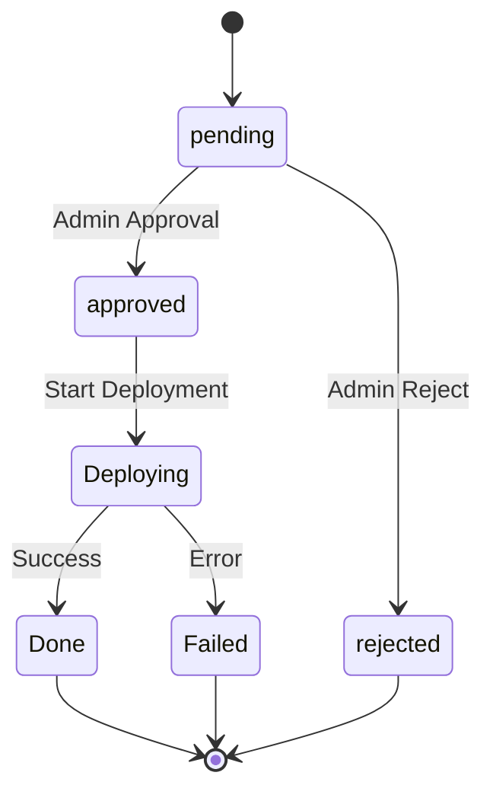

#### 4.2 监控方式
- **实时状态**: `GET /deploy/status?request_group_id={id}`
- **历史记录**: `GET /app/launch-group/history`
- **Pod日志**: `kubectl logs -n [namespace] deployment/[appname]`

**FeaturePlatform监控示例**:
```bash
# 查看部署状态
GET /deploy/status?request_group_id=123

# 查看Pod日志
kubectl logs -n qaautotest deployment/fp-ui
kubectl logs -n qaautotest deployment/fp-mysql
kubectl logs -n qaautotest deployment/fp
```

## 关键配置说明

### 1. 命名规范

#### 1.1 应用名称一致性
以下字段必须保持一致：
- MGT Platform的Service Name
- DAPP Template的App Name
- DAPP Template的Chart Name
- Charts仓库中的目录名称

#### 1.2 示例：FeaturePlatform应用

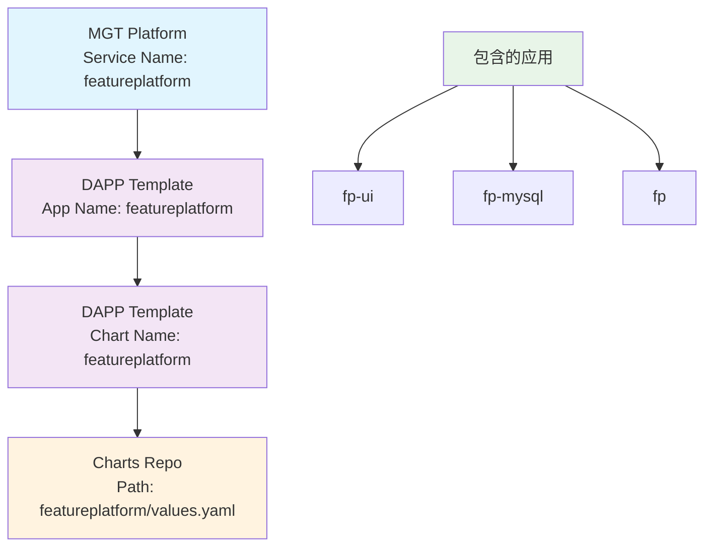

**FeaturePlatform配置示例**:
```
MGT Service Name: featureplatform
DAPP App Name: featureplatform
DAPP Chart Name: featureplatform
Charts Path: featureplatform/values.yaml
包含应用: [fp-ui, fp-mysql, fp]
```

### 2. 数据来源

#### 2.1 Image TAG获取
```javascript
// API调用
GET /image-chart/get?app_name={appName}&filter={filter}

// 数据来源
SELECT * FROM harbor_image_and_chart 
WHERE app_name = ? AND image_tag LIKE ? 
ORDER BY id DESC LIMIT 200
```

#### 2.2 Git Values获取
```javascript
// 获取values文件列表
GET /chart/values/list?app_name={appName}

// 获取具体values文件内容
GET /charts/values/get?path={path}

// 数据来源：datavisorcode/charts.git仓库
```

### 3. Template Group和App Group关系

#### 3.1 推荐的一一对应关系

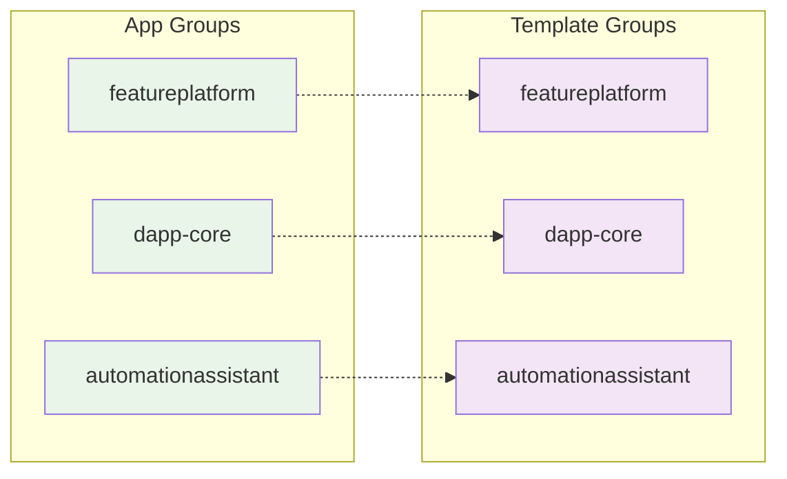

| App Group | Template Group | 用途 |
|-----------|----------------|------|
| `featureplatform` | `featureplatform` | 特性平台应用组 |
| `dapp-core` | `dapp-core` | DAPP核心应用组 |
| `automationassistant` | `automationassistant` | 自动化助手应用组 |

#### 3.2 环境变体

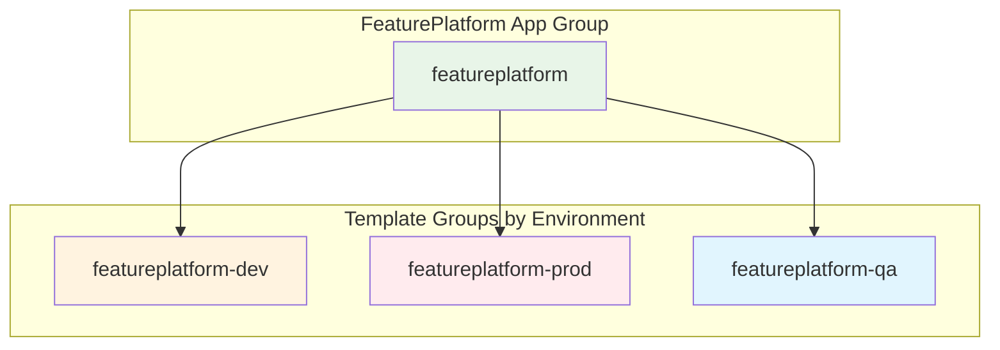

| App Group | Template Group | 环境 |
|-----------|----------------|------|
| `featureplatform` | `featureplatform-dev` | 开发环境 |
| `featureplatform` | `featureplatform-prod` | 生产环境 |
| `featureplatform` | `featureplatform-qa` | 测试环境 |

## 常见问题解决

### 1. 镜像找不到
**问题**: DAPP无法找到对应的Image TAG
**解决**: 检查MGT Platform的Service Name是否与DAPP的App Name一致

### 2. Values文件不存在
**问题**: Git Values Path显示"file not exist"
**解决**: 检查Charts仓库中是否存在对应的values.yaml文件

### 3. Template验证失败
**问题**: "The template does not contain the application for the app group"
**解决**: 确保App Group中的应用在Template Group中有对应配置

### 4. 部署失败
**问题**: 部署状态显示Failed
**解决**: 
1. 检查Kubernetes集群资源是否充足
2. 查看Pod日志定位具体错误
3. 验证values文件配置是否正确

## 最佳实践

### 1. 命名规范
- 使用统一的命名规范
- 保持各平台间名称一致性
- 使用有意义的名称便于管理

### 2. 版本管理
- 使用语义化版本号
- 在MGT Platform中明确指定branch
- 在DAPP中记录版本变更

### 3. 环境隔离
- 为不同环境创建不同的Template Group
- 使用不同的Namespace隔离环境
- 配置环境特定的参数

### 4. 监控和日志
- 定期检查部署状态
- 监控应用运行状态
- 保留部署历史记录

## 操作检查清单

### MGT Platform检查项
- [ ] Service Name与应用名称一致
- [ ] 指定了正确的应用repo branch
- [ ] 指定了正确的charts repo branch
- [ ] 构建成功并推送到Harbor
- [ ] 镜像信息已更新到DAPP数据库

### DAPP Platform检查项
- [ ] 创建了对应的Template Group
- [ ] Template中的App Name和Chart Name一致
- [ ] 创建了对应的App Group
- [ ] App Group中的应用在Template Group中有配置
- [ ] 选择了正确的部署模式
- [ ] 配置了正确的集群和Namespace
- [ ] 提交了部署请求
- [ ] 通过了审批流程
- [ ] 部署成功并运行正常

### FeaturePlatform部署检查示例

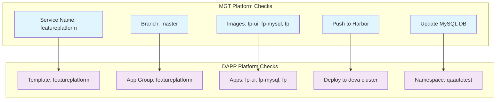

## Jenkins构建流程详解

### Jenkins Pre-process 子任务

当MGT Platform触发Jenkins pre-process时，Jenkins会并行执行两个子任务：

#### 1. Build Image Job
- **目的**: 构建Docker镜像
- **输入**: 应用repo的指定branch
- **输出**: Docker镜像文件
- **配置**: 使用MGT Platform指定的应用repo branch

#### 2. Build Charts Job  
- **目的**: 获取charts配置文件
- **输入**: charts repo的master分支
- **输出**: values.yaml等配置文件
- **配置**: 默认从master分支获取（git fetch from master）

### 构建流程时序

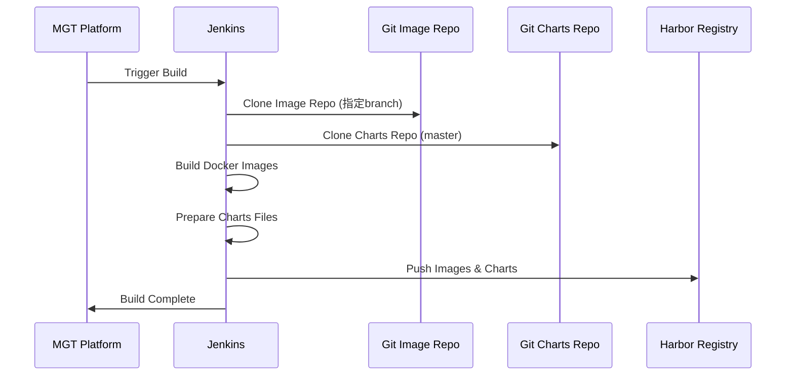

### 关键配置说明

- **Image Branch**: 由MGT Platform指定，影响最终镜像的代码版本
- **Charts Branch**: 固定为master，确保配置的一致性和稳定性
- **并行执行**: 两个子任务可以并行执行，提高构建效率

## 总结

DAPP部署系统通过MGT和DAPP双平台协作，实现了从镜像构建到应用部署的完整流程。关键是要保持各平台间配置的一致性，特别是应用名称的统一。通过Template Group和App Group的设计，提供了灵活的部署配置管理能力。

### FeaturePlatform完整部署流程总结

```mermaid
graph LR
    subgraph "MGT Platform"
        A1[Build Service: featureplatform]
        A2[Push Images: fp-ui, fp-mysql, fp]
        A3[Update MySQL DB]
    end
    
    subgraph "DAPP Platform"
        B1[Create Template: featureplatform]
        B2[Create App Group: featureplatform]
        B3[Deploy to deva/qaautotest]
    end
    
    subgraph "Kubernetes"
        C1[Namespace: qaautotest]
        C2[Deployments: fp-ui, fp-mysql, fp]
        C3[Services Running]
    end
    
    A1 --> A2 --> A3
    A3 --> B1 --> B2 --> B3
    B3 --> C1 --> C2 --> C3
    
    style A1 fill:#e1f5fe
    style A2 fill:#e1f5fe
    style A3 fill:#e1f5fe
    style B1 fill:#f3e5f5
    style B2 fill:#f3e5f5
    style B3 fill:#f3e5f5
    style C1 fill:#e8f5e8
    style C2 fill:#e8f5e8
    style C3 fill:#e8f5e8
```

**关键成功因素**:
1. **命名一致性**: MGT Service Name = DAPP App Name = Chart Name
2. **配置完整性**: Template Group和App Group一一对应
3. **流程规范性**: 遵循MGT构建 → DAPP部署的标准流程
4. **监控及时性**: 实时跟踪部署状态和日志 