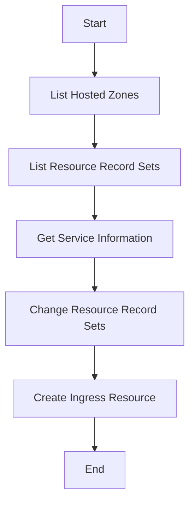

# AWS Route53 URL Creation Guide

This document outlines the steps to create and manage DNS records in AWS Route53, including examples of commands and their expected outputs.

## 1. List Hosted Zones

To list all hosted zones in your AWS account, use the following command:

```bash
aws route53 list-hosted-zones | cat | jq
```

### Example Output:
```json
{
  "Id": "/hostedzone/Z27XZ2PVZXX6I6",
  "Name": "dv-api.com.",
  "CallerReference": "RISWorkflow-c30273cb2b91f50173443310b6092d22",
  "Config": {
    "Comment": "HostedZone created by Route53 Registrar",
    "PrivateZone": false
  },
  "ResourceRecordSetCount": 1656
}
```

**Extracted Hosted Zone ID**: `Z27XZ2PVZXX6I6`

---

## 2. List Resource Record Sets

To list the resource record sets for a specific hosted zone, use the following command:

```bash
aws route53 list-resource-record-sets \
  --hosted-zone-id Z27XZ2PVZXX6I6 \
  --query "ResourceRecordSets[?Name == 'loki.dv-api.com.']"
```

### Example Output:
```json
[
    {
        "Name": "loki.dv-api.com.",
        "Type": "CNAME",
        "TTL": 300,
        "ResourceRecords": [
            {
                "Value": "a28da29ec1599470a902c4a0d493d269-6e244cafa31daf5e.elb.us-west-2.amazonaws.com"
            }
        ]
    }
]
```

**Extracted Record Type**: `CNAME`

---

## 3. Get Service Information

To get information about services in the `ingress-nginx` namespace, use the following command:

```bash
kwestmgt get svc -n ingress-nginx
```

### Example Output:

```sh
NAME TYPE CLUSTER-IP EXTERNAL-IP PORT(S) AGE
ingress-nginx-external-igw LoadBalancer 10.96.34.159 a923b0eed657848d7bbd8cc08ac46122-7ba02faab8d536dd.elb.us-west-2.amazonaws.com 443:32652/TCP 370d
ingress-nginx-internal LoadBalancer 10.111.174.119 a28da29ec1599470a902c4a0d493d269-6e244cafa31daf5e.elb.us-west-2.amazonaws.com 80:31608/TCP,443:32250/TCP 2y223d
ingress-nginx-internal-tcp LoadBalancer 10.98.164.1 a97709351c6744cc39824904345b96dd-8a67bcb63ebea6a0.elb.us-west-2.amazonaws.com 3306:30633/TCP,30001:32007/TCP,32000:32640/TCP,32100:32621/TCP,32200:30256/TCP,32300:31872/TCP,37077:31983/TCP,1515:32681/TCP,1514:31950/TCP,32299:30353/TCP,22:30604/TCP,55000:30775/TCP,33061:32624/TCP 2y223d
```

**Extracted Internal Load Balancer**: `a28da29ec1599470a902c4a0d493d269-6e244cafa31daf5e.elb.us-west-2.amazonaws.com`

---

## 4. Change Resource Record Sets

To change resource record sets, use the following command:

```bash
aws route53 change-resource-record-sets \
  --hosted-zone-id Z27XZ2PVZXX6I6 \
  --change-batch '{
    "Changes": [
      {
        "Action": "UPSERT",
        "ResourceRecordSet": {
          "Name": "cloud-cost-west-mgt.dv-api.com.",
          "Type": "CNAME",
          "TTL": 300,
          "ResourceRecords": [
            {
              "Value": "a28da29ec1599470a902c4a0d493d269-6e244cafa31daf5e.elb.us-west-2.amazonaws.com"
            }
          ]
        }
      }
    ]
  }'
```

**Action**: Create or update the ingress.

---

## 5. Create Ingress Resource

To create an Ingress resource in Kubernetes, use the following YAML configuration:

```yaml
apiVersion: networking.k8s.io/v1
kind: Ingress
metadata:
  name: cloud-cost-calculator-ingress
  namespace: monitoring
  annotations:
    nginx.ingress.kubernetes.io/ssl-redirect: "false"
spec:
  ingressClassName: nginx
  rules:
    - host: cloud-cost-west-mgt.dv-api.com
      http:
        paths:
          - path: /
            pathType: Prefix
            backend:
              service:
                name: cloud-cost-calculator
                port:
                  number: 8080
```

---

## Flowchart



---

This guide provides a comprehensive overview of how to manage DNS records in AWS Route53 and create corresponding Kubernetes Ingress resources. Each command is accompanied by an example output to help you understand the expected results.