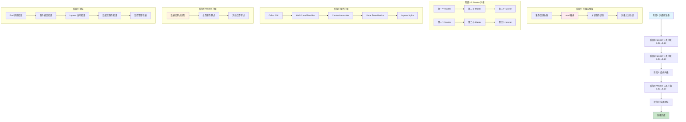
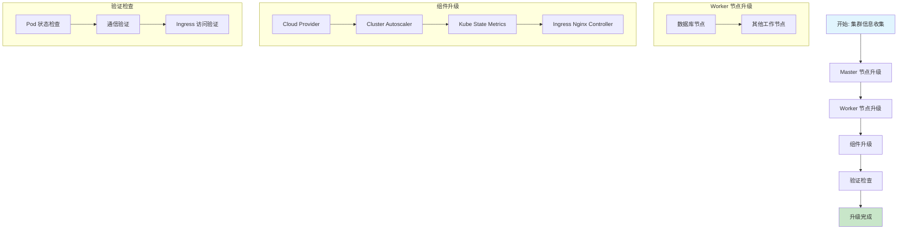
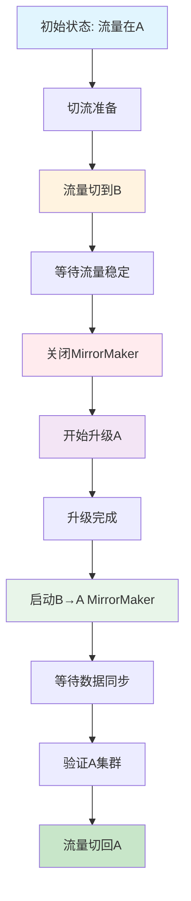
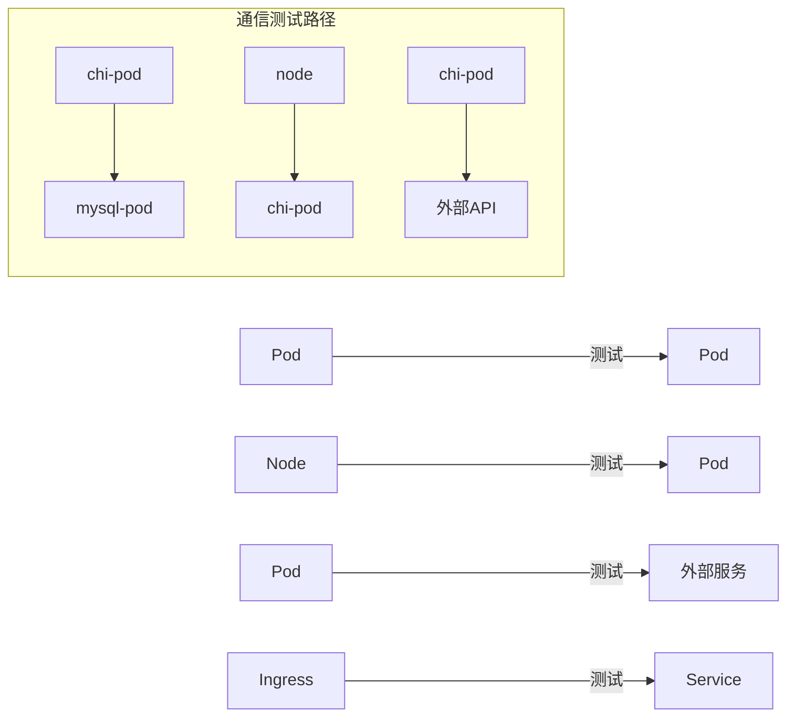

# Kubernetes 集群升级计划文档 (v1.27 => v1.29)

### 1. master process (some notes)
```sh
---
# k get node -o wide | grep contro
ip-172-30-102-11.ec2.internal    Ready    control-plane   18m    v1.24.17   172.30.102.11    <none>           Ubuntu 22.04.5 LTS   6.8.0-1033-aws   containerd://1.7.27
ip-172-30-103-231.ec2.internal   Ready    control-plane   48m    v1.24.17   172.30.103.231   <none>           Ubuntu 22.04.5 LTS   6.8.0-1033-aws   containerd://1.7.27
ip-172-30-106-189.ec2.internal   Ready    control-plane   66m    v1.24.17   172.30.106.189   <none>           Ubuntu 22.04.5 LTS   6.8.0-1033-aws   containerd://1.7.27


ssh -i /Users/rshao/work/code_repos/infra_oncall_mgt/dv_kubeconfig/aws_pem/general-prod2022-useast.pem ubuntu@172.30.106.189

# master
watch -n 1 "kubectl get nodes | grep  control-plane"

# compoennts
watch -n 1 "kubectl get pod -n kube-system"
watch -n 1 'kubectl get pods -n kube-system | egrep "apiserver|controller|scheduler|etcd|coredns"'


# pending status
watch -n 1 "kubectl get pod -n kube-system | grep -v Running | grep -v Completed"


kubectl drain ip-172-30-106-189.ec2.internal --ignore-daemonsets


wait master node was ready before uncordon

kubectl uncordon ip-172-30-106-189.ec2.internal

wait 2mins...

finish all node and check all pods 

# [notice]:
check app 
- 主要保证ingress
    - jumpserver 
    - dapp
    - grafana
        - pod
        - sla
        - multi
    - datavisor internal ui (platform api server)
```

note:
```

ETCDCTL_API=3 etcdctl \
  --endpoints=https://172.30.106.189:2379 \
  --cacert=/etc/kubernetes/pki/etcd/ca.crt \
  --key=/etc/kubernetes/pki/etcd/healthcheck-client.key \
  --cert=/etc/kubernetes/pki/etcd/healthcheck-client.crt \
  endpoint health --write-out=table


ETCDCTL_API=3 etcdctl \
  --endpoints=https://172.30.65.168:2379 \
  --cacert=/etc/kubernetes/pki/etcd/ca.crt \
  --key=/etc/kubernetes/pki/etcd/healthcheck-client.key \
  --cert=/etc/kubernetes/pki/etcd/healthcheck-client.crt \
  member list --write-out=table

cordon 
drain 
etcd remove member
delete node 


```

### 2. components
```sh
root@ip-172-30-106-189:~/henry/1.24-1.26# ls */*
aws-cloud-controller-manager-chart-1.26/Chart.yaml   cluster-autoscaler-chart-1.26/README.md            ingress-nginx-chart/OWNERS               kube-state-metrics-chart-2.9/README.md
aws-cloud-controller-manager-chart-1.26/LICENSE      cluster-autoscaler-chart-1.26/README.md.gotmpl     ingress-nginx-chart/README.md            kube-state-metrics-chart-2.9/values.yaml
aws-cloud-controller-manager-chart-1.26/Readme.md    cluster-autoscaler-chart-1.26/valuesOverride.yaml  ingress-nginx-chart/README.md.gotmpl
aws-cloud-controller-manager-chart-1.26/values.yaml  cluster-autoscaler-chart-1.26/values.yaml          ingress-nginx-chart/values.yaml
cluster-autoscaler-chart-1.26/Chart.yaml             ingress-nginx-chart/Chart.yaml                     kube-state-metrics-chart-2.9/Chart.yaml

aws-cloud-controller-manager-chart-1.26/templates:
cluserrolebinding.yaml  clusterrole.yaml  daemonset.yaml  _helpers.tpl  NOTES.txt  rolebinding.yaml  serviceaccount.yaml

cluster-autoscaler-chart-1.26/templates:
clusterrolebinding.yaml  deployment.yaml  NOTES.txt  podsecuritypolicy.yaml            prometheusrule.yaml  role.yaml    serviceaccount.yaml  service.yaml
clusterrole.yaml         _helpers.tpl     pdb.yaml   priority-expander-configmap.yaml  rolebinding.yaml     secret.yaml  servicemonitor.yaml  vpa.yaml

ingress-nginx-chart/changelog:
helm-chart-2.10.0.md  helm-chart-3.0.0.md   helm-chart-3.18.0.md  helm-chart-3.30.0.md  helm-chart-3.8.0.md   helm-chart-4.0.6.md   helm-chart-4.1.2.md         helm-chart-4.8.1.md
helm-chart-2.11.0.md  helm-chart-3.10.0.md  helm-chart-3.19.0.md  helm-chart-3.3.0.md   helm-chart-3.9.0.md   helm-chart-4.0.7.md   helm-chart-4.2.0.md         helm-chart-4.8.2.md
helm-chart-2.11.1.md  helm-chart-3.10.1.md  helm-chart-3.20.0.md  helm-chart-3.31.0.md  helm-chart-4.0.10.md  helm-chart-4.0.9.md   helm-chart-4.2.1.md         helm-chart-4.8.3.md
helm-chart-2.11.2.md  helm-chart-3.11.0.md  helm-chart-3.20.1.md  helm-chart-3.3.1.md   helm-chart-4.0.11.md  helm-chart-4.10.0.md  helm-chart-4.3.0.md         helm-chart-4.9.0.md
helm-chart-2.11.3.md  helm-chart-3.11.1.md  helm-chart-3.21.0.md  helm-chart-3.32.0.md  helm-chart-4.0.12.md  helm-chart-4.10.1.md  helm-chart-4.4.0.md         helm-chart-4.9.1.md
helm-chart-2.12.0.md  helm-chart-3.12.0.md  helm-chart-3.22.0.md  helm-chart-3.33.0.md  helm-chart-4.0.13.md  helm-chart-4.10.2.md  helm-chart-4.5.2.md         helm-chart.md.gotmpl
helm-chart-2.12.1.md  helm-chart-3.13.0.md  helm-chart-3.23.0.md  helm-chart-3.34.0.md  helm-chart-4.0.14.md  helm-chart-4.1.0.md   helm-chart-4.6.0.md
helm-chart-2.13.0.md  helm-chart-3.14.0.md  helm-chart-3.24.0.md  helm-chart-3.4.0.md   helm-chart-4.0.15.md  helm-chart-4.11.0.md  helm-chart-4.6.1.md
helm-chart-2.14.0.md  helm-chart-3.15.0.md  helm-chart-3.25.0.md  helm-chart-3.5.0.md   helm-chart-4.0.18.md  helm-chart-4.11.1.md  helm-chart-4.7.0.md
helm-chart-2.15.0.md  helm-chart-3.15.1.md  helm-chart-3.26.0.md  helm-chart-3.5.1.md   helm-chart-4.0.1.md   helm-chart-4.11.2.md  helm-chart-4.7.1.md
helm-chart-2.16.0.md  helm-chart-3.16.0.md  helm-chart-3.27.0.md  helm-chart-3.6.0.md   helm-chart-4.0.2.md   helm-chart-4.11.3.md  helm-chart-4.7.2.md
helm-chart-2.9.0.md   helm-chart-3.16.1.md  helm-chart-3.28.0.md  helm-chart-3.7.0.md   helm-chart-4.0.3.md   helm-chart-4.11.4.md  helm-chart-4.8.0-beta.0.md
helm-chart-2.9.1.md   helm-chart-3.17.0.md  helm-chart-3.29.0.md  helm-chart-3.7.1.md   helm-chart-4.0.5.md   helm-chart-4.11.5.md  helm-chart-4.8.0.md

ingress-nginx-chart/ci:
admission-webhooks-cert-manager-values.yaml     controller-daemonset-opentelemetry-values.yaml   controller-deployment-podannotations-values.yaml  deamonset-psp-values.yaml
controller-configmap-addheaders-values.yaml     controller-daemonset-podannotations-values.yaml  controller-deployment-values.yaml                 deamonset-webhook-and-psp-values.yaml
controller-configmap-proxyheaders-values.yaml   controller-daemonset-values.yaml                 controller-hpa-values.yaml                        deployment-psp-values.yaml
controller-configmap-values.yaml                controller-deployment-extra-modules-values.yaml  controller-ingressclass-values.yaml               deployment-webhook-and-psp-values.yaml
controller-daemonset-extra-modules-values.yaml  controller-deployment-metrics-values.yaml        controller-service-internal-values.yaml
controller-daemonset-metrics-values.yaml        controller-deployment-opentelemetry-values.yaml  controller-service-values.yaml

ingress-nginx-chart/templates:
admission-webhooks                      controller-daemonset.yaml             controller-prometheusrule.yaml    controller-servicemonitor.yaml            default-backend-psp.yaml
clusterrolebinding.yaml                 controller-deployment.yaml            controller-psp.yaml               controller-service-webhook.yaml           default-backend-rolebinding.yaml
clusterrole.yaml                        controller-hpa.yaml                   controller-rolebinding.yaml       controller-service.yaml                   default-backend-role.yaml
controller-configmap-addheaders.yaml    controller-ingressclass-aliases.yaml  controller-role.yaml              default-backend-deployment.yaml           default-backend-serviceaccount.yaml
controller-configmap-proxyheaders.yaml  controller-ingressclass.yaml          controller-secret.yaml            default-backend-extra-configmaps.yaml     default-backend-service.yaml
controller-configmap-tcp.yaml           controller-keda.yaml                  controller-serviceaccount.yaml    default-backend-hpa.yaml                  _helpers.tpl
controller-configmap-udp.yaml           controller-networkpolicy.yaml         controller-service-internal.yaml  default-backend-networkpolicy.yaml        NOTES.txt
controller-configmap.yaml               controller-poddisruptionbudget.yaml   controller-service-metrics.yaml   default-backend-poddisruptionbudget.yaml  _params.tpl

ingress-nginx-chart/tests:
admission-webhooks                           controller-hpa_test.yaml                   controller-prometheusrule_test.yaml    controller-service-webhook_test.yaml
controller-configmap-addheaders_test.yaml    controller-ingressclass-aliases_test.yaml  controller-serviceaccount_test.yaml    default-backend-deployment_test.yaml
controller-configmap-proxyheaders_test.yaml  controller-ingressclass_test.yaml          controller-service-internal_test.yaml  default-backend-extra-configmaps_test.yaml
controller-configmap_test.yaml               controller-keda_test.yaml                  controller-service-metrics_test.yaml   default-backend-poddisruptionbudget_test.yaml
controller-daemonset_test.yaml               controller-networkpolicy_test.yaml         controller-servicemonitor_test.yaml    default-backend-serviceaccount_test.yaml
controller-deployment_test.yaml              controller-poddisruptionbudget_test.yaml   controller-service_test.yaml           default-backend-service_test.yaml

kube-state-metrics-chart-2.9/templates:
ciliumnetworkpolicy.yaml  extra-manifests.yaml    NOTES.txt                    psp-clusterrole.yaml  serviceaccount.yaml            stsdiscovery-role.yaml
clusterrolebinding.yaml   _helpers.tpl            pdb.yaml                     rbac-configmap.yaml   servicemonitor.yaml            verticalpodautoscaler.yaml
crs-configmap.yaml        kubeconfig-secret.yaml  podsecuritypolicy.yaml       rolebinding.yaml      service.yaml
deployment.yaml           networkpolicy.yaml      psp-clusterrolebinding.yaml  role.yaml             stsdiscovery-rolebinding.yaml
root@ip-172-30-106-189:~/henry/1.24-1.26# 
```
```
helm 
```
## 升级流程概览

### 核心升级流程

**升级策略**：分阶段渐进式，v1.27 → v1.28 → v1.29（必须经过中间版本）



### 升级步骤详解

#### 阶段0: 升级前准备
- 集群信息收集：节点列表、数据库/业务服务节点识别、ASG/Launch Template 检查
- 数据备份：etcd（必须）、数据库、关键应用配置
- 升级计划验证：kubeadm 升级计划、组件兼容性、回滚方案

#### 阶段1-2: Master 节点升级
- **1.27 → 1.28**：逐个升级 Master（保持至少 2 个可用），drain → kubeadm → kubelet → uncordon
- **1.28 → 1.29**：重复上述流程，确保版本一致

#### 阶段3: 组件升级
按顺序：Calico CNI → AWS Cloud Provider → Cluster Autoscaler → Kube State Metrics → Ingress Nginx

#### 阶段4: Worker 节点升级
- 数据库节点优先 → 业务服务节点 → 其他工作节点
- 逐个升级，验证服务健康

#### 阶段5: 全面验证
Pod 状态、服务通信、Ingress 访问、数据库服务、监控告警

### 关键依赖关系

```
Master 升级 → 组件升级 → Worker 升级
```

## 生产环境关键注意事项

### ⚠️ 高风险操作警告

#### 1. Master 节点升级风险

**风险**：API Server 中断、etcd 数据损坏、版本不一致

**预防**：
- 备份 etcd（必须）
- 逐个升级 Master（保持至少 2 个可用）
- 验证升级计划：`kubeadm upgrade plan`
- 监控 API Server 健康状态
- 准备回滚方案

**问题排查**：`kubeadm upgrade apply` 失败 → 检查 etcd 健康；无法加入集群 → 检查网络/证书；API Server 无法启动 → 检查 kubelet 日志

#### 2. Worker 节点升级风险

**风险**：Pod 迁移失败、数据库/业务服务中断、ASG 自动扩展导致版本不一致

**预防**：
- 数据库节点优先升级
- 逐个升级节点，等待就绪后再下一个
- 检查 Pod 分布，确保有足够节点
- 临时调整 ASG MinSize/MaxSize，防止自动扩展
- drain 使用 `--timeout=300s`
- 使用 `kubectl wait` 验证节点就绪

**问题排查**：drain 失败 → 检查 PDB/DaemonSet；Pod 无法迁移 → 检查资源/调度策略；无法加入集群 → 检查 kubelet/网络；ASG 创建旧节点 → 更新 Launch Template

#### 3. 组件升级风险

**风险**：Calico 网络中断、LoadBalancer 中断、Autoscaler 异常、Ingress 访问中断

**预防**：
- 严格按顺序：Calico → Cloud Provider → Autoscaler → Metrics → Ingress
- 升级后立即验证：网络连通性、LoadBalancer、Ingress 访问
- 检查组件日志

**问题排查**：Calico Pod 无法通信 → 检查 Pod 状态/网络策略；LoadBalancer 无法创建 → 检查 IAM/配置；Ingress 失败 → 检查 Controller/Service；Autoscaler 异常 → 检查 ASG/IAM

#### 4. AWS 相关风险

**风险**：Launch Template 版本、实例类型兼容性、LoadBalancer 重新创建、IAM 权限不足

**预防**：
- 升级前更新所有 ASG Launch Template
- 验证实例类型兼容性
- 检查并更新 IAM 权限
- 备份 LoadBalancer 配置
- 监控 EC2/ELB/ASG 状态

**问题排查**：ASG 创建旧节点 → 更新 Launch Template 为 `$Latest`；LoadBalancer 无法创建 → 检查 IAM/安全组；实例无法加入 → 检查用户数据/kubelet；网络问题 → 检查 VPC/安全组

#### 5. 数据库服务风险

**风险**：服务中断、数据一致性、连接中断

**预防**：
- 数据库节点优先升级
- 每个节点升级后立即验证服务健康
- 验证应用与数据库连接
- 监控数据库性能指标

**问题排查**：MySQL 中断 → 检查 Pod/持久化存储；Kafka 不可用 → 检查 Pod/Zookeeper；YugabyteDB 分裂 → 检查 YB-Master/TServer；ClickHouse 失败 → 检查 Pod/数据目录

#### 6. 业务服务风险

**风险**：服务中断、dcluster 受影响、Ingress 访问中断

**预防**：
- 业务低峰期升级
- 升级后立即验证关键服务
- 验证所有 Ingress 域名访问
- 监控业务关键指标

**问题排查**：Pod 无法启动 → 检查资源/镜像；dcluster 不可用 → 检查 Pod/配置；Ingress 502/503 → 检查 Controller/后端；响应时间增加 → 检查资源/网络

### 🔍 关键检查点

**Master 节点升级后**：API Server 健康、etcd 状态、版本一致性、系统 Pod 状态

**Worker 节点升级后**：节点 Ready、Pod 状态、网络连通性、资源使用

**组件升级后**：组件 Pod 状态、功能验证、日志检查、服务访问

**升级完成后**：节点版本一致、Pod Running、服务正常、监控正常、数据库正常、Ingress 正常

### 📋 回滚准备

**触发条件**：Master 升级失败、>50% Pod 非 Running、关键服务无法访问、大量告警

**回滚步骤**：停止升级 → 回滚 Master → 回滚 Worker → 回滚组件 → 恢复 etcd → 验证集群

### ⏰ 时间窗口

- **测试环境**：工作日白天
- **预生产环境**：工作日晚上
- **生产环境**：周末/节假日
- **预计时间**：小型 <10 节点（2-4h）、中型 10-50 节点（4-8h）、大型 >50 节点（8-16h）

## 集群基本信息

```yaml
集群名称: aws-useast1-dev-c
区域: us-east-1
IMDS版本: IMDSv2
AWS ASG: [待补充]
```
```sh
aws autoscaling describe-auto-scaling-groups --region us-east-1 | grep -A5 -B5 "aws-useast1-dev-c" | grep AutoScalingGroupName

        "AutoScalingGroupName": "aws-useast1-dev-c-preprod-dedicated-m7a2xlarge",
        "AutoScalingGroupName": "aws-useast1-dev-c-preprod-dedicated-r6i.2xlarge",
        "AutoScalingGroupName": "aws-useast1-dev-c-private-r6i.2xlarge",
        "AutoScalingGroupName": "aws-useast1-dev-c-r6i.2xlarge",
        "AutoScalingGroupName": "aws-useast1-dev-c-r6i.2xlarge-preprod",
        "AutoScalingGroupName": "aws-useast1-dev-c-r6i.4xlarge",
```

### east-mgt 
```sh
❯ keastmgt get nodes | grep -vE 'control-plane'
keastmgt get nodes | grep -E 'control-plane'
NAME                             STATUS   ROLES           AGE    VERSION
ip-10-151-130-63.ec2.internal    Ready    <none>          342d   v1.27.6
ip-10-151-131-131.ec2.internal   Ready    <none>          107d   v1.27.6
ip-10-151-136-102.ec2.internal   Ready    <none>          216d   v1.27.6
ip-10-151-136-189.ec2.internal   Ready    <none>          177d   v1.27.6

ip-10-151-134-132.ec2.internal   Ready    control-plane   53d    v1.27.6
ip-10-151-136-220.ec2.internal   Ready    control-plane   342d   v1.27.6
ip-10-151-140-52.ec2.internal    Ready    control-plane   342d   v1.27.6


❯ aws autoscaling describe-auto-scaling-groups \
  --region us-east-1 \
  --query 'AutoScalingGroups[?contains(AutoScalingGroupName, `mgt`)].{ASG:AutoScalingGroupName, LT:LaunchTemplate, LC:LaunchConfigurationName}' \
  --output table | cat
-------------------------------------------------------------------------
|                       DescribeAutoScalingGroups                       |
+---------------------------------------------------------+-------------+
|                           ASG                           |     LC      |
+---------------------------------------------------------+-------------+
|  aws-useast1-mgt-a-r6i.2xlarge                          |  None       |
+---------------------------------------------------------+-------------+
||                                 LT                                  ||
|+-----------------------+---------------------------------+-----------+|
||   LaunchTemplateId    |       LaunchTemplateName        |  Version  ||
|+-----------------------+---------------------------------+-----------+|
||  lt-0cd88ce4dad474688 |  aws-useast1-mgt-a-r6i.2xlarge  |  $Latest  ||
|+-----------------------+---------------------------------+-----------+|
|                       DescribeAutoScalingGroups                       |
+---------------------------------------------------------+-------------+
|                           ASG                           |     LC      |
+---------------------------------------------------------+-------------+
|  aws-useast1-mgt-a-r6i.4xlarge                          |  None       |
+---------------------------------------------------------+-------------+
||                                 LT                                  ||
|+-----------------------+---------------------------------+-----------+|
||   LaunchTemplateId    |       LaunchTemplateName        |  Version  ||
|+-----------------------+---------------------------------+-----------+|
||  lt-0c78043668e38e11c |  aws-useast1-mgt-a-r6i.4xlarge  |  $Default ||
|+-----------------------+---------------------------------+-----------+|

❯ aws ec2 describe-instances \
  --region us-east-1 \
  --instance-ids i-0ae670b580e743177 i-0542600a581746175 i-0937a59b756a6bf8e i-04f011ea61fbb6807 \
  --query 'Reservations[].Instances[].{ID:InstanceId, AMI:ImageId}' \
  --output table | cat

--------------------------------------------------
|                DescribeInstances               |
+------------------------+-----------------------+
|           AMI          |          ID           |
+------------------------+-----------------------+
|  ami-0cf2efaff9c48a3de |  i-0ae670b580e743177  |
|  ami-0cf2efaff9c48a3de |  i-0542600a581746175  |
|  ami-0cf2efaff9c48a3de |  i-0937a59b756a6bf8e  |
|  ami-0c6e923a1ac84deeb |  i-04f011ea61fbb6807  |
+------------------------+-----------------------+

❯ aws ec2 describe-instances \
  --region us-east-1 \
  --instance-ids $(aws autoscaling describe-auto-scaling-groups \
    --region us-east-1 \
    --query 'AutoScalingGroups[?contains(AutoScalingGroupName, `mgt`)].Instances[].InstanceId' \
    --output text) \
  --query 'Reservations[].Instances[].{ID:InstanceId, PrivateIP:PrivateIpAddress, PublicIP:PublicIpAddress}' \
  --output table| cat

-------------------------------------------------------
|                  DescribeInstances                  |
+----------------------+------------------+-----------+
|          ID          |    PrivateIP     | PublicIP  |
+----------------------+------------------+-----------+
|  i-0ae670b580e743177 |  10.151.130.63   |  None     |
|  i-0542600a581746175 |  10.151.136.102  |  None     |
|  i-0937a59b756a6bf8e |  10.151.136.189  |  None     |
|  i-04f011ea61fbb6807 |  10.151.131.131  |  None     |
+----------------------+------------------+-----------+
```

## 升级概览

本文档描述从 Kubernetes v1.27 升级到 v1.29 的详细步骤和检查清单。



## 详细升级步骤

### 步骤1: 集群信息收集

#### 1.1 基本信息收集

```bash
# 检查集群版本
kubectl version --short

# 检查节点状态
kubectl get nodes -o wide

# 检查集群健康状态
kubectl get componentstatuses

# 查看 AWS ASG 信息
aws autoscaling describe-auto-scaling-groups --region us-east-1 | grep -A5 -B5 "aws-useast1-dev-c"
```

#### 1.2 dcluster 环境信息

```bash
# 查看 dcluster 命名空间
kubectl get pod -A | grep -i dcluster | awk '{print $1}' | sort | uniq -c | awk '{print $2}'

# 已知命名空间:
# - qa-oneclick

# 检查 dcluster pod 分布
kubectl get pods -A | grep dcluster | head -10
```

#### 1.3 升级前集群状态保存

在开始升级前，必须保存当前集群状态，便于对比和回滚：

```bash
# 1. 保存 Pod 状态
kubectl get pods --all-namespaces -o wide > cluster_pods_before_upgrade.txt

# 2. 检查 Endpoint 状态（重点关注 None 状态）
kubectl get endpoints --all-namespaces | grep -i none > endpoints_issues_before_upgrade.txt

# 3. 保存节点状态
kubectl get nodes -o wide > cluster_nodes_before_upgrade.txt

# 4. 保存关键服务状态
kubectl get svc --all-namespaces > cluster_services_before_upgrade.txt

# 5. 保存 Ingress 状态
kubectl get ingress --all-namespaces > cluster_ingress_before_upgrade.txt
```

**注意**：如果 endpoint 显示 `none`，通常表示服务异常，需要重启 Pod 才能恢复。

#### 1.4 Kafka MirrorMaker 与流量管理

在双集群环境（Cluster A 和 Cluster B）中升级时，需要特别注意 Kafka MirrorMaker 的管理和流量切换策略。

##### MirrorMaker 工作原理

MirrorMaker 负责在两个集群之间同步 Kafka 数据，确保数据一致性和高可用性。

**Grafana 监控面板**：
- [MirrorLag 监控](https://grafana-mgt.dv-api.com/d/-N7cUPZNk/mirrorlag-v2?orgId=1&var-cluster=aws-uswest2-prod-b&var-namespace=prod&var-source=cluster_b&var-target=cluster_a&var-topic=All)

##### 升级 Cluster A 的流量管理策略



**详细步骤**：

**阶段1：流量切换前（升级 Cluster A）**
```bash
# 当前状态：
# - 流量在 Cluster A
# - MirrorMaker 正常工作（A ↔ B 双向同步）
# - 无明显 Lag

# 监控当前状态
# 查看 MirrorMaker lag 情况（应该很平稳）
```

**阶段2：流量切换到 Cluster B**
```bash
# 1. 切流到 Cluster B
# （通过 API Gateway/Load Balancer 等流量控制机制）

# 2. 等待流量完全切换到 B（观察 Grafana 面板）
# - 此时流量在 B
# - MirrorMaker 会将 B 的数据同步到 A
# - B → A 的 lag 会保持平稳

# 3. 关闭双向 MirrorMaker
# 关闭 A → B 的 MirrorMaker
kubectl scale deployment mirrormaker-a-to-b --replicas=0 -n <namespace>

# 关闭 B → A 的 MirrorMaker（重点！）
kubectl scale deployment mirrormaker-b-to-a --replicas=0 -n <namespace>

# 预期结果：
# - B → A 的 lag 会开始上升（因为阻止了数据流入 A）
# - 这是正常的，因为我们要对 A 进行维护操作
```

**阶段3：升级 Cluster A**
```bash
# 此时：
# - 流量在 B（业务正常运行）
# - MirrorMaker 已关闭
# - A 集群可以安全升级

# 开始升级 Cluster A（参考后续升级步骤）
```

**MirrorMaker Lag 关键指标说明**：

| 场景 | 流量位置 | MirrorMaker 状态 | A→B Lag | B→A Lag | 说明 |
|------|---------|-----------------|---------|---------|------|
| 初始状态 | A | A↔B 双向运行 | 低 | 低 | 正常运行 |
| 切流后 | B | A↔B 双向运行 | 上升 | 平稳 | B 在接收流量，向 A 同步 |
| 关闭 MirrorMaker | B | 已关闭 | - | 上升 | B→A 阻塞，lag 上升正常 |
| 升级中 | B | 已关闭 | - | 持续上升 | A 升级中，无法接收数据 |
| 启动 MirrorMaker | B | B→A 运行 | - | 下降 | B 开始向 A 同步数据 |
| 完成同步 | B | B→A 运行 | - | 低 | 数据同步完成 |
| 切流回 A | A | A↔B 双向运行 | 平稳 | 低 | 恢复正常运行 |

#### 1.5: Ingress Nginx 安装与验证

##### 1.5.1 准备 Helm Chart

确保以下目录结构存在：

```plaintext
ingress-nginx/
└── ingress-nginx-chart/
    ├── Chart.yaml
    ├── values.yaml
    └── templates/
```

##### 1.5.2 部署 Ingress Controller

使用 Helm 安装或升级 ingress-nginx：

```bash
# 安装/升级 ingress-nginx
helm upgrade --install ingress-nginx ingress-nginx-chart -n ingress-nginx

# 检查 Pod 状态
kubectl get pod -n ingress-nginx
# 预期输出示例：
# NAME                                             READY   STATUS    RESTARTS   AGE
# ingress-nginx-controller-6c5cc57697-2pkrb        1/1     Running   0          109s
# ingress-nginx-controller-6c5cc57697-2wyjs        1/1     Running   0          88s
# ingress-nginx-controller-6c5cc57697-d1vsz        1/1     Running   0          78s

# 检查 Service 和 Endpoint
kubectl get svc -n ingress-nginx
kubectl get ep -n ingress-nginx
```

##### 1.5.3 验证 Ingress 访问

```bash
# 获取 Ingress IP 和域名映射
kubectl get ingress --all-namespaces

# 使用 curl 验证特定域名的访问
# 示例: curl --resolve demo.localdev.me:80:172.27.71.49 http://demo.localdev.me:80
# 预期输出: <html><body><h1>works</h1></body></html>

# 检查 Ingress Controller 日志
kubectl logs -n ingress-nginx -l app.kubernetes.io/name=ingress-nginx

# 验证 SSL/TLS 配置（如果启用）
kubectl get secrets -n ingress-nginx
```

##### 1.5.4 故障排查清单

```bash
# 1. 检查 Ingress Controller Pod 状态
kubectl describe pod -n ingress-nginx -l app.kubernetes.io/name=ingress-nginx

# 2. 检查 Ingress 配置
kubectl describe ingress -n <namespace> <ingress-name>

# 3. 检查 Service 后端
kubectl get svc -n <namespace>
kubectl describe svc -n <namespace> <service-name>

# 4. 检查 Endpoints
kubectl get endpoints -n <namespace>
```

### 步骤2: Master 节点升级 (1.27 => 1.28)

#### 2.0 升级期间实时监控

在整个升级过程中，需要在单独的终端窗口中运行以下监控命令，实时观察集群状态：

```bash
# 终端1: 监控 Master/Control-Plane 节点状态
watch "kubectl get nodes | grep control"

# 终端2: 监控关键系统组件（kube-system namespace）
kubectl get pods -n kube-system -w | grep -E 'cluster|etcd|apiserver|scheduler|cloud|core|controller'

# 终端3: 监控所有异常 Pod
kubectl get pod -n kube-system -w | grep -vE 'Running|Completed'
```

**监控说明**：
- `watch` 命令会每 2 秒刷新一次节点状态
- `-w` 参数表示持续监控（watch mode）
- 保持这些监控窗口打开，直到升级完成

#### 2.1 升级前检查

```bash
# 备份 etcd
kubectl get pods -n kube-system | grep etcd

# 检查 master 节点状态
kubectl get nodes --selector=node-role.kubernetes.io/master

# 检查关键系统 Pod
kubectl get pods -n kube-system --field-selector=status.phase!=Running
```

#### 2.2 执行 Master 升级

```bash
# 排空 master 节点 (如果有工作负载)
kubectl drain <master-node-name> --ignore-daemonsets --delete-emptydir-data

# 升级 kubeadm
sudo apt-get update && sudo apt-get install -y kubeadm=1.28.x-00

# 验证升级计划
sudo kubeadm upgrade plan

# 执行升级
sudo kubeadm upgrade apply v1.28.x

# 升级 kubelet 和 kubectl
sudo apt-get install -y kubelet=1.28.x-00 kubectl=1.28.x-00
sudo systemctl daemon-reload
sudo systemctl restart kubelet

# 恢复节点调度
kubectl uncordon <master-node-name>
```

### 步骤2.5: Master 节点升级 (1.28 => 1.29)

#### 2.5.1 升级前检查

```bash
# 检查 master 节点状态
kubectl get nodes --selector=node-role.kubernetes.io/master

# 检查关键系统 Pod
kubectl get pods -n kube-system --field-selector=status.phase!=Running
```

#### 2.5.2 执行 Master 升级

```bash
# 排空 master 节点 (如果有工作负载)
kubectl drain <master-node-name> --ignore-daemonsets --delete-emptydir-data

# 升级 kubeadm
sudo apt-get update && sudo apt-get install -y kubeadm=1.29.x-00

# 验证升级计划
sudo kubeadm upgrade plan

# 执行升级
sudo kubeadm upgrade apply v1.29.x

# 升级 kubelet 和 kubectl
sudo apt-get install -y kubelet=1.29.x-00 kubectl=1.29.x-00
sudo systemctl daemon-reload
sudo systemctl restart kubelet

# 恢复节点调度
kubectl uncordon <master-node-name>
```

### 步骤3: 组件升级 (1.27 => 1.29)

#### 3.1 Calico 升级

```bash
# 检查 calico pods
kubectl get pods -n kube-system | grep calico

# 验证 pod 间通信
kubectl exec -it <test-pod> -- ping <target-pod-ip>
```

#### 3.2 Cloud Provider 升级

```bash
# 检查 cloud-controller-manager
kubectl get pods -n kube-system | grep cloud-controller

# 更新 cloud provider 配置
kubectl apply -f https://raw.githubusercontent.com/kubernetes/cloud-provider-aws/v1.29.x/manifests/rbac.yaml
kubectl apply -f https://raw.githubusercontent.com/kubernetes/cloud-provider-aws/v1.29.x/manifests/aws-cloud-controller-manager-daemonset.yaml

# 验证 LoadBalancer 服务
kubectl get svc --all-namespaces | grep LoadBalancer
```

#### 3.3 Cluster Autoscaler 升级

```bash
# 检查当前版本
kubectl get deployment cluster-autoscaler -n kube-system -o yaml | grep image

# 更新 Cluster Autoscaler
kubectl set image deployment/cluster-autoscaler cluster-autoscaler=k8s.gcr.io/autoscaling/cluster-autoscaler:v1.29.x -n kube-system

# 验证新节点加入功能
kubectl get nodes --watch
```

#### 3.4 Kube State Metrics 升级

```bash
# 检查当前版本
kubectl get deployment kube-state-metrics -n kube-system -o yaml | grep image

# 更新 kube-state-metrics
kubectl apply -f https://github.com/kubernetes/kube-state-metrics/examples/standard/

# 验证监控数据
curl -s http://<kube-state-metrics-service>/metrics | head -10
```

**Grafana 监控面板**: [dev-pod-resources](https://grafana-mgt.dv-api.com/d/devasd_XlLjRMz/dev-pod-resources?orgId=1)

#### 3.5 Ingress Nginx Controller 升级

```bash
# 检查当前版本
kubectl get deployment ingress-nginx-controller -n ingress-nginx -o yaml | grep image

# 更新 Ingress Controller
kubectl apply -f https://raw.githubusercontent.com/kubernetes/ingress-nginx/controller-v1.8.1/deploy/static/provider/aws/deploy.yaml

# 验证 Ingress 功能
kubectl get ingress --all-namespaces
curl -I http://<your-ingress-domain>
```

### 步骤4: Worker 节点升级 (1.27 => 1.29)

#### 4.1 数据库节点升级

```bash
# 识别数据库服务节点
kubectl get pod -A -o wide | grep -E 'mysql|yb-|kafka|chi' | grep -o 'ip-.*internal' | sort | uniq -c

# 逐个升级数据库节点
for node in $(kubectl get nodes --selector='!node-role.kubernetes.io/master' -o jsonpath='{.items[*].metadata.name}'); do
    echo "升级节点: $node"
    
    # 排空节点
    kubectl drain $node --ignore-daemonsets --delete-emptydir-data --timeout=300s
    
    # SSH 到节点执行升级
    ssh $node "
        sudo apt-get update
        sudo apt-get install -y kubeadm=1.29.x-00
        sudo kubeadm upgrade node
        sudo apt-get install -y kubelet=1.29.x-00 kubectl=1.29.x-00
        sudo systemctl daemon-reload
        sudo systemctl restart kubelet
    "
    
    # 恢复节点调度
    kubectl uncordon $node
    
    # 等待节点就绪
    kubectl wait --for=condition=Ready node/$node --timeout=300s
    
    echo "节点 $node 升级完成"
done
```

#### 4.2 验证数据库服务

```bash
# 检查 MySQL 服务
kubectl get pods -A | grep mysql
kubectl exec -it <mysql-pod> -n <namespace> -- mysql -u root -p -e "SELECT VERSION();"

# 检查 Kafka 服务
kubectl get pods -A | grep kafka
kubectl exec -it <kafka-pod> -n <namespace> -- /opt/kafka/bin/kafka-topics.sh --list --bootstrap-server localhost:9092

# 检查 YugabyteDB 服务
kubectl get pods -A | grep yb-
kubectl exec -it <yb-master-pod> -n <namespace> -- /home/yugabyte/bin/yb-admin list_all_masters

# 检查 ClickHouse 服务
kubectl get pods -A | grep chi
kubectl exec -it <clickhouse-pod> -n <namespace> -- clickhouse-client --query "SELECT version()"
```

### 步骤5: 全面验证检查

#### 5.1 应用 Pod 状态检查

```bash
# 检查所有命名空间 Pod 状态
kubectl get pods --all-namespaces --field-selector=status.phase!=Running

# 检查关键应用
kubectl get pods -n <critical-namespace>

# 检查 Pod 重启次数
kubectl get pods --all-namespaces --sort-by='.status.containerStatuses[0].restartCount' | tail -20
```

#### 5.2 通信验证



```bash
# Pod 到 Pod 通信测试 (chi → mysql)
CHI_POD=$(kubectl get pods -A | grep chi | head -1 | awk '{print $2}')
MYSQL_POD=$(kubectl get pods -A | grep mysql | head -1 | awk '{print $2}')
kubectl exec -it $CHI_POD -- ping <mysql-pod-ip>

# Node 到 Pod 通信测试
NODE_IP=$(kubectl get nodes -o jsonpath='{.items[0].status.addresses[?(@.type=="InternalIP")].address}')
kubectl exec -it $CHI_POD -- ping $NODE_IP

# Pod 到外部服务通信测试
kubectl exec -it $CHI_POD -- curl -I https://www.google.com

# DNS 解析测试
kubectl exec -it $CHI_POD -- nslookup kubernetes.default.svc.cluster.local
```

#### 5.3 Ingress 访问验证

```bash
# 检查 Ingress 资源
kubectl get ingress --all-namespaces

# 测试 Ingress 访问
for ingress in $(kubectl get ingress --all-namespaces -o jsonpath='{.items[*].spec.rules[*].host}'); do
    echo "测试 Ingress: $ingress"
    curl -I http://$ingress
done

# 检查证书状态
kubectl get certificates --all-namespaces
```

### 步骤6: 升级后流量恢复与验证

#### 6.1 等待集群稳定

升级完成后，等待 **5 分钟**，确保集群完全稳定后再进行流量切换。

```bash
# 等待期间持续监控
kubectl get pods --all-namespaces --field-selector=status.phase!=Running
kubectl get nodes
```

#### 6.2 恢复 MirrorMaker 数据同步

在升级完 Cluster A 后，流量仍在 Cluster B，需要先恢复 MirrorMaker 让数据从 B 同步到 A。

**重要原则**：先启动**有流量的一端**的 MirrorMaker

```bash
# 1. 启动 B → A 的 MirrorMaker（有流量的 B 先启动）
kubectl scale deployment mirrormaker-b-to-a --replicas=1 -n <namespace>

# 2. 验证 MirrorMaker Pod 状态
kubectl get pods -n <namespace> | grep mirrormaker

# 3. 检查 MirrorMaker 日志
kubectl logs -f deployment/mirrormaker-b-to-a -n <namespace>
```

**监控 MirrorMaker Lag**：

访问 Grafana 面板观察 B → A 的 lag 变化：
- [MirrorLag 监控](https://grafana-mgt.dv-api.com/d/-N7cUPZNk/mirrorlag-v2?orgId=1&var-cluster=aws-uswest2-prod-b&var-namespace=prod&var-source=cluster_b&var-target=cluster_a&var-topic=All)

**预期行为**：
- **B → A 的 lag 开始下降**（之前升级期间阻塞的数据开始同步）
- Lag 逐渐降低，直至接近 0
- 这表示数据正在从 B 同步到 A

#### 6.3 验证 Kafka 数据消费

检查 **Cluster A** 的 Kafka 是否正在消费数据（从无到有，因为数据来自 B）：

```bash
# 1. 检查 Kafka Consumer Group 状态
kubectl exec -it <kafka-pod> -n <namespace> -- \
  /opt/kafka/bin/kafka-consumer-groups.sh \
  --bootstrap-server localhost:9092 \
  --describe --group <consumer-group-name>

# 2. 检查 Topic 的消费 offset 变化
kubectl exec -it <kafka-pod> -n <namespace> -- \
  /opt/kafka/bin/kafka-consumer-groups.sh \
  --bootstrap-server localhost:9092 \
  --describe --all-groups

# 3. 监控关键业务 Topic
# 观察以下指标：
# - cluster: Cluster A
# - velocity: 消费速度（应该从 0 开始上升）
# - backfill: 回填数据量
```

**Grafana 监控面板**：
- 查看 Cluster A 的 Kafka 消费情况
- 确认数据开始从 B 同步到 A

#### 6.4 流量切换回 Cluster A

在确认以下条件后，可以切换流量：

**切换前检查清单**：
- ✅ Cluster A 所有节点状态 Ready
- ✅ Cluster A 所有关键 Pod 状态 Running
- ✅ MirrorMaker B → A 的 lag 已降至低水平（< 1000）
- ✅ Kafka 数据同步正常
- ✅ Ingress 访问测试通过
- ✅ 数据库服务健康检查通过

```bash
# 切换流量回 Cluster A
# （通过 API Gateway/Load Balancer 等流量控制机制）

# 实时监控流量分布
```

**Grafana 监控面板**：
- [多集群流量分布监控](https://grafana-mgt.dv-api.com/d/X2qhqpjSk/multi-cluster-traffic-distribution?orgId=1&var-cluster=aws-uswest2-prod&var-client=All&var-interface=All&refresh=5s)
- [SLA 批处理和实时监控](https://grafana-mgt.dv-api.com/d/p1KqfRAMk/sla-batch-and-realtime?orgId=1&var-PromDs=vms-victoria-metrics-single-server&var-client=sofi&var-sandbox_client=airasia&var-pipeline=&var-Batch_Pipeline=prod.awsus&from=now-30m&to=now&refresh=5s)

#### 6.5 恢复双向 MirrorMaker

流量切回 A 后，恢复双向 MirrorMaker 同步：

```bash
# 1. 启动 A → B 的 MirrorMaker
kubectl scale deployment mirrormaker-a-to-b --replicas=1 -n <namespace>

# 2. 验证双向 MirrorMaker 状态
kubectl get pods -n <namespace> | grep mirrormaker

# 3. 观察双向 lag（A → B 和 B → A 都应该很低）
```

**预期结果**：
- A → B lag：平稳且低（因为 A 现在有流量，向 B 同步）
- B → A lag：继续保持低水平
- 双向数据同步正常

#### 6.6 关键应用验证

验证以下关键应用和服务：

```bash
# 1. JumpServer 验证
# 访问 JumpServer 管理界面
curl -I https://jumpserver.<your-domain>.com
# 手动登录验证功能正常

# 2. dcluster 验证
kubectl get pods -A | grep dcluster
kubectl logs -n <namespace> <dcluster-pod> --tail=50

# 3. 特征平台服务验证
kubectl get pods -A | grep -E 'fp|ngsc|sdg|platform-api-server'
kubectl exec -it <fp-pod> -n <namespace> -- curl http://localhost:8080/health

# 4. 数据库服务验证（参考步骤 4.2）
kubectl get pods -A | grep -E 'mysql|yb-|kafka|chi'

# 5. 监控系统验证
# 检查 Grafana、Prometheus、VictoriaMetrics 等监控服务
kubectl get pods -n monitoring

# 6. 日志系统验证
# 检查 Loki、Elasticsearch 等日志服务
kubectl get pods -n logging
```

#### 6.7 最终验证清单

**完整的升级后验证清单**：

| 检查项 | 验证命令/方法 | 预期结果 | 状态 |
|--------|--------------|---------|------|
| 节点版本 | `kubectl get nodes -o wide` | 所有节点版本一致（v1.29.x） | ⬜ |
| Pod 状态 | `kubectl get pods -A \| grep -vE 'Running\|Completed'` | 无异常 Pod | ⬜ |
| Master 节点 | `kubectl get nodes \| grep control` | 所有 Master Ready | ⬜ |
| 系统组件 | `kubectl get pods -n kube-system` | 所有系统 Pod Running | ⬜ |
| MirrorMaker | Grafana lag 监控 | 双向 lag < 1000 | ⬜ |
| Kafka 消费 | Kafka consumer group 检查 | 消费正常，offset 增长 | ⬜ |
| 流量分布 | Grafana 流量监控 | 流量在 Cluster A | ⬜ |
| Ingress | `curl -I <ingress-domains>` | 所有域名访问正常 | ⬜ |
| 数据库 | 数据库连接测试 | MySQL/Kafka/YB/CH 正常 | ⬜ |
| JumpServer | 登录测试 | 登录和功能正常 | ⬜ |
| dcluster | Pod 和日志检查 | 服务运行正常 | ⬜ |
| 监控系统 | Grafana 访问 | 监控数据正常 | ⬜ |
| 告警 | 检查告警平台 | 无严重告警 | ⬜ |

**最终确认**：
```bash
# 打印升级完成报告
echo "================================"
echo "Kubernetes 集群升级完成"
echo "================================"
echo "集群版本: $(kubectl version --short)"
echo "节点数量: $(kubectl get nodes --no-headers | wc -l)"
echo "Master 节点数: $(kubectl get nodes --selector=node-role.kubernetes.io/master --no-headers | wc -l)"
echo "Worker 节点数: $(kubectl get nodes --selector='!node-role.kubernetes.io/master' --no-headers | wc -l)"
echo "异常 Pod 数量: $(kubectl get pods -A --field-selector=status.phase!=Running,status.phase!=Succeeded --no-headers 2>/dev/null | wc -l)"
echo "================================"
```

## 关键命令汇总

### 升级前准备命令

```bash
# 集群信息收集
kubectl version --short
kubectl get nodes -o wide
kubectl get pod -A | grep -i dcluster | awk '{print $1}' | sort | uniq -c | awk '{print $2}'

# 保存集群状态
kubectl get pods --all-namespaces -o wide > cluster_pods_before_upgrade.txt
kubectl get endpoints --all-namespaces | grep -i none > endpoints_issues_before_upgrade.txt
kubectl get nodes -o wide > cluster_nodes_before_upgrade.txt

# 数据库服务节点检查
kubectl get pod -A -o wide | grep -E 'mysql|yb-|kafka|chi' | grep -o 'ip-.*internal' | sort | uniq -c

# MirrorMaker 管理（升级 Cluster A 前）
kubectl scale deployment mirrormaker-a-to-b --replicas=0 -n <namespace>
kubectl scale deployment mirrormaker-b-to-a --replicas=0 -n <namespace>
```

### 升级期间实时监控命令

```bash
# 监控 Master 节点状态
watch "kubectl get nodes | grep control"

# 监控关键系统组件
kubectl get pods -n kube-system -w | grep -E 'cluster|etcd|apiserver|scheduler|cloud|core|controller'

# 监控异常 Pod
kubectl get pod -n kube-system -w | grep -vE 'Running|Completed'
```

### 升级状态检查命令

```bash
# 升级状态检查
kubectl get pods --all-namespaces --field-selector=status.phase!=Running
kubectl get nodes --selector=node-role.kubernetes.io/master

# 组件状态检查
kubectl get deployment cluster-autoscaler -n kube-system
kubectl get deployment kube-state-metrics -n kube-system  
kubectl get deployment ingress-nginx-controller -n ingress-nginx

# 通信测试
kubectl exec -it <pod-name> -- ping <target-ip>
kubectl exec -it <pod-name> -- curl -I <target-url>
kubectl exec -it <pod-name> -- nslookup <service-name>
```

### 升级后验证命令

```bash
# 恢复 MirrorMaker（有流量的一端先启动）
kubectl scale deployment mirrormaker-b-to-a --replicas=1 -n <namespace>
kubectl scale deployment mirrormaker-a-to-b --replicas=1 -n <namespace>

# Kafka 消费验证
kubectl exec -it <kafka-pod> -n <namespace> -- \
  /opt/kafka/bin/kafka-consumer-groups.sh \
  --bootstrap-server localhost:9092 \
  --describe --all-groups

# 关键应用验证
kubectl get pods -A | grep -E 'jumpserver|dcluster|fp|ngsc|sdg'
kubectl get pods -A | grep -E 'mysql|yb-|kafka|chi'

# 最终版本确认
kubectl get nodes -o wide | awk '{print $1, $5}'
```

## 回滚计划

如果升级过程中出现问题，执行以下回滚步骤：

```bash
# 回滚 Master 节点
sudo kubeadm upgrade apply v1.27.x --force

# 回滚 Worker 节点
sudo apt-get install -y kubelet=1.27.x-00 kubectl=1.27.x-00
sudo systemctl daemon-reload
sudo systemctl restart kubelet

# 回滚组件版本
kubectl rollout undo deployment/<component-name> -n <namespace>
```

## 注意事项

1. **备份重要数据**: 升级前务必备份 etcd 和重要应用数据
2. **分阶段升级**: 先升级测试环境，验证无误后再升级生产环境
3. **监控告警**: 升级过程中密切关注监控告警和日志
4. **回滚准备**: 确保回滚方案可用，必要时快速回滚
5. **业务窗口**: 在业务低峰期执行升级操作 
```
1. db
    - 所在node
2. service 
    - 所在node
3. prod ns
    - 所在node
4. 业务ns （service + db）
```
```sh


# get node 
kubectl get pod -A -o wide|grep -E 'mysql|yb-|kafka|chi'|grep -o 'ip-.*internal'|sort|uniq -c

kubectl get pod -A -o wide|grep -E 'fp|ngsc|sdg|platform-api-server'|grep -o 'ip-.*internal'|sort|uniq -c

kubectl get pod -A -o wide|grep -E 'dcluster'|grep -o 'ip-.*internal'|sort|uniq -c

# get ns
kubectl get pod -A -o wide | grep -E 'mysql|yb-|kafka|chi' | awk '{print $1}' | sort | uniq

# general:

keastmgt get nodes | wc -l
keastmgt get nodes | grep -vE 'control-plane'
keastmgt get nodes | grep -E 'control-plane'

keastmgt get pod -A -o wide | grep -vE 'Running|Completed'

# db:
keastmgt get pod -A -o wide | grep -E 'mysql|yb-|kafka|chi' | grep -o 'ip-.*internal' | sort | uniq -c
keastmgt get pod -A -o wide | grep -E 'mysql|yb-|kafka|chi' | awk '{print $1}' | sort | uniq

# business:
keastmgt get pod -A -o wide|grep -E 'fp|ngsc|sdg|platform-api-server'|grep -o 'ip-.*internal'|sort|uniq -c

keastmgt get pod -A -o wide|grep -E 'dcluster'|grep -o 'ip-.*internal'|sort|uniq -c

# kube-system:
keastmgt get pod -n kube-system -o wide | grep -vE 'Running|Completed'


---
aws autoscaling describe-auto-scaling-groups \
  --region us-east-1 \
  --query 'AutoScalingGroups[?contains(AutoScalingGroupName, `mgt`)].{Name:AutoScalingGroupName, Min:MinSize, Max:MaxSize, Desired:DesiredCapacity}' \
  --output table| cat 

aws ec2 describe-instances \
  --region us-east-1 \
  --instance-ids $(aws autoscaling describe-auto-scaling-groups \
    --region us-east-1 \
    --query 'AutoScalingGroups[?contains(AutoScalingGroupName, `mgt`)].Instances[].InstanceId' \
    --output text) \
  --query 'Reservations[].Instances[].{ID:InstanceId, PrivateIP:PrivateIpAddress, PublicIP:PublicIpAddress}' \
  --output table| cat 

aws autoscaling describe-auto-scaling-groups --region us-east-1 | grep -A5 -B5 "mgt" | grep AutoScalingGroupName


```

