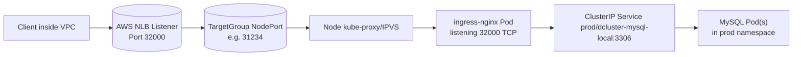
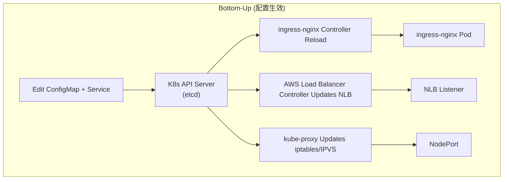
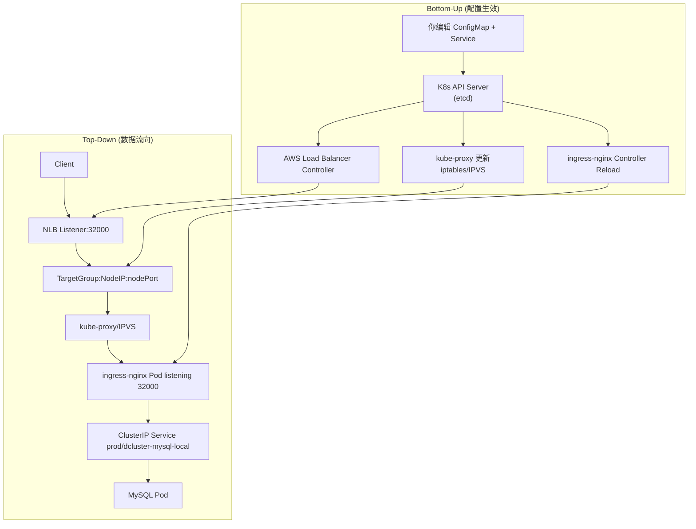

# Kubernetes + AWS NLB: TCP Service Flow and Config Change Propagation

This document explains how traffic flows from AWS NLB into Kubernetes and how configuration changes propagate back to AWS and the ingress-nginx pods.

---

## 1. Top-Down: How Traffic (Data Packets) Flow

1. **Client → AWS NLB**  
   Client connects to an internal AWS NLB Listener (e.g., 32000/TCP). NLB maps Listener to a TargetGroup.

2. **AWS NLB → NodePort**  
   TargetGroup members are the Kubernetes nodes. Each node listens on a nodePort that Kubernetes assigned for the Service.

3. **NodePort → ingress-nginx Pod**  
   kube-proxy or IPVS on the node DNATs nodePort traffic to the correct ingress-nginx Pod targetPort.

4. **ingress-nginx Pod → Backend Service**  
   ingress-nginx Pod, based on `tcp-services` ConfigMap, forwards TCP stream to the configured Kubernetes Service (namespace/service:port).

5. **Backend Service → Backend Pod**  
   The Kubernetes Service then load balances traffic to the actual backend Pods.

### Top-Down Flowchart



---

## 2. Bottom-Up: How Config Changes Propagate

1. **Edit ConfigMap (tcp-services)**  
   Add or change `"port": "namespace/service:targetPort"`.  
   Kubernetes stores ConfigMap updates in etcd.

2. **ingress-nginx Controller Reloads**  
   ingress-nginx Pods watch the ConfigMap and automatically reload Nginx to listen on new ports.

3. **Edit Service (ingress-nginx-internal-tcp)**  
   Add a new port/targetPort to Service spec.  
   Kubernetes stores Service updates in etcd.

4. **AWS Load Balancer Controller Updates NLB**  
   It creates/updates Listeners and TargetGroups in AWS NLB corresponding to new Service ports.  
   It may also update Security Groups.

5. **NodePort Auto Assigned**  
   kube-proxy updates iptables/IPVS on each node to handle the new nodePort.

6. **Traffic Path Updated**  
   New port fully functional from NLB to Pod.

### Bottom-Up Flowchart



---

## 3. Combined Diagram: Top-Down and Bottom-Up



---

## 4. Checklist When Adding a New Port

- **Service (ingress-nginx-internal-tcp)**: Add new `port` + `targetPort`.  
- **ConfigMap (tcp-services)**: Add new `"port": "namespace/service:targetPort"`.  
- **AWS Security Group**: Ensure inbound rules allow the new port.  
- **Helm Values (optional)**: Add to `controller.service.extraPorts` and `controller.tcp` to persist across upgrades.

Once applied, NLB creates a new Listener and ingress-nginx Pods reload automatically to handle the new port.

---

## 5. Practical Commands and Examples

### 5.1 View Current Configuration

```bash
# View current TCP service configuration
kubectl get svc ingress-nginx-internal-tcp -n ingress-nginx -o yaml

# View current tcp-services ConfigMap
kubectl get configmap tcp-services -n ingress-nginx -o yaml

# Check ingress-nginx pods status
kubectl get pods -n ingress-nginx -l app.kubernetes.io/name=ingress-nginx
```

### 5.2 Add New TCP Port - Step by Step

#### Step 1: Edit the Service to add new port

```bash
# Edit the ingress-nginx-internal-tcp service
kubectl edit svc ingress-nginx-internal-tcp -n ingress-nginx
```

**Example Service Configuration:**
```yaml
apiVersion: v1
kind: Service
metadata:
  name: ingress-nginx-internal-tcp
  namespace: ingress-nginx
spec:
  ports:
  - name: mysql-3306
    port: 32000
    protocol: TCP
    targetPort: 32000
    nodePort: 31234
  - name: redis-6379
    port: 32001
    protocol: TCP
    targetPort: 32001
    nodePort: 31235
  - name: new-service-8080
    port: 32002
    protocol: TCP
    targetPort: 32002
    nodePort: 31236
  type: LoadBalancer
```

#### Step 2: Edit the tcp-services ConfigMap

```bash
# Edit the tcp-services ConfigMap
kubectl edit configmap tcp-services -n ingress-nginx
```

**Example ConfigMap Configuration:**
```yaml
apiVersion: v1
kind: ConfigMap
metadata:
  name: tcp-services
  namespace: ingress-nginx
data:
  "32000": "prod/dcluster-mysql-local:3306"
  "32001": "prod/redis-service:6379"
  "32002": "prod/my-new-service:8080"
```

### 5.3 Verify Configuration Changes

```bash
# Check if new port is added to service
kubectl get svc ingress-nginx-internal-tcp -n ingress-nginx

# Verify ConfigMap changes
kubectl get configmap tcp-services -n ingress-nginx -o yaml

# Check ingress-nginx pod logs for reload
kubectl logs -n ingress-nginx -l app.kubernetes.io/name=ingress-nginx --tail=50

# Test the new port (from within cluster)
kubectl run test-pod --image=busybox --rm -it --restart=Never -- nslookup ingress-nginx-internal-tcp.ingress-nginx.svc.cluster.local
```

### 5.4 AWS Load Balancer Controller Verification

```bash
# Check AWS Load Balancer Controller logs
kubectl logs -n kube-system -l app.kubernetes.io/name=aws-load-balancer-controller --tail=50

# Verify NLB target groups (requires AWS CLI)
aws elbv2 describe-target-groups --region us-west-2 --query 'TargetGroups[?contains(TargetGroupName, `k8s-ingress`)].{Name:TargetGroupName,Port:Port,Protocol:Protocol}'

# Check NLB listeners (requires AWS CLI)
aws elbv2 describe-listeners --load-balancer-arn $(aws elbv2 describe-load-balancers --region us-west-2 --query 'LoadBalancers[?contains(LoadBalancerName, `k8s-ingress`)].LoadBalancerArn' --output text) --region us-west-2
```

### 5.5 Troubleshooting Commands

```bash
# Check if new port is listening on ingress-nginx pods
kubectl exec -n ingress-nginx -l app.kubernetes.io/name=ingress-nginx -- netstat -tlnp | grep 32002

# Check iptables rules for new nodePort
kubectl get nodes -o wide
kubectl debug node/<node-name> -it --image=busybox -- chroot /host iptables -t nat -L | grep 31236

# Check service endpoints
kubectl get endpoints -n ingress-nginx ingress-nginx-internal-tcp

# Verify backend service exists
kubectl get svc -n prod my-new-service
kubectl get pods -n prod -l app=my-new-service
```

### 5.6 Complete Example: Adding MySQL TCP Service

```bash
# 1. First, ensure your MySQL service exists in prod namespace
kubectl get svc -n prod dcluster-mysql-local

# 2. Edit the ingress-nginx service to add MySQL port
kubectl edit svc ingress-nginx-internal-tcp -n ingress-nginx
# Add: - name: mysql-3306, port: 32000, protocol: TCP, targetPort: 32000, nodePort: 31234

# 3. Edit the tcp-services ConfigMap
kubectl edit configmap tcp-services -n ingress-nginx
# Add: "32000": "prod/dcluster-mysql-local:3306"

# 4. Wait for ingress-nginx pods to reload (usually 30-60 seconds)
kubectl get pods -n ingress-nginx -w

# 5. Verify the configuration
kubectl get svc ingress-nginx-internal-tcp -n ingress-nginx
kubectl get configmap tcp-services -n ingress-nginx -o yaml

# 6. Test the connection (from within cluster)
kubectl run mysql-test --image=mysql:8.0 --rm -it --restart=Never -- mysql -h ingress-nginx-internal-tcp.ingress-nginx.svc.cluster.local -P 32000 -u root -p
```

### 5.7 Rollback Commands

```bash
# If something goes wrong, rollback the service
kubectl rollout undo deployment/ingress-nginx-controller -n ingress-nginx

# Or manually remove the port from service
kubectl edit svc ingress-nginx-internal-tcp -n ingress-nginx
# Remove the problematic port entry

# Remove from ConfigMap
kubectl edit configmap tcp-services -n ingress-nginx
# Remove the problematic port mapping

# Force restart ingress-nginx pods
kubectl delete pods -n ingress-nginx -l app.kubernetes.io/name=ingress-nginx
```

---

## 6. Common Issues and Solutions

### Issue 1: Port not accessible from outside
```bash
# Check if AWS Security Group allows the port
aws ec2 describe-security-groups --group-ids <sg-id> --query 'SecurityGroups[0].IpPermissions[?FromPort==`32000`]'

# Check if NLB listener was created
aws elbv2 describe-listeners --load-balancer-arn <nlb-arn>
```

### Issue 2: ingress-nginx pods not reloading
```bash
# Check ingress-nginx controller logs
kubectl logs -n ingress-nginx -l app.kubernetes.io/name=ingress-nginx --tail=100

# Force reload by restarting pods
kubectl delete pods -n ingress-nginx -l app.kubernetes.io/name=ingress-nginx
```

### Issue 3: Backend service not reachable
```bash
# Verify backend service exists and has endpoints
kubectl get svc -n prod my-backend-service
kubectl get endpoints -n prod my-backend-service

# Test connectivity from ingress-nginx pod
kubectl exec -n ingress-nginx -l app.kubernetes.io/name=ingress-nginx -- curl -v my-backend-service.prod.svc.cluster.local:8080
```
