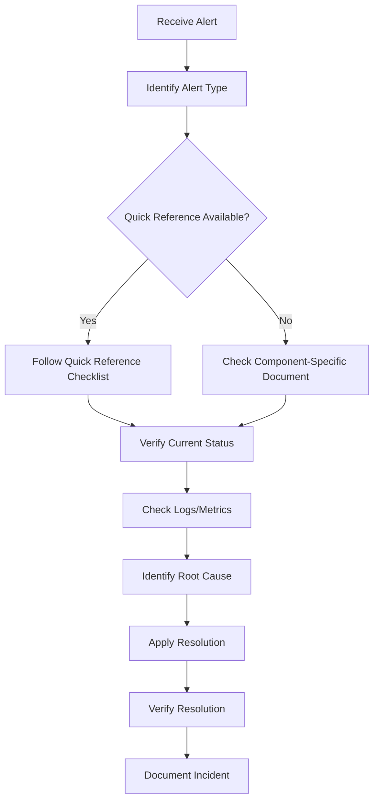

# Infrastructure Oncall Knowledge Base

## Overview

This knowledge base consolidates all infrastructure oncall documentation into a unified, easily searchable reference system. It serves as a navigation hub for oncall engineers to quickly find relevant troubleshooting guides, checklists, and solutions for common infrastructure issues.

**Purpose**: Centralize and organize infrastructure oncall knowledge to improve incident response efficiency and knowledge sharing.

**Coverage**: 
- 22+ oncall documentation files covering databases, message queues, Kubernetes infrastructure, application services, network issues, and cloud infrastructure
- Common troubleshooting patterns, workflows, and checklists
- Quick reference guides for alerts, dashboards, and commands
- Cross-references between related documents and resources
- Kubernetes cluster aliases and configuration (28 clusters across AWS and GCP)
- Grafana dashboard examples with ready-to-use links
- High-frequency problem patterns from actual oncall case analysis (24 cases, 3 major patterns identified)

**How to Use**:
1. For **quick reference**: See [Quick Reference](#quick-reference) section
2. For **high-frequency patterns** (most common issues): See [High-Frequency Problem Patterns](#high-frequency-problem-patterns) section
3. For **specific component issues**: See [Problem Categories by Infrastructure Component](#problem-categories-by-infrastructure-component)
4. For **problem type troubleshooting**: See [Problem Categories by Problem Type](#problem-categories-by-problem-type)
5. For **documentation index**: See [Document Index](#document-index)
6. For **standard workflows**: See [Common Patterns](#common-patterns)
7. For **navigation help**: See [Navigation Guide](#navigation-guide)

**Last Updated**: 2025-01-11

---

## Quick Reference

### Common Checklists

#### General Troubleshooting Checklist
- **Source**: [`../blogs/oncall-check_what.md`](../blogs/oncall-check_what.md)
- Network traffic/QPS check
- SLA performance check
- Backend database (CPU/mem/disk) check

#### OpsGenie General Checklist
- **Source**: [`../blogs/oncall_opsgen_general_checkbook.md`](../blogs/oncall_opsgen_general_checkbook.md)
- Alert analysis (460 error code - usually client timeout, can be ignored)
- Common false positives identification

#### AWS Issue Checklist
- **Source**: [`../blogs/oncall-aws_issue_checkbook.md`](../blogs/oncall-aws_issue_checkbook.md)
- ASG instance issues
- User data (base64) problems
- Instance join cluster issues

### Alert Pattern Mappings

| Alert Pattern | Component | Document | Action |
|--------------|-----------|----------|--------|
| `KubeNodeNotReady`, `KubeletDown` | Kubernetes Node | [`../blogs/oncall-node-notready-issues.md`](../blogs/oncall-node-notready-issues.md) | Check kubelet status, system resources, network connectivity |
| `Kafka lag high` | Kafka | [`../blogs/oncall-kafka-lag-issues.md`](../blogs/oncall-kafka-lag-issues.md) | Check consumer status, downstream write delays (ClickHouse), restart consumers if needed |
| `ClickHouse space insufficient` | ClickHouse | [`../blogs/oncall-clickhouse_storage_issue.md`](../blogs/oncall-clickhouse_storage-issue.md) | Check disk usage, clean temp files, verify EBS status |
| `Network traffic > 300Mbps` (YB nodes) | YugabyteDB | [`../blogs/oncall-client-maqeta_too_many_alert.md`](../blogs/oncall-client-maqeta_too_many_alert.md) | Check if normal for high-traffic client, verify SLA |
| `460 error code` | Load Balancer | [`../blogs/oncall_opsgen_general_checkbook.md`](../blogs/oncall_opsgen_general_checkbook.md) | Usually client timeout, can be ignored |
| `Spark Job: waiting for spark master ready` | DCluster | [`../blogs/oncall-dcluster_trouble_shooting.md`](../blogs/oncall-dcluster_trouble_shooting.md) | Increase worker count, check Spark Master status |

### Emergency Contacts

| Component/Service | Contact | Document |
|------------------|---------|----------|
| DCluster Spark Jobs | @Junhan Ouyang | [`../blogs/oncall-dcluster_trouble_shooting.md`](../blogs/oncall-dcluster_trouble_shooting.md) |
| ClickHouse Storage | @Junhan Ouyang | [`../blogs/oncall-clickhouse_storage_issue.md`](../blogs/oncall-clickhouse_storage-issue.md) |
| Marqeta/MQ Client | @jorozco @kpurre @kpawar @mzhang | [`../blogs/oncall-client-maqeta_too_many_alert.md`](../blogs/oncall-client-maqeta_too_many_alert.md) |

### Dashboard Links

#### General Monitoring
- **Grafana MGT**: https://grafana-mgt.dv-api.com
- **VictoriaMetrics Alert**: https://vm-mgt-a.dv-api.com/vmalert/api/v1/rules
- **VictoriaMetrics Alerts**: https://vm-mgt-a.dv-api.com/vmalert/api/v1/alerts
- **Alert Manager**: https://eng.datavisor.com/#/alert

#### Grafana Dashboards (Parameterizable Templates)

**Note**: Replace `{cluster}`, `{client}`, `{interface}`, `{from}`, `{to}`, etc. with actual values. See [Example Links](#grafana-dashboard-examples) below.

- **Multi-cluster Traffic Distribution**: `https://grafana-mgt.dv-api.com/d/X2qhqpjSk/multi-cluster-traffic-distribution?orgId=1&var-cluster={cluster}&var-client={client}&var-interface={interface}&from={from}&to={to}`
- **Pod Resources**: `https://grafana-mgt.dv-api.com/d/b_XlLjRMz/pod-resources?orgId=1&from=now-2h&to=now&var-PromDs=prometheus-pods&var-cluster={cluster}&var-namespace={namespace}&var-pod={pod}&var-containers={container}`
- **SLA Batch and Realtime**: `https://grafana-mgt.dv-api.com/d/p1KqfRAMk/sla-batch-and-realtime?orgId=1&var-PromDs=vms-victoria-metrics-single-server&var-client={client}&var-sandbox_client={sandbox_client}&var-pipeline={pipeline}&var-Batch_Pipeline={batch_pipeline}&from=now-6h&to=now`
- **YugabyteDB**: `https://grafana-mgt.dv-api.com/d/1IGjQaiMk/yugabytedb?orgId=1&var-PromDs=vms-victoria-metrics-single-server&var-cluster={cluster}&var-dbcluster={dbcluster}&var-node={node}&var-nodeInstance={nodeInstance}&var-serverNode={serverNode}&var-serverNodeInstance={serverNodeInstance}`
- **APISIX Logging**: `https://grafana-mgt.dv-api.com/d/0lpCu9kHk/apisix-logging?orgId=1&from=now-3h&to=now&var-cluster={cluster}&var-client={client}&var-search={search}`
- **Debug Logs for Ingress Nginx Controller**: `https://grafana-mgt.dv-api.com/d/HFAlVh2Nz/debug-logs-for-ingress-nginx-controller?orgId=1&var-cluster={cluster}&var-client={client}&var-interface={interface}&var-status_code={status_code}&var-request_time_operator={operator}&var-request_time_prerequisite={time}`
- **Logging**: `https://grafana-mgt.dv-api.com/d/9aBY8rWMz/logging?orgId=1`
- **Kafka Exporter**: See [`../blogs/oncall-kafka-lag-issues.md`](../blogs/oncall-kafka-lag-issues.md) for full URL

#### Grafana Dashboard Examples (Ready-to-Use)

**Note**: These are example links with actual parameters. Replace cluster/client/interface/time values as needed.

- **Multi-cluster Traffic Distribution** (example: aws-uswest2-prod):
  ```
  https://grafana-mgt.dv-api.com/d/X2qhqpjSk/multi-cluster-traffic-distribution?orgId=1&var-cluster=aws-uswest2-prod&var-client=All&var-interface=All&from=1768041967000&to=1768046797640
  ```

- **Pod Resources** (example: aws-uswest2-prod-a, fp-deployment):
  ```
  https://grafana-mgt.dv-api.com/d/b_XlLjRMz/pod-resources?orgId=1&from=now-2h&to=now&var-PromDs=prometheus-pods&var-cluster=aws-uswest2-prod-a&var-namespace=prod&var-pod=fp-deployment-957745bf6-wdrqx&var-containers=fp
  ```

- **SLA Batch and Realtime** (example: sofi client):
  ```
  https://grafana-mgt.dv-api.com/d/p1KqfRAMk/sla-batch-and-realtime?orgId=1&var-PromDs=vms-victoria-metrics-single-server&var-client=sofi&var-sandbox_client=airasia&var-pipeline=&var-Batch_Pipeline=prod.awsus&from=now-6h&to=now
  ```

- **YugabyteDB** (example: aws-uswest2-prod-a):
  ```
  https://grafana-mgt.dv-api.com/d/1IGjQaiMk/yugabytedb?orgId=1&var-PromDs=vms-victoria-metrics-single-server&var-cluster=aws-uswest2-prod-a&var-dbcluster=prod-external-new-1&var-node=All&var-nodeInstance=172.31.35.20:7000&var-serverNode=All&var-serverNodeInstance=172.31.35.20:9000
  ```

- **APISIX Logging** (example: aws-uswest2-prod, sofi):
  ```
  https://grafana-mgt.dv-api.com/d/0lpCu9kHk/apisix-logging?orgId=1&from=now-3h&to=now&var-cluster=aws-uswest2-prod&var-client=sofi&var-search=
  ```

- **Debug Logs for Ingress Nginx Controller** (example: aws-uswest2-prod-a, sofi):
  ```
  https://grafana-mgt.dv-api.com/d/HFAlVh2Nz/debug-logs-for-ingress-nginx-controller?orgId=1&var-cluster=aws-uswest2-prod-a&var-client=sofi&var-interface=All&var-status_code=200&var-request_time_operator=%3E&var-request_time_prerequisite=0&var-upstream_response_time_operator=%3E&var-upstream_response_time_prerequisite=0.005
  ```

#### Marqeta-Specific Dashboards
- **SLA Batch and Realtime**: https://grafana-mqmgt-a.marqetariskcontroldecisioning.com/d/p1KqfRAMk/sla-batch-and-realtime?orgId=1&from=now-3h&to=now
- **YugabyteDB Dashboard**: https://grafana-mqmgt-a.marqetariskcontroldecisioning.com/d/1IGjQaiMk/yugabytedb?orgId=1
- **Feature Platform Metrics**: https://grafana-mqmgt-a.marqetariskcontroldecisioning.com/d/EP_yHg7Gk/feature-platform-metrics?orgId=1
- **Feature Platform Logs**: https://grafana-mqmgt-a.marqetariskcontroldecisioning.com/d/CFAzjjGGz/feature-platform-log?orgId=1

**Note**: Grafana credentials for Marqeta: `admin` / `Dv123456` (connect VPN first)

### Command Quick Reference

#### AWS CLI
- **Always allowed**: `get`, `describe`, `logs`, `top`, `diff`, `lint`, `test`, `fmt`
- **Default reject**: `delete`, `patch`, `apply`, `scale`, `rollout restart`
- **Requires manual approval**: Any write actions to production (even if seemingly safe)
- **Best practice**: Generate commands for human review, don't execute directly

#### Kubernetes

**Kubeconfig Location**: `config/kubeconfig/*.config`

**Usage**:
```bash
export KUBECONFIG=/path/to/config/kubeconfig/<cluster>.config
kubectl get nodes
```

**Available Clusters** (28 clusters total):
- **Africa**: `aws-afsouth1-preprod-a`, `aws-afsouth1-prod-a`, `aws-afsouth1-prod-b`
- **Asia Pacific**: `aws-apsoutheast1-prod-a`, `aws-apsoutheast1-prod-b`
- **Canada**: `aws-cacentral1-preprod-a`, `aws-cacentral1-prod-a`, `aws-cacentral1-prod-b`, `aws-cawest1-prod-b`
- **Europe**: `aws-euwest1-prod-a`, `aws-euwest1-prod-b`, `aws-euwest2-prod-b`
- **US East**: `aws-useast1-mgt-a`, `aws-useast1-pci-a`, `aws-useast1-pci-b`, `aws-useast1-pcipreprod-a`, `aws-useast1-preprod-a`, `aws-useast1-prod-a`, `aws-useast1-prod-b`
- **US West**: `aws-uswest2-dev-a`, `aws-uswest2-dev-b`, `aws-uswest2-mgt-a`, `aws-uswest2-preprod-a`, `aws-uswest2-prod-a`, `aws-uswest2-prod-b`, `aws-uswest2-sandbox-a`, `aws-uswest2-sandbox-b`
- **GCP**: `gcp-uswest1-prod-a`

**Kubernetes Cluster Aliases** (for convenience):

To use cluster aliases, add these to your shell configuration (e.g., `~/.zshrc` or `~/.bashrc`):

```bash
# Africa clusters
alias kafsouthproda="kubectl --kubeconfig=/Users/rshao/work/code_repos/infra_oncall_mgt/config/kubeconfig/af_prod_a.config"
alias kafsouthprodb="kubectl --kubeconfig=/Users/rshao/work/code_repos/infra_oncall_mgt/config/kubeconfig/af_prod_b.config"
alias kafsouthpreprod="kubectl --kubeconfig=/Users/rshao/work/code_repos/infra_oncall_mgt/config/kubeconfig/af_preprod_a.config"

# US West clusters
alias kwestdeva="kubectl --kubeconfig=/Users/rshao/work/code_repos/infra_oncall_mgt/config/kubeconfig/dev_a.config"
alias kwestdevb="kubectl --kubeconfig=/Users/rshao/work/code_repos/infra_oncall_mgt/config/kubeconfig/dev_b.config"
alias kwestproda="kubectl --kubeconfig=/Users/rshao/work/code_repos/infra_oncall_mgt/config/kubeconfig/us_prod_a.config"
alias kwestprodb="kubectl --kubeconfig=/Users/rshao/work/code_repos/infra_oncall_mgt/config/kubeconfig/us_prod_b.config"
alias kwestmgt="kubectl --kubeconfig=/Users/rshao/work/code_repos/infra_oncall_mgt/config/kubeconfig/us_mgt.config"
alias kwestpreprod="kubectl --kubeconfig=/Users/rshao/work/code_repos/infra_oncall_mgt/config/kubeconfig/us_preprod_a.config"
alias kwestdemoa="kubectl --kubeconfig=/Users/rshao/work/code_repos/infra_oncall_mgt/config/kubeconfig/us_demo_a.config"
alias kwestdemob="kubectl --kubeconfig=/Users/rshao/work/code_repos/infra_oncall_mgt/config/kubeconfig/demo_b.config"

# US East clusters
alias keastdevc="kubectl --kubeconfig=/Users/rshao/work/code_repos/infra_oncall_mgt/config/kubeconfig/dev_c.config"
alias keastproda="kubectl --kubeconfig=/Users/rshao/work/code_repos/infra_oncall_mgt/config/kubeconfig/east_prod_a.config"
alias keastprodb="kubectl --kubeconfig=/Users/rshao/work/code_repos/infra_oncall_mgt/config/kubeconfig/east_prod_b.config"
alias keastmgt="kubectl --kubeconfig=/Users/rshao/work/code_repos/infra_oncall_mgt/config/kubeconfig/east_mgt.config"
alias keastpreprod="kubectl --kubeconfig=/Users/rshao/work/code_repos/infra_oncall_mgt/config/kubeconfig/east_preprod_a.config"

# EU clusters
alias keuwestproda="kubectl --kubeconfig=/Users/rshao/work/code_repos/infra_oncall_mgt/config/kubeconfig/eu_prod_a.config"
alias keuwestprodb="kubectl --kubeconfig=/Users/rshao/work/code_repos/infra_oncall_mgt/config/kubeconfig/eu_prod_b.config"
alias keuwest2prodb="kubectl --kubeconfig=/Users/rshao/work/code_repos/infra_oncall_mgt/config/kubeconfig/eu_west2_prod_b.config"

# PCI clusters
alias keastpcia="kubectl --kubeconfig=/Users/rshao/work/code_repos/infra_oncall_mgt/config/kubeconfig/pci_a.config"
alias keastpcib="kubectl --kubeconfig=/Users/rshao/work/code_repos/infra_oncall_mgt/config/kubeconfig/pci_b.config"
alias keastpcipreprod="kubectl --kubeconfig=/Users/rshao/work/code_repos/infra_oncall_mgt/config/kubeconfig/pci_preprod_a.config"

# Singapore clusters
alias ksga="kubectl --kubeconfig=/Users/rshao/work/code_repos/infra_oncall_mgt/config/kubeconfig/sg_prod_a.config"
alias ksgb="kubectl --kubeconfig=/Users/rshao/work/code_repos/infra_oncall_mgt/config/kubeconfig/sg_prod_b.config"
alias kasiasedcube="kubectl --kubeconfig=/Users/rshao/work/code_repos/infra_oncall_mgt/config/kubeconfig/sg_dcube.config"

# GCP clusters
alias kgcpwestpoca="kubectl --kubeconfig=/Users/rshao/work/code_repos/infra_oncall_mgt/config/kubeconfig/poc_a.config"
alias kgcpwestpocb="kubectl --kubeconfig=/Users/rshao/work/code_repos/infra_oncall_mgt/config/kubeconfig/poc_b.config"
alias kgcpwestproda="kubectl --kubeconfig=/Users/rshao/work/code_repos/infra_oncall_mgt/config/kubeconfig/gcp_us_prod_a.config"
alias kgcpwesttrial="kubectl --kubeconfig=/Users/rshao/work/code_repos/infra_oncall_mgt/config/kubeconfig/gcp_us_trial_a.config"

# Canada clusters
alias kcaproda="kubectl --kubeconfig=/Users/rshao/work/code_repos/infra_oncall_mgt/config/kubeconfig/ca_prod_a.config"
alias kcaprodb="kubectl --kubeconfig=/Users/rshao/work/code_repos/infra_oncall_mgt/config/kubeconfig/ca_prod_b.config"
alias kcapreprod="kubectl --kubeconfig=/Users/rshao/work/code_repos/infra_oncall_mgt/config/kubeconfig/ca_preprod_a.config"
```

**Usage Example**:
```bash
# Instead of:
export KUBECONFIG=/Users/rshao/work/code_repos/infra_oncall_mgt/config/kubeconfig/us_prod_a.config
kubectl get nodes

# You can use:
kwestproda get nodes
```

**Note**: Adjust the path `/Users/rshao/work/code_repos/infra_oncall_mgt/` to match your local repository path.

**Command Permissions** (same as AWS CLI):
- **Always allowed**: `get`, `describe`, `logs`, `top`, `diff`, `lint`, `test`, `fmt`
- **Default reject**: `delete`, `patch`, `apply`, `scale`, `rollout restart`
- **Requires manual approval**: Any write actions to production (even if seemingly safe)
- **Best practice**: Generate commands for human review, don't execute directly

#### Client List Reference

**Available Clients** (57 clients total - see `clients.json` for full list):

Common clients include: `acorns`, `affirm`, `airasia`, `appsflyer`, `argo`, `aspiration`, `binance`, `blibli`, `bookingcom`, `galileo`, `mercari`, `nasa`, `navan`, `okcoin`, `okg`, `okx`, `onefinance`, `rippling`, `sofi`, `sphere`, `standardbank`, `syncbank`, `tabapay`, `taskrabbit`, `transfergo`, `walmart`, `westernunion`, `wex`, and more.

**Usage**: When troubleshooting client-specific issues, use client name in Grafana dashboard parameters (`var-client={client}`).

---

## Problem Categories by Infrastructure Component

### Database Layer

| Component | Documents | Problem Types |
|-----------|-----------|---------------|
| **ClickHouse** | [`../blogs/oncall-clickhouse_canot_connect.md`](../blogs/oncall-clickhouse_canot_connect.md)<br>[`../blogs/oncall-clickhouse_storage_issue.md`](../blogs/oncall-clickhouse_storage-issue.md)<br>[`../blogs/oncall-database-issues.md`](../blogs/oncall-database-issues.md)<br>[`oncall_db_issue.md`](../blogs/oncall_db_issue.md) | Connection issues, Storage space issues, General DB problems |
| **YugabyteDB** | [`../blogs/oncall-yugabyte-debug-process.md`](../blogs/oncall-yugabyte-debug-process.md)<br>[`../blogs/oncall-yugabyte-handler-issues.md`](../blogs/oncall-yugabyte-handler-issues.md)<br>[`../blogs/oncall-database-issues.md`](../blogs/oncall-database-issues.md) | Debug process, Handler issues, Connection problems |
| **General Database** | [`../blogs/oncall-database-issues.md`](../blogs/oncall-database-issues.md)<br>[`oncall_db_issue.md`](../blogs/oncall_db_issue.md) | General troubleshooting, Quick reference |

**Common Issues**:
- ClickHouse: Connection failures, storage space exhaustion, parts too many causing insert delays
- YugabyteDB: Handler issues, connection problems, high CPU/memory usage
- General: DB pod not ready, service dependency issues, data replication problems

### Message Queue

| Component | Documents | Problem Types |
|-----------|-----------|---------------|
| **Kafka** | [`../blogs/oncall-kafka-lag-issues.md`](../blogs/oncall-kafka-lag-issues.md)<br>[`../blogs/oncall-kafka-restart-failed.md`](../blogs/oncall-kafka-restart-failed.md) | Consumer lag, Restart failures |

**Common Issues**:
- Consumer lag high (often caused by downstream ClickHouse write delays)
- Kafka restart failures
- Mirror Maker issues

### Kubernetes Infrastructure

| Component | Documents | Problem Types |
|-----------|-----------|---------------|
| **Cluster** | [`../blogs/oncall-cluster-issues.md`](../blogs/oncall-cluster-issues.md)<br>[`../blogs/oncall-node-notready-issues.md`](../blogs/oncall-node-notready-issues.md)<br>[`../blogs/oncall-node-description-analysis.md`](../blogs/oncall-node-description-analysis.md) | Cluster traffic issues, Node status problems, Cluster health |
| **Node** | [`../blogs/oncall-node-notready-issues.md`](../blogs/oncall-node-notready-issues.md)<br>[`../blogs/oncall-node-description-analysis.md`](../blogs/oncall-node-description-analysis.md) | Node NotReady, Kubelet issues, Resource exhaustion |
| **Resources** | [`../blogs/oncall-resource-exhaustion-issues.md`](../blogs/oncall-resource-exhaustion-issues.md) | CPU/Memory/Disk exhaustion, Pod scheduling failures |

**Common Issues**:
- Node NotReady (kubelet down, resource exhaustion, network issues)
- Cluster traffic distribution problems
- Resource exhaustion (disk, CPU, memory)
- Pod scheduling failures

### Application Services

| Component | Documents | Problem Types |
|-----------|-----------|---------------|
| **Luigi** | [`../blogs/oncall-luigi-debug-helper.md`](../blogs/oncall-luigi-debug-helper.md)<br>[`../blogs/oncall-Luigi-job-error.md`](../blogs/oncall-Luigi-job-error.md) | Job errors, Debugging, Hanging jobs |
| **DCluster** | [`../blogs/oncall-dcluster_trouble_shooting.md`](../blogs/oncall-dcluster_trouble_shooting.md) | Spark job issues, Master not ready |
| **Nginx/Ingress** | [`../blogs/oncall-nginx_issue.md`](../blogs/oncall-nginx_issue.md) | Ingress issues, 502/504 errors, Configuration problems |

**Common Issues**:
- Luigi: Hanging jobs, job failures, namespace issues
- DCluster: Spark master not ready, worker count issues
- Nginx: Service restart failures, configuration errors, 502/504 errors

### Network & Access

| Component | Documents | Problem Types |
|-----------|-----------|---------------|
| **Site Access** | [`../blogs/oncall-site-access-issues.md`](../blogs/oncall-site-access-issues.md) | Site unreachable, 502/504 errors, DNS issues |
| **Data Copy** | [`../blogs/oncall-data-copy-issues.md`](../blogs/oncall-data-copy-issues.md) | Data replication, Cross-cluster data copy |

**Common Issues**:
- Site access failures (502, 504 errors)
- DNS resolution problems
- Load balancer health check failures
- Data copy failures between clusters

### Cloud Infrastructure

| Component | Documents | Problem Types |
|-----------|-----------|---------------|
| **AWS** | [`../blogs/oncall-aws_issue_checkbook.md`](../blogs/oncall-aws_issue_checkbook.md) | ASG issues, EC2 instance problems, EBS volume issues |

**Common Issues**:
- ASG instances failing to launch
- User data (base64) problems
- Instance join cluster failures
- EBS volume issues

### Checklists & General

| Document | Purpose |
|----------|---------|
| [`../blogs/oncall-check_what.md`](../blogs/oncall-check_what.md) | General troubleshooting checklist (network/QPS/SLA/DB) |
| [`../blogs/oncall_opsgen_general_checkbook.md`](../blogs/oncall_opsgen_general_checkbook.md) | OpsGenie alert general checklist |
| [`../blogs/oncall-aws_issue_checkbook.md`](../blogs/oncall-aws_issue_checkbook.md) | AWS-specific issue checklist |
| [`../blogs/oncall-client-maqeta_too_many_alert.md`](../blogs/oncall-client-maqeta_too_many_alert.md) | Client-specific alert analysis (Marqeta) |

---

## Problem Categories by Problem Type

### Connection Issues

| Problem | Documents | Key Indicators |
|---------|-----------|----------------|
| **ClickHouse Cannot Connect** | [`../blogs/oncall-clickhouse_canot_connect.md`](../blogs/oncall-clickhouse_canot_connect.md) | Connection refused, pod not ready, health check failures |
| **Database Connection Problems** | [`../blogs/oncall-database-issues.md`](../blogs/oncall-database-issues.md) | Service dependencies, pod status |
| **Site Access Issues** | [`../blogs/oncall-site-access-issues.md`](../blogs/oncall-site-access-issues.md) | 502/504 errors, DNS resolution failures |

**Common Patterns**:
1. Check pod status: `kubectl get pods -n <namespace> | grep <service>`
2. Check logs: `kubectl logs <pod-name> -n <namespace>`
3. Check service endpoints: `kubectl get endpoints -n <namespace>`
4. Check DNS resolution: Test from pod or external tools
5. Check network policies and firewall rules

### Performance Issues

| Problem | Documents | Key Indicators |
|---------|-----------|----------------|
| **Kafka Lag High** | [`../blogs/oncall-kafka-lag-issues.md`](../blogs/oncall-kafka-lag-issues.md) | Consumer lag > threshold, downstream delays |
| **High Network Traffic** | [`../blogs/oncall-client-maqeta_too_many_alert.md`](../blogs/oncall-client-maqeta_too_many_alert.md)<br>[`../blogs/oncall-check_what.md`](../blogs/oncall-check_what.md) | Network output > 300Mbps, high QPS |
| **Site Latency** | [`../blogs/oncall-site-access-issues.md`](../blogs/oncall-site-access-issues.md) | High response times, timeout errors |

**Common Patterns**:
1. Verify if high metrics are normal for the client/service
2. Check SLA/dashboard metrics for actual impact
3. Check downstream dependencies (often ClickHouse write delays cause Kafka lag)
4. Check resource utilization (CPU, memory, disk I/O)
5. Restart services if needed (e.g., restart fp-async for Kafka lag)

### Resource Exhaustion

| Problem | Documents | Key Indicators |
|---------|-----------|----------------|
| **Disk Space** | [`../blogs/oncall-clickhouse_storage_issue.md`](../blogs/oncall-clickhouse_storage-issue.md)<br>[`../blogs/oncall-resource-exhaustion-issues.md`](../blogs/oncall-resource-exhaustion-issues.md) | Disk usage > 80%, "no space left" errors |
| **CPU/Memory** | [`../blogs/oncall-resource-exhaustion-issues.md`](../blogs/oncall-resource-exhaustion-issues.md)<br>[`../blogs/oncall-node-notready-issues.md`](../blogs/oncall-node-notready-issues.md) | High CPU/memory usage, OOM kills, Node pressure |

**Common Patterns**:
1. Check resource usage: `kubectl top nodes`, `kubectl top pods`
2. Clean temporary files: Check `/tmp`, logs, Docker images
3. Check EBS volume status and auto-expansion settings
4. Clean up old/unused resources (pods, images, volumes)
5. Scale up resources if needed (after identifying root cause)

### Service Failures

| Problem | Documents | Key Indicators |
|---------|-----------|----------------|
| **Node NotReady** | [`../blogs/oncall-node-notready-issues.md`](../blogs/oncall-node-notready-issues.md) | Node status "NotReady", pods stuck, kubelet down |
| **Spark Job Failures** | [`../blogs/oncall-dcluster_trouble_shooting.md`](../blogs/oncall-dcluster_trouble_shooting.md) | "waiting for spark master ready", job stuck |
| **Kafka Restart Failed** | [`../blogs/oncall-kafka-restart-failed.md`](../blogs/oncall-kafka-restart-failed.md) | Kafka pod restart failures, configuration errors |
| **Luigi Job Errors** | [`../blogs/oncall-luigi-debug-helper.md`](../blogs/oncall-luigi-debug-helper.md)<br>[`../blogs/oncall-Luigi-job-error.md`](../blogs/oncall-Luigi-job-error.md) | Job failures, hanging jobs, namespace issues |
| **Nginx Service Issues** | [`../blogs/oncall-nginx_issue.md`](../blogs/oncall-nginx_issue.md) | Service restart failures, configuration errors |

**Common Patterns**:
1. Check pod/service status: `kubectl get pods -n <namespace>`
2. Check logs: `kubectl logs <pod-name> -n <namespace>`
3. Check events: `kubectl describe pod <pod-name> -n <namespace>`
4. Verify configuration: Check configmaps, secrets, environment variables
5. Check dependencies: Verify dependent services are running
6. Restart service if appropriate (check impact first)

### Data Issues

| Problem | Documents | Key Indicators |
|---------|-----------|----------------|
| **Data Copy Failures** | [`../blogs/oncall-data-copy-issues.md`](../blogs/oncall-data-copy-issues.md) | Cross-cluster copy failures, scp/rsync errors |
| **ClickHouse Parts Too Many** | [`../blogs/oncall-kafka-lag-issues.md`](../blogs/oncall-kafka-lag-issues.md) | "Delaying inserting block" errors, parts count high |

**Common Patterns**:
1. Verify source data availability and accessibility
2. Check network connectivity between clusters
3. Verify target storage space
4. Check data integrity after copy
5. For ClickHouse: Optimize parts/partitions, may need to restart consumer

### Configuration Issues

| Problem | Documents | Key Indicators |
|---------|-----------|----------------|
| **AWS User Data Issues** | [`../blogs/oncall-aws_issue_checkbook.md`](../blogs/oncall-aws_issue_checkbook.md) | Instance join cluster failures, base64 encoding problems |
| **Nginx Configuration** | [`../blogs/oncall-nginx_issue.md`](../blogs/oncall-nginx_issue.md) | Configuration syntax errors, reload failures |

**Common Patterns**:
1. Verify configuration syntax: `nginx -t`, `kubectl apply --dry-run`
2. Check base64 encoding for user data
3. Verify configuration is applied: Check configmaps, secrets
4. Test configuration before applying to production
5. Rollback to known good configuration if needed

---

## Document Index

| Document | Category | Problem Type | Description | When to Use | Related Architecture/Monitoring |
|----------|----------|--------------|-------------|-------------|------------------------------|
| [`../blogs/oncall-check_what.md`](../blogs/oncall-check_what.md) | Checklist | General | General troubleshooting checklist for network/QPS/SLA/DB | Start here for general alerts | - |
| [`../blogs/oncall_opsgen_general_checkbook.md`](../blogs/oncall_opsgen_general_checkbook.md) | Checklist | General | OpsGenie alert general checklist (460 errors, false positives) | For OpsGenie alerts | - |
| [`../blogs/oncall-aws_issue_checkbook.md`](../blogs/oncall-aws_issue_checkbook.md) | Checklist | Cloud Infrastructure | AWS-specific issue checklist (ASG, user data, instances) | For AWS-related issues | - |
| [`../blogs/oncall-client-maqeta_too_many_alert.md`](../blogs/oncall-client-maqeta_too_many_alert.md) | Client-Specific | Performance | Marqeta client alert analysis (network traffic, SLA checks) | For Marqeta/MQ client alerts | Monitoring dashboards |
| [`../blogs/oncall-database-issues.md`](../blogs/oncall-database-issues.md) | Database | General | General DB troubleshooting (DB → business service workflow) | For DB-related incidents | - |
| [`oncall_db_issue.md`](../blogs/oncall_db_issue.md) | Database | General | Quick DB reference guide | Quick DB problem reference | - |
| [`../blogs/oncall-clickhouse_canot_connect.md`](../blogs/oncall-clickhouse_canot_connect.md) | Database | Connection | ClickHouse connection issues troubleshooting | When ClickHouse connection fails | - |
| [`../blogs/oncall-clickhouse_storage_issue.md`](../blogs/oncall-clickhouse_storage-issue.md) | Database | Resource Exhaustion | ClickHouse storage space issues | When ClickHouse disk space issues | - |
| [`../blogs/oncall-yugabyte-debug-process.md`](../blogs/oncall-yugabyte-debug-process.md) | Database | General | YugabyteDB debugging process | For YugabyteDB debugging | [`monitoring-yugabyte_monitoring_commands.md`](../blogs/monitoring-yugabyte_monitoring_commands.md) |
| [`../blogs/oncall-yugabyte-handler-issues.md`](../blogs/oncall-yugabyte-handler-issues.md) | Database | Service Failure | YugabyteDB handler issues | When YugabyteDB handler problems | [`monitoring-yugabyte_monitoring_commands.md`](../blogs/monitoring-yugabyte_monitoring_commands.md) |
| [`../blogs/oncall-kafka-lag-issues.md`](../blogs/oncall-kafka-lag-issues.md) | Message Queue | Performance | Kafka consumer lag problems | When Kafka lag alerts | Monitoring dashboards |
| [`../blogs/oncall-kafka-restart-failed.md`](../blogs/oncall-kafka-restart-failed.md) | Message Queue | Service Failure | Kafka restart failure troubleshooting | When Kafka restart fails | - |
| [`../blogs/oncall-cluster-issues.md`](../blogs/oncall-cluster-issues.md) | Kubernetes | General | Kubernetes cluster issues (traffic, nodes, pods) | For cluster-level problems | - |
| [`../blogs/oncall-node-notready-issues.md`](../blogs/oncall-node-notready-issues.md) | Kubernetes | Service Failure | Node NotReady troubleshooting | When nodes show NotReady status | [`architecture-monitoring-system.md`](../blogs/architecture-monitoring-system.md) |
| [`../blogs/oncall-node-description-analysis.md`](../blogs/oncall-node-description-analysis.md) | Kubernetes | General | Node description analysis guide | For analyzing node descriptions | - |
| [`../blogs/oncall-resource-exhaustion-issues.md`](../blogs/oncall-resource-exhaustion-issues.md) | Kubernetes | Resource Exhaustion | Resource exhaustion troubleshooting (CPU/memory/disk) | When resource exhaustion alerts | [`monitoring-useful_sql.md`](../blogs/monitoring-useful_sql.md) |
| [`../blogs/oncall-luigi-debug-helper.md`](../blogs/oncall-luigi-debug-helper.md) | Application | Service Failure | Comprehensive Luigi debugging guide | For Luigi job issues | [`architecture-core-business-job-workflow_luigi&dcluster&spark.md`](../blogs/architecture-core-business-job-workflow_luigi&dcluster&spark.md) |
| [`../blogs/oncall-Luigi-job-error.md`](../blogs/oncall-Luigi-job-error.md) | Application | Service Failure | Luigi job error troubleshooting | For specific Luigi job errors | [`architecture-core-business-job-workflow_luigi&dcluster&spark.md`](../blogs/architecture-core-business-job-workflow_luigi&dcluster&spark.md) |
| [`../blogs/oncall-dcluster_trouble_shooting.md`](../blogs/oncall-dcluster_trouble_shooting.md) | Application | Service Failure | DCluster Spark job troubleshooting | When Spark jobs fail or stuck | [`architecture-core-business-job-workflow_luigi&dcluster&spark.md`](../blogs/architecture-core-business-job-workflow_luigi&dcluster&spark.md) |
| [`../blogs/oncall-nginx_issue.md`](../blogs/oncall-nginx_issue.md) | Application | Configuration | Nginx/Ingress troubleshooting comprehensive guide | For Nginx/Ingress issues | [`architecture-request-routing-flow.md`](../blogs/architecture-request-routing-flow.md), [`monitoring-latency_architecture.md`](../blogs/monitoring-latency_architecture.md) |
| [`../blogs/oncall-site-access-issues.md`](../blogs/oncall-site-access-issues.md) | Network | Connection | Site access issues troubleshooting (502/504, DNS) | When site is unreachable | [`architecture-request-routing-flow.md`](../blogs/architecture-request-routing-flow.md), [`monitoring-latency_architecture.md`](../blogs/monitoring-latency_architecture.md) |
| [`../blogs/oncall-data-copy-issues.md`](../blogs/oncall-data-copy-issues.md) | Network | Data | Data copy issues between clusters | For cross-cluster data copy problems | - |

---

## High-Frequency Problem Patterns

> **Source**: Analysis of 24 oncall cases from `oncall_cognitive_control_plane/knowledge/cases/` (15 fully documented cases)

These patterns represent the most frequently encountered oncall issues based on actual incident analysis. Each pattern includes typical evidence, decision outcomes, and recommended actions.

### Pattern 2: Ingress Global Rate Limit 429 + Burst Window Mismatch

**Frequency**: 3 documented cases (high impact)

**Typical Evidence**:
- Customer-facing intermittent failures
- Intermittent 429 errors observed
- 1-minute average QPS is healthy, but 1-second/5-second bursts trigger rate limiting
- May be accompanied by traffic switch or recent configuration/restart events
- **Root cause**: 1-second rate limit window vs 1-minute SLA/QPS mismatch

**Typical Decision**: 
- `escalate` (if customer-facing and confirmed)
- `monitor` + verify short-window QPS/429 correlation and ingress rate limit configuration

**Standard Workflow**:
1. **First step**: Verify rate limit configuration
   - Check ingress annotations for rate limit parameters
   - Verify window size (1s vs 1m) and burst thresholds
2. **Second step**: Check short-window QPS metrics
   - Use Grafana dashboard to check 1s/5s window QPS
   - Compare with rate limit thresholds
3. **Third step**: Verify correlation between bursts and 429 errors
   - Check Loki logs for rate limit markers
   - Correlate burst timing with 429 error timing
4. **Fourth step**: Check for recent changes
   - Traffic switch events
   - Configuration changes
   - Service restarts
5. **Fifth step**: Decide escalation based on:
   - Customer impact (customer-facing vs internal)
   - Frequency of occurrence
   - Whether configuration adjustment is needed

**Key Insight**: 1-minute average QPS can be healthy while 1-second bursts still trigger rate limits. Always check short-window metrics, not just averages.

**Related Documents**:
- [`monitoring-latency_architecture.md`](../blogs/monitoring-latency_architecture.md) - For understanding latency metrics
- [`architecture-request-routing-flow.md`](../blogs/architecture-request-routing-flow.md) - For understanding ingress routing
- [`../blogs/oncall-nginx_issue.md`](../blogs/oncall-nginx_issue.md) - For ingress configuration issues

**Example Cases**:
- `alert_20260103T143243Z`: Customer intermittent failure + 429 → **escalate** → verify rate limit config and short-window QPS correlation
- `alert_20260108T134045Z`: Customer-facing + 429 + recent changes → **monitor** → verify rate limit and short-window metrics

### Pattern 3: Ingress→Upstream Waiting Latency High (Upstream Normal)

**Frequency**: 1 documented case

**Typical Evidence**:
- `waiting_latency` (request_time - upstream_response_time) is elevated
- `upstream_response_time` is normal
- Traffic switch may have already occurred (possible mitigation)
- Need to confirm blast radius and whether issue is recurring

**Typical Decision**: `monitor`

**Standard Workflow**:
1. **First step**: Latency breakdown analysis
   - Check `request_time` (full request time)
   - Check `upstream_response_time` (backend processing time)
   - Check `waiting_latency` (ingress internal waiting/queuing time)
   - Formula: `waiting_latency = request_time - upstream_response_time`
2. **Second step**: Check ingress logs
   - Look for upstream connection issues
   - Check for endpoint health problems
   - Look for connection pool exhaustion
3. **Third step**: Check for change events
   - Traffic switch events (may be mitigation)
   - Recent deployments or configuration changes
   - Ingress controller restarts
4. **Fourth step**: Verify blast radius
   - Which clusters/namespaces/services are affected?
   - Is this a recurring issue or one-time?
5. **Fifth step**: Determine if escalation needed
   - If upstream is healthy but waiting_latency persists → may need ingress investigation
   - If traffic switch already occurred → verify if it resolved the issue

**Key Insight**: High `waiting_latency` with normal `upstream_response_time` suggests ingress internal issues (queuing, connection pool, scheduling) rather than backend problems. This is NOT necessarily a network issue.

**Related Documents**:
- [`monitoring-latency_architecture.md`](../blogs/monitoring-latency_architecture.md) - **Essential** for understanding latency metrics breakdown
- [`architecture-request-routing-flow.md`](../blogs/architecture-request-routing-flow.md) - For understanding ingress routing
- [`../blogs/oncall-nginx_issue.md`](../blogs/oncall-nginx_issue.md) - For ingress troubleshooting

**Example Case**:
- `alert_20260110T120322Z`: waiting_latency↑, upstream normal, traffic switch occurred → **monitor** → latency breakdown → ingress logs → change events verification

### Pattern Summary Table

| Pattern | Frequency | Typical Decision | First Action | Key Documents |
|---------|-----------|------------------|-------------|---------------|
| **429 + Burst Window Mismatch** | 3 cases | `escalate` or `monitor` | Verify rate limit config + short-window QPS | Latency architecture, Request routing |
| **Waiting Latency High (Upstream Normal)** | 1 case | `monitor` | Latency breakdown analysis | Latency architecture (essential) |

### Pattern-Based Decision Tree

```
Alert Received?
├─ Intermittent 429 errors?
│   └─ → Check rate limit config (1s vs 1m window) → Verify short-window QPS → Check burst correlation → Monitor/escalate
│
└─ High latency but upstream normal?
    └─ → Latency breakdown (request_time/upstream_response_time/waiting_latency) → Ingress logs → Check changes → Monitor/escalate
```

---

## Common Patterns

### Standard Troubleshooting Workflow



### Common Troubleshooting Steps

1. **Initial Assessment**
   - Check alert details and patterns
   - Verify current service/pod status: `kubectl get pods -n <namespace>`
   - Check recent events: `kubectl get events -n <namespace> --sort-by='.lastTimestamp'`

2. **Status Verification**
   - Pod status: Running, Pending, Error, CrashLoopBackOff
   - Node status: Ready, NotReady, Unknown
   - Service endpoints: `kubectl get endpoints -n <namespace>`

3. **Log Analysis**
   - Pod logs: `kubectl logs <pod-name> -n <namespace> --tail=100`
   - Previous container logs: `kubectl logs <pod-name> -n <namespace> --previous`
   - Node logs: `journalctl -u kubelet --since "1 hour ago"`

4. **Resource Check**
   - Node resources: `kubectl top nodes`
   - Pod resources: `kubectl top pods -n <namespace>`
   - Disk usage: `df -h` (if on node)

5. **Dependency Verification**
   - Check dependent services
   - Check network connectivity
   - Check configuration (configmaps, secrets)

6. **Resolution Application**
   - Apply appropriate fix (restart, scale, clean, etc.)
   - Verify fix worked
   - Monitor for recurrence

### Common Root Causes

1. **Downstream Dependency Issues**
   - **Pattern**: Kafka lag high → Often caused by ClickHouse write delays
   - **Solution**: Restart consumer (fp-async), but address ClickHouse parts issue
   - **Example**: [`../blogs/oncall-kafka-lag-issues.md`](../blogs/oncall-kafka-lag-issues.md)

2. **Resource Exhaustion**
   - **Pattern**: Service failures → Often caused by disk/CPU/memory exhaustion
   - **Solution**: Clean resources, check autoscaling, scale up
   - **Example**: [`../blogs/oncall-resource-exhaustion-issues.md`](../blogs/oncall-resource-exhaustion-issues.md)

3. **Configuration Issues**
   - **Pattern**: Service restart failures → Configuration syntax errors or base64 encoding problems
   - **Solution**: Verify configuration, test before applying
   - **Example**: [`../blogs/oncall-aws_issue_checkbook.md`](../blogs/oncall-aws_issue_checkbook.md)

4. **Network/Connectivity Issues**
   - **Pattern**: Connection failures → Network policies, DNS, firewall rules
   - **Solution**: Check network policies, DNS resolution, service endpoints
   - **Example**: [`../blogs/oncall-site-access-issues.md`](../blogs/oncall-site-access-issues.md)

5. **Service State Issues**
   - **Pattern**: Pods stuck in Terminating → Force delete, check node status
   - **Solution**: Force delete stuck pods, restart kubelet if needed
   - **Example**: [`../blogs/oncall-node-notready-issues.md`](../blogs/oncall-node-notready-issues.md)

### Resolution Strategies

1. **Quick Fixes (Temporary)**
   - Restart services (pods, kubelet)
   - Clean temporary files
   - Increase resources (workers, replicas)
   - **Use when**: Need immediate resolution, root cause investigation can follow

2. **Configuration Fixes**
   - Update configuration (configmaps, secrets)
   - Fix base64 encoding
   - Adjust resource limits
   - **Use when**: Configuration is the root cause

3. **Infrastructure Fixes**
   - Scale up resources
   - Clean up unused resources
   - Optimize partitions/parts
   - **Use when**: Resource constraints are the issue

4. **Long-term Solutions**
   - Implement monitoring/alerts
   - Optimize configurations
   - Add autoscaling
   - **Use when**: Problem is recurring or systemic

### Prevention Measures

1. **Monitoring and Alerts**
   - Set up disk usage alerts (e.g., > 80%)
   - Monitor consumer lag thresholds
   - Track resource utilization trends

2. **Resource Management**
   - Implement resource limits and requests
   - Set up pod disruption budgets
   - Configure autoscaling

3. **Configuration Management**
   - Test configurations before applying
   - Use version control for configurations
   - Validate base64 encoding for user data

4. **Documentation**
   - Document common issues and solutions
   - Update runbooks regularly
   - Share knowledge with team

---

## Navigation Guide

### I have an alert for X, what do I do?

1. **Check High-Frequency Patterns** → See [High-Frequency Problem Patterns](#high-frequency-problem-patterns) for most common issues (429 rate limit, waiting latency)
2. **Check Alert Pattern** → See [Alert Pattern Mappings](#alert-pattern-mappings) in Quick Reference
3. **If pattern matches** → Go to corresponding document
4. **If no pattern matches** → Check [Problem Categories](#problem-categories-by-infrastructure-component) by component
5. **Still not sure?** → Use [General Checklist](#common-checklists) in Quick Reference

### I see symptom Y, where do I start?

1. **Check High-Frequency Patterns** → See [High-Frequency Problem Patterns](#high-frequency-problem-patterns) - these are the most common issues
2. **Identify symptom type** → See [Problem Categories by Problem Type](#problem-categories-by-problem-type)
3. **Match to problem type** → Connection, Performance, Resource Exhaustion, Service Failure, Data, Configuration, or Alert Processing
4. **Find relevant documents** → Check table in that section
5. **Follow standard workflow** → See [Common Patterns](#common-patterns)

### I need to troubleshoot component Z, where are the docs?

1. **Identify component** → See [Problem Categories by Infrastructure Component](#problem-categories-by-infrastructure-component)
2. **Find component section** → Database, Message Queue, Kubernetes, Application, Network, or Cloud
3. **Check relevant documents** → Use document table in that section
4. **Cross-reference** → Check [Document Index](#document-index) for detailed descriptions

### I need a quick checklist for scenario W

1. **Check Quick Reference** → See [Common Checklists](#common-checklists)
2. **General troubleshooting** → [`../blogs/oncall-check_what.md`](../blogs/oncall-check_what.md)
3. **Alert-specific** → [`../blogs/oncall_opsgen_general_checkbook.md`](../blogs/oncall_opsgen_general_checkbook.md)
4. **AWS-specific** → [`../blogs/oncall-aws_issue_checkbook.md`](../blogs/oncall-aws_issue_checkbook.md)

### Decision Tree Examples

#### Database Issues
```
Database Problem?
├─ Connection Issue? → oncall-clickhouse_canot_connect.md or oncall-database-issues.md
├─ Storage Issue? → oncall-clickhouse_storage_issue.md
├─ General Problem? → oncall-database-issues.md or oncall_db_issue.md
└─ YugabyteDB? → oncall-yugabyte-debug-process.md or oncall-yugabyte-handler-issues.md
    └─ Use monitoring-yugabyte_monitoring_commands.md for metrics
```

#### Kubernetes Issues
```
K8s Problem?
├─ Node NotReady? → oncall-node-notready-issues.md
├─ Resource Exhaustion? → oncall-resource-exhaustion-issues.md
├─ Cluster Issue? → oncall-cluster-issues.md
└─ Need Node Analysis? → oncall-node-description-analysis.md
```

#### Service Issues
```
Service Problem?
├─ Luigi? → oncall-luigi-debug-helper.md or oncall-Luigi-job-error.md
│   └─ Use architecture-core-business-job-workflow_luigi&dcluster&spark.md for context
├─ DCluster/Spark? → oncall-dcluster_trouble_shooting.md
│   └─ Use architecture-core-business-job-workflow_luigi&dcluster&spark.md for context
├─ Kafka? → oncall-kafka-lag-issues.md or oncall-kafka-restart-failed.md
└─ Nginx/Ingress? → oncall-nginx_issue.md
    └─ Use architecture-request-routing-flow.md and monitoring-latency_architecture.md
```

---

## Monitoring and Architecture Resources for Oncall

### Why Monitoring and Architecture Docs Matter for Oncall

Understanding monitoring dashboards and system architecture is crucial for effective oncall troubleshooting:

1. **Monitoring Dashboards** help you quickly identify issues through metrics visualization
2. **Architecture Documentation** provides context for understanding system components and data flow
3. **System Understanding** enables faster root cause analysis by knowing where to look

### Key Monitoring Documents for Oncall

| Document | Oncall Use Cases | Key Value |
|----------|------------------|-----------|
| [`monitoring-latency_architecture.md`](../blogs/monitoring-latency_architecture.md) | Troubleshooting latency issues, understanding ingress/upstream metrics, interpreting request_time vs upstream_response_time | Explains latency metrics (P95, P99), ingress nginx log format, dashboard usage |
| [`monitoring-useful_sql.md`](../blogs/monitoring-useful_sql.md) | Querying Prometheus/VictoriaMetrics for metrics, client-level monitoring | Provides ready-to-use queries for common metrics |
| [`monitoring-yugabyte_monitoring_commands.md`](../blogs/monitoring-yugabyte_monitoring_commands.md) | YugabyteDB troubleshooting, memory tracking, CQL query analysis | Master/TServer monitoring commands, metrics collection |

**Common Oncall Scenarios Using Monitoring Docs**:
- **Latency Alert**: Use `monitoring-latency_architecture.md` to understand which metrics to check (request_time, upstream_response_time, waiting_latency)
- **Database Issues**: Use `monitoring-yugabyte_monitoring_commands.md` to collect YugabyteDB metrics
- **Client Metrics**: Use `monitoring-useful_sql.md` to query client-specific metrics

### Key Architecture Documents for Oncall

| Document | Oncall Use Cases | Key Value |
|----------|------------------|-----------|
| [`architecture-request-routing-flow.md`](../blogs/architecture-request-routing-flow.md) | Understanding request path: Client → API Gateway → Ingress → Service → Pod, debugging routing issues, dashboard links | Request flow diagram, Grafana dashboard links, component explanations |
| [`architecture-monitoring-system.md`](../blogs/architecture-monitoring-system.md) | Understanding monitoring pipeline, metrics sources, alert generation | Prometheus/VictoriaMetrics/Loki architecture, metrics flow |
| [`architecture-core-business-job-workflow_luigi&dcluster&spark.md`](../blogs/architecture-core-business-job-workflow_luigi&dcluster&spark.md) | Understanding Luigi/DCluster/Spark workflows, data flow, component dependencies | Business workflow, component relationships, troubleshooting context |
| [`architecture-monitoring-configuration.md`](../blogs/architecture-monitoring-configuration.md) | Understanding alert configurations, monitoring setup | Alert rules, monitoring configuration |

**Common Oncall Scenarios Using Architecture Docs**:
- **Request Routing Issues**: Use `architecture-request-routing-flow.md` to understand path and identify which component to check
- **Alert Understanding**: Use `architecture-monitoring-system.md` to understand where alerts come from
- **Luigi/DCluster Issues**: Use `architecture-core-business-job-workflow_luigi&dcluster&spark.md` to understand workflow and dependencies

### Integration with Oncall Workflows

**When troubleshooting latency issues**:
1. Check [`monitoring-latency_architecture.md`](../blogs/monitoring-latency_architecture.md) for metric interpretation
2. Use dashboard links from [`architecture-request-routing-flow.md`](../blogs/architecture-request-routing-flow.md)
3. Follow workflows from relevant [`../blogs/oncall-site-access-issues.md`](../blogs/oncall-site-access-issues.md) or [`../blogs/oncall-nginx_issue.md`](../blogs/oncall-nginx_issue.md)

**When troubleshooting database issues**:
1. Use commands from [`monitoring-yugabyte_monitoring_commands.md`](../blogs/monitoring-yugabyte_monitoring_commands.md)
2. Follow workflows from [`../blogs/oncall-database-issues.md`](../blogs/oncall-database-issues.md) or [`../blogs/oncall-yugabyte-debug-process.md`](../blogs/oncall-yugabyte-debug-process.md)
3. Query metrics using [`monitoring-useful_sql.md`](../blogs/monitoring-useful_sql.md)

**When troubleshooting Luigi/DCluster issues**:
1. Understand workflow from [`architecture-core-business-job-workflow_luigi&dcluster&spark.md`](../blogs/architecture-core-business-job-workflow_luigi&dcluster&spark.md)
2. Follow troubleshooting from [`../blogs/oncall-luigi-debug-helper.md`](../blogs/oncall-luigi-debug-helper.md) or [`../blogs/oncall-dcluster_trouble_shooting.md`](../blogs/oncall-dcluster_trouble_shooting.md)

## Related Resources

### Architecture Documentation
- **Core Business Workflow**: [`architecture-core-business-job-workflow_luigi&dcluster&spark.md`](../blogs/architecture-core-business-job-workflow_luigi&dcluster&spark.md) - **Essential for Luigi/DCluster oncall**
- **Request Routing Flow**: [`architecture-request-routing-flow.md`](../blogs/architecture-request-routing-flow.md) - **Essential for site access issues**
- **Monitoring System**: [`architecture-monitoring-system.md`](../blogs/architecture-monitoring-system.md) - **Essential for understanding alerts**
- **Monitoring Configuration**: [`architecture-monitoring-configuration.md`](../blogs/architecture-monitoring-configuration.md)
- **Business Monitoring System**: [`architecture-business-monitoring-system.md`](../blogs/architecture-business-monitoring-system.md)
- **DV Applications**: [`architecture-dv-applications.md`](../blogs/architecture-dv-applications.md)

### Operation Manuals
- **K8s Upgrade Guide**: [`operation-k8s-upgrade-guide.md`](../blogs/operation-k8s-upgrade-guide.md)
- **K8s Upgrade Plan**: [`operation-k8s-upgrade-plan.md`](../blogs/operation-k8s-upgrade-plan.md)
- **K8s Ingress Setup**: [`operation-k8s-ingress-setup-guide.md`](../blogs/operation-k8s-ingress-setup-guide.md)
- **DNS Configuration**: [`operation-dns-configuration.md`](../blogs/operation-dns-configuration.md)
- **MySQL Backup/Restore**: [`operation-mysql-backup-restore.md`](../blogs/operation-mysql-backup-restore.md)
- **ClickHouse Data Extraction**: [`operation-clickhouse-data-extraction.md`](../blogs/operation-clickhouse-data-extraction.md)

### AWS/K8s Guides
- **AWS K8s Networking**: [`aws-k8s-networking-guide.md`](../blogs/aws-k8s-networking-guide.md)
- **AWS K8s Storage**: [`aws-k8s-storage-guide.md`](../blogs/aws-k8s-storage-guide.md)
- **AWS K8s Load Balancer/Ingress**: [`aws-k8s-load-balancer-ingress-guide.md`](../blogs/aws-k8s-load-balancer-ingress-guide.md)
- **Pod Storage Affinity Scheduling**: [`aws-k8s-pod-storage-affinity-scheduling.md`](../blogs/aws-k8s-pod-storage-affinity-scheduling.md)

### Tool Guides
- **Jenkins Manager**: [`tool-jenkins-manager-guide.md`](../blogs/tool-jenkins-manager-guide.md)
- **URL Generator**: [`tool-url-generator-guide.md`](../blogs/tool-url-generator-guide.md)

### External Resources
- **Grafana**: https://grafana-mgt.dv-api.com
- **VictoriaMetrics**: https://vm-mgt-a.dv-api.com
- **VictoriaMetrics Alert Rules API**: https://vm-mgt-a.dv-api.com/vmalert/api/v1/rules
- **VictoriaMetrics Alerts API**: https://vm-mgt-a.dv-api.com/vmalert/api/v1/alerts
- **Alert Manager**: https://eng.datavisor.com/#/alert
- **Kubernetes Documentation**: https://kubernetes.io/docs/
- **Spark on Kubernetes**: https://spark.apache.org/docs/latest/running-on-kubernetes.html

### Data Reference Files
- **Clusters List**: [`clusters.json`](../clusters.json) - List of 28 Kubernetes clusters
- **Clients List**: [`clients.json`](../clients.json) - List of 57 clients

---

## Gaps and Recommendations

### Identified Gaps

1. **Missing Component Coverage**
   - **Gap**: Limited documentation for specific services (e.g., APISIX, specific application services)
   - **Recommendation**: Add troubleshooting guides for other key services as incidents occur

2. **Missing Problem Types**
   - **Gap**: Limited documentation for security issues, compliance problems
   - **Recommendation**: Create security incident response guide when needed

3. **Missing Checklists**
   - **Gap**: No comprehensive incident response checklist across all components
   - **Recommendation**: Create master incident response checklist

4. **Documentation Consistency**
   - **Gap**: Some documents follow structured format, others are more ad-hoc
   - **Recommendation**: Standardize document format where possible (Problem Pattern, Investigation Process, Resolution Steps, Prevention)

5. **Cross-References**
   - **Gap**: Limited cross-references between related documents
   - **Recommendation**: Add more cross-references (partially addressed in this knowledge base)

### Recommendations for Improvement

1. **Standardize Document Format**
   - Use consistent sections: Problem Pattern, Investigation Process, Resolution Steps, Prevention
   - Include example cases where applicable
   - Add mermaid diagrams for complex workflows

2. **Create Templates**
   - Template for new oncall incident documentation
   - Template for troubleshooting guides
   - Template for checklists

3. **Regular Updates**
   - Review and update knowledge base quarterly
   - Add new incidents and solutions as they occur
   - Archive outdated information

4. **Knowledge Sharing**
   - Share knowledge base in team onboarding
   - Conduct regular knowledge sharing sessions
   - Encourage contributions from team members

5. **Tooling/Automation (Future)**
   - Consider knowledge base search tool
   - Integrate with alerting system for quick reference
   - Create automated knowledge extraction from incident reports

### Priority Areas for New Documentation

1. **High Priority**
   - Comprehensive incident response playbook
   - Security incident response guide
   - Master troubleshooting checklist
   - More case documentation for high-frequency patterns (429 rate limit, waiting latency)

2. **Medium Priority**
   - APISIX troubleshooting guide
   - Feature Platform (FP) specific issues
   - Network policy troubleshooting guide
   - Execution plans for more fault families (currently only ingress_429_rate_limit_window_mismatch)

3. **Low Priority**
   - Historical incident analysis compilation
   - Best practices compilation
   - Performance optimization guide
   - Case analytics and search capabilities

---

**Last Updated**: 2025-01-11  
**Maintained by**: Infrastructure Oncall Team  
**Feedback**: Please update this knowledge base as new incidents and solutions are discovered.

---

## Appendix: Source Integration

This knowledge base integrates content from:
- **Oncall Documentation**: 22+ oncall troubleshooting guides from `blogs/oncall-*.md`
- **Monitoring Documentation**: Monitoring guides and SQL queries from `blogs/monitoring-*.md`
- **Architecture Documentation**: System architecture docs from `blogs/architecture-*.md`
- **Oncall Analysis API**: Dashboard links, cluster aliases, and command permissions from `oncall_analysis_api.md`
- **Oncall Cognitive Control Plane Cases**: High-frequency problem patterns and case analysis from `oncall_cognitive_control_plane/oncall_cognitive_control_plane-analysis.md` (24 cases analyzed, 15 fully documented)
- **Data Files**: Cluster and client lists from `clusters.json` and `clients.json`
